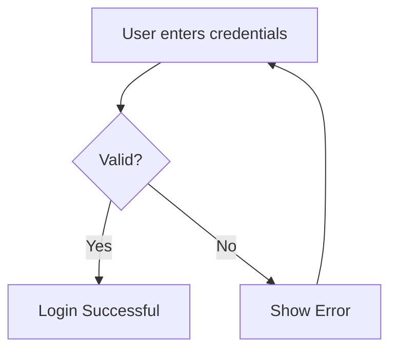
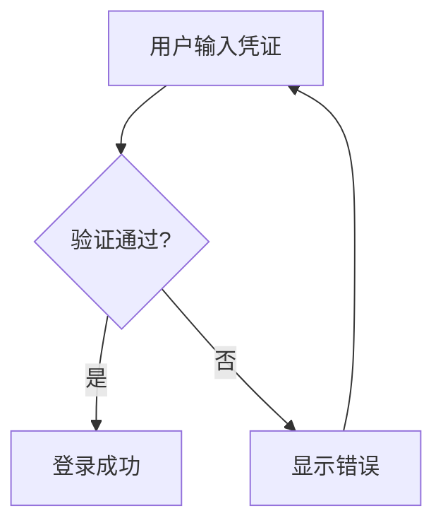

# Obsidian Viz

[English](#english) | [中文](#中文)

---

<a name="english"></a>

## 📊 Obsidian Visualization Skill for OpenClaw

A powerful OpenClaw skill for generating Obsidian-compatible visualization files. Transform text descriptions or images into editable diagrams, flowcharts, mind maps, and more.

  

### ✨ Features

- **Two Input Modes**
  - 📝 Text Description: Create charts from concept/process descriptions
  - 🖼️ Image Input: Understand IM images (screenshots, diagrams) and redraw as editable formats

- **Multiple Output Formats**
  - Obsidian Mode (default): `.md` / `.canvas` files, directly openable in Obsidian
  - Standard Mode: `.mmd` / `.excalidraw` / `.html`, universal formats

- **Supported Chart Types**
  - Flowcharts, Sequence Diagrams, Mind Maps
  - Architecture Diagrams, ER Diagrams, Class Diagrams
  - Gantt Charts, Timelines, Comparison Charts
  - Free-layout Canvas networks

---

## 🚀 Installation

### Method 1: ClawHub (Recommended)

```bash
clawhub install obsidian-viz
```

### Method 2: Manual Installation

```bash
# Clone this repository
git clone https://github.com/your-username/obsidian-viz.git

# Move to OpenClaw skills directory
mv obsidian-viz ~/.openclaw/workspace/skills/obsidian-viz
```

---

## 📖 Usage Examples

### 1. Create from Text Description

**User**: "Create a flowchart showing the user login process"

The skill will generate a Mermaid flowchart:


### 2. Redraw from Image

Send a screenshot/diagram image, and the skill will:
1. Analyze the image content
2. Identify the chart type
3. Redraw as editable Obsidian format

### 3. Export to Standard Format

Add "standard format" or "excalidraw.com" to export as universal formats.

---

## 🛠️ Tool Selection Strategy

| Requirement | Recommended Tool | Chart Type |
|------------|------------------|------------|
| Workflow / CI-CD | Excalidraw or Mermaid | flowchart |
| API Calls / Messages | Mermaid | sequenceDiagram |
| Organization / Layers | Excalidraw | hierarchy |
| Concept / Brainstorming | Canvas or Excalidraw | mindmap |
| State Machine / Lifecycle | Mermaid | stateDiagram-v2 |
| Project Timeline | Excalidraw | timeline |
| A vs B Comparison | Excalidraw | comparison |
| Priority Matrix | Excalidraw | matrix |
| Large Knowledge Networks | Canvas | free-layout |
| Database Design | Mermaid | erDiagram |
| Class / Object Relations | Mermaid | classDiagram |
| Project Scheduling | Mermaid | gantt |

---

## 🔥 Trigger Words

```
Excalidraw, 画图, 流程图, 思维导图, Mermaid, Canvas,
可视化, 时序图, 状态图, 知识图谱, 在Obsidian打开, 生成图表文件,
关系图, 对比图, 时间线, 层级图, 矩阵图, 自由布局, 手绘图,
甘特图, ER图, 交互图表, 导出图表, obsidian图表,
excalidraw, mermaid, canvas, mind map, flowchart,
sequence diagram, visualize, animate, diagram
```

---

## 📁 Output Files

| Format | Extension | Description |
|--------|-----------|-------------|
| Mermaid (Obsidian) | `.md` | Markdown with mermaid code block |
| Mermaid (Standard) | `.mmd` | Pure mermaid syntax |
| Excalidraw (Obsidian) | `.md` | Markdown with Excalidraw JSON |
| Excalidraw (Standard) | `.excalidraw` | Excalidraw JSON |
| Canvas (Obsidian) | `.canvas` | Obsidian Canvas format |
| Canvas (Standard) | `.html` | Interactive HTML |

---

## 🤝 Contributing

Contributions are welcome! Please feel free to submit a Pull Request.

---

## 📄 License

This project is licensed under the MIT License - see the [LICENSE](LICENSE) file for details.

---

---

<a name="中文"></a>

## 📊 Obsidian 可视化 Skill (OpenClaw)

强大的 OpenClaw Skill，用于生成 Obsidian 兼容的可视化文件。将文字描述或图片转换为可编辑的图表、流程图、思维导图等。

### ✨ 核心功能

- **两种输入模式**
  - 📝 文字描述：从概念/流程描述创建图表
  - 🖼️ 图片输入：理解 IM 图片（截图、流程图、架构图）并重绘为可编辑格式

- **多种输出格式**
  - Obsidian 模式（默认）：`.md` / `.canvas`，可在 Obsidian 中直接打开
  - 标准模式：`.mmd` / `.excalidraw` / `.html`，通用格式

- **支持的图表类型**
  - 流程图、时序图、思维导图
  - 架构图、ER 图、类图
  -甘特图、时间线、对比图
  - 自由布局的 Canvas 知识网络

---

## 🚀 安装方法

### 方法一：ClawHub（推荐）

```bash
clawhub install obsidian-viz
```

### 方法二：手动安装

```bash
# 克隆仓库
git clone https://github.com/your-username/obsidian-viz.git

# 移动到 OpenClaw skills 目录
mv obsidian-viz ~/.openclaw/workspace/skills/obsidian-viz
```

---

## 📖 使用示例

### 1. 从文字描述创建

**用户**：「创建一个用户登录流程的流程图」

Skill 将生成 Mermaid 流程图：


### 2. 从图片重绘

发送截图/图表图片，Skill 会：
1. 分析图片内容
2. 识别图表类型
3. 重绘为可编辑的 Obsidian 格式

### 3. 导出为标准格式

添加「标准格式」或「excalidraw.com」可导出为通用格式。

---

## 🛠️ 工具选择策略

| 需求 | 推荐工具 | 图表类型 |
|------|---------|---------|
| 工作流 / CI-CD | Excalidraw 或 Mermaid | flowchart |
| API 调用 / 消息交互 | Mermaid | sequenceDiagram |
| 组织架构 / 系统分层 | Excalidraw | hierarchy |
| 概念发散 / 头脑风暴 | Canvas 或 Excalidraw | mindmap |
| 状态机 / 生命周期 | Mermaid | stateDiagram-v2 |
| 项目时间线 | Excalidraw | timeline |
| A vs B 对比 | Excalidraw | comparison |
| 优先级矩阵 | Excalidraw | matrix |
| 大型知识网络 | Canvas | free-layout |
| 数据库设计 | Mermaid | erDiagram |
| 类图 / 对象关系 | Mermaid | classDiagram |
| 项目排期 | Mermaid | gantt |

---

## 🔥 触发词列表

```
Excalidraw、画图、流程图、思维导图、Mermaid、Canvas、
可视化、时序图、状态图、知识图谱、在Obsidian打开、生成图表文件、
关系图、对比图、时间线、层级图、矩阵图、自由布局、手绘图、
甘特图、ER图、交互图表、导出图表、obsidian图表、
excalidraw、mermaid、canvas、mind map、flowchart、
sequence diagram、visualize、animate、diagram
```

---

## 📁 输出文件说明

| 格式 | 扩展名 | 说明 |
|------|--------|------|
| Mermaid (Obsidian) | `.md` | 包含 mermaid 代码块的 Markdown |
| Mermaid (标准) | `.mmd` | 纯 mermaid 语法 |
| Excalidraw (Obsidian) | `.md` | 包含 Excalidraw JSON 的 Markdown |
| Excalidraw (标准) | `.excalidraw` | Excalidraw JSON |
| Canvas (Obsidian) | `.canvas` | Obsidian Canvas 格式 |
| Canvas (标准) | `.html` | 交互式 HTML |

---

## 🤝 贡献指南

欢迎贡献！请随时提交 Pull Request。

---

## 📄 开源协议

本项目基于 MIT 协议开源 - 查看 [LICENSE](LICENSE) 文件了解更多。
