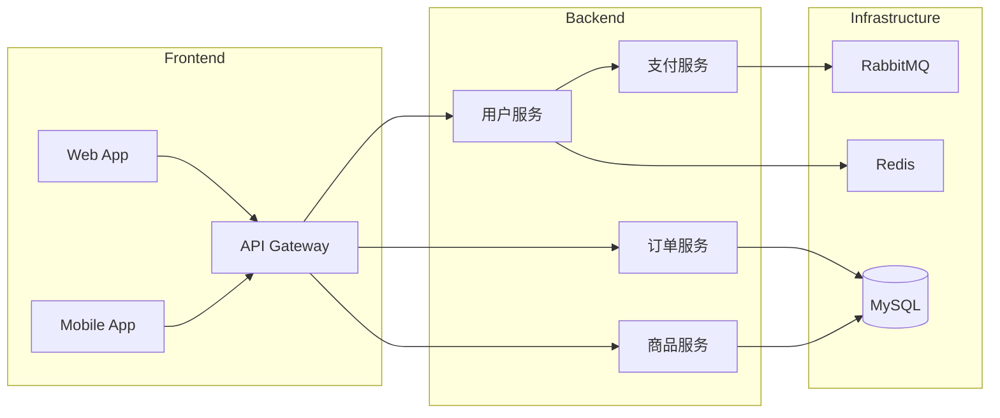

# 架构图示例 - 微服务系统架构

## 示例说明

本示例展示如何使用 obsidian-viz skill 创建微服务系统架构图。

## 使用方法

在 OpenClaw 中发送以下文字：

> 创建一个微服务架构图，包含：
> - 前端：Web App、移动 App
> - API 网关
> - 核心服务：用户服务、订单服务、商品服务、支付服务
> - 基础设施：Redis 缓存、MySQL 数据库、消息队列 RabbitMQ
> - 监控：Prometheus + Grafana

## 生成的 Excalidraw 内容

架构图包含以下组件和关系：

```
┌─────────────────────────────────────────────────────────────┐
│                        前端层                                │
│  ┌─────────────┐              ┌─────────────┐              │
│  │   Web App   │              │  Mobile App │              │
│  └──────┬──────┘              └──────┬──────┘              │
└─────────┼─────────────────────────────┼────────────────────┘
          │                             │
          ▼                             ▼
┌─────────────────────────────────────────────────────────────┐
│                      API 网关                               │
│  (认证、限流、路由)                                          │
└─────────────────────────┬───────────────────────────────────┘
                          │
          ┌───────────────┼───────────────┐
          ▼               ▼               ▼
    ┌──────────┐    ┌──────────┐    ┌──────────┐
    │ 用户服务  │    │ 订单服务  │    │ 商品服务  │
    └────┬─────┘    └────┬─────┘    └────┬─────┘
         │               │               │
         └───────────┬───┴───────────────┘
                     ▼
            ┌──────────────┐
            │  支付服务    │
            └──────┬───────┘
                   │
         ┌─────────┼─────────┐
         ▼         ▼         ▼
    ┌────────┐ ┌──────┐ ┌────────┐
    │ Redis  │ │ MySQL │ │RabbitMQ│
    │ 缓存   │ │ 数据库│ │ 消息队列│
    └────────┘ └──────┘ └────────┘
```

## Mermaid 替代方案



## 适用场景

- 系统架构设计
- 技术方案文档
- 架构演进规划
- 技术分享材料

## 工具选择建议

| 场景 | 推荐工具 |
|------|---------|
| 详细架构图 | Excalidraw |
| 简化架构图 | Mermaid |
| 部署架构 | Mermaid |
| 拓扑结构 | Excalidraw |
