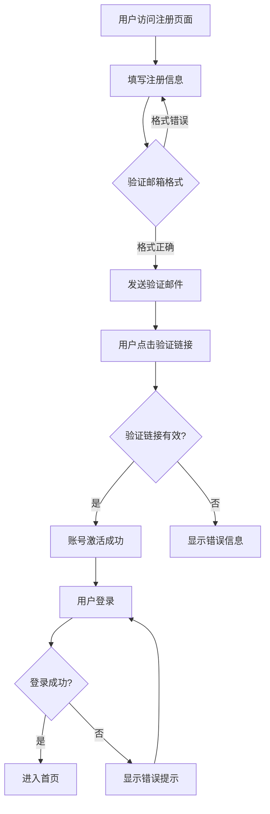

# 流程图示例 - 用户注册登录流程

## 示例说明

本示例展示如何使用 obsidian-viz skill 创建用户注册和登录流程图。

## 使用方法

在 OpenClaw 中发送以下文字：

> 创建一个用户注册和登录的流程图，包含以下步骤：
> 1. 用户访问注册页面
> 2. 填写用户名、邮箱、密码
> 3. 系统验证邮箱格式
> 4. 发送验证邮件
> 5. 用户点击验证链接
> 6. 账号激活成功
> 7. 用户登录
> 8. 登录成功进入首页

## 生成的 Mermaid 代码

## 输出文件格式

- **Obsidian 模式**: `user-login-flow.md` - 可直接在 Obsidian 中预览
- **标准模式**: `user-login-flow.mmd` - 纯 Mermaid 语法，可在任何 Mermaid 编辑器中打开

## 适用场景

- 工作流程说明
- CI/CD 流程图
- 业务流程梳理
- 决策树可视化
