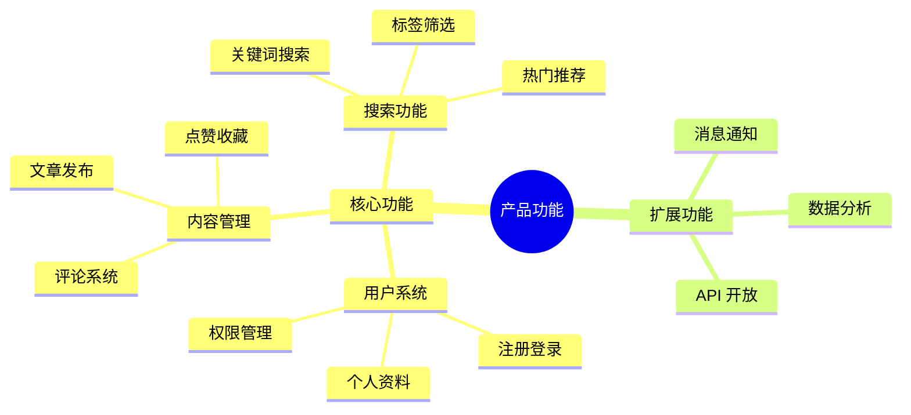

# 思维导图示例 - 产品功能规划

## 示例说明

本示例展示如何使用 obsidian-viz skill 创建思维导图，用于产品功能规划和头脑风暴。

## 使用方法

在 OpenClaw 中发送以下文字：

> 创建一个产品功能的思维导图，包含：
> - 核心功能：用户系统、内容管理、搜索功能
> - 用户系统：注册登录、个人资料、权限管理
> - 内容管理：文章发布、评论系统、点赞收藏
> - 搜索功能：关键词搜索、标签筛选、热门推荐

## 生成的 Mermaid 代码



## 替代方案：使用 Excalidraw 自由布局

对于更自由的思维导图布局，可以使用 Excalidraw：

```
Excalidraw
├── 中心主题：产品功能规划
│   ├── 核心功能
│   │   ├── 用户系统
│   │   │   ├── 注册登录
│   │   │   ├── 个人资料
│   │   │   └── 权限管理
│   │   ├── 内容管理
│   │   │   ├── 文章发布
│   │   │   ├── 评论系统
│   │   │   └── 点赞收藏
│   │   └── 搜索功能
│   │       ├── 关键词搜索
│   │       ├── 标签筛选
│   │       └── 热门推荐
│   └── 扩展功能
│       ├── 消息通知
│       ├── 数据分析
│       └── API 开放
```

## 适用场景

- 产品功能规划
- 头脑风暴
- 知识整理
- 项目拆解
- 学习笔记

## 工具选择建议

| 场景 | 推荐工具 |
|------|---------|
| 结构化思维导图 | Mermaid |
| 自由布局/手绘风格 | Excalidraw |
| 大型知识网络 | Canvas |
