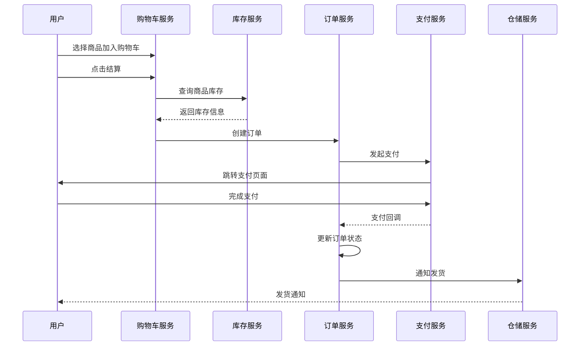
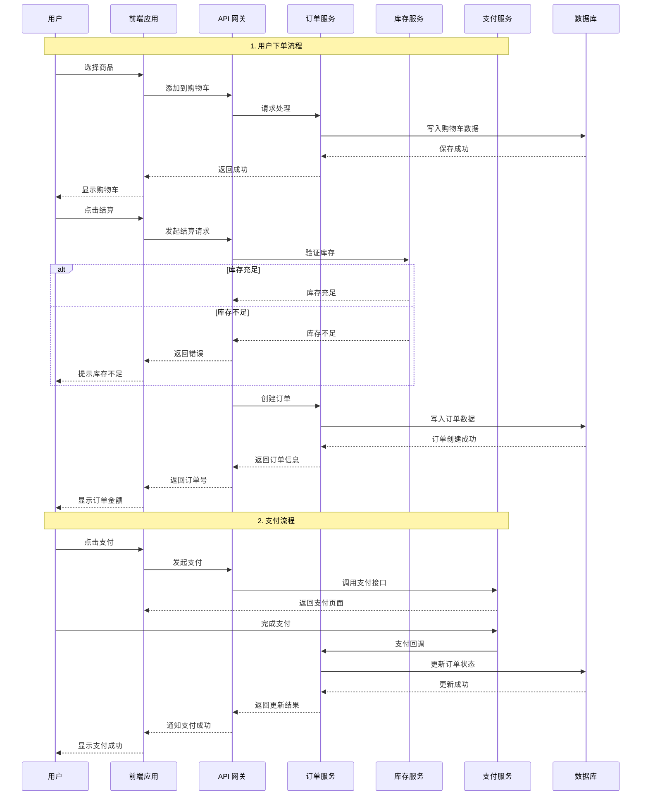

# 时序图示例 - 用户下单流程

## 示例说明

本示例展示如何使用 obsidian-viz skill 创建时序图，说明系统组件之间的交互顺序。

## 使用方法

在 OpenClaw 中发送以下文字：

> 创建一个用户下单的时序图，包含：
> 1. 用户选择商品并加入购物车
> 2. 用户点击结算
> 3. 系统查询购物车商品信息
> 4. 调用库存服务检查库存
> 5. 创建订单
> 6. 调用支付服务发起支付
> 7. 用户完成支付
> 8. 支付回调更新订单状态
> 9. 通知仓储系统发货

## 生成的 Mermaid 代码

## 详细时序图（带更多细节）

## 适用场景

- API 调用流程说明
- 系统交互分析
- 技术方案文档
- Bug 复现步骤
- 接口设计沟通

## 工具选择建议

| 场景 | 推荐工具 |
|------|---------|
| 简单时序图 | Mermaid |
| 复杂交互流程 | Mermaid |
| 带分支逻辑 | Mermaid (alt/else) |
| 并发流程 | Mermaid (par) |
