# Mermaid 格式规范

Mermaid 是一种基于文本的图表语法，支持流程图、时序图、状态图、类图等多种图表类型。

## 支持的图表类型

| 类型 | 声明语句 | 适用场景 |
|------|---------|---------|
| 流程图 | `graph TB` / `graph LR` | 工作流、决策树、步骤说明 |
| 时序图 | `sequenceDiagram` | API 调用、组件交互、消息流 |
| 状态图 | `stateDiagram-v2` | 系统状态、状态转换、生命周期 |
| 类图 | `classDiagram` | 数据模型、对象关系 |
| 思维导图 | `mindmap` | 层级概念、知识组织 |
| 时间线 | `timeline` | 项目进度、事件发展 |
| 甘特图 | `gantt` | 项目排期 |
| ER 图 | `erDiagram` | 数据库设计 |
| 饼图 | `pie` | 数据占比 |

## 流程图 (Flowchart)

### 基本语法

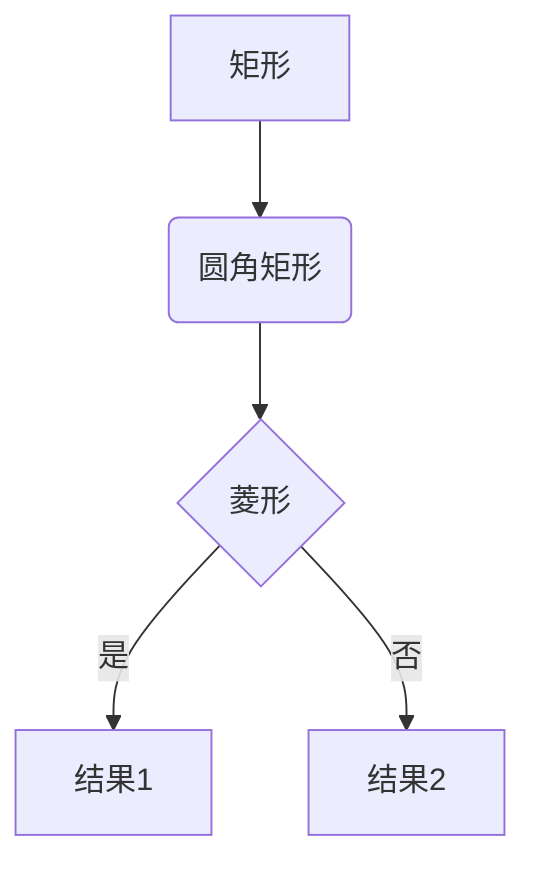

### 节点形状速查

| 语法 | 形状 | 适用场景 |
|------|------|---------|
| `A[文字]` | 矩形 | 流程步骤 |
| `A(文字)` | 圆角矩形 | 柔和步骤 |
| `A([文字])` | 体育场形 | 开始 / 结束 |
| `A{文字}` | 菱形 | 判断 / 决策 |
| `A[/文字/]` | 平行四边形 | 输入 / 输出 |
| `A[\文字\]` | 反向平行四边形 | 输入 / 输出 |
| `A[(文字)]` | 圆柱形 | 数据库 |
| `A((文字))` | 圆形 | 事件 |
| `A>文字]` | 旗帜形 | 标记 |
| `A{{文字}}` | 六边形 | 准备 |

### 边类型速查

| 语�� | 效果 | 适用场景 |
|------|------|---------|
| `A --> B` | 普通箭头 | 顺序流 |
| `A --- B` | 无箭头线 | 关联 |
| `A -- 标签 --> B` | 带标签箭头 | 条件流 |
| `A -.-> B` | 虚线箭头 | 可选流 |
| `A ==> B` | 粗箭头 | 强调流 |
| `A --o B` | 圆点箭头 | 聚合 |
| `A --x B` | 叉号箭头 | 否定 |

### 布局方向

| 语法 | 方向 |
|------|------|
| `graph TB` | 从上到下（Top to Bottom） |
| `graph BT` | 从下到上（Bottom to Top） |
| `graph LR` | 从左到右（Left to Right） |
| `graph RL` | 从右到左（Right to Left） |

### 子图

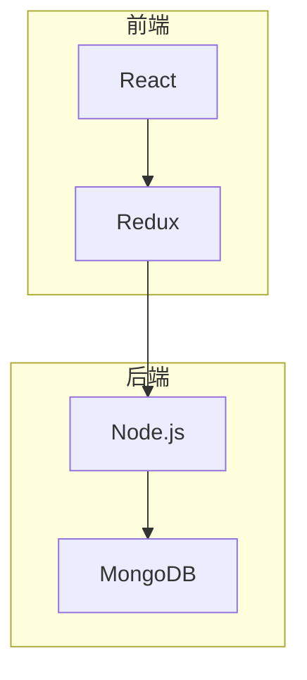

### 样式定义

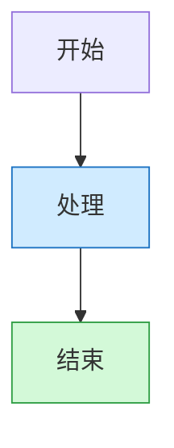

## 时序图 (Sequence Diagram)

### 基本结构

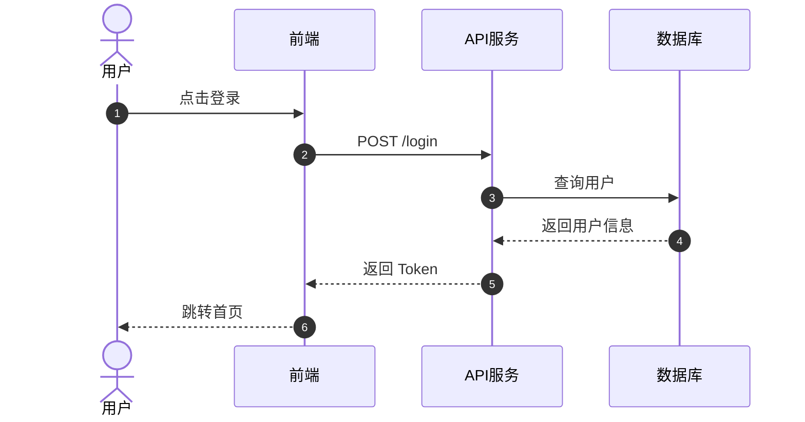

### 参与者类型

| 语法 | 类型 | 适用场景 |
|------|------|---------|
| `participant A` | 普通参与者 | 系统组件 |
| `actor A` | 角色 | 用户、外部系统 |

### 消息类型

| 语法 | 效果 | 适用场景 |
|------|------|---------|
| `A->>B` | 实线箭头 | 同步调用 |
| `A-->>B` | 虚线箭头 | 返回响应 |
| `A-)B` | 异步消息 | 异步调用 |
| `A-xB` | 叉号箭头 | 失败 |

### 控制块

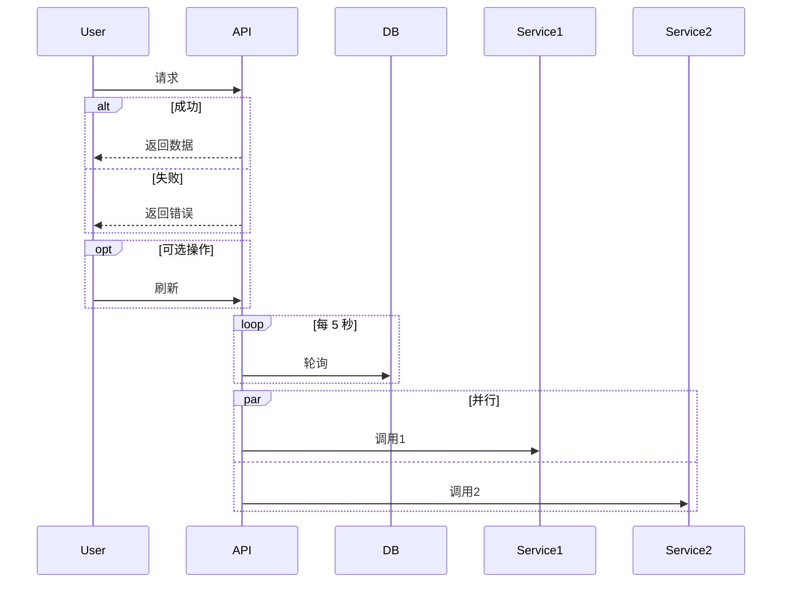

## 状态图 (State Diagram)

### 基本语法

**重要**：必须使用 `stateDiagram-v2`（v1 已弃用）

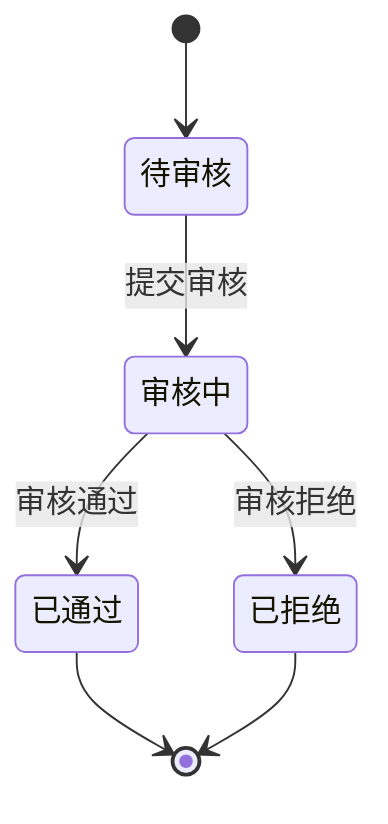

### 复合状态

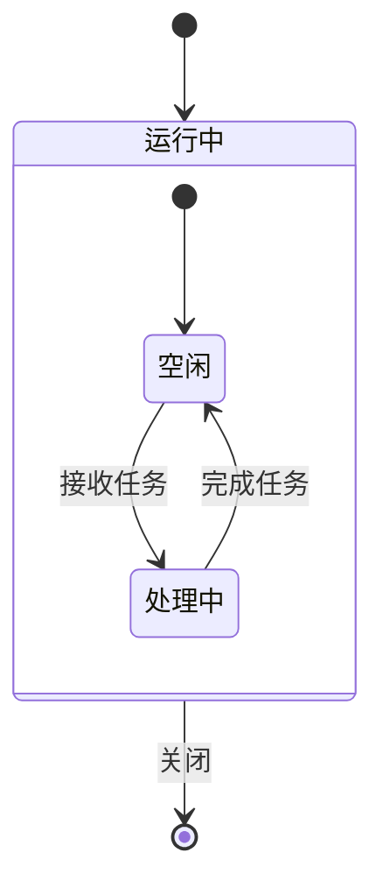

### 并发状态

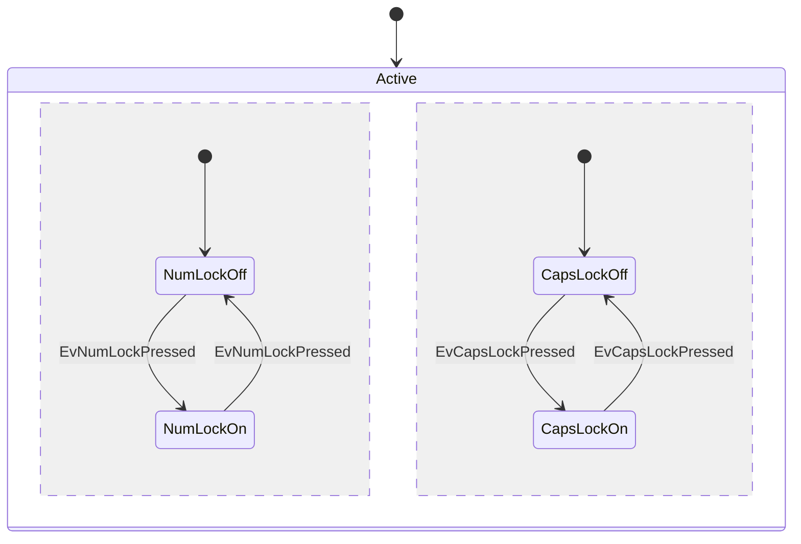

## 类图 (Class Diagram)

### 基本语法

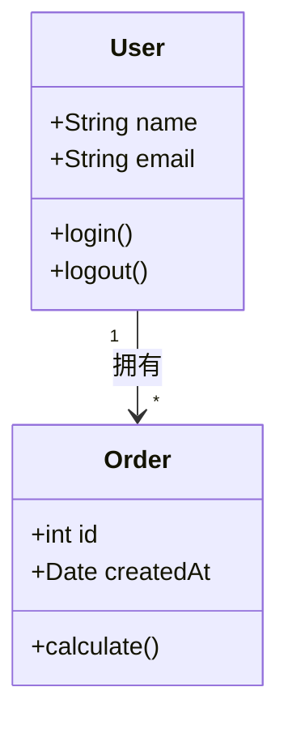

### 关系类型

| 语法 | 关系 | 说明 |
|------|------|------|
| `A <|-- B` | 继承 | B 继承 A |
| `A *-- B` | 组合 | A 包含 B（强关联） |
| `A o-- B` | 聚合 | A 包含 B（弱关联） |
| `A --> B` | 关联 | A 引用 B |
| `A -- B` | 链接 | 简单关联 |
| `A ..> B` | 依赖 | A 依赖 B |
| `A ..|> B` | 实现 | A 实现 B 接口 |

### 可见性

| 符号 | 可见性 |
|------|--------|
| `+` | public |
| `-` | private |
| `#` | protected |
| `~` | package |

## 思维导图 (Mindmap)

### 基本语法

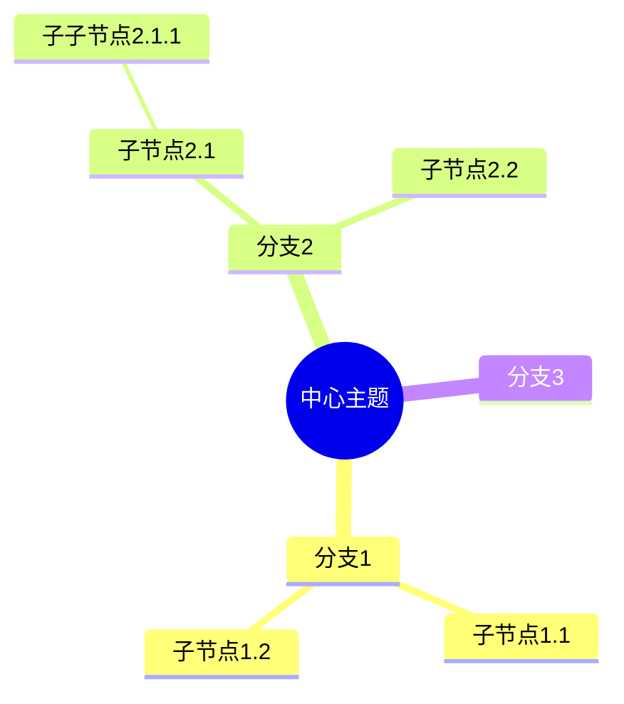

**注意**：
- 使用缩进表示层级关系
- 不支持箭头连线
- 根节点用 `(())` 包裹

## ER 图 (Entity Relationship Diagram)

### 基本语法

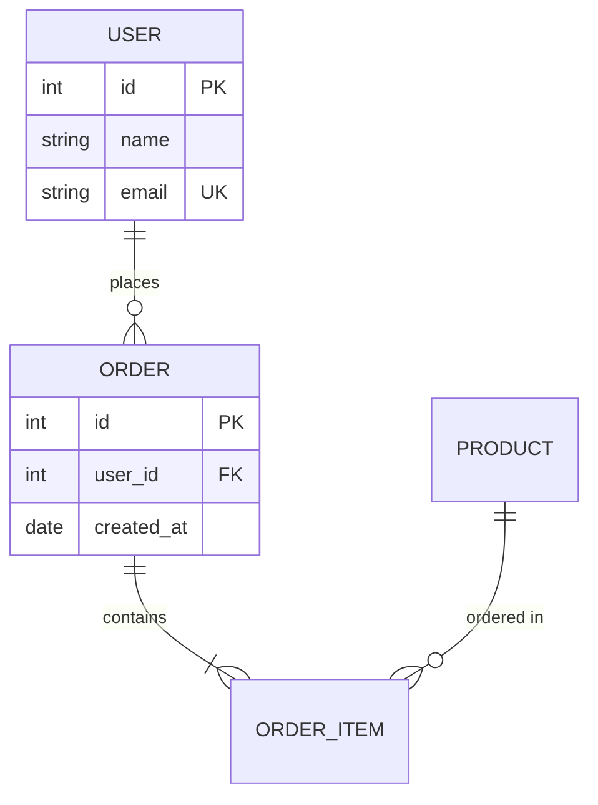

### 关系类型

| 语法 | 关系 | 说明 |
|------|------|------|
| `||--||` | 一对一 | 必须 |
| `||--o{` | 一对多 | 必须对可选 |
| `}o--o{` | 多对多 | 可选 |

### 字段属性

| 标记 | 含义 |
|------|------|
| `PK` | 主键 |
| `FK` | 外键 |
| `UK` | 唯一键 |

## 甘特图 (Gantt)

### 基本语法

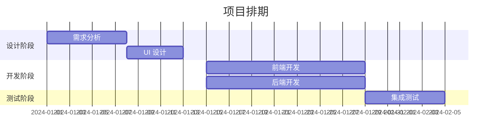

## 时间线 (Timeline)

### 基本语法

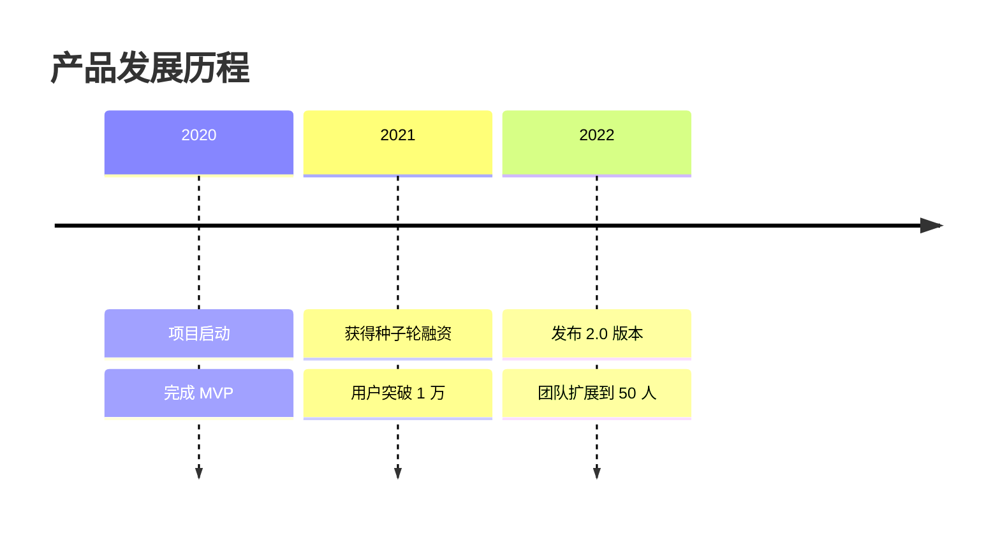

## 中文 / CJK 文本规则

### 必须加引号的场景

| 场景 | 错误写法 | 正确写法 |
|------|---------|---------|
| 菱形判断节点含中文 | `C{是否成功?}` | `C{"是否成功?"}` |
| 体育场形起止节点 | `A([开始])` | `A(["开始"])` |
| 箭头标签含中文 | `A --条件--> B` | `A -- "条件" --> B` |
| 标签含括号 | `A[用户(管理员)]` | `A["用户(管理员)"]` |
| 标签含冒号 | `A[time: 10s]` | `A["time: 10s"]` |
| 标签含分号 | `A[步骤1;步骤2]` | `A["步骤1;步骤2"]` |

### 通用规则

**标签中包含以下字符时，必须用双引号包裹整个标签**：
- 中文字符
- 括号 `()` `[]` `{}`
- 冒号 `:`
- 分号 `;`
- 引号 `"` `'`（需转义）

## 主题与样式

### 主题选择


可选主题：
- `default`：默认主题
- `neutral`：中性主题
- `dark`：暗色主题
- `forest`：森林主题
- `base`：基础主题

### 自定义颜色

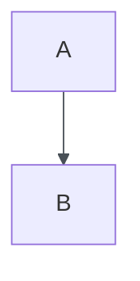

## Obsidian 兼容性

### 支持的图表类型

✅ 完全支持：
- `graph` / `flowchart`
- `sequenceDiagram`
- `stateDiagram-v2`
- `classDiagram`
- `mindmap`
- `timeline`
- `gantt`
- `erDiagram`
- `pie`

❌ 不支持：
- `click` 交互回调（必须删除）
- 过新的实验性语法（如 `packet`、`architecture`）

⚠️ 部分支持：
- `journey`：可能渲染异常
- `gitGraph`：Obsidian Mermaid 版本可能滞后

### Obsidian 输出格式

```markdown
# 文档标题

这是一个流程图：

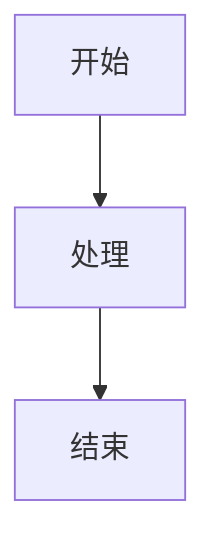

其他内容...
```

## 生成前必检清单

生成 Mermaid 图表前，必须检查：

- [ ] 没有子图 ID 与节点 ID 重名
- [ ] 菱形 / 体育场形中的中文已加双引号
- [ ] 标签内无裸露特殊字符（括号、冒号、分号）
- [ ] 图内无重复节点 ID
- [ ] 箭头标签格式：`-- "文字" -->`（有空格）
- [ ] 使用 `stateDiagram-v2`，非 `stateDiagram`
- [ ] 已删除所有 `click` 事件（Obsidian 不支持）
- [ ] 思维导图内无箭头（mindmap 只用缩进）
- [ ] 时序图参与者声明在消息之前
- [ ] 类图关系语法正确（`<|--` / `*--` / `o--` / `-->` / `..>`）

## 常见错误与修复

| 错误 | 原因 | 修复方法 |
|------|------|---------|
| 语法错误：unexpected token | 中文标签未加引号 | 给含中文的标签加双引号 |
| 节点 ID 冲突 | 子图 ID 与节点 ID 重名 | 重命名子图或节点 |
| 箭头标签不显示 | 标签格式错误 | 使用 `-- "标签" -->` 格式 |
| 状态图不渲染 | 使用了 v1 语法 | 改为 `stateDiagram-v2` |
| 思维导图连线错误 | 使用了箭头语法 | 删除箭头，只用缩进 |
| 时序图参与者未定义 | 消息中使用了未声明的参与者 | 在顶部声明所有参与者 |

## 示例：完整流程图

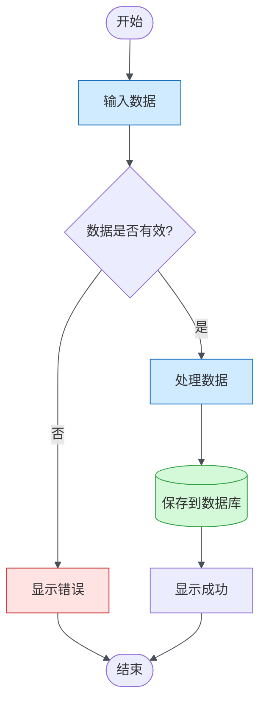

## 示例：完整时序图

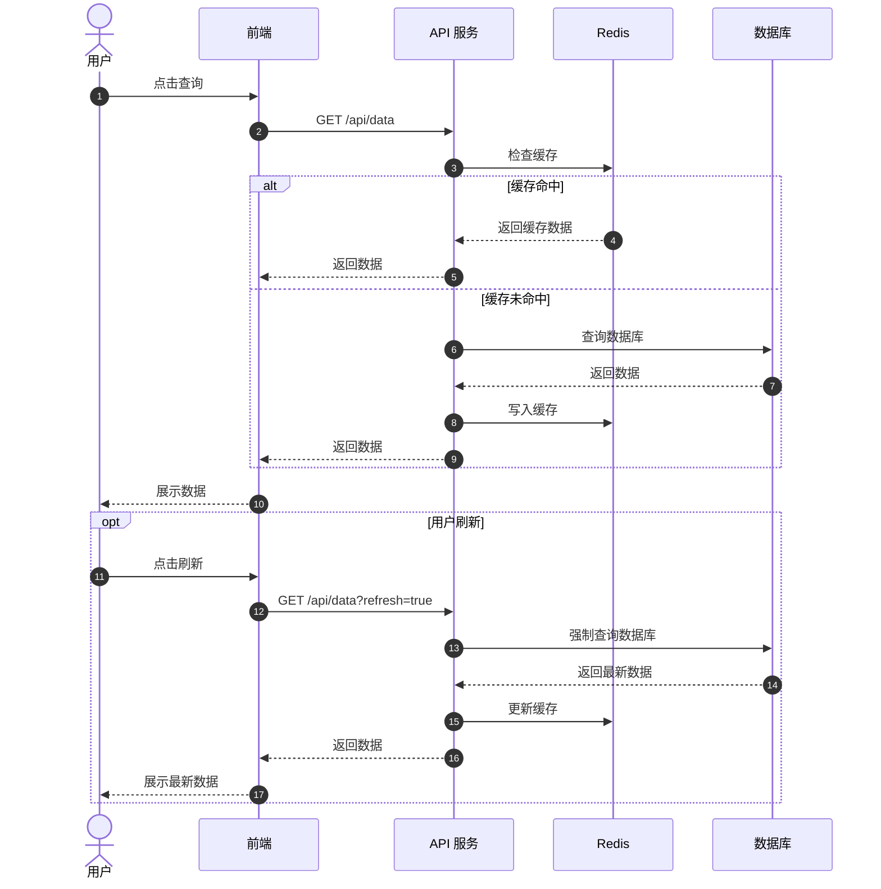
