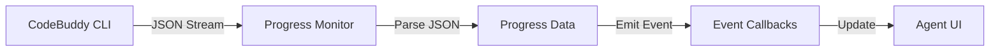

# CodeBuddy Coding Skill

**版本：** 1.0.0
**创建时间：** 2026-03-31
**作者：** OpenClaw Team

---

## 📋 Skill 概述

**CodeBuddy Coding Skill** 是一个通用的 AI 编程能力扩展，让任何 OpenClaw agent 都能调用 CodeBuddy CLI 的强大功能。

### 核心能力

- ✅ **AI 编程** - 代码生成、重构、调试、优化
- ✅ **文件操作** - 创建、修改、删除文件
- ✅ **命令执行** - 运行构建、测试、部署命令
- ✅ **进度监控** - 实时报告任务进度和状态
- ✅ **结构化输出** - JSON 格式的可解析输出

### 适用场景

- **Developer Agent** - 编写代码、修复 Bug
- **Architect Agent** - 生成项目脚手架
- **Tester Agent** - 编写测试用例
- **任何需要编程能力的 Agent** - 通用编程支持

---

## 🚀 快速开始

### 基本用法

```javascript
// 1. 加载 Skill
const codebuddy = require('./skill');

// 2. 执行编程任务
const result = await codebuddy.execute({
  task: '创建一个用户登录页面',
  context: {
    projectPath: '/path/to/project',
    techStack: 'Vue 3 + TypeScript'
  },
  options: {
    outputFormat: 'json',
    permissionMode: 'bypassPermissions'
  }
});

// 3. 获取结果
console.log(result.status);      // 'success'
console.log(result.filesModified); // ['src/views/Login.vue']
console.log(result.toolCalls);   // [{tool: 'write_to_file', ...}]
```

### 监听进度

```javascript
// 订阅进度事件
codebuddy.onProgress((progress) => {
  console.log(`进度: ${progress.percentage}%`);
  console.log(`当前任务: ${progress.currentTask}`);
  console.log(`已用时间: ${progress.elapsedTime}s`);
});
```

---

## 🔧 配置说明

### 环境要求

- **CodeBuddy CLI** v2.68.0+
- **Node.js** v16.0.0+
- **OpenClaw** coding-agent skill 框架

### Skill 配置

```json
{
  "name": "codebuddy-coding",
  "version": "1.0.0",
  "type": "coding",
  "capabilities": [
    "code-generation",
    "file-operations",
    "command-execution",
    "progress-monitoring"
  ],
  "dependencies": {
    "codebuddy-cli": ">=2.68.0"
  }
}
```

---

## 📚 API 文档

### `execute(options)`

执行编程任务。

**参数：**
```typescript
interface ExecuteOptions {
  task: string;           // 任务描述
  context?: {             // 任务上下文
    projectPath?: string; // 项目路径
    techStack?: string;   // 技术栈
    files?: string[];     // 相关文件
  };
  options?: {             // 执行选项
    outputFormat?: 'json' | 'text';  // 输出格式
    permissionMode?: 'default' | 'bypassPermissions'; // 权限模式
    timeout?: number;     // 超时时间（秒）
  };
}
```

**返回：**
```typescript
interface ExecuteResult {
  status: 'success' | 'failed' | 'timeout';
  filesModified: string[];      // 修改的文件列表
  toolCalls: ToolCall[];        // 工具调用记录
  reasoning: string[];          // 推理过程
  duration: number;             // 执行时长（秒）
  error?: string;               // 错误信息
}
```

### `onProgress(callback)`

订阅进度更新事件。

**参数：**
```typescript
type ProgressCallback = (progress: {
  percentage: number;     // 完成百分比
  currentTask: string;    // 当前任务描述
  elapsedTime: number;    // 已用时间（秒）
  estimatedTime?: number; // 预计剩余时间（秒）
  filesModified: string[]; // 已修改文件
  toolCalls: number;      // 已调用工具次数
}) => void;
```

### `getStatus()`

获取当前任务状态。

**返回：**
```typescript
interface TaskStatus {
  state: 'idle' | 'running' | 'completed' | 'failed';
  taskId?: string;
  startTime?: Date;
  progress?: Progress;
}
```

---

## 🎯 使用示例

### 示例1：创建新组件

```javascript
const codebuddy = require('./skill');

// 创建登录组件
const result = await codebuddy.execute({
  task: '创建一个用户登录组件，包含用户名、密码输入框和登录按钮',
  context: {
    projectPath: '/path/to/vue-project',
    techStack: 'Vue 3 Composition API + TypeScript'
  }
});

if (result.status === 'success') {
  console.log('组件创建成功！');
  console.log('创建的文件:', result.filesModified);
}
```

### 示例2：修复 Bug

```javascript
const codebuddy = require('./skill');

// 修复登录验证 Bug
const result = await codebuddy.execute({
  task: '修复用户登录时的验证逻辑，密码应该至少8位且包含数字和字母',
  context: {
    projectPath: '/path/to/project',
    files: ['src/views/Login.vue', 'src/utils/validator.ts']
  }
});

console.log('修复完成:', result.filesModified);
```

### 示例3：监听长时间任务进度

```javascript
const codebuddy = require('./skill');

// 订阅进度
codebuddy.onProgress((progress) => {
  console.log(`[${progress.percentage}%] ${progress.currentTask}`);
  console.log(`  已修改 ${progress.filesModified.length} 个文件`);
  console.log(`  已执行 ${progress.toolCalls} 次操作`);
  console.log(`  用时 ${progress.elapsedTime}s`);
});

// 执行长时间任务
const result = await codebuddy.execute({
  task: '重构整个用户管理模块，使用更清晰的架构',
  context: {
    projectPath: '/path/to/project'
  },
  options: {
    timeout: 600  // 10分钟超时
  }
});
```

---

## 🔍 进度监控原理

### JSON 输出解析

CodeBuddy CLI 支持 `--output-format json` 输出结构化数据：

```bash
codebuddy -p "任务描述" --output-format json --permission-mode bypassPermissions
```

**输出格式：**
```json
{
  "status": "running",
  "tool_calls": [
    {
      "tool": "write_to_file",
      "parameters": {
        "filePath": "src/Login.vue",
        "content": "..."
      },
      "result": "success"
    }
  ],
  "files_modified": ["src/Login.vue"],
  "reasoning": [
    "分析任务需求",
    "设计组件结构",
    "编写代码"
  ],
  "progress": {
    "percentage": 45,
    "current_task": "编写登录表单"
  }
}
```

### 进度解析流程



---

## ⚙️ 高级配置

### 自定义输出解析器

```javascript
const codebuddy = require('./skill');

// 自定义解析器
codebuddy.setOutputParser((jsonLine) => {
  // 自定义解析逻辑
  return {
    percentage: jsonLine.progress?.percentage || 0,
    task: jsonLine.progress?.current_task || '处理中'
  };
});
```

### 超时和重试

```javascript
const result = await codebuddy.execute({
  task: '复杂重构任务',
  options: {
    timeout: 1200,        // 20分钟超时
    retryCount: 3,        // 失败重试3次
    retryDelay: 5000      // 重试间隔5秒
  }
});
```

---

## 🐛 调试和日志

### 启用详细日志

```javascript
const codebuddy = require('./skill');

// 启用调试模式
codebuddy.setDebugMode(true);

// 所有 CLI 输出会被记录到控制台
const result = await codebuddy.execute({
  task: '创建测试文件'
});
```

### 查看执行日志

```javascript
// 获取最近的执行日志
const logs = codebuddy.getExecutionLogs();
console.log(logs);
// [
//   { time: '11:30:01', event: 'CLI_START', command: '...' },
//   { time: '11:30:02', event: 'TOOL_CALL', tool: 'write_to_file' },
//   { time: '11:30:05', event: 'CLI_END', status: 'success' }
// ]
```

---

## 🚨 错误处理

### 错误类型

```typescript
enum CodeBuddyErrorType {
  CLI_NOT_FOUND = 'CLI_NOT_FOUND',        // CodeBuddy CLI 未安装
  INVALID_TASK = 'INVALID_TASK',          // 无效的任务描述
  TIMEOUT = 'TIMEOUT',                     // 执行超时
  PERMISSION_DENIED = 'PERMISSION_DENIED', // 权限被拒绝
  CLI_ERROR = 'CLI_ERROR'                  // CLI 执行错误
}
```

### 错误处理示例

```javascript
try {
  const result = await codebuddy.execute({
    task: '创建文件'
  });
} catch (error) {
  if (error.type === 'CLI_NOT_FOUND') {
    console.error('请先安装 CodeBuddy CLI');
  } else if (error.type === 'TIMEOUT') {
    console.error('任务超时，请增加超时时间');
  } else {
    console.error('执行失败:', error.message);
  }
}
```

---

## 📦 集成到 Agent

### Developer Agent 集成

```javascript
// developer/agent.js
const codebuddy = require('codebuddy-coding');

class DeveloperAgent {
  async implementFeature(task) {
    // 使用 CodeBuddy 实现功能
    const result = await codebuddy.execute({
      task: task.description,
      context: {
        projectPath: this.projectPath,
        files: task.relatedFiles
      }
    });

    return result;
  }
}
```

### Architect Agent 集成

```javascript
// architect/agent.js
const codebuddy = require('codebuddy-coding');

class ArchitectAgent {
  async generateProjectScaffold(requirements) {
    // 使用 CodeBuddy 生成脚手架
    const result = await codebuddy.execute({
      task: `创建项目脚手架：${requirements}`,
      options: {
        permissionMode: 'bypassPermissions'
      }
    });

    return result;
  }
}
```

---

## 🧪 测试

### 运行测试

```bash
# 运行所有测试
npm test

# 运行特定测试
npm test -- --grep "CLI Wrapper"
```

### 测试覆盖

- ✅ CLI Wrapper 单元测试
- ✅ Progress Monitor 单元测试
- ✅ Integration 集成测试
- ✅ E2E 端到端测试

---

## 📄 许可证

MIT License

---

## 🤝 贡献

欢迎提交 Issue 和 Pull Request！

---

## 📞 支持

如有问题，请联系：
- GitHub Issues: [OpenClaw Repository]
- Email: support@openclaw.ai

---

**让每个 Agent 都拥有 AI 编程能力！** 🚀
