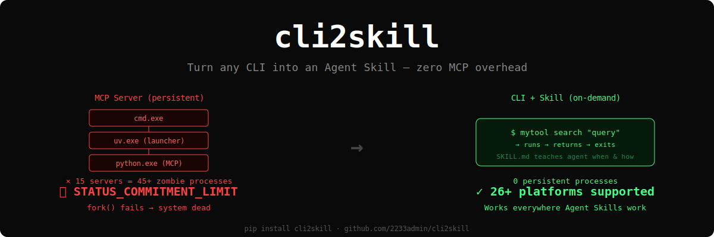
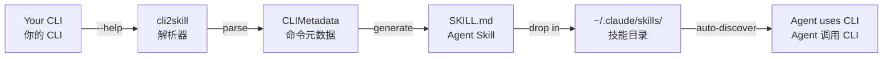

<p align="center">
  
</p>

<h3 align="center">
  🔧 Turn any MCP into an Agent Skill — zero MCP overhead<br/>
  把任意 MCP 变成 Agent Skill —— 告别 MCP 进程泄漏
</h3>

<p align="center">
  <a href="#quick-start--快速开始">Quick Start</a> ·
  <a href="#why-not-mcp--为什么不用-mcp">Why Not MCP</a> ·
  <a href="#examples--示例">Examples</a> ·
  <a href="./ARTICLE.md">Full Story (血案全文)</a>
</p>

<p align="center">
  
  
  
  
</p>

---

## The Problem · 问题

**EN:** 15 MCP servers accumulated **400+ zombie processes** on a 32GB Windows machine, exhausting virtual memory commit charge (`0xC000012D`). Every `fork()` failed. The system was completely dead.

**CN:** 15 个 MCP server 在 32GB Windows 机器上积累了 **400+ 僵尸进程**，耗尽虚拟内存 commit charge（`0xC000012D`），所有 `fork()` 失败，系统彻底死机。

Each MCP server spawns a **3-layer process tree** that never exits:

每个 MCP server 产生一个**三层进程树**，session 结束后不回收：

```
cmd.exe          ← shell wrapper / 壳
  └── uv.exe       ← Python launcher / 启动器
       └── python.exe  ← MCP server / 服务进程
```

**× 15 servers = 45+ persistent processes → system dead in 5-10 sessions**

> *"Software as a tool 结论是别用 MCP... 这玩意是拿去忽悠子刊审稿人用的"*
> *—— 某大厂 RL 团队工程师的非公开评论*

Bug report: [anthropics/claude-code#38228](https://github.com/anthropics/claude-code/issues/38228)

---

## The Solution · 解决方案

**Don't run a server. Just run a command.**

**别跑服务器，跑命令就行。**

```bash
# Before (MCP): persistent process, leaks memory, hard to debug
# 之前 (MCP): 常驻进程，泄漏内存，难调试
Agent --JSON-RPC--> MCP Server (persistent) --API--> Backend

# After (CLI + Skill): runs, returns, exits
# 之后 (CLI + Skill): 跑完退出，零开销
Agent --Bash tool--> CLI (on-demand) --API--> Backend
```

`cli2skill` parses any CLI's `--help` and generates an [Agent Skill](https://agentskills.io) — a markdown file that teaches your AI agent when and how to call your tool.

`cli2skill` 解析任意 CLI 的 `--help`，生成 [Agent Skill](https://agentskills.io) —— 一个教 AI agent 何时、如何调用你工具的 markdown 文件。

**Works with 26+ platforms · 兼容 26+ 平台：** Claude Code · Codex CLI · Gemini CLI · Cursor · Copilot · VS Code...

---

## Quick Start · 快速开始

```bash
# ClawHub (recommended for Claude Code users)
clawhub install cli2skill

# PyPI
pip install cli2skill
```

```bash
# Generate a skill from any CLI / 从任意 CLI 生成 Skill
cli2skill generate gh --name github-cli -o ~/.claude/skills/

# Preview parsed metadata / 预览解析结果
cli2skill preview mytool

# Custom executable path / 自定义可执行路径
cli2skill generate "python my_tool.py" --name my-tool \
  --exe-path "python /full/path/my_tool.py"

# Parse from saved help text / 从文件解析
cli2skill generate mytool --help-file help_output.txt
```

That's it. Drop the generated `.md` into `~/.claude/skills/` (or your platform's skill directory), and your agent can use the CLI immediately.

就这样。把生成的 `.md` 放进 `~/.claude/skills/`（或你平台的 skill 目录），agent 立刻就能用。

---

## Why Not MCP · 为什么不用 MCP

|  | MCP Server | CLI + Skill |
|---|---|---|
| 🔴 **Processes / 进程** | 3 per server, persistent | 1 per call, exits immediately |
| 🔴 **Memory / 内存** | Accumulates across sessions | Zero when idle |
| 🔴 **Debugging / 调试** | JSON-RPC over stdio pipes | Plain `stderr` |
| 🔴 **Token cost / Token 开销** | 150k per workflow | 2k per workflow* |
| 🟢 **Platforms / 平台** | Claude Code only | 26+ via Agent Skills spec |

*\* [Anthropic's own benchmark](https://www.anthropic.com/engineering/code-execution-with-mcp): code execution vs direct MCP tool calls = 98.7% token savings.*

### When MCP IS right · MCP 仍然适用的场景

- 🟢 Persistent browser sessions / 持久化浏览器会话
- 🟢 Multi-client shared servers / 多客户端共享服务
- 🟢 Streaming notifications / 流式通知推送
- 🟢 Remote HTTP endpoints (Slack, GitHub, Notion) / 远程 HTTP 端点

**Rule of thumb / 经验法则:** If your tool is "call → return result", use CLI + Skill. If it needs persistent state or push notifications, MCP is fine.

如果你的工具是"调用 → 返回结果"，用 CLI + Skill。如果需要持久状态或推送通知，MCP 是对的。

---

## Examples · 示例

### Generated: GitHub CLI

```bash
cli2skill generate gh --name github-cli --no-subcommands
```

<details>
<summary>Output (click to expand)</summary>

```markdown
---
name: github-cli
description: Work seamlessly with GitHub from the command line.
user-invocable: false
allowed-tools: Bash(gh *)
---

# github-cli

## Commands

gh auth
gh browse
gh issue
gh pr
gh repo
gh release
...

## When to use
- Work seamlessly with GitHub from the command line.
- Available commands: `auth`, `browse`, `issue`, `pr`, `repo`
```

</details>

### Generated: Custom Python Tool

```bash
cli2skill generate "python memu-cli.py" --name memu \
  --exe-path "python /path/to/memu-cli.py"
```

<details>
<summary>Output (click to expand)</summary>

```markdown
---
name: memu
description: memU memory CLI
user-invocable: false
allowed-tools: Bash(python /path/to/memu-cli.py *)
---

# memu

## Commands

python /path/to/memu-cli.py search
python /path/to/memu-cli.py query
python /path/to/memu-cli.py add
python /path/to/memu-cli.py categories

### search
Semantic search

### query
Search + categories

### add
Memorize content

### categories
List categories
```

</details>

### Real Migration: 4 MCP Servers → 0 Persistent Processes

### 实际迁移：4 个 MCP Server → 0 个常驻进程

| Tool / 工具 | Before (MCP) | After (CLI) | Processes / 进程 |
|---|---|---|---|
| memU (memory) | uv → python MCP | `python memu-cli.py search` | 3 → 0 |
| PageIndex (docs) | python MCP | `python pageindex-cli.py search` | 1 → 0 |
| GitNexus (code graph) | node MCP | `gitnexus query` (already a CLI!) | 1 → 0 |
| Obsidian (notes) | node MCP | `python obsidian-cli.py read` | 1 → 0 |

---

## Supported Formats · 支持的格式

| Framework / 框架 | Language / 语言 | Detection / 检测方式 |
|---|---|---|
| argparse / Click / Typer | Python | `  command   description` |
| Cobra | Go | `  command:  description` |
| Commander.js | TypeScript | `  command   description` |
| clap | Rust | `  command   description` |
| Any CLI / 任意 | Any / 任意 | Generic `--help` parsing |

---

## How It Works · 工作原理



---

## Background · 背景

This tool was born from a real production incident on 2026-03-24. Full technical writeup with process snapshots, root cause analysis, and references:

这个工具诞生于 2026-03-24 的一次真实生产事故。完整技术分析（含进程快照、根因分析、引用）：

**📖 [Read the full story → ARTICLE.md](./ARTICLE.md)**

### References · 参考

- [Agent Skills Specification](https://agentskills.io/specification) — Anthropic, 2025-12
- [Code Execution with MCP](https://www.anthropic.com/engineering/code-execution-with-mcp) — Anthropic (98.7% token savings)
- [Skills vs Dynamic MCP Loadouts](https://lucumr.pocoo.org/2025/12/13/skills-vs-mcp/) — Armin Ronacher
- [CLI-Anything](https://github.com/HKUDS/CLI-Anything) — HKU, 22.3k stars
- [anthropics/claude-code#38228](https://github.com/anthropics/claude-code/issues/38228) — MCP process leak bug

---

## License

MIT · Zero dependencies · Python 3.10+
