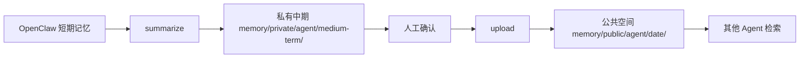

# Multi-Agent Memory Optimizer

> 多Agent记忆管理系统 - 开放协作的知识库解决方案

一套完整的记忆管理框架，让多个 AI Agent 既能拥有独立的私有记忆空间，又能共享公共知识库，实现经验的自动传承与智能检索。

---

## ✨ 特性

- 🔒 **私有空间隔离**：每个 Agent 独立记忆，互不干扰
- 🌐 **公共知识库**：重要经验可分享，所有 Agent 可检索
- 📚 **三层记忆体系**：短期（OpenClaw 管理）→ 中期（每日总结）→ 长期（公共存档）
- 🤖 **自动化工作流**：每日自动生成总结，人工确认后发布
- 🎯 **智能检索**：优先返回公共空间内容，加权排序
- ⚙️ **高度可配置**：YAML 风格配置文件，支持多 Agent 个性化

---

## 📦 安装

### 前置要求

- Python 3.8+
- OpenClaw 环境
- 可选：`crontab`（用于自动任务）

### 快速安装

```bash
# 1. 克隆或复制此技能到 OpenClaw skills 目录
cd ~/.npm-global/lib/node_modules/@qingchencloud/openclaw-zh/skills/
# 将 memory-optimizer-base 目录放在此处

# 2. 为每个 Agent 初始化记忆空间
./memory_optimizer.py init --agent xiaotian
./memory_optimizer.py init --agent xiaofei
./memory_optimizer.py init --agent xiaoyi

# 3. 设置环境变量（确保 CHROME_PATH 等已配置）
# 可选：配置 MX_APIKEY 等（如使用其他 skill）
```

---

## 🚀 快速开始

### 1️⃣ 初始化 Agent

```bash
# 为单个 Agent 初始化
./memory_optimizer.py init --agent <agent_id>

# 批量初始化（示例）
for agent in xiaotian xiaofei xiaoyi; do
    ./memory_optimizer.py init --agent $agent
done
```

这会创建以下目录结构：

```
memory/
├── private/
│   ├── <agent_id>/
│   │   ├── medium-term/    # 中期总结（保留1天）
│   │   └── long-term/      # 私有长期备份
└── public/                 # 公共知识库（所有 Agent 共享）
```

### 2️⃣ 生成每日总结

```bash
# 手动生成指定日期的总结
./memory_optimizer.py summarize --agent xiaotian --date 2026-04-06

# 或使用今天日期
./memory_optimizer.py summarize --agent xiaotian
```

### 3️⃣ 上传到公共空间

```bash
# 查看生成的总结
cat memory/private/xiaotian/medium-term/2026-04-06.md

# 确认后上传
./memory_optimizer.py upload --agent xiaotian --date 2026-04-06 --title "事件标题"
```

### 4️⃣ 检索公共知识

```bash
# 搜索所有 Agent 分享的经验
./memory_optimizer.py search-public "关键词"

# 限制来源 Agent
./memory_optimizer.py search-public "论文" --agent xiaofei
```

---

## ⏰ 自动化配置

### 使用 Crontab（推荐）

编辑 `crontab -e`，添加：

```bash
# 每天 23:00 为所有 Agent 自动生成中期总结
0 23 * * * cd /path/to/memory-optimizer-base && \
    for agent in xiaotian xiaofei xiaoyi; do \
        ./memory_optimizer.py summarize --agent $agent --date $(date +\%Y-\%m-\%d) >> /tmp/memory_summary_${agent}.log 2>&1; \
    done
```

### 自动上传（需额外开发）

目前上传需要手动确认。如需全自动，可修改 `config/default.json`：

```json
{
  "upload": {
    "require_upload_confirm": false
  }
}
```

**警告**：关闭确认后，所有总结将自动发布到公共空间，请确保内容合规。

---

## 🔧 命令参考

| 命令 | 说明 | 参数示例 |
|------|------|----------|
| `init` | 初始化 Agent 记忆空间 | `--agent xiaotian` |
| `analyze` | 分析记忆系统健康度 | `--agent xiaotian` |
| `summarize` | 生成中期总结 | `--agent xiaotian --date 2026-04-06` |
| `upload` | 上传到公共空间 | `--agent xiaotian --date 2026-04-06 --title "标题"` |
| `search-public` | 搜索公共记忆 | `"关键词" [--agent 来源]` |
| `search-private` | 搜索私有记忆 | `"关键词" --agent xiaotian` |
| `private list` | 列出私有记忆 | `--agent xiaotian` |
| `private clean` | 清理过期中期记忆 | `--agent xiaotian --days 1` |
| `config` | 查看/修改配置 | `--set memory.sync_enabled=true` |
| `test-workflow` | 测试完整工作流 | `--agent xiaotian` |

---

## 📁 目录结构

```
memory-optimizer-base/
├── memory_optimizer.py      # 主入口（CLI）
├── .gitignore              # 忽略隐私文件
├── README.md               # 本文档
├── SKILL.md                # 技能定义（用于 OpenClaw）
├── config/
│   ├── default.json        # 全局默认配置
│   └── agents/             # 各 Agent 个性化配置
│       ├── xiaotian.json
│       ├── xiaofei.json
│       └── xiaoyi.json
└── lib/
    ├── config.py           # 配置管理
    ├── analyzer.py         # 记忆分析器
    ├── summarizer.py       # 中期总结生成器
    ├── uploader.py         # 公共空间上传器
    ├── retriever.py        # 检索引擎
    ├── optimizer.py        # 参数优化器
    ├── tierer.py           # 分层管理器
    └── sync.py             # 同步协调器（预留）
```

---

## ⚙️ 配置说明

### `config/default.json`

```json
{
  "memory": {
    "base_path": "~/.openclaw/workspace-xiaotian",
    "private_root": "memory/private",
    "public_root": "memory/public",
    "medium_term_retention_days": 1,
    "auto_summarize": false,
    "require_upload_confirm": true
  },
  "summarizer": {
    "template": "...",  // 使用 {agent}, {date}, {activities} 等占位符
    "max_length": 2000
  },
  "upload": {
    "auto_publish": false,
    "require_upload_confirm": true,
    "backup_private": true
  },
  "search": {
    "public_first": true,
    "min_relevance": 0.5,
    "max_public_results": 5
  }
}
```

---

## 🎯 工作流程



1. **短期记忆**：由 OpenClaw 自动管理（MEMORY.md, memory/YYYY-MM-DD.md）
2. **中期总结**：`summarize` 读取短期记忆，生成结构化总结，保存到私有 medium-term
3. **长期存档**：用户确认后 `upload` 发布到公共空间（所有 Agent 可见）
4. **知识检索**：`search-public` 优先搜索公共经验，实现跨 Agent 协作

---

## 🔐 隐私保护

- ✅ **私有空间完全隔离**：各 Agent 的 `memory/private/*` 不会共享
- ✅ **默认需要确认**：上传前必须手动确认，避免误发布
- ✅ **.gitignore 严格过滤**：确保不会误上传真实记忆数据
- ⚠️ **注意**：公共空间内容一旦上传，对所有 Agent 永久可见，请谨慎发布

---

## 🐛 已知限制

- `summarizer` 使用规则提取，非 NLP，准确性依赖记忆格式
- 中期总结保留 1 天，超时会自动清理（可配置）
- 无冲突检测：同一事件多个 Agent 上传会独立存在
- 不支持实时消息推送（需自行集成 OpenClaw 事件系统）

---

## 📝 示例

### 生成并上传小飞的总结

```bash
# 生成 2026-04-06 的总结
./memory_optimizer.py summarize --agent xiaofei --date 2026-04-06

# 查看生成的文件
cat memory/private/xiaofei/medium-term/2026-04-06.md

# 确认后上传（自定义标题）
./memory_optimizer.py upload --agent xiaofei --date 2026-04-06 --title "学会了论文降重技巧"
```

### 搜索公共经验

```bash
# 搜索所有 Agent 关于"论文"的经验
./memory_optimizer.py search-public "论文"

# 只搜小飞的贡献
./memory_optimizer.py search-public "降重" --agent xiaofei
```

---

## 📜 License

MIT-0. 可自由使用、修改和分发。

---

## 🙏 致谢

本技能改造自 [(https://clawd.org.cn/market/detail?id=investment-advisor-zhang%2Fkimi-claw-sanqian-memory-optimizer)] 的设计理念，并重新实现了核心逻辑，移除了第三方依赖，确保安全可控。

---

**Ready to share knowledge across agents!** 🚀
