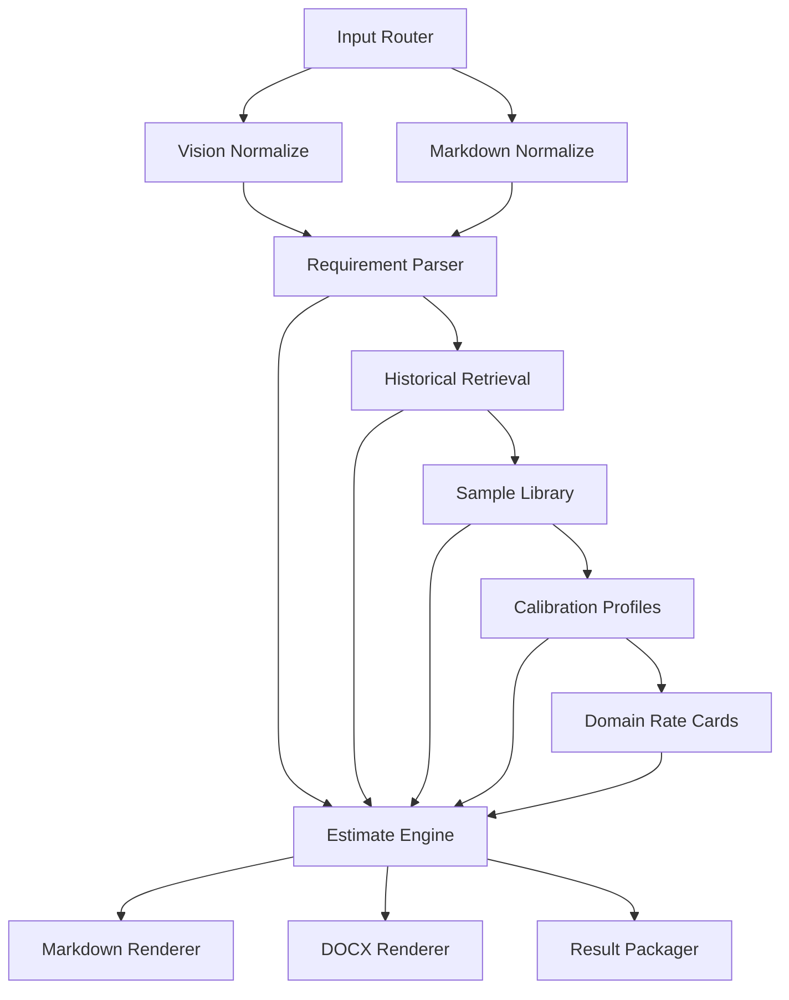

# OpenClaw Workflow Design

## Goal

Run the quotation system inside OpenClaw as a multi-node workflow that accepts either:

1. A markdown requirement document
2. A mind-map image or screenshot

and outputs:

1. Structured quotation JSON
2. Markdown quotation draft
3. DOCX quotation document

## Workflow Overview



## Node List

### 1. Input Router

Purpose:

- Detect whether the user uploaded markdown, plain text, DOCX, or an image
- Route the request into the correct normalization path

Inputs:

- `input_type`
- `input_uri`
- `project_name` optional
- `vendor_name` optional
- `quote_date` optional
- `tax_note` optional

Outputs:

- `normalized_input_task`

### 2. Vision Normalize

Purpose:

- Read a mind-map image or screenshot
- Transcribe the visual structure into markdown bullets
- Preserve module hierarchy and dependencies

Inputs:

- `image_uri`
- `project_name` optional

Outputs:

- `requirement_markdown`
- `vision_notes`

Notes:

- This node should use OpenClaw multimodal capability
- Keep OCR and visual transcription outside the estimation engine

### 3. Markdown Normalize

Purpose:

- Read markdown, txt, or already-transcribed text
- Clean formatting noise
- Keep headings and feature bullets

Inputs:

- `text_uri`

Outputs:

- `requirement_markdown`

### 4. Requirement Parser

Purpose:

- Convert markdown into the normalized input contract
- Infer domains and delivery channels
- Extract features, assumptions, and non-functional requirements

Inputs:

- `requirement_markdown`

Outputs:

- `requirement_json`

Reference:

- [quotation-data-model.md](quotation-data-model.md)

### 5. Historical Retrieval

Purpose:

- Load or query the historical quotation corpus
- Return similar documents and domain hints

Inputs:

- `requirement_json`
- `corpus_index_uri`

Outputs:

- `similar_documents`
- `retrieval_context`

Implementation options:

- Current local mode: keyword matching over extracted corpus JSON
- Future OpenClaw mode: embeddings or reranking over stored historical quotations

### 6. Sample Library

Purpose:

- Load or refresh structured module-level price samples

Inputs:

- `sample_library_uri`

Outputs:

- `sample_library`

### 7. Calibration Profiles

Purpose:

- Load or refresh stratified profiles by category, domains, and channels

Inputs:

- `profiles_uri`

Outputs:

- `calibration_profiles`

### 8. Domain Rate Cards

Purpose:

- Load or refresh domain-level rate cards
- Expose top-level price bands for AI, miniapp, app, platform, IoT, and cross-border projects

Inputs:

- `rate_cards_uri`

Outputs:

- `domain_rate_cards`

### 9. Estimate Engine

Purpose:

- Build line items
- Apply heuristic estimation
- Apply profile calibration when possible
- Fall back to domain rate cards or flat samples
- Produce the final quotation payload

Inputs:

- `requirement_json`
- `similar_documents`
- `sample_library`
- `calibration_profiles`
- `domain_rate_cards`
- `vendor_name` optional
- `quote_date` optional
- `tax_note` optional

Outputs:

- `quote_json`

Current local implementation mapping:

- [generate_quote_draft.py](../scripts/generate_quote_draft.py)

### 10. Markdown Renderer

Purpose:

- Turn `quote_json` into a human-readable markdown draft

Inputs:

- `quote_json`

Outputs:

- `quote_markdown`

### 11. DOCX Renderer

Purpose:

- Turn `quote_json` into a formal Word document

Inputs:

- `quote_json`

Outputs:

- `quote_docx`
- `quote_html` optional

Current local implementation mapping:

- [render_quote_docx.py](../scripts/render_quote_docx.py)

### 12. Result Packager

Purpose:

- Bundle markdown, JSON, DOCX, retrieval evidence, and audit notes
- Return or store the final run artifact

Inputs:

- `quote_json`
- `quote_markdown`
- `quote_docx`
- `similar_documents`

Outputs:

- `quotation_result_package`

## Entry Paths

### Path A: Markdown Requirement

1. Input Router
2. Markdown Normalize
3. Requirement Parser
4. Historical Retrieval
5. Sample Library
6. Calibration Profiles
7. Domain Rate Cards
8. Estimate Engine
9. Markdown Renderer
10. DOCX Renderer
11. Result Packager

### Path B: Mind Map Screenshot

1. Input Router
2. Vision Normalize
3. Requirement Parser
4. Historical Retrieval
5. Sample Library
6. Calibration Profiles
7. Domain Rate Cards
8. Estimate Engine
9. Markdown Renderer
10. DOCX Renderer
11. Result Packager

## Failure and Fallback Rules

### Vision failure

- If visual parsing is incomplete, still produce `requirement_markdown` with uncertainty notes
- Mark missing branches as open questions

### Sparse historical samples

- Prefer `category+domains` profile when sample count is adequate
- If profile support is sparse, fall back to domain rate card
- If no rate card applies, fall back to flat sample library
- If no sample exists, fall back to heuristic estimation only

### Rendering failure

- If DOCX rendering fails, still return markdown and JSON
- Keep the estimation payload stable so rendering can be retried independently

## Storage Model for OpenClaw

Recommended datasets:

1. `historical_quote_corpus`
2. `structured_quote_samples`
3. `quote_calibration_profiles`
4. `domain_rate_cards`
5. `generated_quotes`

Recommended output bundle:

```json
{
  "quote_json_uri": "...",
  "quote_markdown_uri": "...",
  "quote_docx_uri": "...",
  "similar_documents": [],
  "audit": {
    "domains": [],
    "calibration_methods": [],
    "warnings": []
  }
}
```

## Migration Order

1. Move the current corpus, sample library, profiles, and rate cards into OpenClaw-managed storage
2. Implement markdown entry path first
3. Implement DOCX renderer second
4. Add vision entry path for mind maps after the text pipeline is stable
5. Replace local retrieval with retrieval service when historical data volume grows
