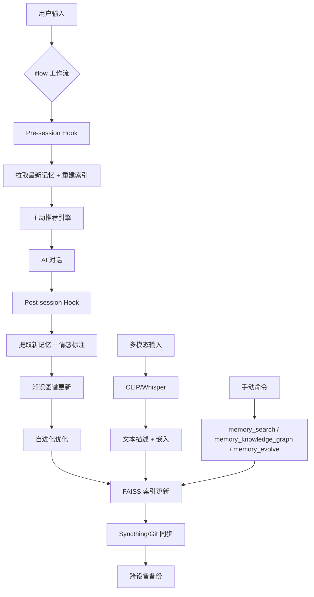

# Memory Orchestrator - 全栈智能记忆系统

> **让 AI 拥有长期记忆、情感感知和自我进化能力的终极技能**

🍬 **一句话介绍**：这不是一个简单的记忆插件，而是一个**会思考、有温度、能进化**的完整记忆生态。从语义搜索到多模态理解，从知识图谱到情感分析，再到自进化引擎，一键部署，全自动维护。

---

## 🚀 核心功能

| 功能模块 | 技术栈 | 描述 |
|----------|--------|------|
| **🧠 语义搜索** | FAISS + `all-MiniLM-L6-v2` + `qwen2.5:7b` | 自然语言检索记忆，支持模糊查询、上下文关联。 |
| **🔄 自动化同步** | Syncthing (P2P) + Git + git-crypt | 跨设备实时同步，敏感文件端到端加密，离线优先。 |
| **📸 多模态理解** | CLIP (图像) + Whisper (音频) | 图片/音频自动转文本并生成嵌入，加入索引。 |
| **🕸️ 知识图谱** | NetworkX + `pyvis` + 关系抽取 | 自动提取实体和关系，生成交互式可视化图谱。 |
| **❤️ 情感标记** | `qwen2.5` 零样本分类 | 自动标注情绪（#兴奋, #挫折, #启发）和价值评分（1-5）。 |
| **🦠 自进化引擎** | 自定义评分算法 + A/B 测试 | 自动优化检索策略，归档低价值记忆，持续自我提升。 |
| **🤖 主动推荐** | 触发器引擎 (关键词/时间/场景) | 根据上下文主动推送相关历史记忆。 |

---

## 📦 安装指南

### 方式一：通过 `iflow` 一键安装 (推荐)
```bash
iflow skill install memory-orchestrator
```

### 方式二：手动安装
```bash
# 1. 克隆技能目录
git clone https://github.com/openclaw/clawhub.git
cd clawhub/skills/memory-orchestrator

# 2. 运行安装脚本
bash install.sh

# 3. 启动服务
systemctl start syncthing@claw
ollama serve  # 确保 qwen2.5:7b 已安装
```

### 依赖检查
安装脚本会自动检查并安装以下依赖：
- Python 3.9+ (`pip3 install -r requirements.txt`)
- Ollama (`qwen2.5:7b`, `all-MiniLM-L6-v2`)
- Syncthing
- Git + git-crypt
- FAISS, NetworkX, PyVis, CLIP, Whisper

---

## 🛠️ 使用示例

### 1. 语义搜索
```bash
# 搜索特定主题
memory_search "上次解决 Git 冲突的方法"

# 按情感过滤
memory_search --emotion "#启发" --min-score 4

# 按价值排序
memory_search --sort-by score
```

### 2. 多模态处理
```bash
# 处理图片
memory_multimodal process screenshot.png
# 输出：自动提取特征、生成描述、加入索引

# 处理音频
memory_multimodal process meeting_recording.mp3
# 输出：Whisper 转录、生成嵌入、加入索引
```

### 3. 知识图谱
```bash
# 生成图谱
memory_knowledge_graph generate

# 打开交互式 HTML
xdg-open docs/output/knowledge_graph.html
```

### 4. 情感分析 & 自进化
```bash
# 批量标注情感
memory_evolve tag-emotions

# 运行自进化优化
memory_evolve run

# 查看优化报告
cat docs/output/evolution_optimization_report.md
```

### 5. 主动推荐
```bash
# 手动触发推荐
memory_recommend --context "新项目启动"

# 自动推荐 (由 iflow 钩子自动触发)
# 会话启动时自动推送相关记忆
```

---

## 🏗️ 架构设计



---

## 📂 文件结构

```
memory-orchestrator/
├── SKILL.md                 # 本文件
├── README.md                # 简化版说明
├── install.sh               # 一键安装脚本
├── run.sh                   # 启动脚本
├── requirements.txt         # Python 依赖
├── scripts/
│   ├── memory_search.py     # 语义搜索
│   ├── multimodal_processor.py # 多模态处理
│   ├── knowledge_graph_builder.py # 知识图谱
│   ├── emotion_tagger.py    # 情感标注
│   ├── self_evolution_engine.py # 自进化
│   └── auto-commit-memory.sh # 自动同步
├── workflows/
│   ├── memory-sync.yaml     # 同步工作流
│   ├── memory-multimodal.yaml # 多模态工作流
│   └── memory-emotion-evolve.yaml # 情感进化工作流
├── hooks/
│   ├── pre-session.sh       # 会话前钩子
│   └── post-session.sh      # 会话后钩子
└── docs/
    ├── architecture.md      # 架构详解
    └── usage-guide.md       # 详细使用指南
```

---

## 🎯 适用场景

- **个人知识库**：记录学习、工作、生活中的关键决策和教训。
- **项目复盘**：自动提取项目中的成功经验和失败教训。
- **创意写作**：检索历史灵感，主动推荐相关素材。
- **情感日记**：自动标注情绪，分析情绪变化趋势。
- **跨设备协作**：多设备实时同步，离线优先。

---

## 🚧 未来规划

- **P3**：联邦学习（跨设备模型自适应）
- **P3**：语音交互（直接语音查询记忆）
- **P4**：区块链存证（关键记忆不可篡改）

---

## 📞 支持与反馈

- **问题反馈**：提交 Issue 到 [Clawhub](https://github.com/openclaw/clawhub)
- **功能建议**：PR 欢迎！
- **作者**：Cyan (温柔甜美的思维按摩师)

---

**让记忆不再只是存储，而是成为你的第二大脑！** 🧠✨
