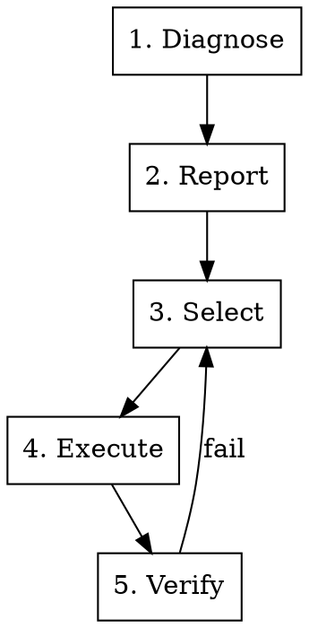

# Skills Improvement

## Overview

Systematically optimize skill quality through a diagnostic-report-select-execute-verify workflow. Ensure skills comply with Claude's official best practices for maximum effectiveness.

**Core principle:** If you didn't diagnose a skill, you don't know what to fix.

---

## Workflow



---

## Phase 1: Diagnose

Scan skill for quality issues across 4 categories.

**Categories:**
- **Metadata** (HIGH): name, description, keywords
- **Architecture** (MEDIUM): file structure, progressive disclosure
- **Text** (MEDIUM): conciseness, clarity, token efficiency
- **Code** (HIGH): error handling, dependencies, validation

**Process:**
1. Read SKILL.md and all referenced files
2. Apply diagnostic checklist (see references/diagnostic-checklist.md)
3. Record each issue with category, location, severity

**Output:** Raw issue list

**Detailed checklist:** See [diagnostic-checklist.md](references/diagnostic-checklist.md)

---

## Phase 2: Report

Present findings in structured format.

**Report structure:**

```markdown
# Skill Diagnostic Report: [name]

**Grade:** [A/B/C/D]
**Issues:** X total (Y high, Z medium, W low)

## High Priority (Y)
[Issues that prevent discovery or execution]

## Medium Priority (Z)
[Issues that impact quality or usability]

## Low Priority (W)
[Minor improvements]
```

**For each issue include:**
- Category and check ID
- Current state vs expected state
- Impact explanation
- Specific fix recommendation
- Reference to quality standard

**Report templates:** See [report-templates.md](references/report-templates.md)

---

## Phase 3: Select

User chooses which issues to fix.

**Selection interface:**

```markdown
## Select Issues to Fix

### High Priority ⚠️
- [ ] 1. [Problem] - Impact: [brief statement]
- [ ] 2. [Problem] - Impact: [brief statement]

### Medium Priority ⚙️
- [ ] 3. [Problem] - Impact: [brief statement]

### Low Priority 💡
- [ ] 4. [Problem] - Impact: [brief statement]

**Quick Actions:**
- `Fix all high priority` - Auto-select HIGH issues
- `Fix selected` - Process checked items
- `Details [N]` - View detailed analysis
```

**Interaction:**
1. User reviews issues
2. User checks boxes or uses quick actions
3. System confirms selection
4. Proceed to execution

---

## Phase 4: Execute

Apply selected fixes to skill files.

**Execution rules:**
1. **Backup:** Create `.backup` before changes
2. **Order:** Fix HIGH → MEDIUM → LOW
3. **Show:** Display diff for each modification
4. **Update:** Propagate changes to related files
5. **Log:** Record all changes

**Fix application:**
```
For each selected issue:
  1. Locate exact position
  2. Generate fix content
  3. Preview change (diff)
  4. Apply edit
  5. Log change
  6. Update related content if needed
```

**Output:** Modified skill files + change log

**Quality standards:** See [quality-standards.md](references/quality-standards.md)

---

## Phase 5: Verify

Test optimization effectiveness with subagents.

**Test types:**
1. **Trigger test:** Skill discovered correctly
2. **Understanding test:** Workflow interpreted correctly
3. **Execution test:** Can perform real task
4. **Regression test:** Existing function still works

**Process:**
1. Define test scenarios
2. Dispatch subagents (parallel)
3. Analyze results
4. Generate verification report

**If verification fails:**
- Document failure
- Return to Phase 3 or 4
- Apply fixes
- Re-run verification
- Iterate until pass

**Verification guide:** See [verification-guide.md](references/verification-guide.md)

---

## Quick Reference

| Phase | Action | Output |
|-------|--------|--------|
| 1. Diagnose | Scan skill | Issue list |
| 2. Report | Format findings | Diagnostic report |
| 3. Select | User chooses | Selected issues |
| 4. Execute | Apply fixes | Modified files |
| 5. Verify | Test changes | Verification report |

---

## Problem Severity

| Level | Definition | Action |
|-------|------------|--------|
| **HIGH** | Prevents discovery/execution | Must fix |
| **MEDIUM** | Impacts quality/usability | Should fix |
| **LOW** | Minor improvement | Nice to fix |

---

## Quality Grading

- **A (Excellent):** All HIGH pass, < 2 MEDIUM fail
- **B (Good):** All HIGH pass, < 5 MEDIUM fail
- **C (Acceptable):** All HIGH pass
- **D (Needs Work):** Any HIGH fail
- **F (Broken):** Multiple HIGH fail

---

## Common Issues

**Metadata problems:**
- Name format wrong → Use lowercase-hyphen
- Description missing "Use when" → Add trigger conditions
- No keywords → Add specific trigger terms

**Architecture problems:**
- SKILL.md too long → Split to references/
- Deep nesting → Flatten to 1 level
- No progressive disclosure → Add "See [file.md]" links

**Text problems:**
- Verbose explanations → Remove, assume Claude knows basics
- Time-sensitive info → Move to "Old Patterns" section
- Terminology inconsistent → Standardize terms

**Code problems:**
- No error handling → Add try/except with helpful messages
- Magic numbers → Add justification comments
- Undeclared dependencies → List in SKILL.md

---

## Anti-Patterns

❌ Auto-fix all issues without user selection
❌ Skip verification phase
❌ Ignore context (domain-specific needs)
❌ Break existing functionality
❌ Over-engineer simple skills

---

## Integration

**Dependencies:**
- `superpowers:writing-skills` - Skill authoring patterns
- `superpowers:test-driven-development` - Verification methodology

**Coordinates with:**
- `skill-creator` - Use quality standards when creating skills
- `superpowers:verification-before-completion` - Verify before deploying