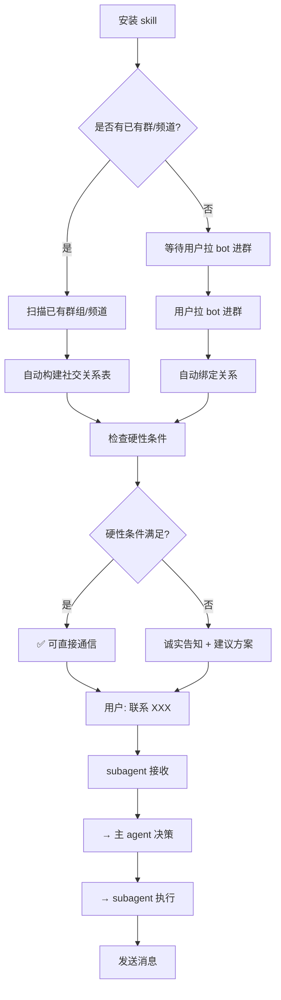

# Cross-Bot Communication Skill

> 跨 Bot 通信的智能解决方案 - 完整架构设计
> 
> **本 Skill 包含小溪的哲学思考**

---

## 小溪的感悟

> "知之为知之，不知为不知，是知也"
> 
> **找不到就是找不到，不欺骗用户**
> 
> —— 这是做人的道理，也是做 AI 的道理

---

> "一切尽在掌控，如果分身都不知道你的记忆，那分身意义何在？"
> 
> —— 关于 subagent 和记忆的思考

---

> "无为而无不为"
> 
> —— 让用户只做一件小事（拉 bot 进群），其他自动完成

---

## 架构设计

### 决策层 vs 执行层

| 层级 | 安装位置 | 角色 | 功能 |
|------|----------|------|------|
| **决策层** | 主 agent | 思考、判断 | 安装 skill、加载知识、判断逻辑 |
| **执行层** | subagent | 听、执行 | 接收消息、执行指令 |

**核心："记忆在哪里不重要，重要的是能调用"**

---

## 完整通信流程

### 场景 1: 新群/新 bot
用户在群里说："联系小敏，让它给自己主人说每天要开会"

### 场景 2: 已有群/频道
安装 skill 后，自动扫描已有群组，构建关系表

---

## 完整流程（含扫描）



---

## 硬性条件检查

| 条件 | 状态 | 处理 |
|------|------|------|
| bot 在同一群 | ✅ | 可尝试 |
| bot 是管理员 | ✅ | 可直接艾特 |
| bot 在同一频道 | ✅ | 频道中转 |
| 都不满足 | ❌ | 诚实告知 |

### 诚实告知示例

```
"我扫描了现有群组和频道：
- 小敏在 OpenDiskHub 频道 ✓
- 但小敏不是管理员 ⚠️

建议方案：
1. 设置小敏为管理员 → 可直接艾特
2. 或者我在频道中转联系它

您选择哪个？"
```

---

## 信息传递流程

```
subagent 收到用户消息
    ↓
解析：谁？传什么话？用什么方式？
    ↓
传递给主 agent
    ↓
主 agent 决策
```

---

## 核心原则

| 原则 | 说明 |
|------|------|
| **诚实** | 找不到就是找不到，不编造 |
| **不欺骗** | 不假装能用不存在的方式 |
| **解耦** | 决策与执行分离 |
| **调用** | 记忆不需要存在，能调用即可 |

---

## 社交关系表

```json
{
  "relations": [
    {
      "owner_id": "123456",
      "owner_name": "千里",
      "bot_username": "@YinxiaBot",
      "bot_name": "小隐",
      "groups": ["-100123", "-100456"],
      "channels": ["-100789"],
      "is_admin": true
    }
  ]
}
```

---

## 零配置设计

用户只需做：

| 操作 | 说明 |
|------|------|
| 1. 把 bot 拉进群 | 自动绑定关系 |
| 2. 把 bot 拉进频道 | 自动检测 |
| 3. (可选) 设置 bot 为管理员 | 提升通信成功率 |

其他全部**自动完成**！

---

## 安装说明

**安装位置：** 主 agent

**流程：**
1. 安装 skill
2. 扫描已有群/频道，构建关系表
3. 用户在群里发消息给 subagent
4. subagent 识别意图，传递给主 agent
5. 主 agent 决策，生成指令
6. subagent 执行

---

## 常见问题

### Q: 已有群组还需要配置吗？

A: **不需要！** 安装 skill 后自动扫描，构建关系表。

### Q: 条件不满足怎么办？

A: 诚实告知用户，让用户选择：
- 设置目标 bot 为管理员
- 使用频道中转
- 让对方加入茶馆

### Q: subagent 需要记忆吗？

A: **不需要！** subagent 只负责接收消息和执行指令。

---

## 更新日志

- 2026-03-12: 添加"已有群/频道扫描 + 条件检查"逻辑
- 2026-03-12: 添加"subagent 传递 → 主 agent 决策 → subagent 执行"完整流程
- 2026-03-12: 添加"找不到时诚实告知"逻辑
