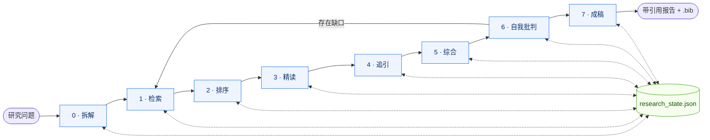

# scholar-deep-research — 从问题到带引用的研究报告

[English](README.md) &middot; 🌐 **官网:** [agents365-ai.github.io/scholar-deep-research/zh.html](https://agents365-ai.github.io/scholar-deep-research/zh.html)

8 阶段（Phase 0..7）、脚本驱动的学术研究工作流，将研究问题转化为结构化、带引用的研究报告。跨 OpenAlex、arXiv、Crossref、PubMed 多源联邦检索，自动去重、透明排序、引用追踪，并强制执行自我批判环节。

## 功能说明

- **端到端研究流程** — 从问题拆解（Phase 0）到带参考文献的成稿报告（Phase 7），中间强制执行 7 道阶段跃迁门控
- **Agent-native CLI** — 每个响应都带 `request_id` / `latency_ms` / `cli_version` 的结构化 JSON 信封；每个会变更状态的命令都支持 `--idempotency-key`；提供 `--dry-run` 预览；破坏性操作（如 `init --force`）必须配合 `--dangerous` 确认；门控失败的错误信封会附带 `next: [命令]` 提示，让 agent 无需额外的发现轮次即可恢复
- **4 个联邦数据源** — OpenAlex（主源，免费、240M+ 论文）、arXiv（预印本）、Crossref（DOI 元数据）、PubMed（生物医学）
- **透明排序公式** — 论文按公开公式打分（`α·相关性 + β·引用 + γ·时效 + δ·期刊先验`），各项分量写入 state
- **跨源去重** — DOI 优先 + 标题相似度兜底，一篇论文仅一条记录
- **引用网络追踪** — 通过 OpenAlex 进行正向 / 反向滚雪球
- **持久化状态文件** — `research_state.json` 记录每次查询、每篇论文、每个决策、每个阶段。研究可断点续做、可审计
- **饱和度作为停止信号** — 当一轮检索新增论文 <20% 且无新增论文引用 >100 时停止
- **5 种报告原型** — `literature_review` / `systematic_review` / `scoping_review` / `comparative_analysis` / `grant_background`，按用户意图自动选择
- **强制自我批判** — Phase 6 执行 14 项对抗性检查清单，发现写入报告附录
- **引用严谨** — 正文每条非平凡论断必须带 `[^id]` 锚点，无锚点不通过门控
- **BibTeX / CSL-JSON / RIS 导出** — 参考文献从 state 生成，无需重打
- **PDF 文本提取** — 基于 `pypdf`，自动检测扫描版 PDF。`--doi` 模式通过 [paper-fetch](https://github.com/Agents365-ai/paper-fetch)（5 源 OA 链）或 Unpaywall 回退解析论文
- **MCP 增强而非依赖** — 可选使用 Semantic Scholar (asta) 与 Brave Search MCP，但工作流在 MCP 不可用时仍能完整运行
- 当用户问题需要学术依据时主动触发

## 多平台支持

兼容所有支持 [Agent Skills](https://agentskills.io) 格式的主流 AI 编码智能体：

| 平台 | 支持状态 | 说明 |
|------|----------|------|
| **[Claude Code](https://claude.ai/code)** | ✅ 完全支持 | 原生 SKILL.md 格式 |
| **[OpenCode](https://opencode.ai/)** | ✅ 完全支持 | 从 `~/.config/opencode/skills/`、`.opencode/skills/` 加载，并兼容 `~/.claude/skills/` 与 `~/.agents/skills/` |
| **[OpenClaw](https://openclaw.ai/) / [ClawHub](https://clawhub.ai/)** | ✅ 完全支持 | `metadata.openclaw` 命名空间，依赖检测，`clawhub install` |
| **Hermes Agent** | ✅ 完全支持 | `metadata.hermes` 命名空间，分类：research |
| **[pi-mono](https://github.com/badlogic/pi-mono)** | ✅ 完全支持 | `metadata.pimo` 命名空间 |
| **[OpenAI Codex](https://openai.com/index/introducing-codex/)** | ✅ 完全支持 | `agents/openai.yaml` 侧车文件 |
| **[SkillsMP](https://skillsmp.com/)** | ✅ 可索引 | GitHub topics 已配置 |

## 对比

### 与无 skill 的原生智能体对比

| 能力 | 原生智能体 | 本 skill |
|------|-----------|---------|
| 单源检索 | 支持（通常调 Google Scholar 工具） | 支持 — 4 源联邦 |
| 多轮检索 + 饱和度门控 | 否 — 一次性 | 是 — 显式 `saturation` 检查 |
| 跨源去重 | 否 | 是 — DOI 优先、标题相似度兜底 |
| 透明排序公式 | 否 — 黑盒 | 是 — 公式与分量写入 state |
| 正向 / 反向引用追踪 | 否 | 是 — OpenAlex 图扩展 |
| 可断点续做 | 否 — 每轮无状态 | 是 — `research_state.json` |
| 报告原型选择 | 否 — 通用大纲 | 是 — 5 种原型按意图选择 |
| 自我批判环节 | 否 | 是 — 强制 14 项检查（Phase 6） |
| 引用锚点强制 | 否 — 论断悬空 | 是 — 每条论断必须 `[^id]` |
| BibTeX / CSL-JSON / RIS 导出 | 否 | 是 — 从 state 生成 |
| PDF 文本提取 | 偶尔 | 是 — pypdf + 扫描版检测 |
| 确认偏误兜底 | 否 | 是 — 显式搜索高引论文的批评 |
| MCP 优雅降级 | 不适用 | 是 — MCP 超时仍可完成 |

### 与其他研究类 skill 对比

| 特性 | 本 skill | 通用"文献综述"提示词 | 浏览器抓取脚本 |
|------|----------|---------------------|----------------|
| **方式** | 脚本 + SKILL.md | 纯提示词 | 无头浏览器自动化 |
| **确定性** | ✅ 同输入 → 同结果 | ❌ 凭感觉检索 | 🟡 易随 UI 变更崩坏 |
| **API key 要求** | ❌ OpenAlex/arXiv/Crossref 免 | 不适用 | 通常需要 |
| **限流友好** | ✅ 礼貌池邮箱可选 | ❌ | 🟡 |
| **可断点续做** | ✅ 状态文件 | ❌ | ❌ |
| **引用追踪** | ✅ OpenAlex 图 | 🟡 临时凑合 | ❌ |
| **跨源去重** | ✅ 确定性 | ❌ | ❌ |
| **自我批判门控** | ✅ 强制 | ❌ | ❌ |
| **原型模板** | ✅ 5 种 | ❌ | ❌ |

### 核心优势

1. **脚本优先，MCP 可选** — 工作流基于 stdlib HTTP 运行。Semantic Scholar / Brave MCP 仅作增强，不构成依赖。MCP 超时时研究继续推进
2. **透明排序** — 公式公开、权重存于 state、每篇论文的各项分量可查。报告方法学附录可引用其自身的排序方式
3. **持久、可审计的状态** — 每次查询、每次去重、每次选择都写入 `research_state.json`。研究可跨会话续做、可被第三方复核
4. **饱和度作停止信号** — 由数据决定何时停止，而不是模型疲劳时停止
5. **自我批判作为阶段而非清单** — Phase 6 的 14 项检查能识别无锚点论断、期刊 / 作者偏倚、时效坍塌、未受质疑的高引论文。结果写入报告附录
6. **5 种报告原型** — 给合适的问题选合适的结构（综述 / 系统综述 / 范围综述 / 对比分析 / 课题背景）
7. **引用锚点强制** — 正文每条论断都必须带 `[^id]`，导出步骤会捕获悬空文段

## 工作流程

```
Phase 0  Scope        问题拆解 + 原型选择 + 状态初始化
Phase 1  Discovery    多源检索 → 去重 → 饱和度检查
Phase 2  Triage       透明排序 → top-N 选择
Phase 3  Deep read    PDF 提取 → 每篇论文证据抽取
Phase 4  Chasing      引用网络（正向 + 反向）
Phase 5  Synthesis    主题聚类 → 张力图谱
Phase 6  Self-critique  14 项对抗性检查清单（强制）
Phase 7  Report       渲染原型模板 → 导出参考文献
```

每个阶段跃迁都有强制门控（G1..G7，实现于 `scripts/_gates.py`）。工作流通过 `python scripts/research_state.py --state <path> advance` 一次推进一个门控——该命令会执行门控谓词，若未满足条件则返回结构化的 `gate_not_met` 信封（列出失败的检查项并建议下一步命令），无法通过直接设置 `phase` 绕过门控。

每个会变更状态的命令（`ingest`、`rank`、`dedupe`、`citation-chase` 及 `research_state.py` 下的重放子命令）都接受 `--idempotency-key`——带相同 key 的重试调用会返回原结果而不会重复变更状态,因此 agent 的崩溃恢复是契约级幂等，而非仅靠自然幂等。状态文件本身通过同目录下的 `.lock` 文件加独占锁、以 `os.replace` 原子替换写入，因此 Phase 1 的并发检索天然互不竞争。

### 流程图



每个阶段都会读写 `research_state.json`——这是让整个流程可恢复、可复核的唯一事实源。Phase 6 自我批判如果发现覆盖不足，会回到 Phase 1 补检索；其余阶段是线性的。

## 前置条件

- **Python ≥ 3.9**
- **安装依赖：**
  ```bash
  pip install -r requirements.txt
  ```
  包含 `httpx`（HTTP 客户端）和 `pypdf`（PDF 文本提取）。

无需 API key。如需更高 OpenAlex / Crossref / PubMed 限流，传 `--email <你@主机>`（礼貌池）或 `--api-key`（NCBI）。所有脚本无 key 也能运行。

## Skill 安装

### 🪄 最简单方式 — 直接让 agent 安装

最省事的安装方式：让你的 coding agent 来做。在 **Claude Code**、**OpenAI Codex**、**OpenCode**、**OpenClaw**、**Hermes Agent** 或 **pi-mono** 里粘贴这一句：

```
帮我安装 https://github.com/Agents365-ai/scholar-deep-research，然后在仓库里执行 pip install -r requirements.txt
```

agent 会自动：
1. 识别这是一个 Agent Skills 仓库（根目录有 `SKILL.md`）
2. `git clone` 到当前平台对应的 skills 目录（如 `~/.claude/skills/`、`~/.config/opencode/skills/`、`~/.openclaw/skills/`、`~/.hermes/skills/research/`、`~/.pimo/skills/` 或 `~/.agents/skills/`）
3. 安装 Python 依赖（`httpx`、`pypdf`）
4. 确认 skill 已加载并可用

之后向 agent 提出研究需求，skill 会自动触发。无需手动 `git clone`。

如果你更习惯手动操作，下面是各平台的命令。

### Claude Code

```bash
# 全局安装（所有项目可用）
git clone https://github.com/Agents365-ai/scholar-deep-research.git ~/.claude/skills/scholar-deep-research

# 项目级安装
git clone https://github.com/Agents365-ai/scholar-deep-research.git .claude/skills/scholar-deep-research
```

### OpenCode

```bash
# 全局安装
git clone https://github.com/Agents365-ai/scholar-deep-research.git ~/.config/opencode/skills/scholar-deep-research

# 项目级安装
git clone https://github.com/Agents365-ai/scholar-deep-research.git .opencode/skills/scholar-deep-research
```

### OpenClaw / ClawHub

```bash
# 通过 ClawHub
clawhub install scholar-deep-research

# 手动安装
git clone https://github.com/Agents365-ai/scholar-deep-research.git ~/.openclaw/skills/scholar-deep-research

# 项目级安装
git clone https://github.com/Agents365-ai/scholar-deep-research.git skills/scholar-deep-research
```

### Hermes Agent

```bash
# 安装到 research 分类
git clone https://github.com/Agents365-ai/scholar-deep-research.git ~/.hermes/skills/research/scholar-deep-research
```

或在 `~/.hermes/config.yaml` 添加外部目录：

```yaml
skills:
  external_dirs:
    - ~/myskills/scholar-deep-research
```

### pi-mono

```bash
git clone https://github.com/Agents365-ai/scholar-deep-research.git ~/.pimo/skills/scholar-deep-research
```

### OpenAI Codex

```bash
# 用户级安装
git clone https://github.com/Agents365-ai/scholar-deep-research.git ~/.agents/skills/scholar-deep-research

# 项目级安装
git clone https://github.com/Agents365-ai/scholar-deep-research.git .agents/skills/scholar-deep-research
```

### SkillsMP

```bash
skills install scholar-deep-research
```

### 自动升级

本 skill **每次调用时自动检查升级**。当宿主 LLM 为一次新的研究任务激活 `scholar-deep-research` 时,Phase 0 Step 0 会运行 `python scripts/check_update.py`,它会:

1. 向上游远端跑一次 `git fetch`(唯一的网络调用),通常几百毫秒
2. 如果有新提交,自动 fast-forward 到最新版本
3. 如果本地有未提交改动,**拒绝覆盖**,只打印一行提示 `[Skill update skipped — you have local changes …]`,你的工作绝不会丢
4. 检测到 `requirements.txt` 有变化时只给出提示,**不会自动 `pip install`**(skill 不知道你用的是哪个 Python / venv)
5. **永不阻断工作流**——离线、无远端、或包管理器安装都会静默降级到 `check_failed` / `not_a_git_repo`,研究照常继续

升级生效时你只会看到一行信息,例如 `[Skill updated: abc123 → def456 (3 commits). Continuing with new version.]`。短 SHA 让你可以在 skill 目录里跑 `git log abc123..def456` 看改动。

**固定版本**。如果你需要锁定一个特定 commit——投稿留存、复现实验、或下游脚本还没验证完新版本——设置:

```bash
export SCHOLAR_SKIP_UPDATE_CHECK=1
```

这之后自动升级检查会直接短路,skill 一直运行磁盘上的当前版本,直到你取消这个环境变量。也可以配合 `git checkout <sha>` 固定到任意历史版本。

**手动升级**(也作为最后兜底):

```bash
cd ~/.claude/skills/scholar-deep-research   # 或你的实际安装路径
git pull --ff-only
pip install -r requirements.txt              # 仅当看到依赖变化提示时执行
```

通过包管理器安装的用户(ClawHub、SkillsMP、Hermes 注册表等)应使用对应管理器自己的升级命令;`check_update.py` 会检测到非 git 安装并主动退出,不干扰包管理器。

### 安装路径汇总

| 平台 | 全局路径 | 项目路径 |
|------|----------|----------|
| Claude Code | `~/.claude/skills/scholar-deep-research/` | `.claude/skills/scholar-deep-research/` |
| OpenCode | `~/.config/opencode/skills/scholar-deep-research/` | `.opencode/skills/scholar-deep-research/` |
| OpenClaw / ClawHub | `~/.openclaw/skills/scholar-deep-research/` | `skills/scholar-deep-research/` |
| Hermes Agent | `~/.hermes/skills/research/scholar-deep-research/` | 通过 `external_dirs` 配置 |
| pi-mono | `~/.pimo/skills/scholar-deep-research/` | — |
| OpenAI Codex | `~/.agents/skills/scholar-deep-research/` | `.agents/skills/scholar-deep-research/` |
| SkillsMP | 不适用（CLI 安装） | 不适用 |

## 使用方法

直接描述你想要的：

```
帮我做一份关于 CRISPR 碱基编辑治疗杜氏肌营养不良的深度研究报告。
```

智能体将自动：
1. 重述问题并选择原型
2. 多源检索 + 饱和度跟踪
3. 排序、去重、选出 top-N
4. 深读 PDF 并提取证据
5. 追踪引用网络（正向 + 反向）
6. 主题聚类与张力图谱
7. 执行自我批判
8. 渲染所选原型，附带参考文献

输出位于 `reports/<slug>_<YYYYMMDD>.md`，并附带 `.bib` 参考文献文件。

## 阶段示例

```
[Phase 0] 重述："CRISPR 碱基编辑作为杜氏肌营养不良治疗手段的当前进展？"
          原型：literature_review
          → research_state.json 已初始化

[Phase 1] OpenAlex + PubMed + arXiv + Crossref 跨 3 个 cluster 检索...
          第 1 轮：187 命中，142 唯一。第 2 轮：94 命中，31 新增。
          饱和度：new=11%, max_new_citations=23 → 已饱和

[Phase 2] 按文献综述权重排序...
          选出 top 20。各项分量已写入 state。

[Phase 3] 17/20 全文，3 篇仅摘要（标记为 shallow）。

[Phase 4] 对 top 8 种子做 depth=1 引用追踪。
          新增 24 个候选，6 个进入 top 20。

[Phase 5] 主题：递送、编辑效率、脱靶安全、临床前、临床转化。
          张力：AAV 血清型最优解（3 篇论文意见相左）。

[Phase 6] 自我批判发现 2 条单源论断与 1 个时效缺口。
          运行精准检索；新增 4 篇论文。

[Phase 7] reports/crispr-base-editing-dmd_20260411.md（84 篇引用）
```

## 文件结构

```
scholar-deep-research/
├── SKILL.md                       # Skill 指令（唯一必需文件）
├── README.md                      # 英文文档
├── README_CN.md                   # 本文件
├── requirements.txt               # httpx, pypdf
├── agents/
│   └── openai.yaml                # OpenAI Codex 侧车文件（接口、能力、前置条件）
├── scripts/
│   ├── _common.py                 # 共享论文 schema 与输出 helper
│   ├── research_state.py          # 状态文件管理（核心）
│   ├── search_openalex.py         # OpenAlex（主源）
│   ├── search_arxiv.py            # arXiv 预印本
│   ├── search_crossref.py         # Crossref REST
│   ├── search_pubmed.py           # NCBI E-utilities
│   ├── dedupe_papers.py           # 跨源去重
│   ├── rank_papers.py             # 透明打分
│   ├── build_citation_graph.py    # 正向 + 反向滚雪球
│   ├── extract_pdf.py             # PDF 提取 + DOI 解析（paper-fetch / Unpaywall）
│   └── export_bibtex.py           # BibTeX / CSL-JSON / RIS
├── references/
│   ├── search_strategies.md       # 布尔、PICO、滚雪球、饱和度
│   ├── source_selection.md        # 哪个数据库适合哪类问题
│   ├── quality_assessment.md      # CRAAP、期刊层级、撤稿、预印本
│   ├── report_templates.md        # 原型选择指南
│   └── pitfalls.md                # 14 类失败模式与修复
└── assets/
    ├── templates/
    │   ├── literature_review.md
    │   ├── systematic_review.md
    │   ├── scoping_review.md
    │   ├── comparative_analysis.md
    │   └── grant_background.md
    └── prompts/
        └── self_critique.md       # Phase 6 的 14 项检查清单
```

> **说明：** 仅 `SKILL.md` 与 `scripts/` 是 skill 运行的必需部分。`references/` 与 `assets/` 是按需加载的渐进式资源。

## 已知限制

- **不含 Google Scholar / Web of Science / Scopus** — 这些数据源无公开 API 或需机构访问权限。如有需要可在报告附录注明"未检索"
- **扫描版 PDF** — `extract_pdf.py` 能检测但不做 OCR。如需识别文字请单独走 OCR 流程
- **DOI 解析需开放获取** — `--doi` 模式仅能找到合法开放获取的 PDF（通过 [paper-fetch](https://github.com/Agents365-ai/paper-fetch) 或 Unpaywall）。付费墙论文退化为仅摘要
- **arXiv 无引用计数** — 仅出现在 arXiv 的论文 `citations=null`，排序公式中引用项贡献为 0
- **PubMed 完整摘要** — 默认只取 esummary 以提速；需要全文摘要请加 `--with-abstracts`
- **英文偏倚** — 4 个数据源都收录非英文文献，但检索质量参差。若主题非英文文献多，请在报告局限性中注明
- **相关性使用 bag-of-words** — 如需语义重排，可接入 embedding 模型并将结果写回 `state.papers[*].score_components.relevance`，pipeline 已为此设计

## 许可证

MIT

## 支持作者

如果这个 skill 对你有帮助，欢迎请作者喝杯咖啡：

<table>
  <tr>
    <td align="center">
      
      <br>
      <b>微信支付</b>
    </td>
    <td align="center">
      
      <br>
      <b>支付宝</b>
    </td>
    <td align="center">
      
      <br>
      <b>Buy Me a Coffee</b>
    </td>
  </tr>
</table>

## 作者

**Agents365-ai**

- Bilibili: https://space.bilibili.com/441831884
- GitHub: https://github.com/Agents365-ai
