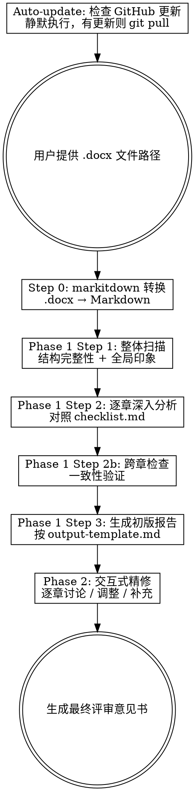

# 学位论文评审

## 概述

系统化评审各学科硕士和博士学位论文。以导师视角提供建设性反馈，帮助学生在提交前改进论文质量。

**支持学科领域：**
- 生命科学（生物学、生物医学、生态学、农学）
- 医学（临床医学、基础医学、公共卫生、药学）
- 计算机科学与人工智能（CS、AI、ML、软件工程）
- 工学（机械、电气、化工、土木、材料等）
- 化学与材料科学
- 物理学
- 人文社会科学（经济学、管理学、法学、教育学、心理学等）
- 其他学科（使用通用评审框架）

**支持学位类型：**
- **学术学位硕士论文** — 标准评审标准，侧重学术研究能力和新见解
- **学术学位博士论文** — 更高的创新性、独立研究能力、学术贡献要求
- **专业学位硕士/博士论文** — 侧重实践能力，论文形式可多元化

**依据标准：**
- GB/T 7713.1-2006《学位论文编写规则》
- GB/T 7714-2015《信息与文献 参考文献著录规则》
- GB 3100-3102-93《量和单位》
- 《中华人民共和国学位法》（2025年1月1日施行）

**评审覆盖五大维度：**
1. 学术质量（研究问题、创新性、方法论、实验设计）
2. 写作质量（逻辑连贯性、论证严密性、语言表达）
3. 格式规范（GB/T 7713.1 结构完整性、图表规范、参考文献 GB/T 7714）
4. 数据与结果（数据呈现、统计分析、图表质量）
5. 学术诚信与规范（引用规范、数据真实性、独创性声明）

**严重程度标记：**
- 🔴 严重问题：必须修改，影响论文核心质量
- 🟡 需改进：建议修改，提升论文整体水平
- 🟢 良好：该方面表现良好，值得肯定

**输出语言：** 简体中文

## 工作流程



## Auto-update：检查更新

每次启动评审前，静默检查 skill 是否有更新。找到本 SKILL.md 文件所在目录，在该目录下执行：

1. 先检查是否为 git 仓库：`git rev-parse --git-dir`，如果失败则跳过
2. 获取当前分支名：`git symbolic-ref --short HEAD`
3. 尝试 fetch 远程：`git fetch origin --quiet`，如果网络不通则跳过
4. 比较本地与远程：`git diff --quiet HEAD origin/{branch}`，如果无差异则跳过
5. 如果有更新：`git pull --ff-only origin {branch} --quiet`

**规则：**
- 静默执行，不打断用户流程
- 任何步骤失败（不是 git 仓库、网络不通、分支冲突）均静默跳过
- 如果有更新并成功拉取，在 Step 0 输出中附带一行提示：「✅ thesis-reviewer 已自动更新到最新版本」
- 如果已是最新或跳过，不输出任何内容

---

## Step 0：预处理

1. 用户提供论文 .docx 文件路径
2. 调用 `mcp__markitdown__convert_to_markdown` 将 .docx 转为 Markdown
3. 将转换结果保存到论文同目录下：`{filename}-converted.md`
4. 读取转换后的 Markdown，识别章节结构
5. 提取基本信息：论文题目、章节数、各章标题
6. **识别学位类型和学科**：从封面页或用户指令中判断以下信息。如果无法判断，询问用户：
   - 学位层次：硕士 or 博士
   - 学位类型：学术学位 or 专业学位
   - 学科领域：从以下选项中选择
   > 请确认学位类型：(1) 学术硕士 (2) 专业硕士 (3) 学术博士 (4) 专业博士
   >
   > 请确认学科领域：(a) 生命科学 (b) 医学 (c) 计算机/AI (d) 工学 (e) 化学/材料 (f) 物理学 (g) 人文社科 (h) 其他
7. 向用户报告：已完成转换，学位类型为{学术/专业}{硕士/博士}，学科为{学科}，共识别到 N 个章节，列出章节标题

**学位类型和学科决定评审标准：**
- 所有论文 → 执行 `checklist.md` 中的通用检查项
- 根据学科 → 加载 `disciplines/{学科}.md` 中的学科专项检查
- 博士论文 → 启用 `checklist.md` 中的「博士论文附加检查」部分
- 专业学位论文 → 启用 `checklist.md` 中的「专业学位论文注意事项」部分
- 学术学位论文 → 重点关注学术创新性和理论贡献

**学科专项检查文件：**
| 学科 | 文件 |
|------|------|
| 生命科学 | `disciplines/life-sciences.md` |
| 医学 | `disciplines/medicine.md` |
| 计算机/AI | `disciplines/cs-ai.md` |
| 工学 | `disciplines/engineering.md` |
| 化学/材料 | `disciplines/chemistry.md` |
| 物理学 | `disciplines/physics.md` |
| 人文社科 | `disciplines/social-sciences.md` |
| 其他 | 仅使用通用检查项 |

**如果用户未提供文件路径，提示：**
> 请提供学位论文的 .docx 文件路径，例如：`/path/to/thesis.docx`

## Phase 1：自动深度分析

### Step 1 — 整体扫描

通读全文转换后的 Markdown，输出整体扫描报告：

1. **结构完整性**（依据 GB/T 7713.1-2006）：检查是否按顺序包含所有必要部分——封面、独创性声明、中英文摘要、目录、正文（绪论→各章→结论）、参考文献、附录（如需）、致谢、作者简历及学术成果。列出缺失的部分。
2. **研究问题清晰度**：研究问题/科学问题是否在绪论中清晰提出？
3. **全局印象**：2-3 句话概括论文的整体质量和第一印象。
4. **初步发现**：标注最突出的问题或亮点（不超过 5 条）。

输出格式：
```
## 整体扫描报告

### 结构完整性
{分析}

### 研究问题清晰度
{分析}

### 全局印象
{2-3句概括}

### 初步发现
- 🔴/🟡/🟢 {发现1}
- 🔴/🟡/🟢 {发现2}
...
```

完成后告知用户："整体扫描完成，现在开始逐章深入分析。"

### Step 2 — 逐章深入分析

**在开始本步骤前：**
1. 读取 `checklist.md` 获取通用评审检查清单
2. 根据 Step 0 识别的学科领域，读取 `disciplines/{学科}.md` 获取学科专项检查清单
3. 将两份清单合并使用

检查清单中的检查项分为两类，按不同方式执行：

**A. 逐章检查项**（维度一中按章节分组的检查项 + 学科专项检查项）：
按章节顺序，依次分析每一章。对每章：
1. 读取该章内容
2. 对照检查清单中与该章对应的检查项逐一评估
3. 对每个检查项给出严重程度标记和具体意见
4. 标注问题的具体位置（如能识别，给出段落位置描述）
5. 给出改进建议
6. 撰写本章综合评语（1 段）

**B. 全局检查项**（所有章节分析完成后统一执行）：
- 维度二：写作质量（逻辑连贯性、论证严密性、语言表达）— 需通读全文才能评判
- 维度三：格式规范（论文结构完整性、页面设置、图表规范、参考文献、公式编排等）
- 维度四：数据与结果（统计分析、图表质量、可重复性）
- 维度五：学术诚信（学术不端检查、引用规范）
- 跨章检查（研究问题↔结果、方法↔数据、引用↔文献列表一致性等）

每分析完一章，向用户输出该章的分析结果，格式：
```
### 第 N 章：{章节标题}

**本章概要**：{概括}

| 标记 | 问题/意见 | 具体位置 | 改进建议 |
|------|-----------|----------|----------|
| ... | ... | ... | ... |

**综合评语**：{评语}
```

**所有章节分析完成后，执行跨章检查：**

1. 绪论提出的所有研究问题 → 结果和讨论中是否都回应？列出未回应的问题。
2. 材料与方法中描述的所有实验 → 结果中是否都呈现了数据？列出缺失的数据。
3. 正文中的参考文献引用 ↔ 参考文献列表一致性检查。
4. 图表编号连续性检查。

输出跨章检查结果：
```
### 跨章一致性检查

| 检查项 | 状态 | 详情 |
|--------|------|------|
| 研究问题-结果对应 | 🟢/🔴 | {详情} |
| 方法-结果对应 | 🟢/🔴 | {详情} |
| 引用-文献一致性 | 🟢/🔴 | {详情} |
| 图表编号连续性 | 🟢/🔴 | {详情} |
```

### Step 3 — 生成初版评审报告

**读取 `output-template.md` 获取评审意见书模板。**

将 Step 1 和 Step 2 的所有分析结果，按模板格式汇总为完整的评审意见书。

关键要求：
- 所有占位符必须替换为实际内容
- "具体位置"列尽量精确
- 修改优先级建议（第四部分）从各章评审中提取所有 🔴 和 🟡 条目，去重合并
- 总结部分需给出修改的优先顺序建议

保存初版报告为 `{filename}-review-draft.md`（与论文同目录）。

输出提示：
> "初版评审报告已生成并保存至 `{path}`。"

随后自动进入 Phase 2。

## Phase 2：交互式精修

向用户展示操作菜单：

> **初版评审报告已完成，现在进入交互式精修阶段。你可以：**
>
> 1. **逐章讨论** — 告诉我要看哪一章，我展开详细讨论
> 2. **追问具体问题** — 例如「第三章的实验设计对照组设置是否合理？」
> 3. **调整意见** — 修改某条评审意见的严重程度或内容
> 4. **补充意见** — 添加你发现的我遗漏的问题
> 5. **删除意见** — 移除你认为不恰当的评审意见
> 6. **完成精修** — 生成最终评审意见书
>
> 直接输入编号或描述你的需求：

**交互规则：**

- **逐章讨论**：重新读取该章内容，进行更深入的分析，与用户讨论具体问题。
- **追问具体问题**：定位到论文相关段落，给出针对性分析。
- **调整意见**：用户指定某条意见，修改其严重程度标记或文字内容。记录变更。
- **补充意见**：用户提出新的评审意见，确认后加入报告。
- **删除意见**：用户指定某条意见，确认后从报告中移除。
- **每次交互后**：显示该操作影响的报告部分的更新预览。
- **变更追踪**：每次调整/补充/删除意见时，记录到变更日志（见下方格式）。
- **完成精修**：合并所有修改，按 `output-template.md` 格式生成最终版本。

**Phase 2 变更日志格式（在最终报告末尾附上）：**
```
## 附录：评审精修记录

| 序号 | 操作 | 章节 | 变更内容 | 理由 |
|------|------|------|----------|------|
| 1 | 调整 | 第3章 | 🔴→🟡 "对照组设置" | 导师判断：有对照但不够完善 |
| 2 | 补充 | 第4章 | 新增 🟡 "缺少误差线" | 导师发现遗漏 |
| 3 | 删除 | 第2章 | 移除 "文献综述不全面" | 导师认为已覆盖核心文献 |
```

## 最终输出

当用户选择"完成精修"：

1. 合并 Phase 1 初版报告与 Phase 2 所有修改
2. 按 `output-template.md` 模板生成最终评审意见书
3. 在报告末尾附上 Phase 2 变更日志
4. 保存为 `{filename}-review-final.md`（与论文同目录）
5. 向用户确认：
   > "最终评审意见书已保存至 `{path}`。"
   >
   > 统计：🔴 {n} 条严重问题 / 🟡 {n} 条建议修改 / 🟢 {n} 条肯定
   > Phase 2 精修：{n} 条调整 / {n} 条补充 / {n} 条删除

## 评审原则

在整个评审过程中，始终遵循以下原则：

1. **建设性为先**：指出问题的同时必须给出可操作的改进建议
2. **具体而非笼统**：避免"写作需加强"这类空泛评价，要指出具体哪里、为什么、怎么改
3. **肯定优点**：不要只挑问题，好的地方要明确标注 🟢
4. **区分严重程度**：🔴 仅用于真正影响论文核心质量的问题，不要滥用
5. **导师视角**：语气应兼具严谨和关怀，目标是帮助学生成长
6. **学科专业性**：根据论文所属学科，重点关注该学科特有的方法论要求、数据规范、术语规范和评审惯例（参见 `disciplines/` 目录下的学科专项检查清单）
7. **学位层次适配**：博士论文需更高标准——创新性必须体现原创贡献而非增量改进；需展示独立研究能力；多章研究之间需有内在逻辑联系；文献综述需体现对领域的全局把握
8. **国家标准合规**：格式规范以 GB/T 7713.1-2006 为基准，参考文献以 GB/T 7714-2015 为基准，量和单位以 GB 3100-3102-93 为基准
9. **盲审风险意识**：从盲审评审专家的角度审视论文，预警可能导致退回或大修的问题（选题、创新性、学术性、规范性、写作水平）
