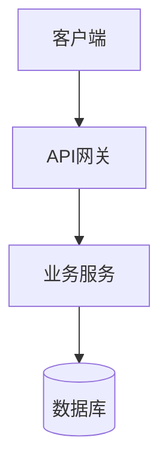

# [项目名] 架构设计文档

## 版本历史
| 版本 | 日期 | 修改人 | 说明 |
|------|------|--------|------|
| v1.0 | {{DATE}} | AI | 初始版本 |

---

## 关联决策
- 决策文档：{{DECISION_FILE}}

## 系统架构图



## 模块划分

### 模块 A
- 职责：
- 接口：

### 模块 B
- 职责：
- 接口：

### 模块 C
- 职责：
- 接口：

## 数据流

[描述主要的数据流转过程]

## 部署架构

[描述部署环境和架构]

## 技术架构

### 分层架构
```
┌─────────────────┐
│   表现层        │
├─────────────────┤
│   业务逻辑层    │
├─────────────────┤
│   数据访问层    │
├─────────────────┤
│   数据存储层    │
└─────────────────┘
```

## 接口设计

### API 接口列表
| 接口名 | 方法 | 路径 | 说明 |
|--------|------|------|------|
| 接口1 | GET | /api/v1/xxx | 说明 |
| 接口2 | POST | /api/v1/xxx | 说明 |

## 安全考虑

[描述安全相关的考虑和措施]

## 性能考虑

[描述性能相关的考虑和优化策略]
