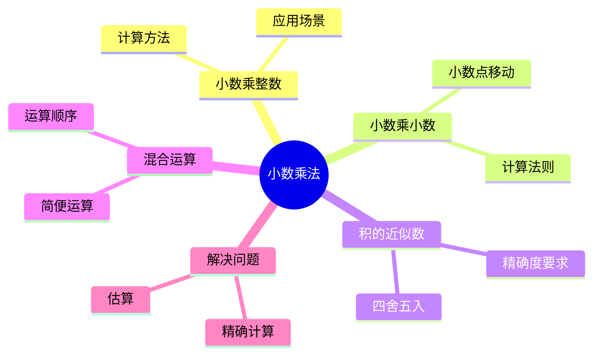

# 课件思维导图使用指南

## 概述

本指南说明在制作教学课件时如何使用思维导图功能，提升知识呈现效果。

## 适用场景

### 适合使用思维导图的情况

1. **知识复习课**：梳理单元知识点，帮助学生建立知识体系
2. **概念关系复杂**：多个概念之间有层级或关联关系
3. **逻辑推理步骤**：展示定理推导、解题思路等流程
4. **对比总结**：多个相似概念的异同点分析
5. **结构化信息**：文章结构、人物关系、历史事件等

### 不适合使用思维导图的情况

1. **单一知识点**：只需展示一个概念或公式
2. **流程化步骤**：线性流程更适合用流程图
3. **数据对比**：表格更适合数据对比
4. **具体例题**：例题展示需要详细步骤而非结构

## 学科应用示例

### 数学学科

#### 1. 单元知识梳理

**课题**：《小数乘法》复习课

**导图结构**：


**使用位置**：课件第 2-3 页，作为知识回顾引入新课

#### 2. 解题思路梳理

**课题**：《鸡兔同笼》问题

**导图结构**：
```
鸡兔同笼问题
├── 假设法
│   ├── 假设全是鸡
│   └── 假设全是兔
├── 方程法
│   ├── 设未知数
│   └── 列方程求解
└── 比较法
    ├── 列表法
    └── 画图法
```

**使用位置**：课件中"探究新知"部分，展示多种解题思路

### 语文学科

#### 1. 古诗词意象梳理

**课题**：《望天门山》

**导图结构**：
```
《望天门山》
├── 景物描写
│   ├── 天门山（雄伟）
│   ├── 楚江（汹涌）
│   └── 孤帆（渺小）
├── 动态意象
│   ├── 断（山势险峻）
│   ├── 开（江水奔腾）
│   └── 出（相对而出）
└── 情感表达
    └── 豪迈豁达的胸襟
```

**使用位置**：课件"诗情画意"部分，帮助学生理解诗意

#### 2. 文章结构分析

**课题**：《富饶的西沙群岛》

**导图结构**：
```
《富饶的西沙群岛》
├── 总述（地理位置、总体特点）
└── 分述
    ├── 海面
    │   ├── 五光十色
    │   └── 瑰丽无比
    ├── 海底
    │   ├── 珊瑚
    │   ├── 海参
    │   └── 大龙虾
    ├── 海滩
    │   ├── 贝壳
    │   └── 海龟
    └── 海岛
        └── 鸟儿的天堂
```

**使用位置**：课件"课文梳理"部分，理清文章脉络

## 生成流程

### 自动生成

当用户要求制作课件时，系统会自动：

1. **分析课程内容**
   - 识别核心知识点
   - 判断是否适合使用思维导图
   - 确定导图格式（默认 Mermaid）

2. **生成导图 JSON**
   ```json
   {
     "format": "mermaid",
     "title": "小数乘法知识梳理",
     "elements": [
       {"type": "node", "id": "root", "name": "小数乘法"},
       {"type": "node", "id": "n1", "name": "小数乘整数"},
       {"type": "node", "id": "n2", "name": "小数乘小数"},
       {"type": "edge", "source": "root", "target": "n1"},
       {"type": "edge", "source": "root", "target": "n2"}
     ]
   }
   ```

3. **调用 MCP 服务生成导图**
   - 生成文件保存到 `d:/WorkBuddy/MyTeacher/diagrams/`
   - 支持三种格式：mermaid(.md)、drawio(.drawio)、excalidraw(.excalidraw)

4. **插入到课件**
   - Mermaid：作为代码块或渲染后的图片
   - DrawIO：作为图片，提供原文件链接
   - Excalidraw：作为图片，可后续编辑

### 手动指定格式

用户可以在制作课件时指定导图格式：

```
"帮我制作《小数乘法》复习课课件，使用 drawio 格式的思维导图"
```

或

```
"在课件中添加一个手绘风格的思维导图（excalidraw）"
```

## 文件保存规范

### 默认路径

所有生成的导图文件保存在：

```
d:/WorkBuddy/MyTeacher/diagrams/
```

### 命名规则

```
{年级}{册次}_{单元}_{课题}_导图.{格式}
```

示例：

- `五上一单元_小数乘法_导图.md` (Mermaid)
- `五上一单元_小数乘法_导图.drawio` (DrawIO)
- `六下三单元_圆柱圆锥_导图.excalidraw` (Excalidraw)

### 与课件的关联

- PPT 课件中会包含导图的图片
- PPT 文件名与导图文件名保持一致（后缀除外）
- 便于后续查找和编辑

## 效果对比

### 使用思维导图

✅ **优点**：
- 知识结构清晰，一目了然
- 便于记忆和复习
- 培养学生逻辑思维
- 视觉效果好，吸引注意力

❌ **注意事项**：
- 信息不能过多，避免拥挤
- 文字要简洁精炼
- 配色要协调统一
- 字体大小要合适

### 不使用思维导图

✅ **适用情况**：
- 内容简单，无需梳理
- 需要详细解释每个知识点
- 时间有限，快速呈现

## 最佳实践

1. **分层设计**：主节点 → 一级子节点 → 二级子节点，一般不超过 3 层
2. **关键词**：每个节点只写关键词，不写完整句子
3. **色彩搭配**：不同层级使用不同颜色，区分度要明显
4. **简洁原则**：信息密度适中，避免信息过载
5. **互动设计**：可以在导图中设置动画，逐级展开

## 常见问题

### Q1: 导图太复杂怎么办？
**A**: 拆分成多个导图，每个导图只展示一个主题。

### Q2: 如何选择导图格式？
**A**:
- 快速生成、课件展示 → Mermaid
- 需要后续精细编辑 → DrawIO
- 追求创意和视觉效果 → Excalidraw

### Q3: 导图在课件中显示模糊？
**A**: 使用高分辨率导出，或在 DrawIO 中调整导出设置。

### Q4: 能否修改已生成的导图？
**A**: 可以，保存原始导图文件，使用对应工具打开编辑即可。

## 技术支持

如需技术支持，请联系 diagram-generator 技能维护者：
- **开发者**: AlkaidY
- **邮箱**: tccio2023@gmail.com
