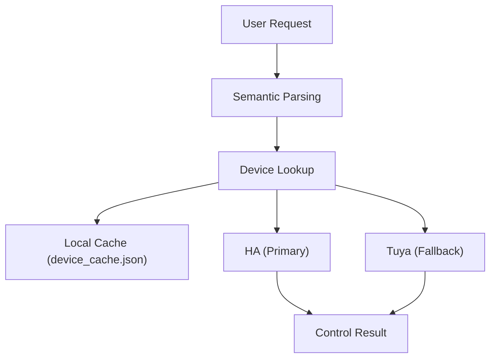

# SKILL.md
universal-smarthome
Universal Smart Home Control Skill
Dominate your smart home with seamless control across Home Assistant and Tuya Smart.
Control smart home appliances of global brands through Home Assistant (Primary) and Tuya Smart (Fallback), with support for fuzzy name matching.

## Setup
Option 1: Config File (Recommended)
Create ~/.config/universal-smarthome/config.json:

```json
{
  "homeassistant": {
    "url": "http://homeassistant.local:8123",
    "token": "your-long-lived-access-token"
  },
  "tuya": {
    "access_id": "your-access-id",
    "access_secret": "your-access-secret",
    "endpoint": "https://openapi.tuyacn.com"
  }
}
```

Option 2: Environment Variables
```bash
export HA_URL="http://homeassistant.local:8123"
export HA_TOKEN="your-long-lived-access-token"
export TUYA_ACCESS_ID="your-access-id"
export TUYA_ACCESS_SECRET="your-access-secret"
```

## Getting Home Assistant Token
1. Open Home Assistant → Profile (bottom left)
2. Scroll to "Long-Lived Access Tokens"
3. Click "Create Token" and name it (e.g., "Clawdbot")
4. Copy the token immediately (it is only displayed once)

## Getting Tuya Credentials
1. Log in to the Tuya Smart Open Platform (https://iot.tuyacn.com/)
2. Create a cloud project or navigate to "Cloud Development"
3. Get access_id and access_secret from the project credentials

## Quick Reference
### Device Discovery
```bash
python3 scripts/smart.py discovery
```
Sync all devices from Home Assistant and Tuya to the local cache.

### Control Devices
```bash
# Turn on device by name
python3 scripts/smart.py control "device_name" on

# Turn off device by name
python3 scripts/smart.py control "device_name" off
```
# The script automatically identifies the platform (HA or Tuya) based on the device ID

### Device Name Matching
The script supports fuzzy name matching:

```
# If device_cache.json contains:
# {"id": "light.living_room", "name": "Living Room Light", "platform": "homeassistant"}
# User can say: "Turn on the living room light" or "Turn on the light"
```
Priority: Exact Name Match → ID Match → Fuzzy Match

### CLI Wrapper
The scripts/smart.py CLI provides smart home control functionality:

```bash
# Discovery - sync all devices
python3 scripts/smart.py discovery

# Control device by name
python3 scripts/smart.py control "Living Room Light" on
python3 scripts/smart.py control "Bedroom Light" off
```

# The script will:
# 1. Look up the device ID from the local cache
# 2. Try Home Assistant first (Primary)
# 3. Fall back to Tuya Cloud if HA fails or the device is not found

## Supported Platforms
| Platform       | Features                                  | Priority    |
|----------------|-------------------------------------------|-------------|
| Home Assistant | Local Control, Fast Response, Entity-Based | 1 (Primary) |
| Tuya Cloud     | Cloud API, Broader Device Support         | 2 (Fallback)|

## Common Issues & Solutions
### Error: Missing Configuration File
Solution: Create the file ~/.config/universal-smarthome/config.json

### Error: 1004: Invalid Signature
Solution: Check your Tuya access_id and access_secret. Ensure the endpoint matches your region (cn/com/us/eu).

### Error: Entity Not Found
Solution: Run "python3 scripts/smart.py discovery" to sync devices first.

### Error: Connection Refused (HA)
Solution: Check the HA_URL and ensure Home Assistant is running and accessible.

### Error: 401 Unauthorized (HA)
Solution: The token has expired or is invalid. Generate a new Long-Lived Access Token.

### Device Not Responding
Solutions:
1. Check if the device is online in the corresponding app (HA or Tuya)
2. Try controlling the device directly in the Home Assistant or Tuya app
3. Run the discovery command again to refresh the device cache

## Architecture Design

```
┌─────────────────┐
│   User Request  │
└────────┬────────┘
         │
         ▼
┌─────────────────┐
│  Semantic Parsing │
└────────┬────────┘
         │
         ▼
┌─────────────────┐
│  Device Lookup  │
└────────┬────────┘──────▶ Local Cache
         │                (device_cache.json)
         ▼
    ┌────┴────┐
    │         │
    ▼         ▼
┌───────┐ ┌───────┐
│Primary│ │Fallback│
│  HA   │ │ Tuya  │
└───┬───┘ └───┬───┘
    │         │
    └────┬────┘
         │
         ▼
┌─────────────────┐
│  Control Result │
└─────────────────┘
```

## Security Notes
- Credentials are stored locally in the ~/.config/universal-smarthome/ directory
- No hardcoded tokens or secrets are included in the scripts
- Only accesses the user-defined HA address and Tuya's official APIs
- No third-party data exfiltration occurs

## Troubleshooting
- 401 Unauthorized: The HA token has expired or is invalid. Generate a new token.
- Connection Refused: Check the HA_URL and ensure Home Assistant is running and accessible.
- Entity Not Found: Run the discovery command to sync devices first.
- 1004 Invalid Signature: Verify your Tuya credentials and regional endpoint.
- All Platforms Failed: Check your network connection and the online status of the device.

## API Reference
For advanced usage and custom integrations, refer to:
- Home Assistant API: https://developers.home-assistant.io/docs/api/rest/
- Tuya Cloud API: https://developer.tuya.com/en/docs/iot/api-reference/list

