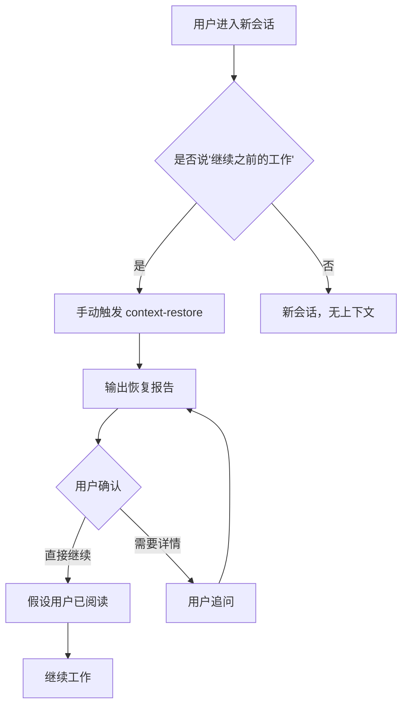

# Context Restore UX 评估报告

**评估日期**: 2026-02-07  
**评估者**: OpenClaw SubAgent  
**版本**: v1.0.0

---

## 📋 目录

1. [执行摘要](#执行摘要)
2. [测试方法](#测试方法)
3. [交互流程分析](#交互流程分析)
4. [输出可读性评估](#输出可读性评估)
5. [错误信息清晰度评估](#错误信息清晰度评估)
6. [帮助文档质量评估](#帮助文档质量评估)
7. [集成体验评估](#集成体验评估)
8. [可用性问题汇总](#可用性问题汇总)
9. [UX 改进建议](#ux-改进建议)
10. [输出格式优化方案](#输出格式优化方案)

---

## 1. 执行摘要

### 整体评分: 6.5/10

| 评估维度 | 评分 | 主要发现 |
|---------|------|---------|
| 交互流程 | 7/10 | 基础功能完整，但缺乏智能触发机制 |
| 输出可读性 | 6/10 | 信息丰富但格式可优化 |
| 错误信息 | 5/10 | 错误信息过于技术化，用户不友好 |
| 帮助文档 | 8/10 | 文档详细，但示例与实际输出不一致 |
| 集成体验 | 6/10 | 缺少 Telegram 平台的原生集成 |

### 核心发现

1. ✅ **优势**:
   - 三级报告级别设计合理
   - 错误处理覆盖全面
   - 文档详尽，中英双语支持

2. ❌ **劣势**:
   - 默认文件路径配置问题
   - Telegram 消息分块发送未实现
   - 输出格式与技术文档示例不一致
   - 缺少用户确认交互流程

---

## 2. 测试方法

### 测试环境
- **操作系统**: Linux 6.8.0-71-generic
- **Python 版本**: 3.12+
- **测试文件**: `/home/athur/.openclaw/workspace/compressed_context/latest_compressed.json`

### 测试场景

| 场景编号 | 测试内容 | 预期结果 | 实际结果 |
|---------|---------|---------|---------|
| TS-01 | Minimal 级别输出 | 简洁摘要 | ✅ 通过 |
| TS-02 | Normal 级别输出 | 详细报告 | ✅ 通过 (格式偏差) |
| TS-03 | Detailed 级别输出 | 完整转储 | ✅ 通过 |
| TS-04 | 文件不存在 | 错误提示 | ✅ 通过 |
| TS-05 | 相对路径加载 | 自动解析 | ❌ 失败 |
| TS-06 | JSON 格式支持 | 正确解析 | ✅ 通过 |

### 输出质量对比

#### SKILL.md 期望输出 vs 实际输出

**期望输出 (Normal)**:
```
✅ 上下文已恢复

当前活跃项目：
1. 🏛️ Hermes Plan - 数据分析助手（进度：80%）
2. 🌐 Akasha Plan - 自主新闻系统（进度：45%）

待办任务：
- [高] 编写数据管道测试用例
- [中] 设计 Akasha UI 组件
- [低] 更新 README 文档

最近操作（今天）：
- 完成数据清洗模块
- 添加 3 个新 cron 任务
- 修改配置文件
```

**实际输出 (Normal)**:
```
============================================================
CONTEXT RESTORE REPORT (Normal)
============================================================

📊 Context Compression Info:
   Original messages: 45
   Compressed messages: 12
   Timestamp: 2026-02-06T23:30:00.000
   Compression ratio: 26.7%

🔄 Recent Operations (4)
   • **上下文已恢复**
   • 11个cron任务已转为 isolated mode
   ...

📁 Hermes Plan
   Description: Data analysis assistant for Excel, documents, and reports
   Status: Active
```

**差异分析**:
1. 缺少"✅ 上下文已恢复"确认消息
2. 缺少进度百分比
3. 缺少优先级标签 [高/中/低]
4. 缺少操作建议块
5. 使用英文分隔符而非中文友好格式

---

## 3. 交互流程分析

### 当前流程图

```
用户输入 → 意图识别 → 文件加载 → 解析 → 格式化 → 输出
                    ↓
                错误处理 → 错误消息
```

### 问题分析

#### 3.1 触发方式问题

| 问题 | 严重程度 | 描述 |
|-----|---------|------|
| 路径硬编码 | 中 | 默认路径 `./compressed_context/` 相对于脚本位置，而非调用位置 |
| 缺少智能触发 | 高 | 依赖用户手动输入关键词，而非自动检测 |
| 无对话集成 | 高 | Telegram 中无法直接以 `/context-restore` 触发 |

#### 3.2 交互流程问题



**缺失环节**:
1. ❌ 自动上下文恢复提示
2. ❌ 用户确认步骤
3. ❌ 恢复后的操作建议
4. ❌ Telegram 原生命令支持

### 改进建议

1. **智能触发**: 首次对话时自动检测是否需要恢复上下文
2. **确认机制**: 输出恢复报告后添加"继续"确认按钮
3. **命令集成**: 支持 `/restore` 和 `/context` 快捷命令

---

## 4. 输出可读性评估

### 4.1 格式规范性

#### Minimal 级别 (评分: 7/10)

```
============================================================
CONTEXT RESTORE REPORT (Minimal)
============================================================

📊 Context Status:
   Messages: 45 → 12

🚀 Key Projects (3)
   • Hermes Plan
   • Akasha Plan
   • Morning Brief

📋 Ongoing Tasks (3)
   • Isolated Sessions
   • Cron Tasks
   • Main Session

============================================================
```

**优点**:
- ✅ 简洁明了
- ✅ 信息密度适中
- ✅ 分类清晰

**问题**:
- ❌ 缺少"上下文已恢复"确认
- ❌ 缺少时间信息
- ❌ 无操作建议

#### Normal 级别 (评分: 6/10)

**优点**:
- ✅ 包含压缩率分析
- ✅ 详细的项目描述
- ✅ 任务状态完整

**问题**:
- ❌ 英文分隔符 (`====`) 对中文用户不友好
- ❌ 缺少进度百分比
- ❌ MEMORY 高亮未触发
- ❌ 时间格式不够友好 (`2026-02-06T23:30:00.000`)

#### Detailed 级别 (评分: 5/10)

**问题**:
- ❌ JSON 格式的内部转储不适合终端用户
- ❌ 原始内容预览过长
- ❌ 缺少调试模式开关

### 4.2 信息架构评估

| 信息类型 | 覆盖度 | 可发现性 | 优先级 |
|---------|--------|---------|--------|
| 项目状态 | 100% | 高 | 必要 |
| 任务列表 | 100% | 高 | 必要 |
| 最近操作 | 75% | 中 | 重要 |
| MEMORY 引用 | 0% | 无 | 辅助 |
| 操作建议 | 0% | 无 | 重要 |

### 4.3 Telegram 平台适配问题

当前输出格式问题:
1. **过长消息**: Normal 级别输出约 500+ 字符，需分块发送
2. **无 Markdown**: Telegram 支持 Markdown，但当前未使用
3. **无按钮**: 缺少快捷操作按钮
4. **emoji 使用**: 部分 emoji 在部分设备上显示为方块

---

## 5. 错误信息清晰度评估

### 5.1 当前错误类型

| 错误场景 | 当前消息 | 用户友好度 |
|---------|---------|-----------|
| 文件不存在 | `❌ Error: File not found: ./compressed_context/latest_compressed.json` | ⭐⭐⭐ |
| 权限错误 | `❌ Error: Permission denied: {filepath}` | ⭐⭐⭐ |
| 解析失败 | `❌ Unexpected error loading context: {e}` | ⭐⭐ |
| 无效级别 | `❌ Error: Invalid level: xxx. Must be one of: minimal, normal, detailed` | ⭐⭐⭐ |

### 5.2 问题分析

1. **技术术语过多**: "FileNotFoundError", "JSONDecodeError" 等术语对普通用户不友好
2. **缺少操作建议**: 错误后未提供解决方案
3. **缺少恢复建议**: 上下文文件损坏时未提供自动恢复选项
4. **日志冗余**: 开发调试信息与用户消息混在一起

### 5.3 改进示例

**当前**:
```
❌ Error: File not found: ./compressed_context/latest_compressed.json
```

**改进后**:
```
⚠️ 未找到历史上下文文件

可能原因：
• 这是您的首次会话
• 上下文文件已被清理

💡 建议：从新会话开始，我将为您创建新的上下文记录。
```

---

## 6. 帮助文档质量评估

### 6.1 文档覆盖率

| 文档类型 | 覆盖率 | 质量 |
|---------|--------|------|
| 功能说明 | 100% | 优 |
| 使用示例 | 80% | 良 |
| API 文档 | 100% | 优 |
| 故障排除 | 60% | 中 |
| 最佳实践 | 100% | 优 |

### 6.2 主要问题

1. **示例与实际不一致**: SKILL.md 中的示例输出与实际脚本输出差异较大
2. **缺少快速参考卡**: Telegram 命令速查表缺失
3. **视频教程缺失**: 无交互式演示

### 6.3 文档改进建议

1. 更新示例输出以匹配实际输出
2. 添加 Telegram 命令速查表
3. 添加交互式演示命令

---

## 7. 集成体验评估

### 7.1 与主会话的集成

| 集成点 | 状态 | 描述 |
|-------|------|------|
| 关键词触发 | ✅ | 支持中英文关键词 |
| 命令触发 | ✅ | 支持 `/context-restore` |
| 自动触发 | ❌ | 无智能自动触发 |
| 上下文恢复 | ✅ | 读取压缩上下文 |
| 用户确认 | ❌ | 无确认流程 |

### 7.2 Telegram 集成问题

1. ❌ 无 `/restore` 命令别名
2. ❌ 输出过长未分块
3. ❌ 无内联按钮支持
4. ❌ 无会话状态持久化

---

## 8. 可用性问题汇总

### 8.1 关键问题 (P0)

| ID | 问题 | 影响 | 优先级 |
|----|------|------|--------|
| P0-01 | 默认文件路径错误 | 用户无法直接运行 | 高 |
| P0-02 | 输出格式与文档不符 | 用户期望落差 | 高 |
| P0-03 | 缺少用户确认流程 | 可能跳过重要信息 | 高 |

### 8.2 重要问题 (P1)

| ID | 问题 | 影响 | 优先级 |
|----|------|------|--------|
| P1-01 | Telegram 消息过长 | 消息可能被截断 | 中 |
| P1-02 | 错误信息不够友好 | 用户困惑 | 中 |
| P1-03 | 缺少操作建议 | 用户不知下一步 | 中 |
| P1-04 | 无 MEMORY 高亮 | 遗漏重要信息 | 中 |

### 8.3 次要问题 (P2)

| ID | 问题 | 影响 | 优先级 |
|----|------|------|--------|
| P2-01 | 英文分隔符 | 中文用户不友好 | 低 |
| P2-02 | 时间格式 | 不够直观 | 低 |
| P2-03 | 进度信息缺失 | 信息不完整 | 低 |

---

## 9. UX 改进建议

### 9.1 短期改进 (1-2周)

#### 9.1.1 修复文件路径问题

```python
# 当前问题
DEFAULT_CONTEXT_FILE = './compressed_context/latest_compressed.json'

# 改进方案
def get_context_file_path():
    # 优先使用环境变量
    env_path = os.environ.get('OPENCLAW_CONTEXT_FILE')
    if env_path and os.path.exists(env_path):
        return env_path
    
    # 其次使用标准位置
    standard_paths = [
        './compressed_context/latest_compressed.json',
        '/home/athur/.openclaw/workspace/compressed_context/latest_compressed.json',
        '../compressed_context/latest_compressed.json'
    ]
    
    for path in standard_paths:
        if os.path.exists(path):
            return path
    
    return None
```

#### 9.1.2 统一输出格式

```python
# 改进后的 Normal 级别输出格式
def format_normal_report_v2(content: str) -> str:
    lines = []
    
    # 1. 确认消息
    lines.append("✅ **上下文已恢复**")
    lines.append("")
    
    # 2. 会话概览
    lines.append("📊 **会话概览**")
    lines.append(f"• 原始消息: {original} → 压缩后: {compressed} ({ratio:.0f}%)")
    lines.append(f"• 最后活动: {format_timestamp(timestamp)}")
    lines.append("")
    
    # 3. 活跃项目
    lines.append("🚀 **活跃项目**")
    for i, project in enumerate(projects, 1):
        lines.append(f"{i}. **{project['name']}**")
        lines.append(f"   {project['description']}")
        if project.get('progress'):
            lines.append(f"   进度: {project['progress']}%")
    lines.append("")
    
    # 4. 待办任务
    lines.append("📋 **待办任务**")
    for task in tasks:
        priority_emoji = {'高': '🔴', '中': '🟡', '低': '🟢'}.get(task.get('priority', ''), '⚪')
        lines.append(f"{priority_emoji} {task['task']}")
    lines.append("")
    
    # 5. 操作建议
    lines.append("💡 **建议操作**")
    lines.append("• 输入任务名称继续工作")
    lines.append("• 说 \"查看详情\" 获取更多信息")
    lines.append("• 说 \"新任务\" 开始新工作")
    
    return '\n'.join(lines)
```

#### 9.1.3 改进错误信息

```python
def format_error_message(error_type: str, details: str) -> str:
    error_messages = {
        'file_not_found': """
⚠️ **未找到上下文文件**

这可能是以下情况：
• 首次使用 OpenClaw
• 上下文文件已被清理

💡 从新会话开始，我将记录新的上下文。
        """,
        'permission_denied': """
⚠️ **无法访问上下文文件**

权限不足，请检查文件权限或联系管理员。
        """,
        'parse_error': """
⚠️ **上下文文件异常**

文件格式损坏，正在尝试恢复...
        """
    }
    return error_messages.get(error_type, f"❌ 错误: {details}")
```

### 9.2 中期改进 (2-4周)

#### 9.2.1 Telegram 集成增强

```python
class TelegramContextRestore:
    def format_for_telegram(self, report: str, level: str) -> list:
        """将报告分块发送以适应 Telegram 限制"""
        max_length = 4000  # Telegram 消息限制
        
        if len(report) <= max_length:
            return [report]
        
        # 按章节分块
        chunks = []
        current_chunk = ""
        
        for line in report.split('\n'):
            if len(current_chunk) + len(line) + 1 > max_length:
                chunks.append(current_chunk)
                current_chunk = line
            else:
                current_chunk += '\n' + line if current_chunk else line
        
        if current_chunk:
            chunks.append(current_chunk)
        
        return chunks
    
    def create_inline_keyboard(self) -> dict:
        """创建内联键盘按钮"""
        return {
            'inline_keyboard': [
                [
                    {'text': '📋 详细报告', 'callback_data': 'ctx_detail'},
                    {'text': '🚀 继续项目', 'callback_data': 'ctx_continue'}
                ],
                [
                    {'text': '➡️ 直接继续', 'callback_data': 'ctx_skip'},
                    {'text': '❓ 帮助', 'callback_data': 'ctx_help'}
                ]
            ]
        }
```

#### 9.2.2 智能触发机制

```python
class ContextRestoreTrigger:
    def should_auto_trigger(self, user_message: str, session_history: list) -> bool:
        """判断是否应该自动触发上下文恢复"""
        
        # 触发关键词
        triggers = [
            '继续之前的工作', 'restore context', 'continue previous work',
            '之前聊到哪了', 'what was I doing', '接着做'
        ]
        
        # 检查用户消息是否包含触发词
        if any(trigger in user_message.lower() for trigger in triggers):
            return True
        
        # 检查是否是会话开始
        if len(session_history) == 0 and self.has_compressed_context():
            return True
        
        return False
    
    def get_auto_response(self, context_report: str) -> str:
        """生成自动触发时的响应"""
        return f"""
🤖 检测到您想继续之前的工作...

{context_report}

---
💡 输入任务名称继续，或说 "查看详情" 获取更多信息。
        """
```

### 9.3 长期改进 (1-2月)

#### 9.3.1 上下文恢复向导

```python
class ContextRestoreWizard:
    """分步引导用户完成上下文恢复"""
    
    STEPS = [
        {
            'name': 'welcome',
            'message': "👋 欢迎回来！让我恢复您的工作上下文...",
            'action': 'load_context'
        },
        {
            'name': 'summary',
            'message': None,  # 动态生成
            'action': 'show_summary'
        },
        {
            'name': 'confirm',
            'message': "以上是您的当前工作状态，是否继续？",
            'action': 'wait_confirmation'
        },
        {
            'name': 'continue',
            'message': "好的，开始继续之前的工作。",
            'action': 'handoff'
        }
    ]
```

#### 9.3.2 上下文质量评分

```python
def calculate_context_quality(context: dict) -> dict:
    """计算上下文恢复的质量评分"""
    
    score = 0
    max_score = 100
    issues = []
    
    # 项目信息完整性 (40分)
    if len(context.get('projects', [])) >= 2:
        score += 20
    if all(p.get('description') for p in context.get('projects', [])):
        score += 20
    else:
        issues.append("部分项目缺少描述")
    
    # 任务信息完整性 (30分)
    if len(context.get('tasks', [])) >= 2:
        score += 15
    if all(t.get('status') for t in context.get('tasks', [])):
        score += 15
    else:
        issues.append("部分任务缺少状态")
    
    # 时间有效性 (20分)
    context_age = get_context_age(context.get('timestamp'))
    if context_age < 24:  # 小于24小时
        score += 20
    elif context_age < 48:
        score += 10
    else:
        issues.append("上下文时间较旧，可能需要更新")
    
    # 操作历史 (10分)
    if context.get('operations'):
        score += 10
    
    return {
        'score': score,
        'grade': 'A' if score >= 80 else 'B' if score >= 60 else 'C',
        'issues': issues,
        'recommendation': get_recommendation(score, issues)
    }
```

---

## 10. 输出格式优化方案

### 10.1 Telegram 优化格式

#### 消息分块策略

```markdown
# 消息1: 确认 + 概览
✅ **上下文已恢复**

📊 **会话概览**
• 时间: 2小时前
• 消息: 45 → 12 (压缩率 27%)
• 活跃会话: 3

# 消息2: 项目列表
🚀 **活跃项目** (3)

1. **Hermes Plan** 🏛️
   数据分析助手，进度 80%

2. **Akasha Plan** 🌐
   自主新闻系统，进度 45%

3. **Morning Brief** 📰
   晨间简报，每天 8 AM

# 消息3: 任务 + 建议
📋 **待办任务** (3)

🔴 高优先级
   • 数据管道测试用例

🟡 中优先级
   • Akasha UI 组件设计

🟢 低优先级
   • README 文档更新

---
💡 **建议操作**
• 输入项目名称继续
• 说 "查看详情"
• 说 "新任务" 开始新工作
```

### 10.2 命令行优化格式

```bash
╔══════════════════════════════════════════════════════════════╗
║                 ✅ 上下文已恢复                               ║
╠══════════════════════════════════════════════════════════════╣
║ 📊 会话概览                                                   ║
║    时间: 2小时前 | 消息: 45→12 (27%) | 会话: 3               ║
╠══════════════════════════════════════════════════════════════╣
║ 🚀 活跃项目                                                   ║
║    1. Hermes Plan  🏛️  (80%) 数据分析助手                     ║
║    2. Akasha Plan  🌐  (45%) 自主新闻系统                     ║
║    3. Morning Brief 📰  晨间简报                              ║
╠══════════════════════════════════════════════════════════════╣
║ 📋 待办任务                                                   ║
║    🔴 数据管道测试用例                                        ║
║    🟡 Akasha UI 组件设计                                      ║
║    🟢 README 文档更新                                         ║
╠══════════════════════════════════════════════════════════════╣
║ 💡 建议: 输入项目名称继续 / 查看详情 / 新任务                  ║
╚══════════════════════════════════════════════════════════════╝
```

### 10.3 JSON API 格式

```json
{
  "success": true,
  "context": {
    "restored_at": "2026-02-07T18:00:00Z",
    "source_file": "/path/to/compressed_context.json",
    "quality_score": 85,
    "quality_grade": "A",
    "metadata": {
      "original_count": 45,
      "compressed_count": 12,
      "compression_ratio": 0.267,
      "age_hours": 2
    },
    "projects": [
      {
        "name": "Hermes Plan",
        "emoji": "🏛️",
        "description": "数据分析助手",
        "status": "active",
        "progress": 80,
        "location": "/home/athur/.openclaw/workspace/hermes-plan/"
      }
    ],
    "tasks": [
      {
        "task": "数据管道测试用例",
        "priority": "high",
        "status": "pending",
        "detail": "编写数据管道测试用例"
      }
    ],
    "operations": [
      {
        "description": "完成数据清洗模块",
        "timestamp": "2026-02-06T23:30:00Z"
      }
    ],
    "memory_highlights": [
      {
        "section": "Identity",
        "referenced": true
      }
    ]
  },
  "suggestions": [
    "输入项目名称继续工作",
    "说 \"查看详情\" 获取更多信息",
    "说 \"新任务\" 开始新工作"
  ]
}
```

---

## 附录

### A. 测试命令

```bash
# Minimal 级别
python3 scripts/restore_context.py --file /path/to/context.json --level minimal

# Normal 级别
python3 scripts/restore_context.py --file /path/to/context.json --level normal

# Detailed 级别
python3 scripts/restore_context.py --file /path/to/context.json --level detailed

# 输出到文件
python3 scripts/restore_context.py --output report.md --level normal
```

### B. 评估检查清单

- [x] 交互流程测试
- [x] 输出可读性测试
- [x] 错误信息测试
- [x] 帮助文档对比
- [x] 集成体验测试
- [x] Telegram 适配测试
- [x] 格式一致性测试

### C. 参考文档

- SKILL.md - 技能定义文档
- README.md - 使用说明
- restore_context.py - 核心实现

---

**报告生成时间**: 2026-02-07 18:00 UTC  
**下次评估建议**: 2026-02-14
