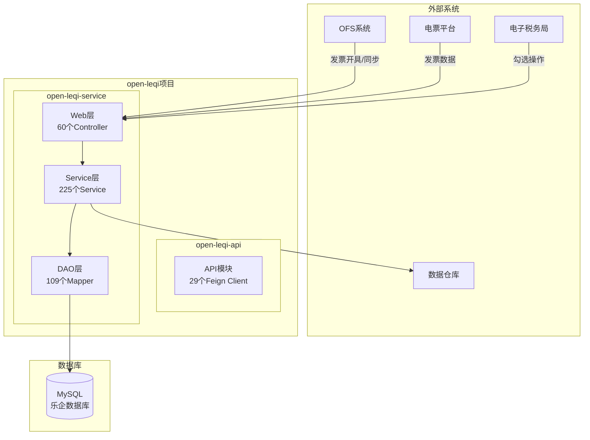
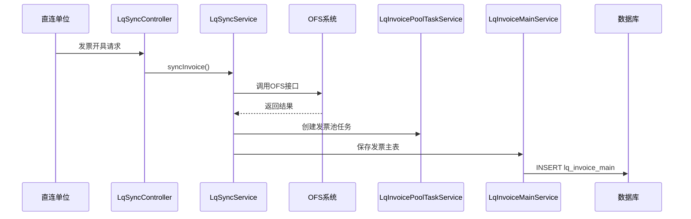
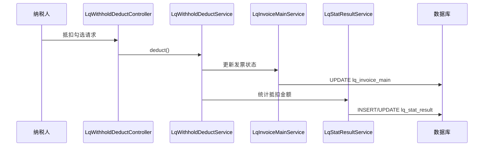
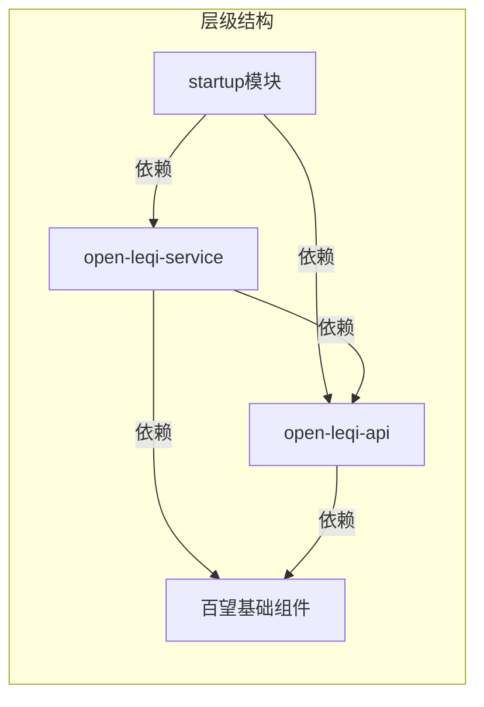
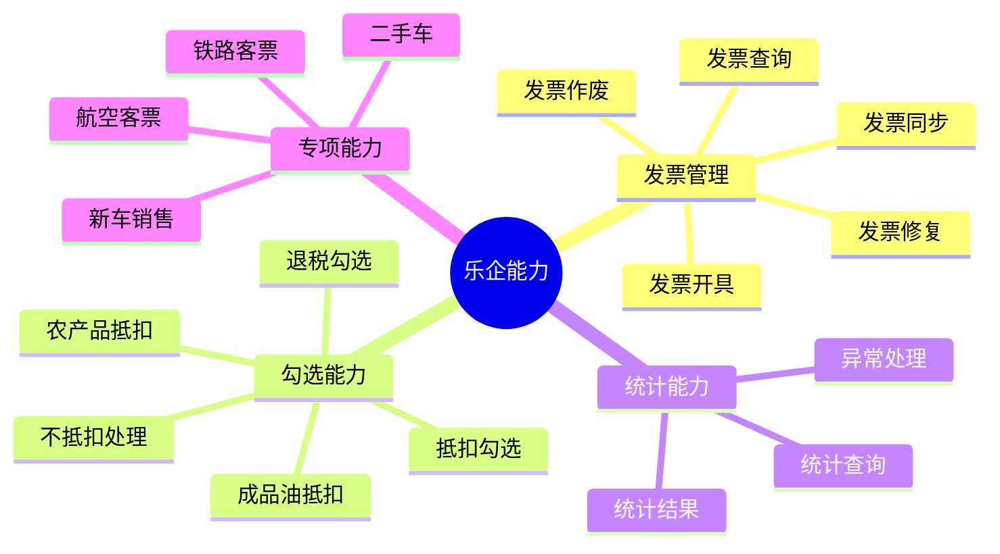

# 乐企系统架构图

## 系统架构总览

```mermaid
graph TB
    subgraph 外部系统
        OFS[OFS系统]
        EPS[电票平台]
        ETS[电子税务局]
        DW[数据仓库]
    end

    subgraph open-leqi项目
        subgraph open-leqi-api
            API[API模块<br/>29个Feign Client]
        end
        
        subgraph open-leqi-service
            WEB[Web层<br/>60个Controller]
            SERVICE[Service层<br/>225个Service]
            DAO[DAO层<br/>109个Mapper]
        end
    end

    subgraph 数据库
        DB[(MySQL<br/>乐企数据库)]
    end

    OFS -->|发票开具/同步| WEB
    EPS -->|发票数据| WEB
    ETS -->|勾选操作| WEB
    WEB --> SERVICE
    SERVICE --> DAO
    DAO --> DB
    SERVICE -->|统计结果| DW
```

## 发票开具流程

```mermaid
sequenceDiagram
    participant 直连单位
    participant Controller as LqSyncController
    participant Service as LqSyncService
    participant OFS as OFS系统
    participant Pool as LqInvoicePoolTaskService
    participant Main as LqInvoiceMainService
    participant DB as 数据库

    直连单位->>Controller: 发票开具请求
    Controller->>Service: syncInvoice()
    Service->>OFS: 调用OFS接口
    OFS-->>Service: 返回结果
    Service->>Pool: 创建发票池任务
    Service->>Main: 保存发票主表
    Main->>DB: INSERT lq_invoice_main
```

## 抵扣勾选流程

```mermaid
sequenceDiagram
    participant 纳税人
    participant Controller as LqWithholdDeductController
    participant Service as LqWithholdDeductService
    participant Main as LqInvoiceMainService
    participant Stat as LqStatResultService
    participant DB as 数据库

    纳税人->>Controller: 抵扣勾选请求
    Controller->>Service: deduct()
    Service->>Main: 更新发票状态
    Main->>DB: UPDATE lq_invoice_main
    Service->>Stat: 统计抵扣金额
    Stat->>DB: INSERT/UPDATE lq_stat_result
```

## 模块依赖关系

```mermaid
graph LR
    subgraph 层级结构
        STARTUP[startup模块]
        API[open-leqi-api]
        SERVICE[open-leqi-service]
        COMMON[百望基础组件]
    end

    STARTUP -->|依赖| SERVICE
    STARTUP -->|依赖| API
    SERVICE -->|依赖| API
    SERVICE -->|依赖| COMMON
    API -->|依赖| COMMON
```

## 业务能力模块

```mermaid
mindmap
  root((乐企能力))
    发票管理
      发票开具
      发票同步
      发票查询
      发票作废
      发票修复
    勾选能力
      抵扣勾选
      退税勾选
      不抵扣处理
      农产品抵扣
      成品油抵扣
    统计能力
      统计结果
      统计查询
      异常处理
    专项能力
      航空客票
      铁路客票
      二手车
      新车销售
```
