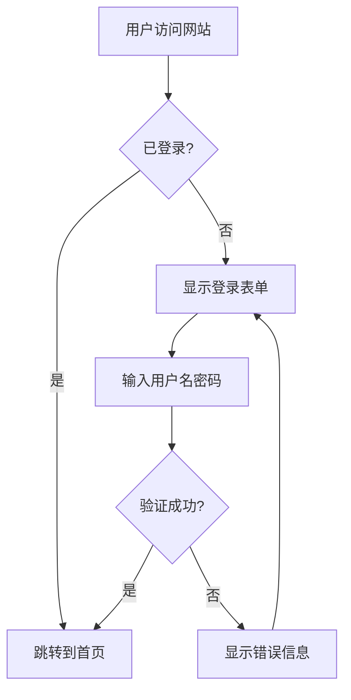
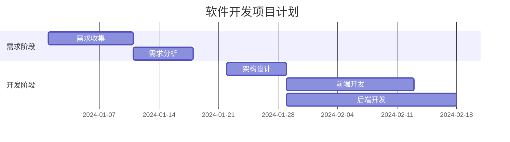
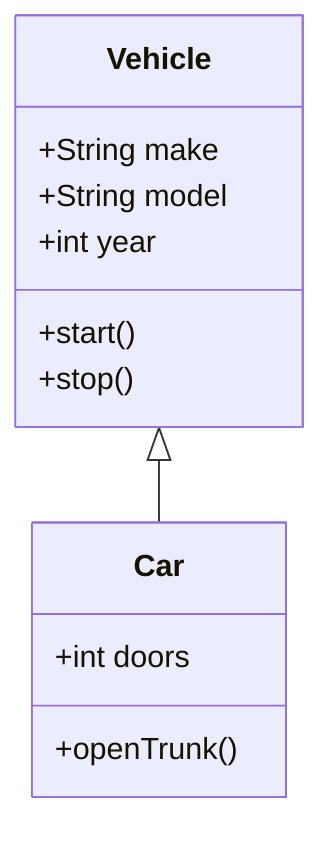

# 流程图生成器 (flowchart-gen) v1.0

将自然语言描述或Mermaid代码转换为高质量的流程图图片，支持DeepSeek API智能生成、多种图表类型和丰富的模板库。

## 🚀 快速开始

### 安装依赖

#### 方法一：使用安装脚本（推荐）

```bash
# Windows (PowerShell)
.\install.ps1

# Linux/macOS
chmod +x install.sh
./install.sh
```

#### 方法二：手动安装

```bash
# 1. 安装Mermaid CLI（必需）
npm install -g @mermaid-js/mermaid-cli

# 2. 安装Python依赖（推荐）
pip install pillow requests

# 3. 验证安装
mmdc --version
python -c "import requests; print('依赖检查通过')"
```

### 🛠️ 解决Chromium下载卡住问题

如果安装Mermaid CLI时卡在Chromium下载（常见于Windows），请使用以下命令跳过Chromium下载，使用系统Chrome：

```bash
# Windows (CMD/PowerShell)
set PUPPETEER_SKIP_CHROMIUM_DOWNLOAD=1
set PUPPETEER_EXECUTABLE_PATH="C:\\Program Files\\Google\\Chrome\\Application\\chrome.exe"
npm install -g @mermaid-js/mermaid-cli

# 或者使用PowerShell
$env:PUPPETEER_SKIP_CHROMIUM_DOWNLOAD="1"
$env:PUPPETEER_EXECUTABLE_PATH="C:\\Program Files\\Google\\Chrome\\Application\\chrome.exe"
npm install -g @mermaid-js/mermaid-cli

# Linux/macOS
export PUPPETEER_SKIP_CHROMIUM_DOWNLOAD=1
npm install -g @mermaid-js/mermaid-cli
```

**注意**：如果Chrome安装在其他路径，请相应修改 `PUPPETEER_EXECUTABLE_PATH`。

### 基本使用

```bash
# 使用DeepSeek API生成流程图（自动从OpenClaw配置读取API密钥）
python scripts/generate.py "用户登录认证流程" -o login.png

# 强制使用模板匹配（无API调用）
python scripts/generate.py "订单处理流程" --no-llm -o order.png

# 生成甘特图（项目时间计划）
python scripts/generate.py "项目开发时间计划" -o project_gantt.png

# 生成类图（系统设计）
python scripts/generate.py "电商系统类图设计" -o class_diagram.png

# 使用SVG格式（矢量图，无需Chrome）
python scripts/generate.py "API调用序列" -o api.svg -f svg -t dark

# 直接输入Mermaid代码（跳过AI转换）
python scripts/generate.py --raw "graph TD; A[开始]-->B[结束]" -o simple.png
```

### 高级功能

```bash
# 调试模式（保留临时文件，详细输出）
python scripts/generate.py "复杂流程" -o output.png --debug --verbose

# 查看所有可用模板（31个）
python scripts/generate.py --list-templates

# 使用特定模板
python scripts/generate.py --use-template login -o login_template.png
python scripts/generate.py --use-template gantt-project -o gantt.png

# 环境依赖检查
python scripts/generate.py "测试" --verbose
```

## ✨ 功能特性

### 1. **智能AI生成**
- **DeepSeek API集成**: 自动从OpenClaw配置读取API密钥
- **智能回退系统**: API失败 → 模板匹配 → 基础生成
- **多种图表类型**: 根据描述自动选择合适图表类型

### 🔧 LLM API配置

本技能支持多种LLM API配置方式，按优先级自动选择（从高到低）：

#### 配置方式

1. **命令行参数**（优先级最高）
   ```bash
   python scripts/generate.py "描述" --api-key sk-xxx --api-provider deepseek
   ```
   - `--api-key`: 手动指定API密钥
   - `--api-provider`: 提供商（deepseek 或 openai，默认 deepseek）
   - `--api-base-url`: 自定义API基础URL

2. **环境变量**（推荐用于持久化配置）
   ```bash
   # Windows
   set DEEPSEEK_API_KEY=sk-xxx
   # 或
   set OPENAI_API_KEY=sk-xxx
   
   # Linux/macOS
   export DEEPSEEK_API_KEY=sk-xxx
   export OPENAI_API_KEY=sk-xxx
   ```

3. **OpenClaw配置文件**（自动读取，适合OpenClaw用户）
   - 自动从 `~/.openclaw/openclaw.json` 读取 DeepSeek 配置
   - 无需额外配置，与OpenClaw共享API密钥

4. **模板匹配**（无API调用）
   - 使用 `--no-llm` 参数禁用LLM，使用模板匹配
   - 使用 `--use-template` 指定预置模板
   - 使用 `--raw` 直接输入Mermaid代码

#### 安全说明
- API密钥优先从命令行参数或环境变量读取，符合最小权限原则
- OpenClaw配置读取作为辅助选项，需要明确用户授权
- 所有配置访问已在元数据中声明，透明可审计

#### 配置优先级（从高到低）
1. 命令行参数 (`--api-key`, `--api-provider`, `--api-base-url`)
2. 环境变量 (`DEEPSEEK_API_KEY`, `OPENAI_API_KEY`)
3. OpenClaw配置文件 (`~/.openclaw/openclaw.json`)
4. 模板匹配（无API调用）

#### 配置向导
首次运行或缺少配置时，脚本会提供详细的配置指引，帮助用户快速设置。

### 2. **丰富的模板库（31个模板）**
- **业务流程类**: 订单处理、客户服务、库存管理、退款流程
- **技术架构类**: 系统部署、数据管道、API网关、备份恢复
- **项目管理类**: 项目审批、任务流程、发布流程、风险管理
- **教育培训类**: 培训流程、考试流程、入职流程、绩效评估
- **其他常用**: 采购流程、事件响应、招聘流程、变更请求
- **特殊图表**: 甘特图、类图、状态图、饼图、旅程图、时间线图

### 3. **多图表类型支持**
| 图表类型 | 语法 | 用途 |
|----------|------|------|
| 流程图 | `graph TD` / `graph LR` | 业务流程、工作流程 |
| 序列图 | `sequenceDiagram` | 系统交互、API调用 |
| 甘特图 | `gantt` | 项目时间规划、进度跟踪 |
| 类图 | `classDiagram` | 面向对象设计、系统架构 |
| 状态图 | `stateDiagram-v2` | 状态机表示、状态转换 |
| 饼图 | `pie` | 数据比例、统计图表 |
| 用户旅程图 | `journey` | 用户体验、服务蓝图 |
| 时间线图 | `timeline` | 历史事件、发展历程 |

### 4. **智能错误处理**
- **环境依赖检查**: 自动检查Mermaid CLI、Python库
- **错误智能分析**: 根据错误类型提供具体修复建议
- **调试模式**: `--debug` 选项保留临时文件
- **中文友好**: 全中文错误提示和帮助文档
- **故障排除指南**: 详细的解决方案和在线资源

### 5. **灵活的输出选项**
- **输出格式**: PNG、SVG、PDF
- **主题风格**: default、dark、forest、neutral
- **详细控制**: 命令行参数精细控制生成过程

## 📖 详细使用说明

### 命令行参数

```
usage: generate.py [-h] [-o OUTPUT] [-f {png,svg,pdf}] [-t THEME] [--raw]
                   [--verbose] [--no-llm] [--debug] [--list-templates]
                   [--use-template USE_TEMPLATE]
                   prompt

生成流程图 - 将自然语言描述或Mermaid代码转换为流程图图片

positional arguments:
  prompt                流程图描述（自然语言）或Mermaid代码（使用--raw时）

options:
  -h, --help            显示帮助信息
  -o OUTPUT, --output OUTPUT
                        输出文件路径 (默认: flowchart.png)
  -f {png,svg,pdf}, --format {png,svg,pdf}
                        输出格式 (默认: png)
  -t THEME, --theme THEME
                        主题: default, dark, forest, neutral (默认: default)
  --raw                 直接使用输入作为Mermaid代码（跳过AI转换）
  --verbose             显示详细输出
  --no-llm              禁用LLM API，强制使用模板匹配
  --debug               调试模式：保存临时文件，显示更详细的信息
  --list-templates      列出可用模板
  --use-template USE_TEMPLATE
                        使用预置模板（输入模板名称）

示例:
  generate.py "用户登录认证流程" -o login.png
  generate.py "API调用序列" -o api.svg -f svg -t dark
  generate.py --raw "graph TD; A[开始]-->B[结束]" -o simple.png
  generate.py "购物流程" --verbose --debug
```

### 输出示例

#### 生成的Mermaid代码示例


#### 甘特图示例


#### 类图示例


## 🔧 配置说明

### DeepSeek API配置
脚本会自动从以下位置读取DeepSeek API配置：
1. **OpenClaw配置文件**: `~/.openclaw/openclaw.json`
2. **环境变量**: `DEEPSEEK_API_KEY`

**OpenClaw配置示例**:
```json
{
  "models": {
    "providers": {
      "custom-api-deepseek-com": {
        "apiKey": "sk-xxxxxxxxxxxxxxxxxxxxxxxxxxxxxxxx",
        "baseUrl": "https://api.deepseek.com/v1",
        "models": [
          {"id": "deepseek-chat"},
          {"id": "deepseek-reasoner"}
        ]
      }
    }
  }
}
```

### 模板匹配系统
- **关键词映射**: 支持中英文关键词自动匹配模板
- **智能选择**: 优先匹配更具体的描述
- **分类组织**: 按业务领域分类，便于查找和使用

## 🛠️ 故障排除

### 常见问题解决方案

1. **"未找到Mermaid CLI (mmdc)"**
   ```bash
   # 重新安装Mermaid CLI
   npm uninstall -g @mermaid-js/mermaid-cli
   npm install -g @mermaid-js/mermaid-cli
   
   # Windows用户使用
   mmdc.cmd --version
   ```

2. **Puppeteer/Chrome相关错误**
   ```bash
   # 安装Chrome浏览器
   # 或使用SVG格式（不需要Chrome）
   python scripts/generate.py "描述" -o output.svg -f svg
   ```

3. **API调用失败**
   ```bash
   # 使用模板匹配（无API调用）
   python scripts/generate.py "描述" --no-llm -o output.png
   
   # 检查OpenClaw配置
   python scripts/generate.py "测试" --verbose
   ```

4. **语法错误**
   ```bash
   # 在线检查语法
   # 访问 https://mermaid.live
   
   # 简化测试
   python scripts/generate.py --raw "graph TD; A[开始]-->B[结束]" -o test.png
   ```

### 调试技巧
```bash
# 完整调试命令
python scripts/generate.py "你的描述" -o output.png --debug --verbose

# 环境检查
python scripts/generate.py --list-templates
mmdc --version
node --version
```

### 在线资源
- **Mermaid官方文档**: https://mermaid.js.org
- **在线编辑器**: https://mermaid.live
- **语法参考**: https://mermaid.js.org/syntax/flowchart.html
- **FAQ文档**: 查看 `FAQ.md` 获取详细解答

## 📚 开发与扩展

### 项目结构
```
flowchart-gen/
├── SKILL.md                    # 技能说明文档（本文件）
├── TODO.md                     # 改进计划（已完成所有任务）
├── FAQ.md                      # 常见问题解答
├── 进度报告-2026-03-17.md      # 开发进度报告
├── scripts/
│   └── generate.py             # 主生成脚本（2400+行代码）
├── templates/                  # 模板目录（如果需要文件模板）
└── references/                 # 参考文档
```

### 添加新模板
编辑 `scripts/generate.py` 文件：
1. 在 `TEMPLATES` 字典中添加新模板
2. 在 `template_keywords` 中添加关键词映射
3. 测试新模板

### 扩展AI生成能力
- 修改 `call_deepseek_api()` 函数支持其他API
- 更新系统提示词优化生成效果
- 添加模型选择参数

### 贡献指南
欢迎提交：
1. 新的流程图模板
2. 错误修复和改进
3. 文档完善
4. 功能建议

## 📞 支持与反馈

### 获取帮助
1. **查看FAQ**: `flowchart-gen/FAQ.md`
2. **使用调试模式**: 添加 `--debug --verbose` 参数
3. **在线资源**: Mermaid官方文档和社区

### 问题反馈
请提供以下信息：
- 错误消息和完整输出
- 使用的命令和参数
- 操作系统和软件版本
- 重现步骤

### 社区支持
- **OpenClaw社区**: Discord和GitHub
- **Mermaid社区**: 官方论坛和GitHub

## 📄 许可证

MIT License

## 📅 版本历史

### v1.0.0 (2026-03-17) - 首次正式发布
**状态**: ✅ 生产就绪
**主要特性**:
- DeepSeek API智能生成（自动配置）
- 31个预置模板，覆盖常用场景
- 8种Mermaid图表类型支持
- 智能错误处理和故障排除系统
- 多格式输出（PNG/SVG/PDF）
- 多主题支持（default/dark/forest/neutral）
- Windows兼容性优化（支持mmdc.cmd）
- 版本管理系统（--version参数）
- 调试模式（--debug参数）

**新增文档**:
- ✅ SKILL.md - 完整技能说明
- ✅ FAQ.md - 常见问题解答
- ✅ TODO.md - 开发任务跟踪（已完成）
- ✅ CHANGELOG.md - 版本变更记录
- ✅ VERSION - 版本号文件
- ✅ 进度报告-2026-03-17.md - 项目总结

**修复问题**:
- 两个路径脚本版本不一致问题
- Windows系统mmdc命令兼容性问题
- Chrome/Puppeteer依赖配置问题
- 参数解析和错误处理问题

### v0.1.0 (2026-03-16) - 基础版本
**状态**: 🔄 已升级
**特性**:
- 基础流程图生成功能
- 4个基础模板（login, api-call, shopping, decision）
- 基本的Mermaid代码生成和渲染
- 简单的错误处理

---

**当前版本**: 1.0.0  
**发布日期**: 2026-03-17  
**最后更新**: 2026-03-17  
**状态**: ✅ 生产就绪

**版本验证**:
```bash
# 查看版本信息
python scripts/generate.py --version

# 查看版本文件
cat VERSION

# 查看变更日志
cat CHANGELOG.md | head -50
```
