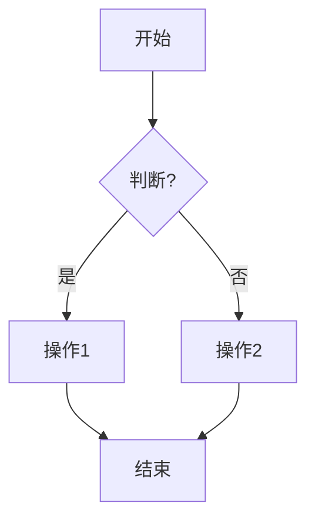
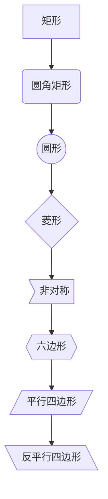
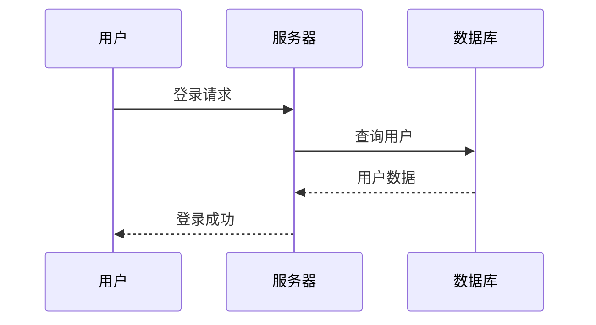
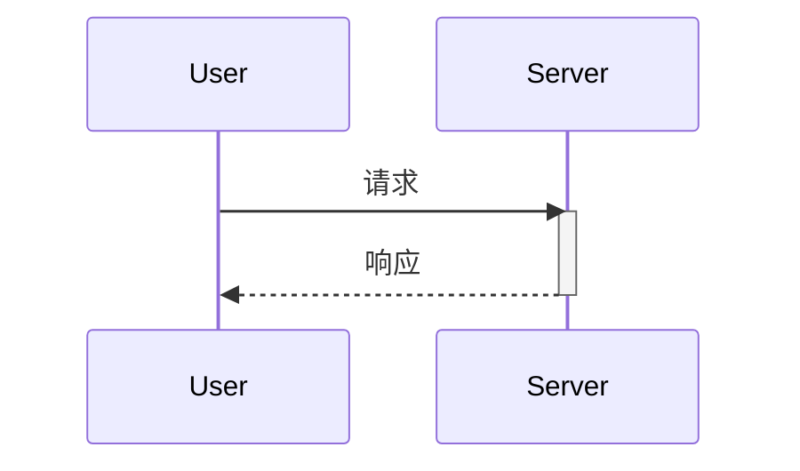
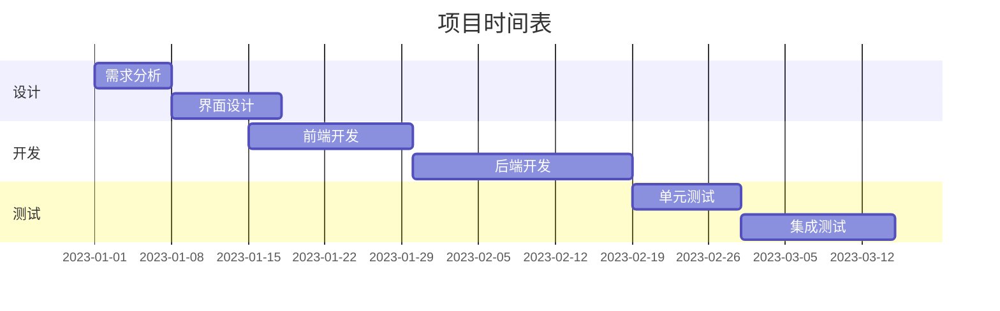
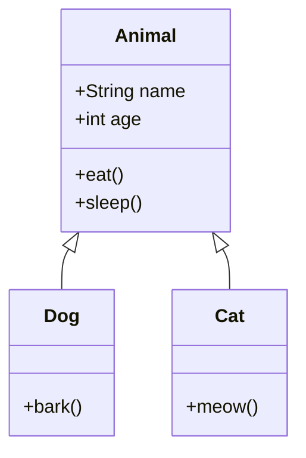
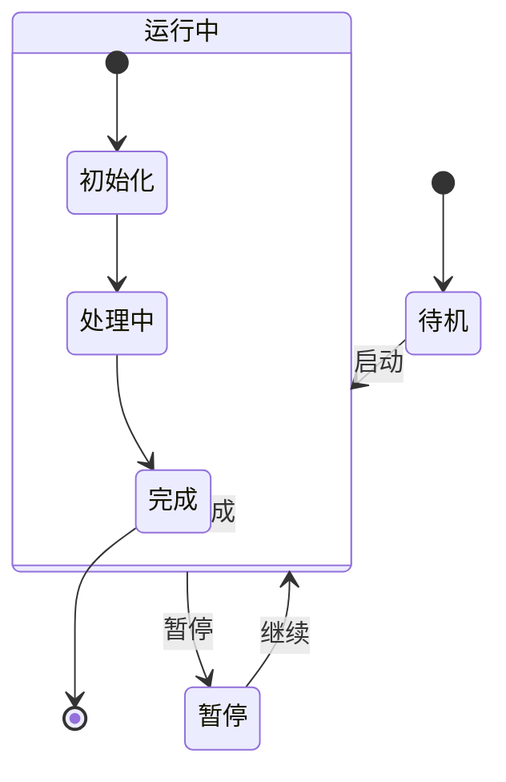
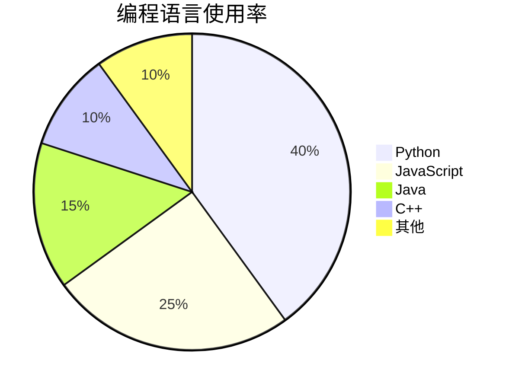
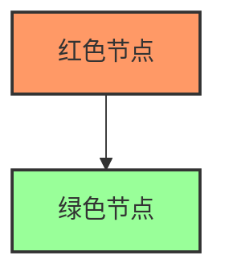

# Mermaid 语法速查指南

本文档提供Mermaid流程图语法的快速参考，适用于flowchart-gen技能。

## 目录
1. [流程图 (Flowchart)](#流程图)
2. [序列图 (Sequence Diagram)](#序列图)
3. [甘特图 (Gantt Chart)](#甘特图)
4. [类图 (Class Diagram)](#类图)
5. [状态图 (State Diagram)](#状态图)
6. [饼图 (Pie Chart)](#饼图)
7. [常用样式](#常用样式)

## 流程图

### 基本语法


### 方向
- `graph TD` - 从上到下 (Top-Down)
- `graph LR` - 从左到右 (Left-Right)
- `graph RL` - 从右到左
- `graph BT` - 从下到上

### 节点形状


### 连接线样式
```mermaid
graph LR
    A --> B           // 实线箭头
    A -.-> C          // 虚线箭头
    A ==> D           // 粗线箭头
    A -- 文字 --- B   // 带文字的线
    A --o B           // 空心圆箭头
    A --x B           // X箭头
```

## 序列图

### 基本语法


### 消息类型
- `->>` - 实线箭头
- `-->>` - 虚线箭头
- `->` - 实线无箭头
- `-->` - 虚线无箭头
- `-x` - 带X的实线
- `--x` - 带X的虚线

### 激活与停用


## 甘特图

### 基本语法


## 类图

### 基本语法


### 关系类型
- `<|--` - 继承
- `*--` - 组合
- `o--` - 聚合
- `-->` - 关联
- `--` - 实线连接
- `..>` - 依赖
- `..|>` - 接口实现

## 状态图

### 基本语法


## 饼图

### 基本语法


## 常用样式

### 自定义样式


### 主题
Mermaid支持多种主题：
- `default` - 默认主题
- `dark` - 深色主题
- `forest` - 森林主题
- `neutral` - 中性主题

### 常用配置
```javascript
{
  "theme": "dark",
  "fontFamily": "Arial, sans-serif",
  "logLevel": "fatal"
}
```

## 最佳实践

1. **保持简洁** - 每个图表不要超过15个节点
2. **命名清晰** - 使用有意义的节点名称
3. **逻辑分组** - 使用子图或分组组织相关节点
4. **样式一致** - 保持颜色和样式的一致性
5. **注释** - 在复杂图表中添加注释说明

## 常见错误

### 语法错误
```
graph TD
    A --> B
    // 缺少方向声明
```
修正：
```
graph TD
    A[开始] --> B[结束]
```

### 格式错误
```
graph TD
    A --> B{
```
修正：
```
graph TD
    A --> B{判断}
```

## 在线资源

- [Mermaid官方文档](https://mermaid.js.org/)
- [Mermaid在线编辑器](https://mermaid.live/)
- [Mermaid语法检查器](https://github.com/mermaid-js/mermaid-live-editor)

## 在flowchart-gen中的使用技巧

1. **模板系统** - 使用预置模板快速开始
2. **主题切换** - 使用 `-t` 参数切换主题
3. **格式选择** - 支持PNG、SVG、PDF格式
4. **AI辅助** - 让AI帮你生成Mermaid代码

## 示例库

查看 `templates/` 目录获取更多示例：
- `login.mmd` - 登录流程
- `api-call.mmd` - API调用序列
- `shopping.mmd` - 购物流程
- `decision.mmd` - 决策流程