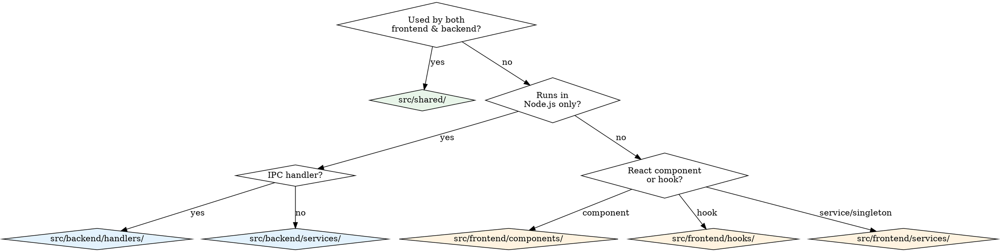
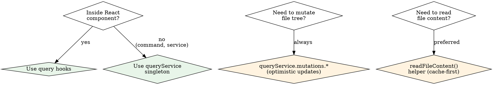

# Fable Development Guide

Fable is a creative-writing desktop app: **Electron + React 19 + Vite + TanStack Query + Plate.js** frontend, **Node.js + SQLite + custom indexed filesystem** backend, **Google ADK** for AI features.

## Critical Invariant

**Every file can have children, not just folders.** `FileNode.children` exists on ANY node regardless of `category`. A text document can contain child documents (chapters containing scenes). Never assume only folders have children.

`parentId` and `siblingIndex` are computed by `buildFileTree()` at runtime — never persist them.

## Where Does My Code Go?



**Shared code constraint**: `src/shared/` must NOT import browser APIs, Node.js APIs, or React.

## How Do I Access / Mutate Data?



**Never call `window.api.*` directly for tree mutations** — always go through `queryService.mutations.*` which handles optimistic updates and rollback.

## Key Directories

| Directory | What to find |
|---|---|
| `src/types.ts` | All shared types (FileNode, FileMetadata, ChatSession, Agent, etc.) |
| `src/shared/` | Code shared by both processes (graph, agentFlow, toolDescriptors, search) |
| `src/backend/handlers/` | IPC handlers: file, project, agent, agentFlow |
| `src/backend/services/` | IndexedFsService, UserDataService, ReferenceIndexService, agent/ |
| `src/backend/services/agent/` | AI system: AdkRunner, ToolFactory, providers, ChatDatabaseService |
| `src/frontend/components/` | All React components (chat/, graph/, fileViewer/, collectionViewer/) |
| `src/frontend/services/commandInfra/` | VS Code-style commands, keybindings, context keys |
| `src/frontend/services/query/` | TanStack Query: queryService, mutations, treeTransformations |
| `src/frontend/hooks/` | Custom hooks: useFileTree, useChat, useAgentFlowRun, etc. |
| `src/frontend/styles/plate/` | Plate.js editor plugins and kits |
| `src/locales/{en,zh-CN}/` | i18n translations (8 namespaces) |
| `e2e/` | Playwright E2E tests |
| `electron/preload.ts` | IPC bridge — `window.api.*` definitions |
| `src/global.d.ts` | TypeScript declarations for `Window.api` |

## Common Task Recipes

Read `references/recipes.md` for **detailed step-by-step procedures** including:
- Adding a new IPC channel (5-step checklist)
- Adding a new command (5-step checklist)
- Adding a new file subType (8-step checklist)
- Adding a new agent tool (6-step checklist)
- Adding a new sidebar panel or editor handler
- Adding i18n strings

## Architecture at a Glance

Read `references/architecture.md` for the full breakdown. Key mental model:

```
Frontend (React) --window.api.*--> Preload --IPC--> Backend handlers --> Services --> Disk
                 <--transport push events--  <--IPC--  ProjectManager <-- IndexedFsService events
```

- **State**: TanStack Query is single source of truth. `staleTime: Infinity` everywhere.
- **File tree**: Event-driven push from backend, never polled. `useFileTree` sets up listener.
- **Mutations**: `createTreeMutation` factory: optimistic update -> IPC call -> rollback on error.
- **Commands**: VS Code-style `CommandService` + `ContextService` + `KeybindingService`.
- **Editor routing**: `ContentViewer` dispatches by `subType` first, then `category`.
- **AI**: Google ADK with multi-provider LLM registry. See `references/agent-system.md`.

## i18n Checklist

- 8 namespaces: `common`, `fileExplorer`, `chat`, `project`, `editor`, `agentBuilder`, `graph`, `agentDefinition`
- In components: `const { t } = useTranslation("namespace")`
- Outside React: `import i18n from "@/src/i18n/i18n"; i18n.t("ns:key")`
- **Always add keys to BOTH `en` and `zh-CN`**

## Build, Lint & Test

```bash
npm run dev:electron     # Dev mode (Vite + Electron)
npm run build            # Production build
npm run check            # Lint + format + TypeScript check
npm run test:e2e         # Playwright E2E tests (headless)
npm run test:e2e:headed  # E2E with visible browser
```

- Path alias: `@/*` maps to repo root
- Formatting: Prettier (double quotes, 4-space indent, semicolons)
- **Always run E2E tests you wrote before committing**

## Pitfalls

1. **Any node can have children** — not just folders
2. **parentId/siblingIndex are derived** — never persist
3. **Tree mutations must be pure** — `treeTransformations.ts` returns new arrays, never mutate
4. **Always add i18n to BOTH locales** — `en` and `zh-CN`
5. **Toolbar renders via portal** — `#file-toolbar-portal` in TopBar, not inside editor DOM
6. **Input elements suppress keybindings** — `useKeybindings` checks `event.target` tag
7. **subType controls routing** — checked before category in ContentViewer
8. **Binary files use base64 over IPC** — text uses UTF-8
9. **STRUCTURAL_FILE_CHANGES control broadcasts** — content "update" does NOT re-push tree
10. **Add Window.api types** — update `src/global.d.ts` when adding IPC channels
11. **Shared code is process-agnostic** — `src/shared/` cannot import browser or Node APIs
12. **Tool descriptors are shared** — `toolDescriptors.ts` serves both UI commands and LLM agents
13. **Every user-facing data element needs a tooltip**

## References

| Reference | Use when |
|---|---|
| `references/architecture.md` | Understanding layers, IPC channels, backend services, frontend providers |
| `references/command-system.md` | Working with commands, keybindings, context keys, when clauses |
| `references/workspace-structure.md` | On-disk file layout, metadata schema, storage guidelines |
| `references/agent-system.md` | AI features: providers, streaming, tools, planning mode, chat persistence |
| `references/recipes.md` | Step-by-step procedures for common development tasks |
