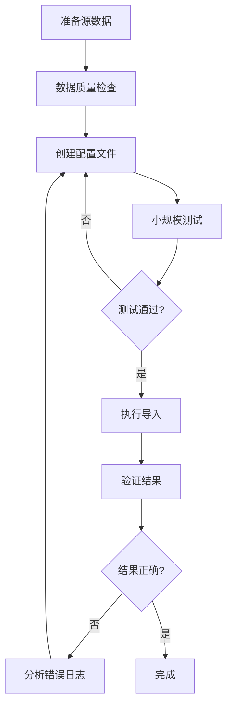

# Excel 数据导入 - 最佳实践

## 概述

本文档汇总了 Excel 数据导入技能的最佳实践，帮助您优化导入流程、避免常见错误、提升数据质量。

## 配置最佳实践

### 1. 配置文件组织

**推荐结构**:
```
project/
├── configs/
│   ├── import_config.yaml          # 主配置
│   ├── field_mappings.yaml         # 字段映射（可复用）
│   └── validation_rules.yaml       # 验证规则（可复用）
├── data/
│   ├── source/                     # 源数据
│   └── templates/                  # 模板文件
└── output/
    └── results/                    # 导出结果
```

**优点**:
- 配置文件可复用
- 数据和代码分离
- 便于版本控制

### 2. 字段映射配置

**原则**:
1. **明确性优先**: 使用清晰易懂的字段名
2. **必需字段标记**: 关键字段设置 `required: true`
3. **数据清洗**: 使用 `transform` 进行前置处理
4. **类型验证**: 使用 `validate` 确保数据质量

**推荐配置**:
```yaml
field_mappings:
  # ✅ 好的配置
  - source: "用户姓名"
    target: "姓名"
    required: true
    transform: "strip"
    validate: "not_empty"

  # ❌ 避免这样配置
  - source: "name"
    target: "xm"
```

### 3. 错误处理策略

**生产环境推荐配置**:
```yaml
error_handling:
  backup: true                    # 必须启用备份
  backup_path: "backup/"          # 备份目录
  stop_on_error: false            # 遇到错误继续处理
  log_errors: true                # 记录所有错误
  error_log_path: "logs/errors.log"
  max_errors: 100                 # 超过100个错误后停止
```

**开发环境推荐配置**:
```yaml
error_handling:
  backup: true
  stop_on_error: true             # 快速失败，便于调试
  log_errors: true
  verbose: true                   # 详细输出
```

## 性能优化建议

### 1. 大文件处理 (>10,000 行)

**策略 1: 分批导入**
```python
# 手动分割大文件
# 使用 Python 脚本预处理
import pandas as pd

df = pd.read_excel('large_file.xlsx')
batch_size = 5000

for i in range(0, len(df), batch_size):
    batch = df.iloc[i:i+batch_size]
    batch.to_excel(f'batch_{i}.xlsx', index=False)
```

**策略 2: 禁用不需要的功能**
```yaml
options:
  preserve_formatting: false     # 不保持格式，提升速度
  skip_validation: true          # 跳过验证（谨慎使用）
```

### 2. 批量文件处理

**优化配置**:
```yaml
source:
  directory_path: "input/"
  file_pattern: "*.xlsx"
  # ✅ 指定文件排序，确保可预测的导入顺序
  sort_by: "name"                # 按文件名排序
  sort_order: "ascending"
```

### 3. 内存优化

**处理超大文件**:
```python
# 使用 openpyxl 的 read_only 模式
from openpyxl import load_workbook

wb = load_workbook('large.xlsx', read_only=True)
ws = wb.active

for row in ws.iter_rows(values_only=True):
    # 逐行处理，不加载整个文件到内存
    process_row(row)
```

## 数据质量保证

### 1. 数据验证金字塔

```
第一层: 格式验证 (validate)
   ↓
第二层: 业务规则 (自定义验证)
   ↓
第三层: 数据一致性 (后处理检查)
```

**实现示例**:
```yaml
field_mappings:
  - source: "身份证号"
    target: "身份证号码"
    required: true
    validate: "id_card"           # 第一层: 格式验证

# 第二层: 业务规则（在脚本中实现）
validations:
  - field: "年龄"
    rules:
      - type: "range"
        min: 18
        max: 65
        message: "年龄必须在18-65岁之间"
      - type: "custom"
        expression: "value != 0"
        message: "年龄不能为0"
```

### 2. 数据清洗最佳实践

**常用转换函数**:
```yaml
field_mappings:
  # 去除空格
  - source: "姓名"
    target: "姓名"
    transform: "strip"

  # 统一大写
  - source: "email"
    target: "邮箱"
    transform: "lower"

  # 日期格式转换
  - source: "入职日期"
    target: "参加工作时间"
    transform: "date"
    transform_params:
      input_format: "%Y-%m-%d"
      output_format: "%Y年%m月%d日"
```

### 3. 重复数据处理

**检测策略**:
```yaml
options:
  # 基于关键字段去重
  deduplicate: true
  deduplicate_key: "身份证号"
  deduplicate_strategy: "last"    # 保留最后一条（或 "first"）
```

## 常见错误避免

### 错误 1: 关键字段不唯一

**问题**: 使用非唯一字段作为 `key_field`

**解决方案**:
```yaml
# ❌ 错误
key_field: "姓名"  # 姓名可能重复

# ✅ 正确
key_field: "身份证号"  # 唯一标识

# 或使用多字段匹配
key_fields:
  - "姓名"
  - "手机号"
```

### 错误 2: 数据类型不匹配

**问题**: 源数据和目标表数据类型不一致

**解决方案**:
```yaml
field_mappings:
  - source: "金额"
    target: "总金额"
    transform: "float"          # 转换为浮点数
    validate: "numeric"
```

### 错误 3: 合并单元格处理不当

**问题**: 导入后合并单元格格式丢失

**解决方案**:
```yaml
options:
  preserve_formatting: true      # 保持格式（包括合并单元格）
  skip_merged_cells: false       # 不跳过合并单元格
```

### 错误 4: 忽略备份

**问题**: 导入失败后无法恢复

**解决方案**:
```yaml
error_handling:
  backup: true                   # 必须启用
  backup_path: "backup/"
  # 设置备份保留策略
  backup_retention_days: 30
```

## 工作流优化

### 推荐的导入流程



### 测试驱动导入

**步骤**:
1. 准备小样本数据（10-20 行）
2. 使用测试数据验证配置
3. 检查导入结果
4. 调整配置参数
5. 全量导入

**示例**:
```bash
# 步骤 1: 创建测试配置
cp import_config.yaml import_config_test.yaml

# 步骤 2: 修改为测试数据
vim import_config_test.yaml
# 修改 source.file_path 指向测试数据

# 步骤 3: 测试导入
python scripts/excel_import.py import_config_test.yaml

# 步骤 4: 验证通过后，使用正式配置
python scripts/excel_import.py import_config.yaml
```

## 监控和日志

### 1. 导入监控

**关键指标**:
- 成功率: `successful / total_records`
- 失败率: `failed / total_records`
- 跳过率: `skipped / total_records`
- 处理时间: 导入耗时

**日志配置**:
```yaml
error_handling:
  log_errors: true
  error_log_path: "logs/import_errors.log"
  # 详细日志
  verbose: true
  # 统计信息
  statistics: true
```

### 2. 错误分析

**错误日志格式**:
```json
{
  "timestamp": "2024-01-20T10:30:00",
  "row": 10,
  "field": "身份证号",
  "value": "123456",
  "error": "格式错误",
  "error_type": "ValidationError"
}
```

**分析脚本**:
```python
import json
from collections import Counter

with open('logs/import_errors.log', 'r') as f:
    errors = [json.loads(line) for line in f]

# 统计错误类型
error_types = Counter(e['error_type'] for e in errors)
print("错误类型分布:", error_types)

# 统计错误字段
error_fields = Counter(e['field'] for e in errors)
print("错误字段分布:", error_fields)
```

## 安全性建议

### 1. 敏感数据处理

**加密敏感字段**:
```yaml
field_mappings:
  - source: "身份证号"
    target: "身份证号码"
    transform: "encrypt"
    transform_params:
      algorithm: "aes"
      key: "your-secret-key"
```

### 2. 访问控制

**文件权限**:
```bash
# 配置文件: 只读
chmod 444 import_config.yaml

# 备份目录: 仅所有者可写
chmod 700 backup/

# 错误日志: 仅所有者可读写
chmod 600 logs/import_errors.log
```

### 3. 数据备份策略

**多层备份**:
```yaml
error_handling:
  # 本地备份
  backup: true
  backup_path: "backup/"

  # 远程备份（需自定义脚本）
  remote_backup:
    enabled: true
    type: "s3"
    bucket: "my-backup-bucket"
```

## 协作最佳实践

### 1. 配置版本控制

**Git 配置**:
```
# .gitignore
*.xlsx
!templates/*.xlsx
backup/
output/
logs/

# 提交配置文件
git add configs/
git commit -m "更新导入配置"
```

### 2. 文档化

**每个配置文件都应包含**:
```yaml
# 文件头注释
task_name: "人员信息导入"
description: "从HR系统导出的人员信息导入到人事档案"
author: "张三"
created: "2024-01-20"
updated: "2024-01-21"
version: "1.1"

# 配置说明...
```

### 3. 代码审查

**配置审查清单**:
- [ ] 字段映射是否正确
- [ ] 验证规则是否合理
- [ ] 错误处理是否完善
- [ ] 备份是否启用
- [ ] 性能是否可接受

## 故障排除清单

遇到问题时，按以下顺序检查:

1. **配置文件**
   - [ ] YAML 语法正确
   - [ ] 文件路径正确
   - [ ] 字段名拼写正确

2. **源数据**
   - [ ] 文件格式正确 (.xlsx)
   - [ ] 工作表名称正确
   - [ ] 表头行号正确
   - [ ] 数据质量良好

3. **目标模板**
   - [ ] 文件存在且可写
   - [ ] 表头行号正确
   - [ ] 数据起始行正确

4. **系统环境**
   - [ ] Python 版本正确 (3.8+)
   - [ ] 依赖包已安装
   - [ ] 磁盘空间充足
   - [ ] 文件权限正确

## 参考资源

- [配置示例](configuration-examples.md) - 完整的配置示例
- [数据映射指南](data-mapping-guide.md) - 高级映射技巧
- [故障排除](troubleshooting.md) - 详细的问题解决方案

---

**文档版本**: 1.0.0
**最后更新**: 2024-01-20
