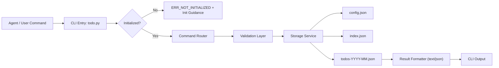
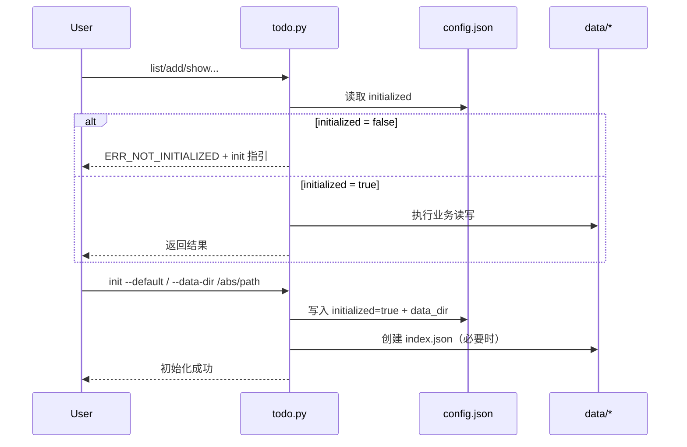

# OpenClaw Todo Skill 介绍文档

## 1. 技能定位

`todo` 是一个本地文件驱动的待办管理 skill，目标是让代理在不依赖数据库与外部服务的情况下，稳定管理长期/短期待办，并支持按时间范围查询和按月归档。

核心特性：

1. 写能力：支持 `long` / `short` 两类待办
2. 读能力：支持按 `created` / `plan` / `due` 的时间段查询
3. 管能力：按月分文件归档，不使用单一大文件
4. 强约束：首次必须初始化路径，未初始化禁止任何业务命令

## 2. 目录结构

```text
skills/todo/
  SKILL.md
  INTRO.md
  TECH_SPEC.md
  config.json
  scripts/
    todo.py
  data/                       # init 后自动创建
    index.json
    todos-YYYY-MM.json
```

## 3. 总体架构图



## 4. 初始化门禁流程图



## 5. 数据设计

### 5.1 待办对象（核心字段）

1. `id`：全局唯一
2. `title`：标题
3. `type`：`long|short`
4. `status`：`open|done|canceled|deleted`
5. `created_at` / `updated_at`：带时区时间（默认中国时区）
6. `plan_date`：短期任务必填（`short`）
7. `due_date`：长期任务可选
8. `archive_month`：归档月份（`YYYY-MM`）

### 5.2 归档规则

1. `type=long` 且有 `due_date`：归档月优先取 `due_date`
2. 否则若有 `plan_date`：取 `plan_date`
3. 否则：取 `created_at` 所在月

## 6. 命令能力矩阵

1. 初始化：`init --default` / `init --data-dir /absolute/path`
2. 新增：`add --type --title [--plan] [--due] [--tag] [--note]`
3. 查询：`list` / `show --id` / `overdue`
4. 状态管理：`done` / `reopen` / `cancel` / `rm`（软删除）
5. 更新：`update --id ...`

## 7. 查询与过滤

1. 状态过滤：`--status open|done|canceled|deleted|all`
2. 时间口径：`--by created|plan|due`
3. 时间范围：`--from YYYY-MM-DD --to YYYY-MM-DD`
4. 逾期过滤：`--due-state overdue|not-overdue|all`

## 8. 可靠性设计

1. 原子写入：临时文件 + `os.replace`
2. 索引定位：`index.json` 维护 `id_map` 与统计
3. 数据校验：读入时校验 schema 和枚举合法性
4. 错误前缀：`ERR_VALIDATION` / `ERR_NOT_FOUND` / `ERR_STORAGE` / `ERR_CORRUPTION` / `ERR_NOT_INITIALIZED`

## 9. 典型使用流程

1. 首次初始化：选择默认路径或自定义绝对路径
2. 记录待办：按 `long` 或 `short` 创建任务
3. 周期查看：按时间窗口和逾期状态筛选
4. 状态流转：完成、取消、重开、软删除
5. 月度累积：自动沉淀到 `todos-YYYY-MM.json`

## 10. 适用场景与边界

适用场景：

1. 本地个人任务管理
2. 无数据库环境的 agent 自动化任务记录
3. 需要可审计 JSON 落盘和月度归档

边界说明：

1. 当前不含多端同步
2. 当前不含并发锁（单进程/低并发优先）
3. 当前不含 GUI
