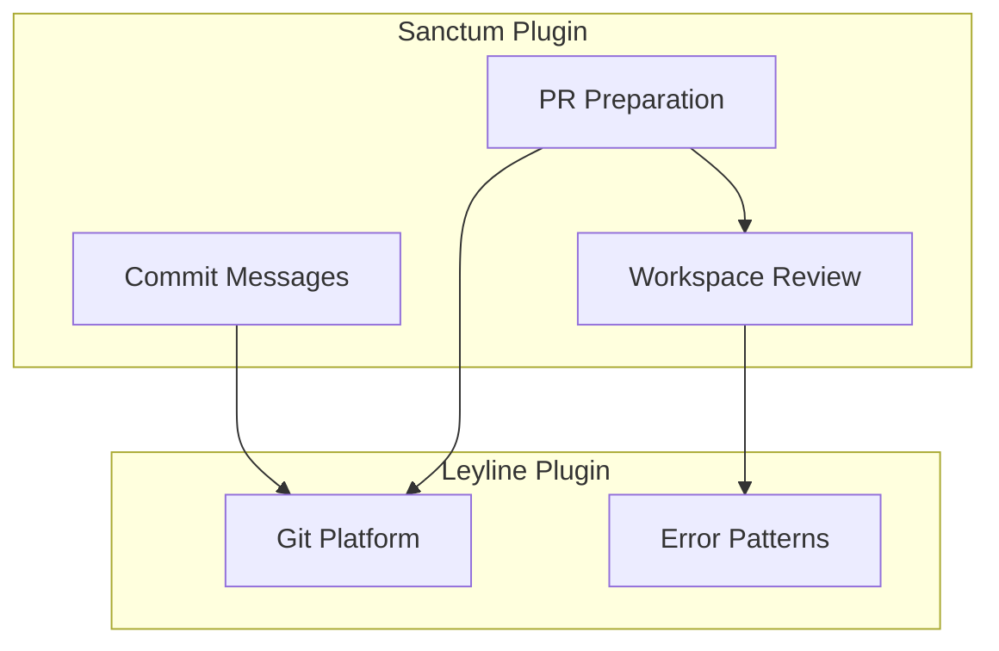

> **Night Market Skill** — ported from [claude-night-market/cartograph](https://github.com/athola/claude-night-market/tree/master/plugins/cartograph). For the full experience with agents, hooks, and commands, install the Claude Code plugin.


# Architecture Diagram

Generate a Mermaid flowchart showing high-level component
relationships in a codebase.

## When To Use

- Visualizing how plugins/modules relate to each other
- Onboarding to understand system structure
- Documenting architecture for PR reviews
- Answering "how does this system fit together?"

## Workflow

### Step 1: Explore the Codebase

Dispatch the codebase explorer agent to analyze the scope:

```
Agent(cartograph:codebase-explorer)
Prompt: Explore [scope] and return a structural model.
Focus on packages, modules, and their relationships
for an architecture diagram.
```

If no scope is provided, use the project root.

### Step 2: Generate Mermaid Syntax

Transform the structural model into a Mermaid flowchart.

**Rules for architecture diagrams**:

- Use `flowchart TD` (top-down) for hierarchical systems
- Use `flowchart LR` (left-right) for pipeline/flow systems
- Group related modules into subgraphs by package
- Use descriptive edge labels for relationships
- Limit to 15-20 nodes maximum (aggregate small modules)
- Use shapes to distinguish component types:
  - `[Rectangle]` for modules/packages
  - `([Stadium])` for entry points/commands
  - `[(Database)]` for data stores
  - `{Diamond}` for decision points

**Example output**:



### Step 3: Render via MCP

Call the Mermaid Chart MCP to render:

```
mcp__claude_ai_Mermaid_Chart__validate_and_render_mermaid_diagram
  prompt: "Architecture diagram of [scope]"
  mermaidCode: [generated syntax]
  diagramType: "flowchart"
  clientName: "claude-code"
```

If rendering fails, fix the Mermaid syntax based on the
error message and retry (max 2 retries).

### Step 4: Present Results

Show the rendered diagram to the user with a brief summary
of what it depicts (2-3 sentences).
