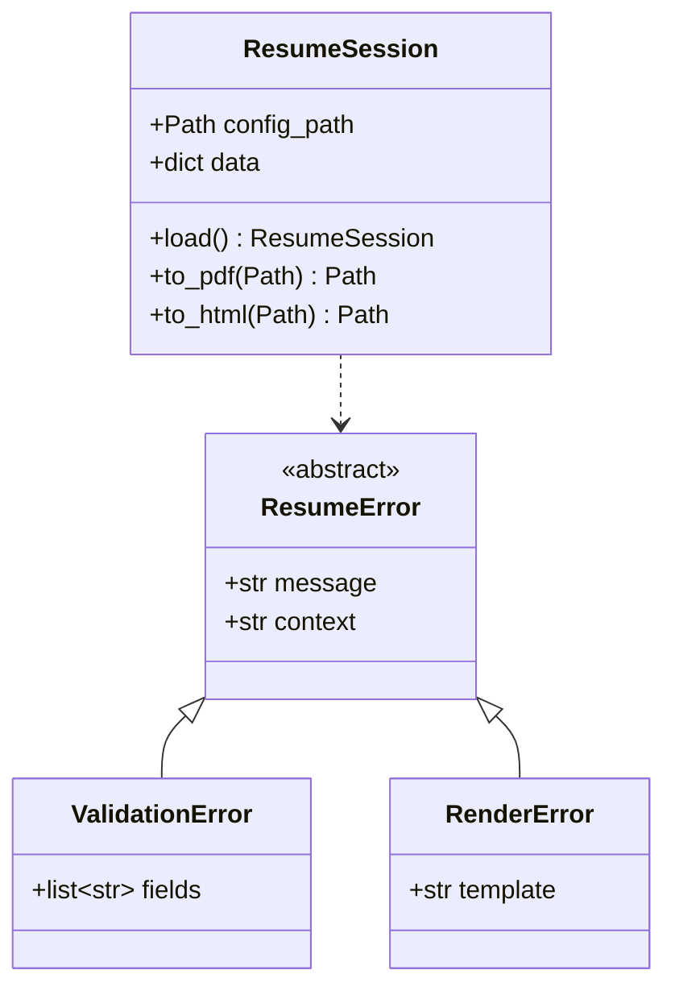

> **Night Market Skill** — ported from [claude-night-market/cartograph](https://github.com/athola/claude-night-market/tree/master/plugins/cartograph). For the full experience with agents, hooks, and commands, install the Claude Code plugin.


# Class Diagram

Generate a Mermaid class diagram showing types, their
relationships, and public interfaces from a codebase.

## When To Use

- Understanding class hierarchies and inheritance
- Documenting public APIs of a module
- Analyzing composition vs. inheritance patterns
- Answering "what types exist and how do they relate?"

## Workflow

### Step 1: Explore the Codebase

Dispatch the codebase explorer agent:

```
Agent(cartograph:codebase-explorer)
Prompt: Explore [scope] and return a structural model.
Focus on classes, dataclasses, protocols, type aliases,
inheritance, and composition for a class diagram.
Extract: class names, methods (public only), attributes,
parent classes, and composed types.
```

### Step 2: Generate Mermaid Syntax

Transform the structural model into a Mermaid class
diagram.

**Rules for class diagrams**:

- Use `classDiagram` diagram type
- Show only public methods and key attributes
- Use Mermaid relationship notation:
  - `<|--` for inheritance
  - `*--` for composition
  - `o--` for aggregation
  - `..>` for dependency/usage
- Add stereotypes for special types:
  - `<<protocol>>` for Python protocols/interfaces
  - `<<dataclass>>` for dataclasses
  - `<<enum>>` for enums
  - `<<abstract>>` for abstract classes
- Limit to 12-15 classes maximum
- Group related classes with `namespace`
- Omit private methods and dunder methods
- Show return types for methods

**Example output**:



### Step 3: Render via MCP

Call the Mermaid Chart MCP to render:

```
mcp__claude_ai_Mermaid_Chart__validate_and_render_mermaid_diagram
  prompt: "Class diagram of [scope]"
  mermaidCode: [generated syntax]
  diagramType: "classDiagram"
  clientName: "claude-code"
```

If rendering fails, fix syntax and retry (max 2 retries).

### Step 4: Present Results

Show the rendered diagram with analysis notes:

- Total classes and relationship count
- Key inheritance hierarchies identified
- Composition patterns noted
