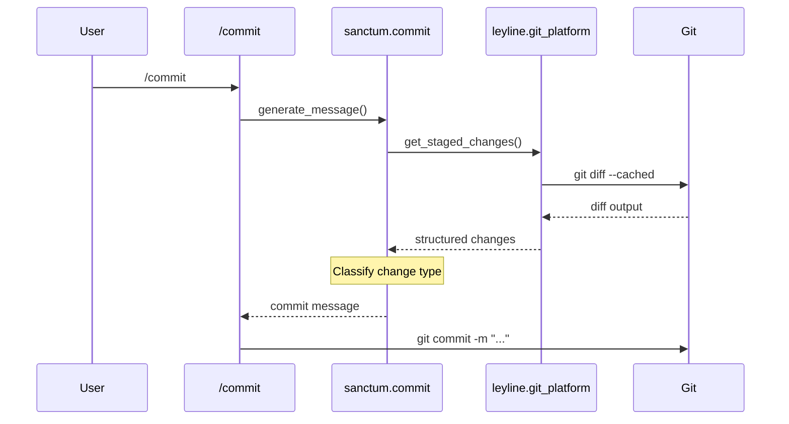

> **Night Market Skill** — ported from [claude-night-market/cartograph](https://github.com/athola/claude-night-market/tree/master/plugins/cartograph). For the full experience with agents, hooks, and commands, install the Claude Code plugin.


# Data Flow Diagram

Generate a Mermaid sequence diagram showing how data moves
between components in a codebase.

## When To Use

- Tracing how a request flows through the system
- Understanding data transformation pipelines
- Documenting API call chains
- Answering "what happens when X is called?"

## Workflow

### Step 1: Explore the Codebase

Dispatch the codebase explorer agent:

```
Agent(cartograph:codebase-explorer)
Prompt: Explore [scope] and return a structural model.
Focus on function calls, data transformations, and
inter-module communication for a data flow diagram.
```

### Step 2: Generate Mermaid Syntax

Transform the structural model into a Mermaid sequence
diagram.

**Rules for data flow diagrams**:

- Use `sequenceDiagram` for request/response flows
- Participants are modules or components (not functions)
- Arrows show data direction: `->>` for calls,
  `-->>` for returns
- Use `activate`/`deactivate` for long-running operations
- Add `Note over` for data transformations
- Limit to 8-10 participants maximum
- Use `alt`/`else` for conditional flows
- Handle circular calls by showing them once with a note

**Example output**:



### Step 3: Render via MCP

Call the Mermaid Chart MCP to render:

```
mcp__claude_ai_Mermaid_Chart__validate_and_render_mermaid_diagram
  prompt: "Data flow diagram of [scope/feature]"
  mermaidCode: [generated syntax]
  diagramType: "sequenceDiagram"
  clientName: "claude-code"
```

If rendering fails, fix syntax and retry (max 2 retries).

### Step 4: Present Results

Show the rendered diagram with a brief description of the
flow depicted (2-3 sentences).
