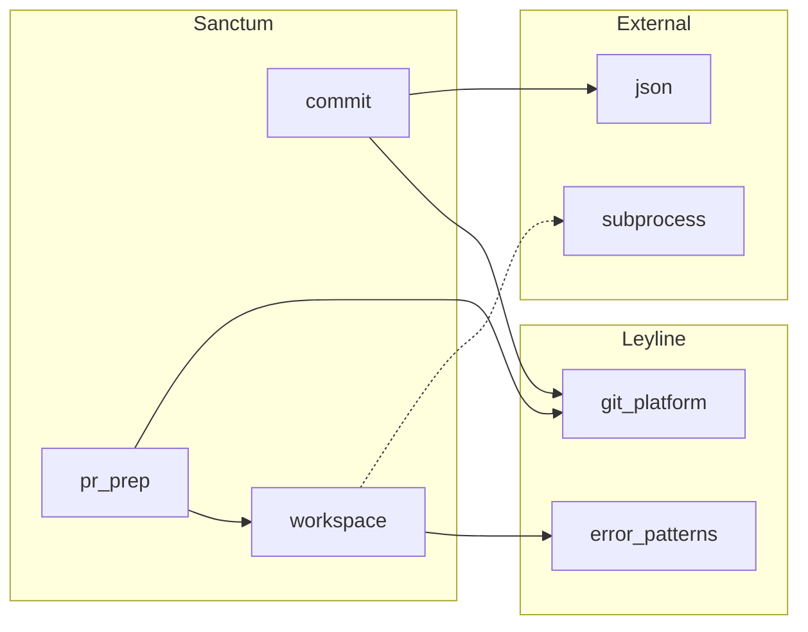

> **Night Market Skill** — ported from [claude-night-market/cartograph](https://github.com/athola/claude-night-market/tree/master/plugins/cartograph). For the full experience with agents, hooks, and commands, install the Claude Code plugin.


# Dependency Graph

Generate a Mermaid flowchart showing import and dependency
relationships between modules, packages, or plugins.

## When To Use

- Understanding what depends on what
- Finding circular dependencies
- Analyzing coupling between modules
- Planning refactoring by seeing dependency impact
- Answering "what breaks if I change this?"

## Workflow

### Step 1: Explore the Codebase

Dispatch the codebase explorer agent:

```
Agent(cartograph:codebase-explorer)
Prompt: Explore [scope] and return a structural model.
Focus on import statements and cross-module dependencies
for a dependency graph. Track both internal and external
imports.
```

### Step 2: Generate Mermaid Syntax

Transform the structural model into a Mermaid flowchart
with directed edges representing dependencies.

**Rules for dependency graphs**:

- Use `flowchart LR` (left-right) for dependency direction
- Each node is a module or package
- Edges point from dependent to dependency (A --> B means
  "A depends on B")
- Color-code by dependency type:
  - Default arrows for internal dependencies
  - Dotted arrows (`-.->`) for external/optional deps
  - Thick arrows (`==>`) for critical path dependencies
- Group into subgraphs by package/plugin
- If depth parameter given, limit transitive dependencies
- Highlight circular dependencies with red styling

**Example output**:



### Step 3: Render via MCP

Call the Mermaid Chart MCP to render:

```
mcp__claude_ai_Mermaid_Chart__validate_and_render_mermaid_diagram
  prompt: "Dependency graph of [scope]"
  mermaidCode: [generated syntax]
  diagramType: "flowchart"
  clientName: "claude-code"
```

If rendering fails, fix syntax and retry (max 2 retries).

### Step 4: Present Results

Show the rendered diagram with analysis notes:

- Total modules and dependency count
- Most-depended-on modules (high fan-in)
- Modules with most dependencies (high fan-out)
- Circular dependencies if any detected
