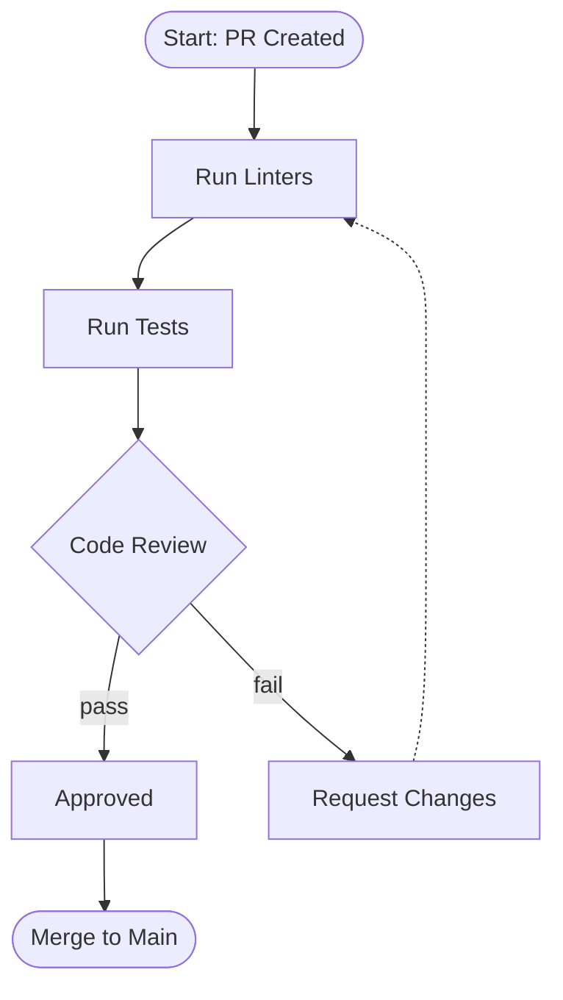

> **Night Market Skill** — ported from [claude-night-market/cartograph](https://github.com/athola/claude-night-market/tree/master/plugins/cartograph). For the full experience with agents, hooks, and commands, install the Claude Code plugin.


# Workflow Diagram

Generate a Mermaid flowchart showing process workflows,
pipelines, or state machines from code or documentation.

## When To Use

- Visualizing CI/CD or deployment pipelines
- Documenting multi-step development workflows
- Mapping state machines or lifecycle processes
- Answering "what steps happen when X runs?"

## Workflow

### Step 1: Explore the Codebase

Dispatch the codebase explorer agent:

```
Agent(cartograph:codebase-explorer)
Prompt: Explore [scope] and return a structural model.
Focus on process steps, conditional logic, state
transitions, and pipeline stages for a workflow diagram.
Look for: Makefiles, CI configs, hook chains, command
sequences, and lifecycle methods.
```

### Step 2: Generate Mermaid Syntax

Transform the structural model into a Mermaid flowchart
with decision nodes and process steps.

**Rules for workflow diagrams**:

- Use `flowchart TD` for sequential processes
- Use `flowchart LR` for pipelines with parallel tracks
- Use shapes to distinguish step types:
  - `[Rectangle]` for process steps
  - `{Diamond}` for decision points
  - `([Stadium])` for start/end states
  - `[[Subroutine]]` for sub-processes
  - `((Circle))` for join/sync points
- Use `-->|label|` for transition conditions
- Group parallel tracks into subgraphs
- Color-code by outcome:
  - Default for happy path
  - Dotted (`-.->`) for error/fallback paths
  - Thick (`==>`) for critical path
- Limit to 20 nodes maximum

**Example output**:



### Step 3: Render via MCP

Call the Mermaid Chart MCP to render:

```
mcp__claude_ai_Mermaid_Chart__validate_and_render_mermaid_diagram
  prompt: "Workflow diagram of [scope/process]"
  mermaidCode: [generated syntax]
  diagramType: "flowchart"
  clientName: "claude-code"
```

If rendering fails, fix syntax and retry (max 2 retries).

### Step 4: Present Results

Show the rendered diagram with a brief description of
the workflow stages and decision points (2-3 sentences).
