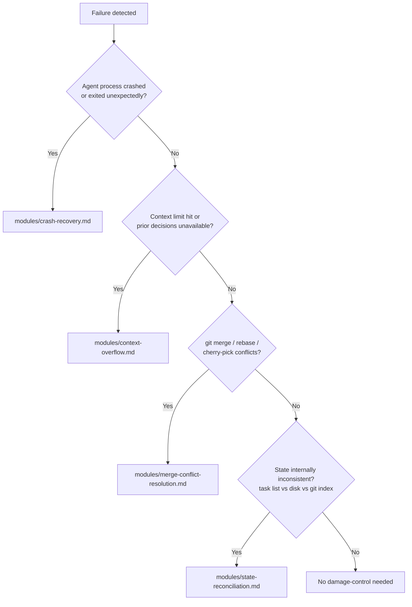

> **Night Market Skill** — ported from [claude-night-market/leyline](https://github.com/athola/claude-night-market/tree/master/plugins/leyline). For the full experience with agents, hooks, and commands, install the Claude Code plugin.


## Table of Contents

- [Overview](#overview)
- [When To Use](#when-to-use)
- [When NOT To Use](#when-not-to-use)
- [Damage Triage](#damage-triage)
- [Module Reference](#module-reference)
- [Integration Pattern](#integration-pattern)
- [Exit Criteria](#exit-criteria)


# Damage Control

## Overview

Provides recovery protocols for agents that encounter broken
state mid-session. Damage control covers four failure classes:
agent crashes with partial work on disk, context window overflow
that causes state loss, merge conflicts blocking forward progress,
and general session state corruption requiring reconciliation.

The skill does not prevent failures. It defines what to do after
one has already happened, so recovery is consistent, auditable,
and does not silently discard work.

## When To Use

- An agent process crashed and left files in an unknown state
- A session hit the context limit and cannot load prior decisions
- `git merge` or `git rebase` produced conflicts the agent cannot
  resolve automatically
- Observed state (files on disk, task list, git index) disagrees
  with expected state
- A downstream agent reports missing artifacts that should have
  been produced upstream

## When NOT to Use

- Proactive risk assessment before work starts (use
  `Skill(leyline:risk-classification)` instead)
- Strategic architectural decisions after a failure (use
  `Skill(attune:war-room)` instead)
- Routine error handling within a single tool call (use
  `Skill(leyline:error-patterns)` instead)

## Damage Triage

Use this decision tree to route to the correct module:



When multiple failure types overlap, start with
`state-reconciliation.md` to establish a known baseline, then
address the specific failure class.

## Risk Assessment Checklist

Before executing Level 1+ tasks, complete the risk assessment
checklist from `modules/risk-assessment-checklist.md`. Answer
these five questions:

1. **What could fail in production?** — List specific failure
   scenarios
2. **How would we detect it quickly?** — Monitoring, alerts,
   logs
3. **What is the fastest safe rollback?** — Step-by-step
   procedure
4. **What dependency could invalidate this plan?** — External
   dependencies
5. **What assumption is least certain?** — Weakest link in
   the plan

Required for Level 1 (Watch) and above. See
`modules/risk-assessment-checklist.md` for the full template and
examples.

## Module Reference

- **crash-recovery.md**: Triage, checkpoint inspection, and
  safe resume or rollback after an agent crash.
- **context-overflow.md**: Procedures for reconstructing
  decision context when the window is exhausted.
- **merge-conflict-resolution.md**: Classification and
  resolution strategies for git conflicts, including
  escalation to human review.
- **state-reconciliation.md**: Protocol for reconciling
  divergent state across task list, git index, and on-disk
  artifacts.
- **risk-assessment-checklist.md**: Pre-execution checklist for
  Level 1+ tasks.

## Integration Pattern

```yaml
# In your skill's frontmatter
dependencies: [leyline:damage-control]
```

Invoke a specific module when a failure class is identified:

```
# Crash detected
Skill(leyline:damage-control) → modules/crash-recovery.md

# Context limit reached
Skill(leyline:damage-control) → modules/context-overflow.md
```

For orchestrators managing multiple agents, invoke
state-reconciliation at session boundaries regardless of whether
a failure occurred. This establishes a verified checkpoint before
the next work phase begins.

## Exit Criteria

- Agent state is unambiguously known (no unknown partial writes)
- Git index is clean or all conflicts are resolved
- Task list reflects actual completion status of all tasks
- All artifacts expected by downstream agents are present and
  verified
- If rollback was taken, the rollback is committed and the
  reverted scope is documented in the task list
- If escalation to human review was required, the escalation
  record exists before the session closes
