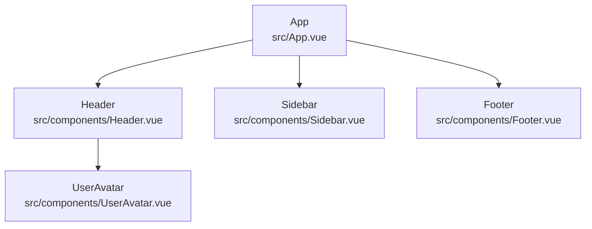

# Vue 组件依赖分析器

## 功能概述

分析 Vue 项目的组件依赖关系，从入口文件(main.js/main.ts/App.vue)开始递归分析，生成完整的组件层级关系图。

## 支持特性

- Vue 2 和 Vue 3 项目兼容
- 支持 Options API 和 Composition API
- 识别组件名称、文件路径、props 属性
- 多种输出格式：Markdown 树形、JSON、Mermaid 图表

## 分析流程

1. **定位入口文件**
   - 查找 main.js / main.ts / app.js / app.ts
   - 定位根组件 App.vue

2. **递归分析组件**
   - 解析 `<template>` 中的组件引用
   - 提取 `import` 语句中的组件依赖
   - 识别 `components` 选项中注册的组件
   - 递归分析子组件

3. **提取组件信息**
   - 组件名称（name 属性或文件名）
   - 组件文件绝对/相对路径
   - Props 定义（名称、类型、是否必填、默认值）

4. **生成输出**
   - Markdown 树形结构
   - JSON 结构化数据
   - Mermaid 流程图

## 输出格式

### 1. Markdown 树形结构

```
📦 App (src/App.vue)
├── 📁 components/
│   ├── 📄 Header (src/components/Header.vue)
│   │   ├── props: title(String), showLogo(Boolean)
│   │   └── 📄 UserAvatar (src/components/UserAvatar.vue)
│   │       └── props: src(String), size(Number)
│   └── 📄 Sidebar (src/components/Sidebar.vue)
│       └── props: menuItems(Array), collapsed(Boolean)
└── 📄 Footer (src/components/Footer.vue)
    └── props: copyright(String)
```

### 2. JSON 格式

```json
{
  "name": "App",
  "path": "src/App.vue",
  "props": [],
  "children": [
    {
      "name": "Header",
      "path": "src/components/Header.vue",
      "props": [
        { "name": "title", "type": "String", "required": true },
        { "name": "showLogo", "type": "Boolean", "default": true }
      ],
      "children": [...]
    }
  ]
}
```

### 3. Mermaid 图表



## 使用方法

分析当前 Vue 项目的组件结构：

1. 确定项目根目录
2. 查找入口文件和根组件
3. 递归分析所有组件依赖
4. 生成三种格式的分析报告

## 组件识别规则

### Vue 2
- 识别 `components: { ComponentName }` 选项
- 解析 `import ComponentName from './path'`
- 识别 `<component-name>` 和 `<ComponentName>` 标签

### Vue 3
- 支持 `<script setup>` 语法
- 识别 `import ComponentName from './path'`
- 解析动态组件 `<component :is="...">`

### Props 提取
- 识别 `props: ['prop1', 'prop2']` 数组形式
- 解析 `props: { prop1: String, prop2: { type: Object, required: true } }` 对象形式
- 支持 TypeScript 类型定义

## 注意事项

- 忽略第三方库组件（如 Element UI、Ant Design Vue）
- 处理循环依赖（A 引用 B，B 引用 A）
- 支持别名路径解析（@/components/...）
- 异步组件标记为 `(async)`
