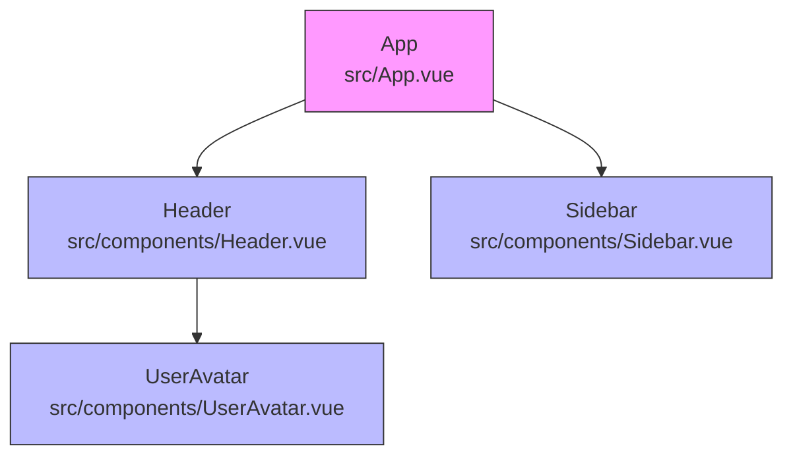

# Vue 组件分析示例

## 示例 1：简单 Vue 3 项目

### 项目结构
```
src/
├── main.js
├── App.vue
└── components/
    ├── Header.vue
    ├── Sidebar.vue
    └── UserAvatar.vue
```

### App.vue
```vue
<template>
  <div id="app">
    <Header :title="pageTitle" :show-logo="true" />
    <Sidebar :menu-items="menus" :collapsed="isCollapsed" />
    <router-view />
  </div>
</template>

<script setup>
import { ref } from 'vue'
import Header from './components/Header.vue'
import Sidebar from './components/Sidebar.vue'

const pageTitle = ref('My App')
const menus = ref([...])
const isCollapsed = ref(false)
</script>
```

### Header.vue
```vue
<template>
  <header>
    <UserAvatar :src="userAvatar" :size="40" />
    <h1>{{ title }}</h1>
  </header>
</template>

<script setup>
import UserAvatar from './UserAvatar.vue'

defineProps({
  title: { type: String, required: true },
  showLogo: { type: Boolean, default: true }
})
</script>
```

### 分析输出

#### Markdown 树形
```
📦 App (src/App.vue)
├── 📄 Header (src/components/Header.vue)
│   ├── props: title(String, required), showLogo(Boolean, default: true)
│   └── 📄 UserAvatar (src/components/UserAvatar.vue)
│       └── props: src(String, required), size(Number, default: 32)
├── 📄 Sidebar (src/components/Sidebar.vue)
│   └── props: menuItems(Array, required), collapsed(Boolean, default: false)
└── 📄 RouterView (外部组件)
```

#### JSON
```json
{
  "name": "App",
  "path": "src/App.vue",
  "props": [],
  "children": [
    {
      "name": "Header",
      "path": "src/components/Header.vue",
      "props": [
        { "name": "title", "type": "String", "required": true },
        { "name": "showLogo", "type": "Boolean", "default": true }
      ],
      "children": [
        {
          "name": "UserAvatar",
          "path": "src/components/UserAvatar.vue",
          "props": [
            { "name": "src", "type": "String", "required": true },
            { "name": "size", "type": "Number", "default": 32 }
          ],
          "children": []
        }
      ]
    },
    {
      "name": "Sidebar",
      "path": "src/components/Sidebar.vue",
      "props": [
        { "name": "menuItems", "type": "Array", "required": true },
        { "name": "collapsed", "type": "Boolean", "default": false }
      ],
      "children": []
    }
  ]
}
```

#### Mermaid


---

## 示例 2：Vue 2 Options API 项目

### App.vue
```vue
<template>
  <div id="app">
    <app-header :title="pageTitle"></app-header>
    <app-sidebar v-bind="sidebarProps"></app-sidebar>
  </div>
</template>

<script>
import AppHeader from './components/Header.vue'
import AppSidebar from './components/Sidebar.vue'

export default {
  name: 'App',
  components: {
    AppHeader,
    AppSidebar
  },
  data() {
    return {
      pageTitle: 'Vue 2 App'
    }
  },
  computed: {
    sidebarProps() {
      return {
        items: this.menuItems,
        collapsible: true
      }
    }
  }
}
</script>
```

### 分析输出

#### Markdown 树形
```
📦 App (src/App.vue)
├── 📄 AppHeader (src/components/Header.vue)
│   └── props: title(String)
└── 📄 AppSidebar (src/components/Sidebar.vue)
    └── props: items(Array), collapsible(Boolean)
```

---

## 示例 3：带异步组件的项目

### App.vue
```vue
<template>
  <div>
    <SyncComponent />
    <AsyncComponent v-if="showAsync" />
  </div>
</template>

<script>
import SyncComponent from './SyncComponent.vue'

export default {
  components: {
    SyncComponent,
    AsyncComponent: () => import('./AsyncComponent.vue')
  }
}
</script>
```

### 分析输出
```
📦 App (src/App.vue)
├── 📄 SyncComponent (src/components/SyncComponent.vue)
└── 📄 AsyncComponent (src/components/AsyncComponent.vue) (async)
```

---

## 示例 4：带循环依赖的处理

当 A.vue 引用 B.vue，B.vue 又引用 A.vue 时：

```
📦 ComponentA (src/components/A.vue)
└── 📄 ComponentB (src/components/B.vue)
    └── 📄 ComponentA (src/components/A.vue) [循环依赖 - 已截断]
```

JSON 中标记：
```json
{
  "name": "ComponentB",
  "path": "src/components/B.vue",
  "children": [
    {
      "name": "ComponentA",
      "path": "src/components/A.vue",
      "circular": true,
      "children": []
    }
  ]
}
```
