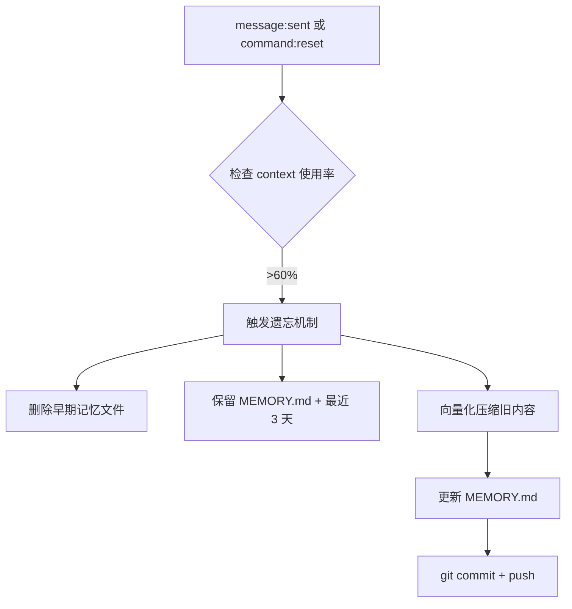

# Context Monitor Hook

## 功能

实时监控 OpenClaw 的 context 使用率，当超过 60% 时自动：

1. **遗忘早期会话** - 删除 7 天前的 `memory/YYYY-MM-DD.md` 文件
2. **保留长期记忆** - 完整保留 `MEMORY.md` + 最近 3 天日志
3. **向量化压缩** - 调用压缩系统整合被删除内容
4. **自动提交** - git commit + 推送

## 工作原理



## 配置

### 阈值调整

编辑 `handler.ts` 中的 `CONTEXT_THRESHOLD`：

```typescript
const CONTEXT_THRESHOLD = 0.85; // 85% - 可改为 0.7/0.8
```

### 保留策略

```typescript
const DAYS_TO_KEEP = 3; // 保留最近 3 天日志
const MIN_FILES_TO_KEEP = 5; // 至少保留 5 个文件
```

### 压缩模型

```typescript
const COMPRESSION_MODEL = 'ollama/qwen2.5:0.5b'; // 轻量模型
```

## 文件结构

```
~/.openclaw/workspace/hooks/context-monitor/
├── HOOK.md          ← 本文件
└── handler.ts       ← 核心逻辑
```

## 注意事项

1. **不会删除** `MEMORY.md` - 长期记忆始终保留
2. **压缩前备份** - 旧内容会被整合进长期记忆
3. **可逆操作** - git history 可恢复
4. **静默执行** - 仅在日志输出，不干扰用户对话

## 日志输出

```bash
[context-monitor] Context usage: 65% → 触发清理
[context-monitor] 删除了 12 个旧记忆文件 (2026-02-20 到 2026-03-01)
[context-monitor] 保留了 3 个文件 (2026-03-02 到 2026-03-09)
[context-monitor] 压缩了 45K tokens → 8K tokens (82% 压缩率)
[context-monitor] 已提交到 git (commit abc123)
```

## 高级定制

### 添加向量化存储

如果你有向量数据库（Chroma/Pinecone），可以扩展：

```typescript
// 示例：存储压缩后的记忆到向量库
await vectorStore.add({
  content: compressedMemory,
  metadata: {
    date: '2026-03-09',
    originalFiles: deletedFiles
  }
});
```

### 自定义压缩提示词

```typescript
const COMPRESSION_PROMPT = `
你是一个记忆压缩专家。请从以下原始记忆中提取关键信息：
- 重要决定和结论
- 项目进度和状态
- 待办事项和目标
- 技术决策和理由

压缩后保留核心信息，删除冗余细节：
${rawMemory}
`;
```
