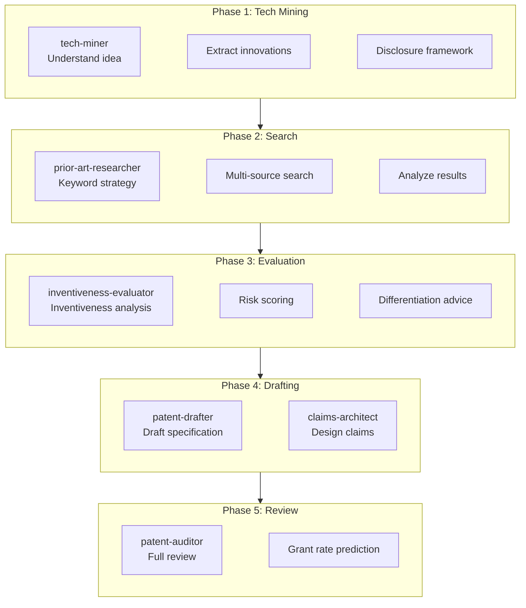
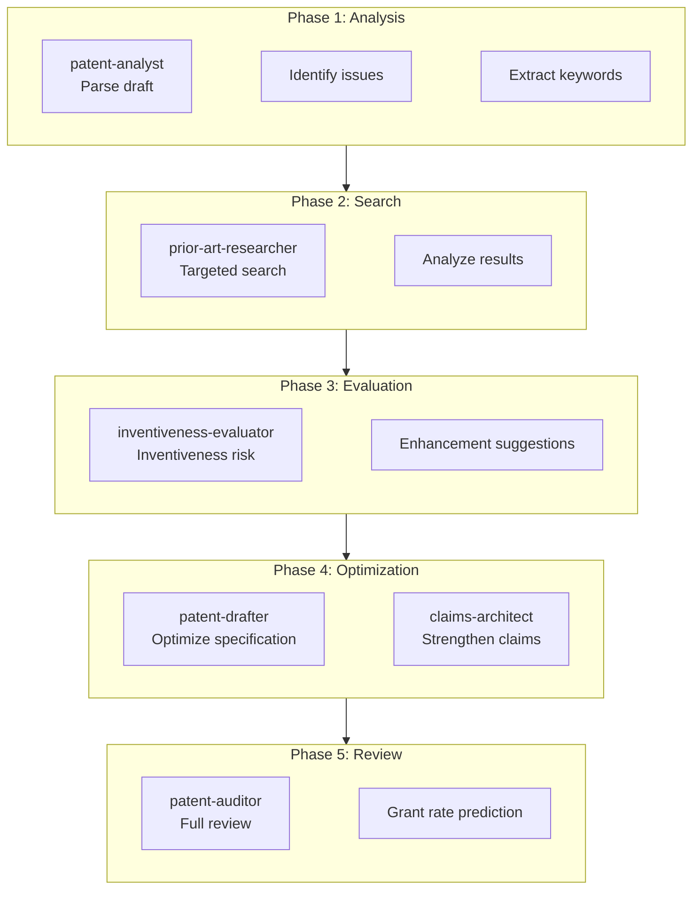
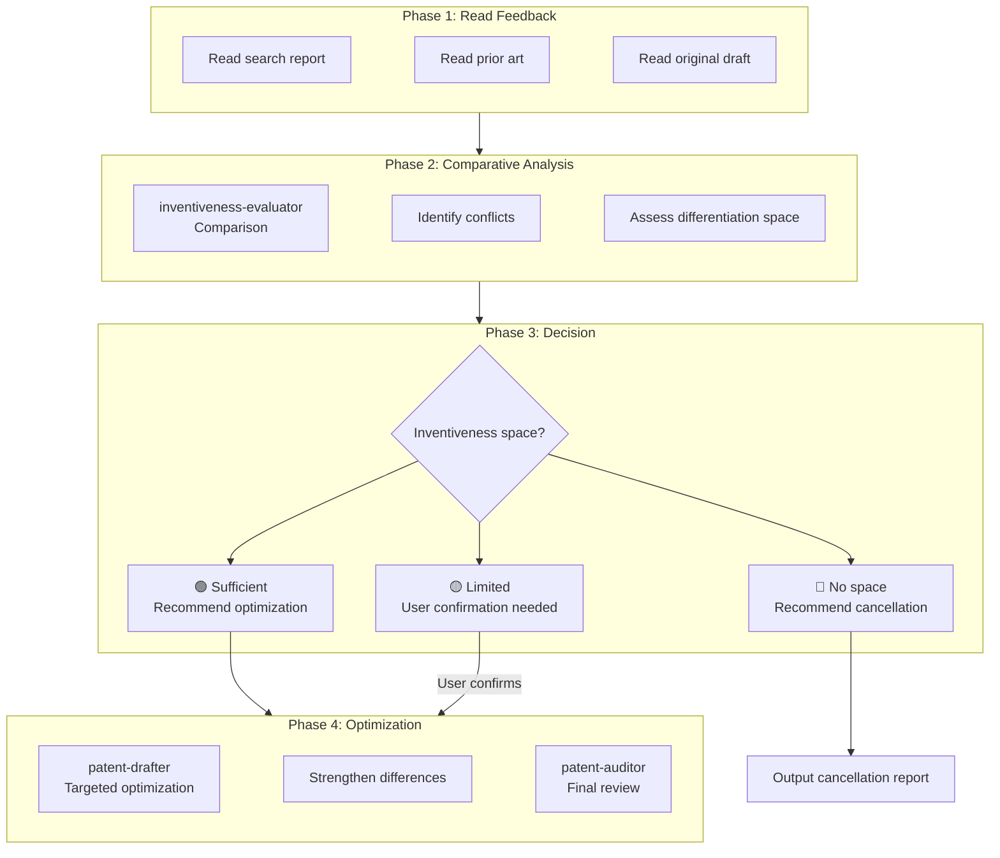
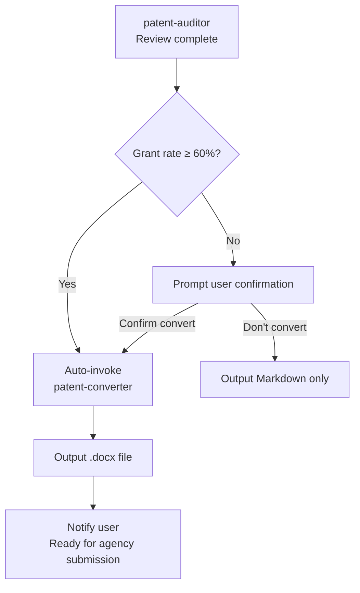

# Professional Patent Agents Suite

## License

MIT License

Copyright (c) 2026 BigPiPiHua

Permission is hereby granted, free of charge, to any person obtaining a copy
of this software and associated documentation files (the "Software"), to deal
in the Software without restriction, including without limitation the rights
to use, copy, modify, merge, publish, distribute, sublicense, and/or sell
copies of the Software, and to permit persons to whom the Software is
furnished to do so, subject to the following conditions:

The above copyright notice and this permission notice shall be included in all
copies or substantial portions of the Software.

THE SOFTWARE IS PROVIDED "AS IS", WITHOUT WARRANTY OF ANY KIND, EXPRESS OR
IMPLIED, INCLUDING BUT NOT LIMITED TO THE WARRANTIES OF MERCHANTABILITY,
FITNESS FOR A PARTICULAR PURPOSE AND NONINFRINGEMENT. IN NO EVENT SHALL THE
AUTHORS OR COPYRIGHT HOLDERS BE LIABLE FOR ANY CLAIM, DAMAGES OR OTHER
LIABILITY, WHETHER IN AN ACTION OF CONTRACT, TORT OR OTHERWISE, ARISING FROM,
OUT OF OR IN CONNECTION WITH THE SOFTWARE OR THE USE OR OTHER DEALINGS IN THE
SOFTWARE.

---

## Core Positioning

| Scenario | Input | Output | Goal |
|----------|-------|--------|------|
| **Scenario 1** | User idea (vague description) | Complete patent document + Search report | Grant rate + Inventiveness |
| **Scenario 2** | User draft (existing document) | Optimized patent document | Grant rate + Inventiveness |
| **Scenario 3** | Agency feedback (search report/prior art) | Optimization suggestions / Cancellation advice | Decision support |

**Boundary**: Does not handle Office Action (OA) responses - leave that to professional patent agencies.

---

## Dependencies

### Required Skills

| Skill | Purpose | Install Command |
|-------|---------|-----------------|
| `tavily-search` | AI-optimized search | `clawhub install tavily-search` |
| `aminer-open-academic` | Academic paper search | `clawhub install aminer-open-academic` |

### Python Dependencies

```bash
pip install requests python-docx
```

---

## Agent List (9 Core Agents)

| Agent | Role | Core Capability | Priority |
|-------|------|-----------------|----------|
| **tech-miner** | Technology Mining Expert | Idea analysis, innovation extraction, technical disclosure framework | ⭐⭐⭐⭐⭐ |
| **prior-art-researcher** | Prior Art Search Expert | Keyword strategy + Multi-source search + Analysis | ⭐⭐⭐⭐⭐ |
| **inventiveness-evaluator** | Inventiveness Evaluation Expert | Inventiveness analysis, risk scoring, grant rate prediction | ⭐⭐⭐⭐⭐ |
| **patent-drafter** | Patent Drafting Expert | 7-section drafting, Mermaid diagrams, document conversion | ⭐⭐⭐⭐⭐ |
| **claims-architect** | Claims Architect | Claims design, scope optimization | ⭐⭐⭐⭐ |
| **patent-analyst** | Patent Analyst | Draft analysis, issue identification, optimization suggestions | ⭐⭐⭐⭐ |
| **patent-auditor** | Patent Audit Expert | Quality review, grant rate prediction, revision suggestions | ⭐⭐⭐⭐⭐ |
| **patent-value-appraiser** | Patent Value Appraiser | 5-dimension value assessment, market value estimation | ⭐⭐⭐⭐ |
| **patent-converter** | Document Conversion Expert | Markdown→Word, Mermaid diagram embedding | ⭐⭐⭐⭐ |

---

## Workflows

### Scenario 1: User Idea → Drafting + Search



**Trigger**:
```
"Help me write a patent: [technical idea]"
"I have an idea and want to apply for a patent"
```

**Output Files**:
- `TECH_DISCLOSURE.md` - Technical disclosure framework
- `KEYWORD_STRATEGY.md` - Keyword strategy
- `PATENT_SEARCH_REPORT.md` - Search report
- `INVENTIVENESS_REPORT.md` - Inventiveness evaluation report
- `Patent-*.md` - Complete patent document (7-section standard format)
- `PATENT_AUDIT_REPORT.md` - Audit report (with grant rate prediction)
- `Patent-*.docx` - Word document (auto-converted)

---

### Scenario 2: User Draft → Optimization



**Trigger**:
```
"Help me optimize this patent: /path/to/patent.md"
"Review this patent and provide optimization suggestions"
```

**Output Files**:
- `PATENT_ANALYSIS_REPORT.md` - Analysis report
- `PATENT_SEARCH_REPORT.md` - Search report
- `INVENTIVENESS_REPORT.md` - Inventiveness evaluation report
- `PATENT_OPTIMIZATION_SUGGESTIONS.md` - Optimization suggestions
- `Patent-*.md` - Optimized patent document
- `PATENT_AUDIT_REPORT.md` - Audit report

---

### Scenario 3: Agency Feedback → Evaluation

**Use Case**: User has submitted to a patent agency, received a search report or prior art, needs to evaluate whether to continue optimizing or cancel the application.



**Trigger**:

```
"The agency gave me a search report, help me see if I can optimize: /path/to/report.pdf"
"Here's the prior art, help me evaluate if I need to modify the patent"
"The agency says there's risk, should I continue or cancel?"
```

**Output Files**:
- `AGENCY_FEEDBACK_ANALYSIS.md` - Agency feedback analysis
- `DECISION_RECOMMENDATION.md` - Decision recommendation (continue/cancel)
- `PATENT_OPTIMIZATION_SUGGESTIONS.md` - Targeted optimization suggestions

**Decision Criteria**:

| Inventiveness Space | Basis | Recommendation |
|---------------------|-------|----------------|
| 🟢 Sufficient | Core features not disclosed, clear differentiation points | Continue optimization, strengthen differences |
| 🟡 Limited | Some features disclosed, need repositioning | User confirmation required |
| 🔴 No space | Core features already disclosed, cannot circumvent | Recommend cancellation or redesign |

---

## Agent Details

### Tech Miner (Technology Mining Expert)

**Identity**: Dr. Li, 15 years of technology assessment and innovation mining experience

**Trigger**: When user provides vague idea

**Output**: Technical disclosure framework

```
Use tech-miner to analyze the technical idea:
[User description]
```

---

### Prior Art Researcher (Prior Art Search Expert)

**Identity**: Dr. Chen, 15 years of patent search experience

**Trigger**: When search is needed

**Output**: Search report + analysis

```
Use prior-art-researcher to search:
Keywords: [keywords]
Technical field: [field]
```

**Search Channels (Default)**:
| Priority | Channel | Tool | Purpose |
|----------|---------|------|---------|
| 1 | Tavily | `tavily-search` | Quick search, technical overview |
| 2 | AMiner | `aminer-open-academic` | Academic papers + patent database |
| 3 | Google Patents | `web_fetch` | Global patent full text |
| 4 | GitHub | `tavily site:` | Open source projects |
| 5 | Tech blogs | `tavily site:` | Technical articles |

**⚠️ Patent Database APIs Recommended**:

Default channels may not be sufficient for accurate patent prior art search. For professional patent search, recommend users to connect patent database APIs:

| Database | API Type | Coverage | Best For |
|----------|----------|----------|----------|
| **Google Patents** | Public API | 100+ offices | Global search |
| **USPTO** | Public API | US patents | US details |
| **EPO (Espacenet)** | Public API | European patents | EP search |
| **CNIPA** | Public API | Chinese patents | CN search |
| **WIPO** | Public API | PCT applications | International |
| **Lens.org** | Free API | Global patents | Academic research |

**ClawHub Skill Discovery**:
```bash
# Always check ClawHub for patent search skills
clawhub search patent
clawhub search "prior art"
```

---

### Inventiveness Evaluator (Inventiveness Evaluation Expert)

**Identity**: Dr. Zhao, former examiner, 12 years of evaluation experience

**Trigger**: After search completion

**Output**: Inventiveness evaluation report (with risk score)

```
Use inventiveness-evaluator to evaluate inventiveness:
Patent document: /path/to/patent.md
Search report: PATENT_SEARCH_REPORT.md
```

---

### Patent Drafter (Patent Drafting Expert)

**Identity**: Patricia, 12 years of drafting experience, 92% grant rate

**Trigger**: After inventiveness evaluation passes

**Output**: Complete patent document (7 sections)

```
Use patent-drafter to draft patent:
Patent title: [title]
Technical disclosure: TECH_DISCLOSURE.md
Search report: PATENT_SEARCH_REPORT.md
Inventiveness evaluation: INVENTIVENESS_REPORT.md
```

---

### Claims Architect (Claims Architect)

**Identity**: Claude, 1000+ claims experience

**Trigger**: Parallel participation during drafting phase

**Output**: Claims document

```
Use claims-architect to design claims:
Patent document: /path/to/patent.md
Core inventive points: [points]
```

---

### Patent Analyst (Patent Analyst)

**Identity**: Dr. Zhang, 12 years of patent analysis experience

**Trigger**: First step in optimization scenario

**Output**: Analysis report + optimization suggestions

```
Use patent-analyst to analyze patent:
Patent document: /path/to/patent.md
```

---

### Patent Auditor (Patent Audit Expert)

**Identity**: Judge Wu, former examiner, reviewed 3000+ applications

**Trigger**: After drafting/optimization completion

**Output**: Audit report (with grant rate prediction)

```
Use patent-auditor to audit patent:
Patent document: /path/to/patent.md
```

---

### Patent Value Appraiser (Patent Value Appraiser)

**Identity**: Ms. Lin, 10 years of patent valuation experience, certified IP asset appraiser

**Trigger**: User needs to evaluate existing patent value (transfer, pledge, financing)

**Output**: Patent value assessment report (5-dimension radar chart + market value range)

```
Use patent-value-appraiser to evaluate patent value:
Patent title: [title]
Or patent number: [number]
Purpose: pledge financing / licensing negotiation / technology transfer / M&A transaction
```

**5 Evaluation Dimensions**:
| Dimension | Weight | Content |
|-----------|--------|---------|
| Technical Value | 25% | Innovation degree, technical complexity, substitution difficulty |
| Legal Value | 25% | Claim breadth, stability, invalidation resistance |
| Market Value | 25% | Application scenarios, market size, competitive alternatives |
| Economic Value | 15% | Cost savings, revenue potential, licensing income |
| Strategic Value | 10% | Supply chain position, barrier strength, negotiation leverage |

---

### Patent Converter (Document Conversion Expert)

**Identity**: Alex, document conversion expert, proficient in Markdown → Word conversion

**Trigger**: Auto-triggered after patent-auditor review passes

**Output**: Word document (.docx), with embedded Mermaid diagrams

**Conversion Flow**:
1. Parse 7 sections of patent Markdown
2. Extract Mermaid code blocks and render to PNG
3. Use Pandoc to convert section content
4. Fill into Word template at corresponding positions
5. Embed images into document
6. Output to same directory as source file

**Dependencies**:
| Tool | Purpose |
|------|---------|
| Pandoc | Markdown → Word conversion |
| mmdc (mermaid-cli) | Mermaid → PNG rendering |
| python-docx | Word document operations |

---

## Standard Patent Template (7 Sections)

```markdown
# [Patent Title]

## 1. Related Prior Art and Their Defects or Deficiencies
### 1.1 Description of Prior Art
### 1.2 Defects or Deficiencies of Prior Art

## 2. Technical Improvements to Overcome the Above Defects

## 3. Alternative Solutions for Technical Improvements

## 4. Detailed Embodiments of the Technical Solution
### 4.1 System Architecture
### 4.2 Signal Logic Relationships
### 4.3 Implemented Functions
### 4.4 Specific Implementation Steps
### 4.5 Embodiment 1
(Describe included components/modules and their connections, signal logic; implemented functions and specific implementation steps)
## 5. Advantages of This Proposal Over Prior Art
(Achieved technical effects)
## 6. Related Drawings
(Structure diagrams with labeled component/module names; flowcharts with clear steps and process directions)
## 7. Claims
(Optional)
```

---

## Language Adaptation

**The agents automatically detect and use the user's language for output.**

| User Input Language | Output Language | Template Format |
|---------------------|-----------------|-----------------|
| English | English | 7-Section Standard (English) |
| 中文 | 中文 | 7章节标准模板（中文） |
| Other languages | User's language | 7-Section Standard (translated) |

### Chinese 7-Section Template (中文七章节模板)

```markdown
# [专利名称]

## 一、相关的现有技术及现有技术的缺陷或不足
### 1.1 现有技术描述
### 1.2 现有技术的缺陷或不足

## 二、为克服上述缺陷本提案的技术改进点

## 三、技术改进点的其他替代方案

## 四、详细的技术方案具体实施例
### 4.1 系统架构
### 4.2 信号逻辑关系
### 4.3 实现功能
### 4.4 具体实现步骤
### 4.5 实施例一

## 五、本提案相对现有技术的优点

## 六、相关附图

## 七、权利要求书
```

### Key Rules for All Languages

1. **7-Section Structure** — Must follow the standard template regardless of language
2. **No Executable Code** — Use pseudocode or flowcharts instead
3. **Quantified Technical Effects** — Always quantify improvements (e.g., "30% efficiency increase")
4. **Comparison Table** — Include comparison with prior art
5. **Mermaid Diagrams** — Use flowcharts and architecture diagrams

---

## Output Files Summary

### Scenario 1: User Idea → Drafting

| File | Content | Phase |
|------|---------|-------|
| `TECH_DISCLOSURE.md` | Technical disclosure framework | Tech mining |
| `KEYWORD_STRATEGY.md` | Keyword strategy | Search |
| `PATENT_SEARCH_REPORT.md` | Search report | Search |
| `INVENTIVENESS_REPORT.md` | Inventiveness evaluation report | Evaluation |
| `Patent-*.md` | Complete patent document | Drafting |
| `PATENT_AUDIT_REPORT.md` | Audit report (with grant rate) | Review |

### Scenario 2: User Draft → Optimization

| File | Content | Phase |
|------|---------|-------|
| `PATENT_ANALYSIS_REPORT.md` | Analysis report | Analysis |
| `PATENT_SEARCH_REPORT.md` | Search report | Search |
| `INVENTIVENESS_REPORT.md` | Inventiveness evaluation report | Evaluation |
| `PATENT_OPTIMIZATION_SUGGESTIONS.md` | Optimization suggestions | Optimization |
| `PATENT_AUDIT_REPORT.md` | Audit report (with grant rate) | Review |

### Scenario 3: Agency Feedback → Evaluation

| File | Content | Phase |
|------|---------|-------|
| `AGENCY_FEEDBACK_ANALYSIS.md` | Feedback analysis | Analysis |
| `DECISION_RECOMMENDATION.md` | Decision recommendation | Decision |
| `PATENT_OPTIMIZATION_SUGGESTIONS.md` | Optimization suggestions (if chosen) | Optimization |

### Patent Value Assessment

| File | Content |
|------|---------|
| `PATENT_VALUE_REPORT.md` | 5-dimension value assessment + market value range |

---

## Installation Location

```
skills/
└── professional-patent-agents/
    ├── SKILL.md
    ├── agents/
    │   ├── tech-miner/
    │   ├── prior-art-researcher/
    │   ├── inventiveness-evaluator/
    │   ├── patent-drafter/
    │   ├── claims-architect/
    │   ├── patent-analyst/
    │   ├── patent-auditor/
    │   ├── patent-value-appraiser/
    │   └── patent-converter/
    └── skills/
        └── continuous-learning/
```

---

## Auto-Conversion Flow

### Trigger Conditions

Auto-invoke patent-converter to convert Markdown to Word when:

| Condition | Requirement |
|-----------|-------------|
| patent-auditor review result | Passed |
| Grant rate prediction | ≥ 60% (low/medium risk) |
| User confirmation | High risk (< 60%) requires user confirmation |

### Conversion Flow



### Output Location

```
Source directory/
├── Patent-1-xxx.md      # Source Markdown
├── Patent-1-xxx.docx    # Converted output (same directory)
├── Patent-2-xxx.md
├── Patent-2-xxx.docx
└── ...
```

---

## Innovation Mining & Notifications

### Work Record Source

```
memory/
├── 2026-03-16.md    # Daily work records
├── 2026-03-17.md
├── 2026-03-18.md
└── ...
```

### Innovation Mining Rules

1. **Extract technical points from work records**: Code commits, architecture designs, problem solutions
2. **Combine with industry trends**: Search for latest technical developments
3. **Evaluate grant rate**: Prior art search + Inventiveness evaluation
4. **Selection criteria**: Grant rate ≥ 65%, Low/Medium risk level

### Notification Format

```
📢 Innovation Mining Report

📊 X potential innovations discovered this week:

1. 【Highly Recommended】A method for XXX
   - Grant rate prediction: 70-80%
   - Risk level: Low
   - Innovation: XXX

2. 【Recommended】A system for XXX
   - Grant rate prediction: 65-75%
   - Risk level: Medium
   - Innovation: XXX

📁 Detailed documents: /patent/weekly/

💡 Suggestion: Prioritize applying for patent #1
```

---

*Professional Patent Agents Suite v1.0*
*Author: BigPiPiHua*
*Mail: 775262592@qq.com*
*License: MIT*
*Updated: 2026-03-19*