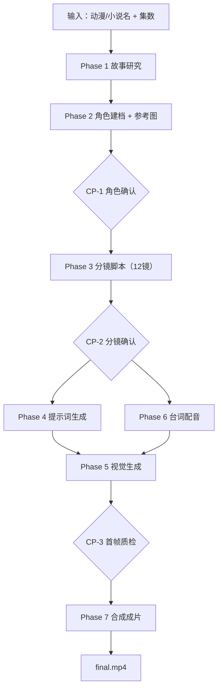

# 动漫短视频编排（`cartoon-video-creation`）

## 编排定位

- **层级**：L3 `orchestration`，仅负责编排与状态推进，不实现产品级 API 细节。
- **目标**：将动漫/小说主题自动转为单集短视频（<=120s，12 镜）。
- **边界**：
  - 文案脚本细则：[`references/story-script-guide.md`](references/story-script-guide.md)
  - 文生图提示词细则：[`references/image-prompt-guide.md`](references/image-prompt-guide.md)
  - 图生视频提示词细则：[`references/video-prompt-guide.md`](references/video-prompt-guide.md)
  - 人物身份卡模板：[`templates/person-prompt.md`](templates/person-prompt.md)

### 跨分镜：风格与主题一致（强制）

全集 12 镜须在**同一画风、同一主题与世界观调性**下呈现；不得中途换画风（如从赛璐珞突然变写实）、不得偏离本集确立的题材与情绪基调。

- **落地方式**：在 `project.json` 中固化「全片不变特征」（风格锚、画质锚、主题锚、一致性强化等，字段命名与写法见 [`references/image-prompt-guide.md`](references/image-prompt-guide.md)）。
- **提示词要求**：**每一镜**的 `image_prompt` 与 `video_prompt` 都必须显式包含上述不变特征（可与分镜变量拼接，但不可省略）；图生视频侧须与首帧图侧同源，避免「静帧日系、动效美漫」类漂移。细则见 image / video 两份 reference。

### 文案与公共音色：人设一致（强制）

本编排以 **AI 分镜画面 + TTS 配音** 为主（可选对口型）。**台词、`speaker`、公共音色**须与角色设定一致：

- **性别与气质**：`story_bible.json` 与本集**主题、情感基调**先确定叙述视角（旁白 / 角色对白）及**说话者性别、年龄气质**；`characters/*.json` 身份卡中的性别、人设须与 **`speaker` 字段**一致。
- **公共音色**：首集用 `products/chanjing-tts/scripts/list_voices.py --fetch-all` 建立 `voice_registry.json`；为每个 **`speaker`（或旁白）** 绑定一条 **`audio_man`**：**`list_voices` 返回的 `gender` 须与该说话者在剧本与身份卡中的性别呈现一致**；在一致前提下按 **`name` 语义**匹配本集**应用场景**（热血/治愈/搞笑/严肃等）与**情感要求**。
- **多角色**：不同 `speaker` 使用不同 `audio_man`，且各音色与对应角色身份卡一致；**同一角色全片固定同一音色**，不得中途换声。
- **与一键成片对齐**：选型逻辑与 **`chanjing-one-click-video-creation`** 的 **`templates/render-rules.md` §3·C.2.5**、**§3·C.4** 一致（仅本场景通常无公共数字人出镜，不涉及 `list_figures`）。

---

## 涉及产品（L2）

| 能力 | 产品目录 | 用途 |
|------|----------|------|
| 文生图/图生视频 | `chanjing-ai-creation` | 参考图、首帧图、分镜视频 |
| TTS | `chanjing-tts` | 台词转音频 |
| 声音克隆（可选） | `chanjing-tts-voice-clone` | 角色定制音色 |
| 分镜对口型（可选） | `chanjing-avatar` | 仅在 `enable_lip_sync=true` 时对每镜执行 lip-sync（`model=2` 卡通） |
| 本地合成 | `ffmpeg`/`ffprobe` | 音视频对齐、拼接、增强 |

> 说明：默认成片为「动漫画面 + 分镜配音」，不对口型；与一键成片混剪路径不同。

---

## 总流程



并行关系：

- Phase 4（提示词）与 Phase 6（TTS）并行
- 默认：Phase 5 在 5.2 图生视频完成后即可记为 `video_base_done`；Phase 7 将每镜 **AI 视频 + 分镜配音** 做时长对齐后拼接
- 若 `project.json.enable_lip_sync=true`：在 Phase 5.2 与 Phase 6 均完成后执行 Phase 5.3 逐镜对口型，Phase 7 使用 `lip_sync_done` 视频进入拼接（与默认二选一）

## Workflow Output Semantics

本 Skill 输出语义对齐 [`../orchestration-contract.md`](../orchestration-contract.md)：

- `ok`：成功交付 `final.mp4`（并保留中间产物与状态文件）
- `need_param`：必要输入缺失（主题、集数或关键约束不足）
- `auth_required`：凭据不可用（典型 `10400`）
- `upstream_error`：上游图/视频/TTS 或渲染步骤失败
- `timeout`：异步任务轮询超时

---

## 编排执行步骤

### Phase 1：故事研究

1. 使用 `web_search` 检索作品剧情、人物关系、世界观。
2. 同步检索**相关话题在短视频平台/公开网页上的热门讨论、爆点标题、常见争议点与高互动切口**，提炼可复用的 **Hook 方向**、情绪触发点与观众最关心的问题；**仅可参考表达策略，不得直接照搬文案**。
3. 对知名 IP（如蜡笔小新）额外检索主要角色公开形象图，记录来源页面与可用图片 URL。
4. 产出 `story_bible.json`，至少包含：`title`、`genre`、`world_setting`、`plot_arcs`、`main_characters`、`character_reference_candidates`，并建议补充 `trend_hooks` / `audience_interest_points` 供 Phase 3 写稿参考。
5. 支持续集补充检索，不要求首次穷尽剧情。

输出路径：`{project_dir}/story_bible.json`

---

### Phase 2：角色建档与参考图

1. 依据 `templates/person-prompt.md` 生成角色身份卡。
2. 优先复用 Phase 1 的角色参考候选图；每个主角至少确认 1 张主参考图（正脸/半身清晰，无遮挡）。
3. 若公开图质量不足，再按 `references/image-prompt-guide.md` 生成核心参考图与可选辅助图。
4. 写入角色档案与全局配置；在 `project.json` 中写入全片共用的 **视觉与主题不变特征**（`风格锚` / `画质锚` / `主题锚` / `一致性强化` 等，见 `references/image-prompt-guide.md`），供后续每一镜文生图、图生视频提示词复用。

输出：

- `characters/{character_id}.json`
- `characters/{character_id}_ref.png`（核心）
- 可选：`_ref_side.png`、`_ref_full.png`
- `project.json`（须含可逐镜复制的风格与主题锚定字段）

CP-1（可跳过）：角色形象确认后继续。

---

### Phase 3：分镜脚本编排（12 镜）

1. 按 `references/story-script-guide.md` 规划单集叙事结构与情绪弧线；**单集主题句与世界观边界**一旦确立，12 镜剧情与场景变化不得与之矛盾（视觉提示词将据此与 `project.json` 主题锚对齐）。
2. 文案与镜头切口应结合 Phase 1 提炼的 **`trend_hooks` / `audience_interest_points`**，优先吸收互联网上该题材的高互动开场、争议问题、反差表达与情绪触发点，用于增强 Hook、冲突与留悬念能力；**禁止**原样复刻热点文案、标题或他人脚本。
3. 固定约束：
   - 总时长 <= 120s
   - 固定 12 镜
   - 单镜 <= 10s
   - 单镜台词 <= 40 字
   - 每镜仅 1 名主角色作为视觉主体（primary_subject）
   - 主角色位于画面中轴附近且占画幅 >= 1/3
   - 其它角色仅允许远景/背景人群形态，不得与主角色争夺主体面积
4. 生成 `storyboard.json`，每镜至少包含：
   - `scene_id`、`scene_title`
   - `narrative_phase`（hook/build/payoff）
   - `emotion_intensity`
   - `duration`、`voiceover`、`speaker`
   - `camera_shot`、`camera_movement`
   - `primary_subject`、`primary_subject_ratio`
   - `background_characters_policy`
   - `transition_hint`、`status`

CP-2（可跳过）：12 镜摘要确认后继续。

---

### Phase 4：提示词生成（与 Phase 6 并行）

按分镜逐镜写入：

- `image_prompt`：规则见 `references/image-prompt-guide.md`；**每镜**须拼接 `project.json` 中的风格锚、画质锚、主题锚、一致性强化与负向约束（全集不变块），不得省略。
- `video_prompt`：规则见 `references/video-prompt-guide.md`；**每镜**须含与文生图同源的风格与主题不变块，与首帧画风一致。
- `negative_prompt`：来自 `project.json`
- `ref_img_url`：当前镜主角色参考图 URL（优先 Phase 1 检索结果，其次角色档案图）

输出：更新 `storyboard.json`。

---

### Phase 5：视觉生成（默认不含口型）

在 `project.json` 中约定布尔字段 **`enable_lip_sync`**（默认 `false`）。未开启时本阶段在 5.2 完成后结束，直接进入 Phase 7 与配音合成。

## 5.1 首帧图生成（参考图生图优先）

- 调用 `products/chanjing-ai-creation/scripts/submit_task.py`（`creation-type=3`）
- 参数读取：
  - `model-code` <- `project.json.image_model`
  - `aspect-ratio` <- `project.json.aspect_ratio`
  - `prompt` <- 当前镜 `image_prompt`
  - `ref-img-url` <- 当前镜 `ref_img_url`（主角色参考图）
- 记录 `image_task_id`、`image_url`、`status=image_done`
- 若 `ref-img-url` 不支持或失效，自动降级为纯 prompt（保留主角色构图约束）
- 构图验收：主角色居中且占比 >= 1/3，其他角色只允许远景，不通过则仅重生该镜首帧

## 5.2 图生视频

- 调用 `submit_task.py`（`creation-type=4`）
- 参数读取：
  - `model-code` <- `project.json.video_model`
  - `prompt` <- 当前镜 `video_prompt`
  - `ref-img-url` <- 当前镜首帧图
- 记录 `video_task_id`、`video_url`、`status=video_base_done`
- `transition_hint=continuous` 时可启用尾帧衔接；不支持则自动降级
- 持续约束：主角色主体面积和居中关系在视频内尽量保持一致，其他角色保持远景陪衬

## 5.3 逐镜对口型（可选，默认跳过）

- **仅当** `project.json.enable_lip_sync=true`（或用户明确要求对口型并已写入该字段）时执行；默认不调用 `chanjing-avatar`。
- 目标：在已具备分镜视频与分镜音频的前提下，对每个 AI 分镜执行一次 lip-sync，输出可用于成片的口型对齐视频。
- 调用 `products/chanjing-avatar/scripts/upload_file.py` 上传：
  - 分镜视频（service=`lip_sync_video`）
  - 分镜音频（service=`lip_sync_audio`）
- 调用 `products/chanjing-avatar/scripts/create_task.py`：
  - `--video-file-id` <- 当前镜视频 file_id
  - `--audio-file-id` <- 当前镜音频 file_id
  - `--model 2`（卡通形象专用）
- 调用 `products/chanjing-avatar/scripts/poll_task.py` 获取 `lip_sync_video_url`
- 记录 `lip_sync_task_id`、`lip_sync_video_url`、`status=lip_sync_done`
- 若单镜 lip-sync 失败，标记 `lip_sync_failed` 并按重试策略仅重跑该镜

CP-3：首帧图自检（角色一致性 + 构图占比）。若已开启对口型，可增加口型对齐抽检（唇动与音频节奏一致）。

---

### Phase 6：台词配音（与 Phase 4 并行）

1. 首集读取 `list_voices.py --fetch-all` 并建立 `voice_registry.json`：按编排定位「**文案与公共音色：人设一致**」，为每个 `speaker` 选定 **`audio_man`**（性别与角色/旁白一致，气质匹配主题与情感）。
2. 后续集直接复用 voice registry（同一项目同一套角色音色不变）。
3. 每镜调用 TTS 脚本，写入音频与时长、任务号、字幕时间戳。

输出：

- `audios/{scene_id}.wav`
- 分镜字段：`audio_task_id`、`audio_url`、`audio_duration`、`tts_subtitles`
- `status=audio_done`

---

### Phase 7：合成与成片

1. **默认（未对口型）**：单镜使用 `video_base_done` 的 AI 分镜视频，与对应镜 `audio_done` 的配音做时长对齐（裁剪或补帧、必要时静音原视频音轨后混入 TTS）。
2. **对口型开启**：单镜仅使用 `lip_sync_done` 视频，进行时长对齐（裁剪或补帧）。
3. 全集拼接：按镜头顺序 concat。
4. 可选增强（有则执行，无则跳过）：
   - 字幕（基于 `tts_subtitles`）
   - BGM 混入
   - 转场（cut/fade/dissolve）
   - 片头/片尾卡
5. 输出 `final.mp4`。

---

## 质量门控与重试

检查点：

- CP-1：角色定稿
- CP-2：分镜确认
- CP-3：首帧质检（对口型开启时含口型抽检）

重试策略：

- 仅重生失败镜头（`retry` / `failed`）
- 每镜最多 `max_retry`（默认 2）
- 超限标记 `image_failed` 或 `video_failed`
- 跳过镜头 > 2 时输出状态建议为 `partial`

---

## 断点恢复

通过 `storyboard.json.scenes[].status` 恢复：

- `pending`：从首帧图开始
- `image_done`：从图生视频开始
- `video_base_done`：默认路径下可与 `audio_done` 一并进入 Phase 7；若 `enable_lip_sync=true` 则等待口型步骤
- `lip_sync_done`：对口型开启时可直接进入合成
- `audio_done`：与 `video_base_done` 齐套后进入合成（默认路径）
- `retry`：重跑失败步骤
- `composed`：跳过

任务追踪字段：

- `image_task_id`
- `video_task_id`
- `audio_task_id`
- `lip_sync_task_id`（仅对口型开启时）

---

## 数据与目录（摘要）

```text
outputs/cartoon-video/{project_name}/
├── project.json
├── story_bible.json
├── voice_registry.json
├── characters/
└── episodes/ep{N}/
   ├── storyboard.json
   ├── images/
   ├── videos/
   ├── audios/
   ├── composed/
   ├── subtitles/
   └── final.mp4
```

字段细则：

- 分镜脚本字段：`references/story-script-guide.md`
- 文生图提示词字段：`references/image-prompt-guide.md`
- 图生视频提示词字段：`references/video-prompt-guide.md`

---

## 编排检查清单（摘要）

1. 环境满足 `ffmpeg`/`ffprobe`
2. 分镜满足 12 镜、时长与字数上限
3. 提示词字段完整写入 `storyboard.json`
4. 失败镜头可选择性重试，成功镜头不回滚
5. 续集读取上一集 `story.json` 的衔接信息
6. 所有状态字段与任务 ID 已持久化
7. 默认：每个 AI 分镜均达到 `video_base_done` 且对应镜 `audio_done` 后可进入成片拼接；若 `enable_lip_sync=true`，则每镜需达到 `lip_sync_done`

---

## 文档索引

- 编排共用约定：[`../orchestration-contract.md`](../orchestration-contract.md)
- 包级运行时契约：[`../../SKILL.md`](../../SKILL.md)
- 文案脚本细则：[`references/story-script-guide.md`](references/story-script-guide.md)
- 文生图细则：[`references/image-prompt-guide.md`](references/image-prompt-guide.md)
- 图生视频细则：[`references/video-prompt-guide.md`](references/video-prompt-guide.md)
- 身份卡模板：[`templates/person-prompt.md`](templates/person-prompt.md)

