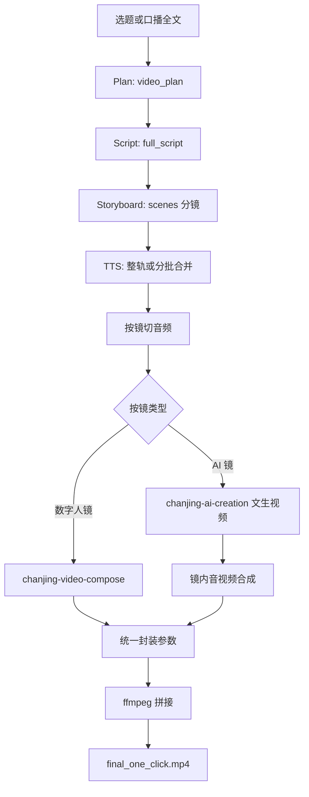

# chanjing-one-click-video-creation

## 1. 作用说明

本 skill 面向「**把选题或口播稿做成可发布的竖屏短视频**」：由 Agent（配合 `templates/` 提示词）或你自备的 `workflow.json`，串联 **蝉镜 TTS、数字人视频合成、AI 文生视频**，再经本机 **ffmpeg** 切段、对齐、拼接，得到**本地 mp4** 成片。

- **适合**：要成片、要口播 + 画面混剪（奇偶镜 / 文生提示词见 [`templates/storyboard-prompt.md`](./templates/storyboard-prompt.md)；速查 [`chanjing-one-click-video-creation-SKILL.md`](./chanjing-one-click-video-creation-SKILL.md)）。
- **不适合**：只要文案/标题、不要视频、或仅剪辑已有素材（不必走本流水线）。

**编排路由与跨产品边界**以 **[`chanjing-one-click-video-creation-SKILL.md`](./chanjing-one-click-video-creation-SKILL.md)** 为准；篇内 **§ 编号、速查表、`run_render` 输入输出**以 **本 `README.md`** 为长文真源。**文生 `ref_prompt`** 条文以 **[`storyboard-prompt.md`](./templates/storyboard-prompt.md)** / **[`history-storyboard-prompt.md`](./templates/history-storyboard-prompt.md)** 为准；**渲染技术规则与硬性约束**以 **[`templates/render-rules.md`](./templates/render-rules.md)** 为准。

---

## 2. 文档结构与各文件作用

| 文件路径 | 作用 |
|------|------|
| **[`chanjing-one-click-video-creation-SKILL.md`](./chanjing-one-click-video-creation-SKILL.md)** | **L3 唯一编排手册**（与 [`orchestration-contract.md`](../orchestration-contract.md) 约定一致）：场景目标、涉及产品、Agent 执行顺序；**不**重复 README 内 § 细则。 |
| **`README.md`（本文件）** | 人类 / Agent **§ 速查**：业务分层 §3.1、数字人与列表 §4、`ref_prompt` 指针 §4.2、Agent 通用模式 §5、`workflow.json` 契约 §6；流程图 §3.2。 |
| **`templates/*.md`** | Plan / Script / **文生 `ref_prompt` 真值**（`storyboard-prompt.md`、`history-storyboard-prompt.md`）/ 族裔约束 / **渲染规则**（`render-rules.md`）等；**渲染实现**与 `render-rules.md` 冲突时以 `render-rules.md` 为准。 |
| **`scripts/run_render.py`** | **确定性成片**：读 `workflow.json`，调子 skill（TTS、video-compose、ai-creation），写 `work/` 与 `final_one_click.mp4`；行为须符合 **`render-rules.md`**、**本 README §6** 与 **`examples/workflow-contract.md`**。 |
| **`scripts/validate_ai_resolution.py`** | **可选校验**：据 `person_id`+`figure_type` 调 `list_figures.py`（默认 **`--fetch-all`**，可用 **`--no-fetch-all`** 调试）取宽高，映射与 `run_render` 相同的 **`aspect_ratio`/`clarity`**；未匹配或占位符时用 **默认竖屏 1080×1920**。支持 `--check-ref-prompt` / `--strict`、`--try-both-sources`。 |
| **`examples/workflow-input.example.json`** | `run_render` 输入结构最小示例。 |
| **[`examples/workflow-contract.md`](./examples/workflow-contract.md)** | **题材无关**：`workflow.json` 根级与分镜字段与 `run_render.py` 的通用契约（实现真源为脚本）。 |
| **`tests/`** | 桩测试与测试用 ID 解析（可选 `chanjing_test_defaults.json`，**不**写 `.chanjing_test_ids.json` 缓存）；保障脚本与 JSON 结构，**不**承载业务规则。 |

### 模板模板（templates/）文件简介

| 文件路径 | 作用（主要角色） |
|----------|-----------------|
| **templates/video-brief-plan.md** | 视频策划结构 JSON 约束模板，要求 Agent 输出标准化 `video_plan` 字段结构（如 scene_count、core_angle、场景等）。|
| **templates/script-prompt.md** | 口播文案创作提示词模板：据策划输出口播全文（含 hook/正文/结尾收束句），口语化风格和结构详细要求都在此定义。|
| **templates/storyboard-prompt.md** | 分镜切段与奇偶镜、`scenes[]` 字段；当代画面 7 要素与 D.1b checklist，为每镜 `visual_prompt` / `ref_prompt` 奠基。 |
| **templates/history-storyboard-prompt.md** | 非当代/纪传/历史分镜模板：适配历史/非当代题材，突出时代/文明圈准确性与细节自洽。|
| **templates/visual-prompt-people-constraint.md** | 文生视频人物与族裔：**触发条件**下须在 `ref_prompt` 显式写入族裔锚定（本 skill 文档化的默认 profile 见该文件）；含身份动作刻画与推荐英文短语。|
| **templates/render-rules.md** | 渲染阶段唯一细则：技术规则（TTS/切段/数字人/AI/ffmpeg）、硬性约束、Render/成功状态与输出约定；`ref_prompt` 质检配合 **`storyboard-prompt.md`** / **`history-storyboard-prompt.md`**。|
| **templates/rewrite-hook-prompt.md** | Hook 优化提示词模板：可选，用于将初稿 hook 强化冲突感或反常识/代入感（便于算法抓取）。|

---

## 3. 业务逻辑与技术方案

### 3.1 逻辑概要

端到端可分为两层：

1. **内容层（Agent 或人工）**：输入选题或口播全文 → 产出 **`video_plan`**（**须含** **`presenter_gender`**、**`application_context`** 与 **`tone`**，见 **`video-brief-plan.md`**）、**`full_script`**、**`scenes[]` 分镜**（含每镜类型：数字人口播 / AI 画面、文案与 `ref_prompt` 等）。模板见 `templates/`；编排与两层分离见本 README **§5**；**`run_render` 可读字段**见 **§6** 与 **`examples/workflow-contract.md`**；**`ref_prompt`** 见 **`storyboard-prompt.md`** / **`history-storyboard-prompt.md`**；**切段与奇偶镜**见 **`storyboard-prompt.md`** 篇首；**镜数**见 **`video-brief-plan.md`**。**音色与公共数字人选型**须符合 **`render-rules.md` §3·C.2.5**。**首个数字人分镜**（`scene_id` 序首条 `use_avatar=true`）：`voiceover` **≤20 字**、口播目标 **3–5 秒**，由 **`run_render.py` 硬校验字数**（可用环境变量 `FIRST_DIGITAL_HUMAN_MAX_CHARS` 覆盖上限，默认 20）。默认 `execution_mode=non_interactive_render`，若未产出 mp4，不得降级为互动文案交付。
2. **渲染层**：对已定稿口播做 **TTS**（过长则按分镜合并少批次）→ **按镜切音频** → 数字人镜走 **video-compose（音频驱动）**，AI 镜走 **文生视频 + 与镜内音频合成** → 按公共数字人轨统一分辨率/帧率等 → **ffmpeg 顺序拼接** → 输出 **`final_one_click.mp4`** 与 **`workflow_result.json`**。细则见 **`templates/render-rules.md`**。

既可由 Agent **分步**调用各蝉镜 skill，也可在已有 `workflow.json` 时**只跑** `run_render.py`（见下节「环境与运行」）。

### 3.2 流程图

---

## 4. 数字人与音色（无环境变量默认）

`run_render.py` **不会**从环境变量读取默认音色、数字人 `person_id` 或 `figure_type`。每次成片须在 **`workflow.json` 根级**写明 **`audio_man`**、存在数字人镜时的 **`person_id`**（或 `avatar_id`）与 **`figure_type`**。请按当次 **`video_plan`** 与口播人设，调用 **`list_voices.py`** 与 **`list_figures.py`**（`--source` 与任务一致，如公共或定制），将返回的 ID 填入；勿依赖 shell/`export` 或仓库内跨任务的隐式「默认」记录。

**文案—公共音色—公共数字人（三角一致）**：先由 **`video_plan`**（含 `tone`、`presenter_gender`、`application_context` 等，见 **`templates/video-brief-plan.md`**）与 **`full_script`** 锚定叙述人设，再 **`list_voices.py --fetch-all`** 按主题/情感/场景选音色，最后 **`list_figures.py --source common --fetch-all`** 选公共数字人，使 **`gender` 与 `audio_man` 链路与文案一致**；细则见 **`templates/render-rules.md` §3·C.2.5**。

**公共数字人**可先 **`list_tag_dict.py`** 用标签大类/子标签（含 `weight`、`parent_id`、`level` 等）确定 **`tag_ids`**，再 **`list_figures.py --source common --tag-ids … --fetch-all`**；无标签筛选时仍须 **`list_figures.py --source common --fetch-all`**（或等价全量）后在**当前条件下的**完整列表上全局匹配，细则见 **`templates/render-rules.md` §3·C.3** 与 **`chanjing-video-compose-SKILL.md`**。

### 4.2 `ref_prompt` 与分镜模板指针（通用）

当代 / 非当代分镜结构、文生 **D.1** 质检与画幅一致等，以 **`templates/storyboard-prompt.md`**、**`templates/history-storyboard-prompt.md`** 为真值；**TTS / 切段 / ffmpeg** 等渲染实现约束以 **`templates/render-rules.md`** 为准。本 README **不**重复粘贴上述长条文。

---

## 5. Agent 通用执行模式（与选题无关）

适用于任意「内容 → `workflow.json` → `run_render`」任务，不绑定单一行业或叙事。

1. **两层分离**  
   - **内容层**：选题、口播、`video_plan`、`ref_prompt`、风格等——遵循 `templates/` 内提示词与质检；**可扩展 JSON 字段**供人读或宿主用，`run_render` 不解析的键不影响渲染。  
   - **渲染层**：仅消费 **[`examples/workflow-contract.md`](./examples/workflow-contract.md)** 所列契约字段 + 已有 L2 脚本；**不**在会话内重写 HTTP 客户端或列表逻辑。

2. **标准能力调用**  
   - 鉴权、拉音色、拉数字人、成片：**仅使用** `products/` 与 `orchestration/` 下已提供的脚本（如 `list_voices.py`、`list_tag_dict.py`、`list_figures.py`、`run_render.py`）。  
   - **反模式**：为「调一次 list API」临时写新的 Python 包装脚本；应用 CLI 参数组合替代。

3. **交付物**  
   - 一次任务一套 **`workflow.json`**（契约字段齐全）+ 明确 **`--output-dir`**；成片产物见包根 **`SKILL.md`「持久性变更范围」**。

---

## 6. `workflow.json` 字段速查

完整、与实现同步的表格见 **[`examples/workflow-contract.md`](./examples/workflow-contract.md)**。最小示例见 **[`examples/workflow-input.example.json`](./examples/workflow-input.example.json)**。

---
