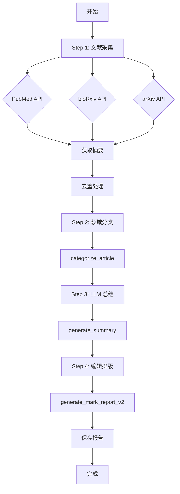

# 工作流指南

本文档详细描述每日科研日报的完整工作流程和执行逻辑。

## 整体流程图



## Step 1: 文献采集详解

### PubMed 采集逻辑

```python
def fetch_articles_with_abstracts(query, days_back=1, max_results=20):
    """从 PubMed EUtils 获取当天文献"""
    
    # 1. 构建日期范围查询
    date_from = (datetime.now() - timedelta(days=days_back)).strftime("%Y/%m/%d")
    date_to = datetime.now().strftime("%Y/%m/%d")
    
    # 2. ESrch 搜索文献 ID
    search_params = {
        "db": "pubmed",
        "term": f"({query}) AND ({date_from}[PDAT] : {date_to}[PDAT])",
        "retmax": max_results,
        "sort": "date"
    }
    
    # 3. EFetch 批量获取摘要
    fetch_params = {
        "db": "pubmed",
        "id": ",".join(id_list),
        "rettype": "abstract",
        "retmode": "xml"
    }
    
    return articles
```

**关键点：**
- 使用 `[PDAT]` 过滤发表日期
- 批量获取避免多次 API 调用
- 解析 XML 提取标题、作者、期刊等信息

### bioRxiv 采集逻辑

```python
def fetch_biorxiv_articles_with_abstracts(days_back=1, max_results=30):
    """从 bioRxiv REST API 获取预印本"""
    
    # 1. 日期范围 API
    api_url = f"https://api.biorxiv.org/details/biorxiv/{date_from}/{date_to}/0/json"
    
    # 2. 关键词过滤
    keywords = ["metagenomics", "fungal", "pathogen", "machine learning"]
    
    # 3. 分页获取
    while len(articles) < max_results:
        response = requests.get(next_url)
        collection = response.json()["collection"]
        
        for item in collection:
            if any(kw in item["title"].lower() for kw in keywords):
                articles.append(process_item(item))
```

**关键点：**
- `0/json` 表示从第一条开始
- 通过 `messages.total` 判断总数
- 每次最多获取 30 条（API 限制）

### arXiv 采集逻辑

```python
def fetch_arxiv_articles_with_abstracts(days_back=1, max_results=20):
    """从 arXiv Export API 获取论文"""
    
    # 1. 构建查询字符串
    submitted_date_filter = "submittedDate:[YYYYMMDD0000 TO YYYYMMDD2359]"
    query = quote(f"(cat:q-bio OR cat:cs.AI OR cat:cs.LG) AND {submitted_date_filter}")
    
    # 2. Atom API 请求
    url = f"http://export.arxiv.org/api/query?search_query={query}&max_results={max_results}"
    
    # 3. 解析 Atom XML
    ns = {'': 'http://www.w3.org/2005/Atom'}
    for entry in root.findall('entry', ns):
        title = entry.find('title', ns).text
        abstract = entry.find('summary', ns).text
        authors = [author.find('name', ns).text for author in entry.findall('author', ns)]
```

**关键点：**
- 关注类别：`q-bio`(生命科学) + `cs.AI/LG`(人工智能)
- 使用 `submittedDate` 过滤发布日期
- 结果按提交时间降序排列

---

## Step 2: 语义筛选详解

### 分类器逻辑

```python
def categorize_article(title, abstract):
    """根据标题和摘要对文献进行分类"""
    
    text = (title + " " + abstract).lower()
    categories = []
    
    for category, keywords in CATEGORY_KEYWORDS.items():
        if any(kw.lower() in text for kw in keywords):
            categories.append(category)
    
    return categories if categories else ["其他"]
```

**策略说明：**
- **简单关键词匹配**: 快速但可能误判
- **多标签允许**: 一篇文章可属于多个领域
- **"其他"兜底**: 确保所有文章都有分类

### 重点推荐评分系统

```python
def score_article(article):
    """优先级评分算法"""
    score = 0
    
    journal = article.get("journal", "").lower()
    title = article.get("title", "").lower()
    abstract = article.get("abstract", "").lower()
    
    # 高影响力期刊加分
    high_impact = ["nature", "science", "cell", "genome biology"]
    if any(hij in journal for hij in high_impact):
        score += 10
    
    # 方法开发加分
    method_keywords = ["method", "tool", "pipeline", "algorithm"]
    if any(mk in title or mk in abstract for mk in method_keywords):
        score += 5
    
    # 热门话题加分
    hot_topics = ["single-cell", "deep learning", "transformer", "foundation model"]
    if any(ht in title or ht in abstract for ht in hot_topics):
        score += 3
    
    return score
```

**推荐理由：**
- 优先展示高影响力期刊论文
- 重视方法学工具类文章
- 跟踪当前最热门的研究方向

---

## Step 3: LLM 总结详解

### 结构化总结生成

```python
def generate_summary(abstract, title, categories):
    """基于摘要生成 100-250 字中文格式总结"""
    
    summary_parts = []
    
    # 1. 提取研究目的
    purpose_match = re.search(r"we developed|we present|this study", abstract, re.IGNORECASE)
    if purpose_match:
        purpose = abstract[purpose_match.start():purpose_match.end()+100]
        summary_parts.append(f"【研究目的】{purpose}")
    
    # 2. 提取方法技术
    method_match = re.search(r"using|based on|by", abstract, re.IGNORECASE)
    if method_match:
        method = abstract[max(0, method_match.start()-20):method_match.end()+80]
        summary_parts.append(f"【方法】{method}")
    
    # 3. 提取主要发现
    result_match = re.search(r"results show|demonstrate|found that", abstract, re.IGNORECASE)
    if result_match:
        result = abstract[result_match.start():result_match.end()+120]
        summary_parts.append(f"【研究结果】{result}")
    
    # 如果没有提取到足够信息，取摘要前 200 字符
    if len(summary_parts) < 2:
        summary_parts = [' '.join(abstract.split()[:20])]
    
    return " ".join(summary_parts)[:250] + "..."
```

**优化策略：**
- 使用正则表达式精准定位关键句
- 添加 `【】` 标签增强可读性
- 长度控制在 250 字以内

---

## Step 4: 编辑排版详解

### Markdown 模板结构

```markdown
# 📚 每日文献速递 - 2026-02-26

## 📰 编辑前言
- 总文献数统计
- 来源分布饼图文字版
- 热点领域概览

## ⭐ 重点推荐 (8 篇)
每篇包含：
- 标题
- 分类标签
- 作者 + 期刊 + 日期
- DOI 链接
- 核心总结

## 📖 完整文献列表
按来源分组，包含：
- 标题
- 作者列表
- 期刊名称
- 发表日期
- DOI/URL
- 简短摘要

## 📝 编辑总结
- 今日趋势分析（图表化文字描述）
- 编者点评
- 关注建议
```

### 去重逻辑

```python
seen_titles = set()
unique_articles = []

for article in all_articles:
    # 规范化标题（去除标点符号）
    title_norm = re.sub(r'[^\w]', '', article["title"].lower())
    
    if title_norm and title_norm not in seen_titles:
        seen_titles.add(title_norm)
        unique_articles.append(article)
```

**去重依据：**
- 基于标题规范化（忽略大小写和标点）
- 保留最先出现的版本
- 避免因多源收录导致重复

