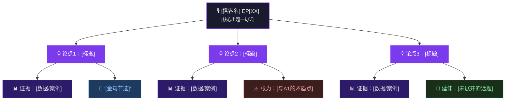
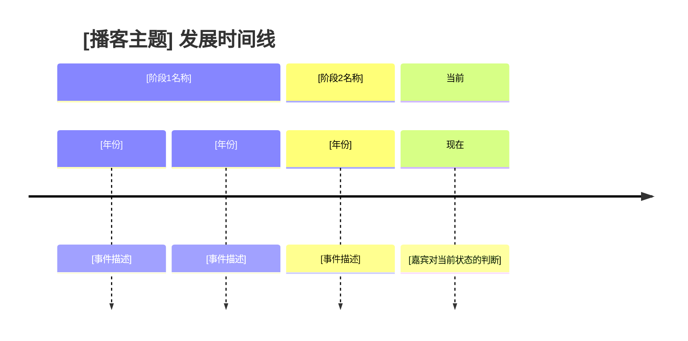
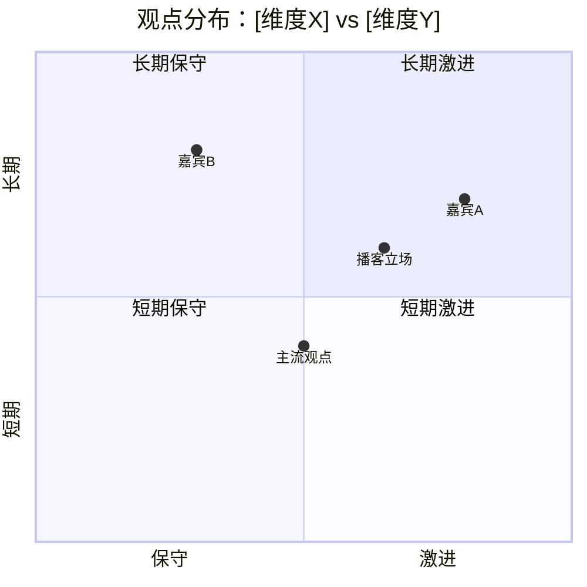
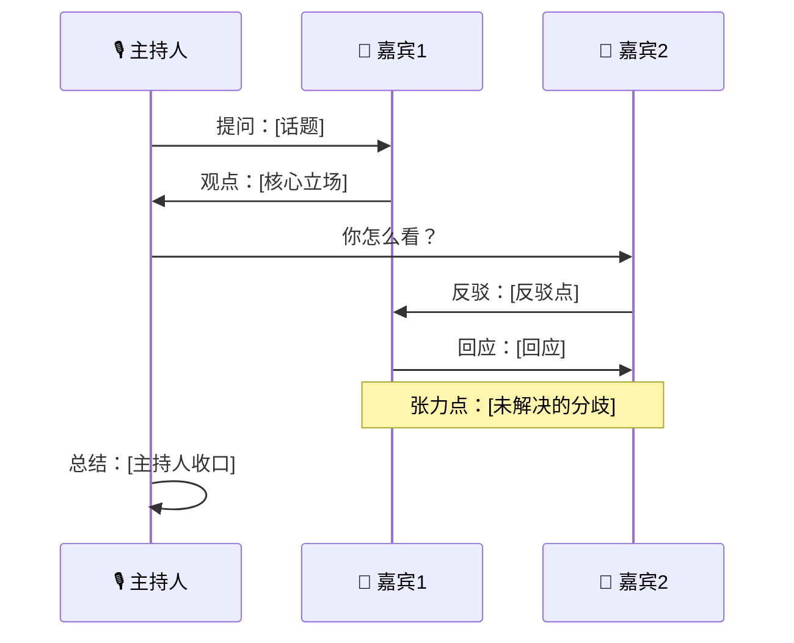

# Mermaid 模板库 — 播客可视化

## 模板 1：单期论点结构图（graph TD）

适用：解析单期播客的核心论点层次



---

## 模板 2：多期知识关联图（graph LR）

适用：显示多期播客之间的概念流动与关联

```mermaid
graph LR
    subgraph EP01["📻 EP01 [主题]"]
        C1["概念A"] 
        C2["概念B"]
    end
    
    subgraph EP02["📻 EP02 [主题]"]
        C3["概念C"]
        C4["概念D"]
    end
    
    subgraph EP03["📻 EP03 [主题]"]
        C5["概念E"]
        C6["概念F"]
    end
    
    C1 -->|"深化"| C3
    C2 -->|"应用"| C5
    C3 -->|"反驳"| C6
    C4 -->|"前提"| C6
    C1 -.->|"隐含关联"| C4
    
    style EP01 fill:#1a1a2e,stroke:#7c3aed
    style EP02 fill:#1a1a2e,stroke:#2563eb
    style EP03 fill:#1a1a2e,stroke:#059669
```



---

## 模板 3：时间线图（timeline）

适用：播客讨论历史事件、发展阶段



---

## 模板 4：观点对比象限图（quadrantChart）

适用：比较嘉宾观点、分析不同立场



---

## 模板 5：嘉宾对话流程图（sequenceDiagram）

适用：记录嘉宾之间的论辩结构



---

## 模板 6：概念mind map（mindmap）

适用：梳理单个核心概念的全貌

```mermaid
mindmap
  root((**[核心概念]**))
    定义
      [定义1]
      [定义2]
    应用场景
      [场景A]
      [场景B]
    相关概念
      [[概念X]]
      [[概念Y]]
    争议点
      [争议1]
      [争议2]
    推荐资源
      [书/文章]
```

---

## 使用指引

1. 选择最匹配内容结构的模板
2. 将 `[占位符]` 替换为实际内容
3. 单期通常用模板 1 或 5
4. 多期研究用模板 2
5. 有历史背景时加入模板 3
6. 观点分歧明显时加入模板 4