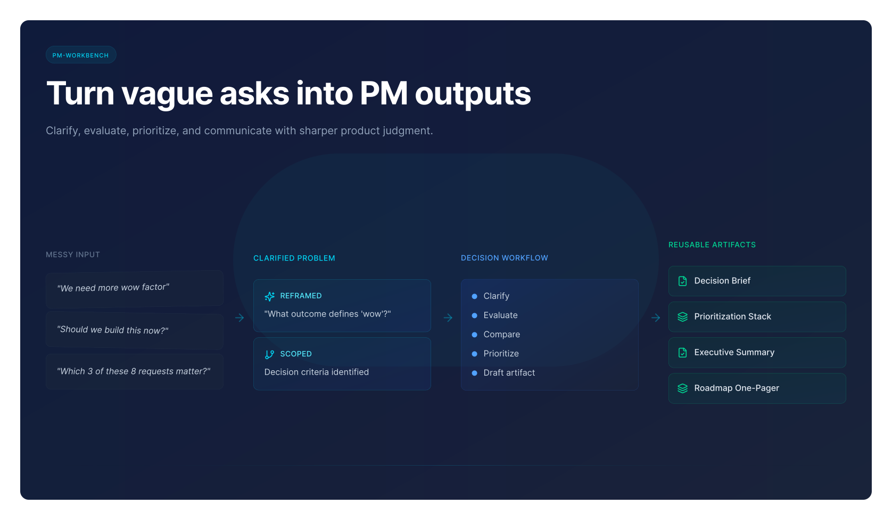
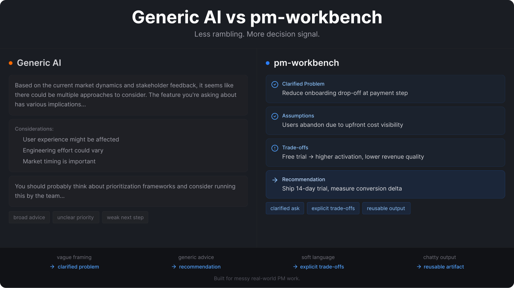
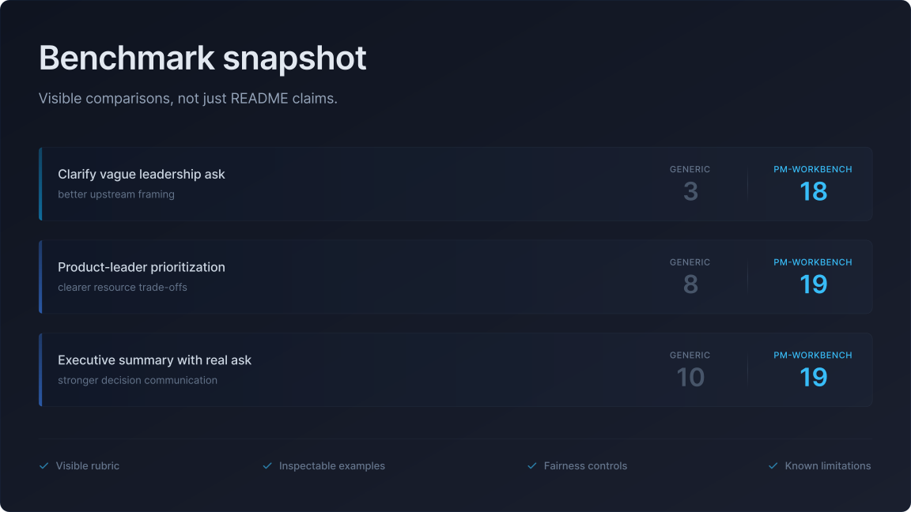
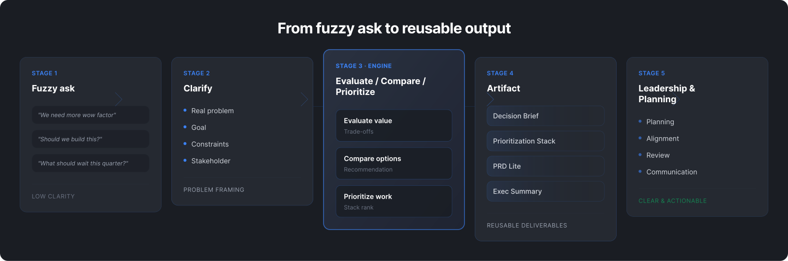

# pm-workbench

> **Turn vague product asks into clear PM outputs people can actually use.**

`pm-workbench` is an OpenClaw skill for PMs, product leaders, and founders who need clearer product judgment under messy real-world constraints.
It is built for the work between **“someone asked for something”** and **“we need a recommendation, reusable output, or next move we can stand behind.”**

**Current release target:** `v1.1.3`  
**Language:** [English](./README.md) | [简体中文](./README.zh-CN.md)

## Start here if you only have 3 minutes

If you are about to copy this to another machine — including a fresh Windows setup — do not overthink the first run.
The shortest path is still:

1. copy `pm-workbench/` into your OpenClaw `skills` directory
2. run `npm run validate`
3. run `openclaw skills check`
4. try one real PM prompt

Then decide whether you want to keep tuning or publish.

### What this is

A workflow skill for turning ambiguity into **decisions, reusable outputs, and explicit trade-offs**.

### Best fit

- PMs handling messy asks
- product leaders making priority or resource calls
- founders needing sharper product / business trade-offs

### Try these 3 prompts first

1. **Vague leadership ask**  
   “My boss said our AI product needs more wow factor. Help me unpack what that actually means.”
2. **Quarterly prioritization**  
   “We only have room for 3 of these 8 requests next quarter. Help me prioritize them and explain what waits.”
3. **Founder / product path trade-off**  
   “Help me choose between a fast marketable AI layer and a slower trust-building product path.”

### Why install this instead of asking a generic model directly?

`pm-workbench` is **not** a PM theory pack or prompt pile. It is an OpenClaw-native PM workbench designed to:

- clarify the upstream problem first
- ask only the missing questions that change the decision
- force explicit trade-offs and “not now” calls
- shape outputs into reusable PM artifacts instead of polished rambling

If you want the shortest path, go here:

- [START_HERE](START_HERE.md)
- [3-minute quick start](docs/TRY-IN-3-MINUTES.md)
- [Scenario Router](docs/SCENARIO-ROUTER.md)
- [10 real entry prompts](docs/10-REAL-ENTRY-PROMPTS.md)
- [Command-style combinations](docs/COMMANDS.md)
- [Try 3 prompts in 10 minutes](docs/TRY-3-PROMPTS.md)



## Why this feels different

Most AI tools can talk about product work.
`pm-workbench` is designed to help you get to a usable next step.

It has a few deliberate habits:

- it routes by the **actual PM job to be done**, not by abstract framework recital
- when the ask is still fuzzy, it helps get the problem frame right before moving into the right workflow
- it asks for **only the missing context that would materially change the recommendation**
- it prefers **artifacts you can reuse in meetings, reviews, and leadership syncs**
- it makes **trade-offs, assumptions, risks, and “not now” calls** explicit
- it works for both **single-feature PM work** and **product-leader / founder decision work**
- it includes a **benchmark layer** so visitors can inspect side-by-side differences versus generic AI



## Benchmark snapshot

This repo includes a visible proof layer, not just positioning copy.



Illustrative worked-example totals using the repo rubric:

- **Clarify vague leadership ask:** generic AI `3` vs `pm-workbench 18`
- **Product-leader prioritization:** generic AI `8` vs `pm-workbench 19`
- **Executive summary with real ask:** generic AI `10` vs `pm-workbench 19`

Why this matters:

- the repo shows differentiation across **upstream framing**, **portfolio prioritization**, and **leadership communication**
- visitors can inspect the comparison chain instead of relying on README claims
- the benchmark now documents **fairness controls** and **known limitations**, not just self-scoring

Start here:

- [Benchmark kit](benchmark/README.md)
- [Command benchmark guide](benchmark/command-benchmark-guide.md)
- [Benchmark contribution guide](benchmark/CONTRIBUTING-BENCHMARKS.md)
- [Share-friendly benchmark card](docs/images/pm-workbench-benchmark-card.svg)

## The core product logic

`pm-workbench` is built around a simple idea:

**Fuzzy ask → Clarify → Evaluate / Compare / Prioritize → Artifact → Leadership communication / planning / alignment**



This matters because a lot of PM work fails at the upstream handoff:

- vague asks turn into vague discussion
- solution ideas arrive before the problem is clear
- feature evaluation becomes opinion trading
- prioritization becomes politics or scorecard theater
- roadmap reviews hide what is intentionally _not_ being done
- leadership summaries bury the actual conclusion

`pm-workbench` is designed to reduce those failure modes.

## What you get

If the user is still figuring out what kind of product problem this is, the skill can help frame it first, then move into the right workflow and output.

### Not only single workflows

`pm-workbench` is not limited to one workflow at a time.
For recurring PM jobs that naturally span multiple steps, it also supports **command-style combinations** — compact cross-workflow paths such as:

- clarify -> evaluate
- clarify -> compare
- prioritize -> roadmap -> exec summary
- PRD -> metrics -> exec summary

That matters because a lot of real PM work is not one prompt deep.
It is a short sequence: frame the problem, make the call, then turn it into something reusable.

Start here:

- [Command-style combinations](docs/COMMANDS.md)

### 9 workflow paths

| PM job                             | Workflow                 | Default output shape        |
| ---------------------------------- | ------------------------ | --------------------------- |
| Clarify a fuzzy ask                | `clarify-request`        | Request Clarification Brief |
| Judge whether to do something      | `evaluate-feature-value` | Feature Evaluation Memo     |
| Choose between options             | `compare-solutions`      | Decision Brief              |
| Rank competing work                | `prioritize-requests`    | Prioritization Stack        |
| Draft a lightweight spec           | `draft-prd`              | PRD Lite                    |
| Turn priorities into a staged plan | `build-roadmap`          | Roadmap One-Pager           |
| Define success measurement         | `design-metrics`         | Metrics Scorecard           |
| Prepare upward communication       | `prepare-exec-summary`   | Executive Summary           |
| Learn from a launch / initiative   | `write-postmortem`       | Postmortem Lite             |

### Reusable output shapes

This repo does not stop at “analysis.”
It includes reusable PM templates under `references/templates/` so the skill naturally shapes outputs into things a PM can actually use.

Current built-in template library:

- Request Clarification Brief
- Feature Evaluation Memo
- Decision Brief
- Prioritization Stack
- PRD Lite
- Roadmap One-Pager
- Metrics Scorecard
- Executive Summary
- Postmortem Lite
- Portfolio Review Summary
- Head of Product Operating Review
- Founder Business Review

### Anti-template by design

A template is a delivery choice, **not** a substitute for judgment.

This repo explicitly tries to avoid template theater:

- do **not** fill every section mechanically
- skip sections that add no decision value
- sharpen the conclusion before expanding the structure
- when speed matters, prefer a sharp compressed artifact over a bloated “complete” one

The goal is not to output something that merely **looks like a PM doc**.
The goal is to output something that can actually **help a decision, alignment, or review move forward**.

### Benchmark and trust layer

This repo includes a concrete proof layer under [`benchmark/`](benchmark/README.md):

- realistic PM scenarios
- a comparison rubric
- a reusable scorecard
- worked comparison artifacts with fuller evidence chains
- higher-pressure worked examples for launch readiness and mixed-signal diagnosis
- fairness-control notes
- known benchmark limitations
- a benchmark contribution guide
- README-ready visual summary assets

It also includes a lightweight local validation script so the repo can check its own structural integrity:

```bash
cd skills/pm-workbench
npm run validate
```

What the validate script actually checks:

- required repo structure exists
- workflow / template / command wiring is not broken
- command workflow chains point to real workflows
- important docs and onboarding paths still link to real files
- benchmark assets and proof-entry docs are present
- example coverage is still wired correctly
- README / Chinese README / changelog / package version are still aligned

That is not glamorous, but it matters. Repos feel more trustworthy when they can verify more than prose.

## High-tension case studies

If you want to understand the difference fast, start with these:

- [Boss says the product needs more wow factor](examples/15-case-study-boss-wow-factor.md)
- [Ops wants an AI gimmick feature, PM is unconvinced](examples/16-case-study-gimmick-feature.md)
- [8 requests, only 3 fit next quarter](examples/17-case-study-quarterly-priority-conflict.md)

These are intentionally more conflict-heavy than standard format examples.
They are there to show where the skill should outperform generic AI:

- messy stakeholder input
- hidden assumptions
- real trade-offs
- explicit non-decisions

## Examples that show correction, not just output

A good PM workbench should not only answer clean prompts.
It should also **repair bad prompts**.

Start here:

- [Bad input → clarified problem framing](examples/18-bad-input-reframed.md)
- [Bad priority request → defendable priority stack](examples/19-bad-priority-input-corrected.md)

## Higher-pressure leader examples

If you want to see where the repo is now aiming to feel more like a real product-leadership workbench, start here:

- [Launch readiness call under pressure](examples/20-launch-readiness-call.md)
- [Mixed signals operating review](examples/21-mixed-signals-operating-review.md)

These are useful for testing whether the skill can:

- make a condition-based recommendation under uncertainty
- explain what not to do, not just what to do
- synthesize mixed signals into a real next focus

## Install and use

### Option 1 — use the source folder directly

This is the easiest and most transparent path.

#### 3-step install path

1. **Copy**
   - Clone or copy this repository.
   - Place the `pm-workbench` folder under your OpenClaw skills workspace.
2. **Validate**

   ```bash
   cd skills/pm-workbench
   npm run validate
   ```

3. **Confirm recognition**

   ```bash
   openclaw skills check
   ```

Then start with a real PM prompt.

If you prefer, you can also send a one-line install request to your Agent and let it adapt the steps to your setup.
That Agent can be OpenClaw or any other AI assistant you already use.

Example:

> Please install this skill: <project link>, and adapt the installation method to my current environment.

If you want the short install checklist, use:

- [Install checklist](docs/INSTALL-CHECKLIST.md)

Notes:

- this repo is designed as a **source-first OpenClaw skill**
- local recognition can depend on your OpenClaw version and skill-path configuration
- `npm run validate` is the most reliable first check that the repo itself is structurally sound before debugging local discovery

### Option 2 — use a packaged `.skill`

If your environment already produces or distributes packaged OpenClaw skills, this repo is structured cleanly enough for that path too.
But the default recommendation is still: **start from source, validate fast, then customize.**

## First prompts to try

- “Help me unpack this request before we jump to solutions.”
- “Should we build this feature, or is it not worth doing now?”
- “Compare these two directions and recommend one.”
- “Turn this into a one-page exec summary for leadership.”
- “Help me prioritize this quarter and say what should wait.”
- “Help me write a lightweight postmortem from this launch result.”

## In scope vs out of scope

### In scope

- PM judgment
- product decision framing
- prioritization and leadership communication
- reusable PM outputs
- founder / product-leader product-business trade-offs

### Out of scope

- raw data-heavy analytics
- deep project or program tracking
- legal or compliance review
- general business operations tooling
- tasks where data crunching matters more than product judgment

This boundary is deliberate.
The repo gets weaker if it tries to become a generic operating system for all business work.

## Repository structure

```text
pm-workbench/
├── SKILL.md
├── README.md
├── CHANGELOG.md
├── CONTRIBUTING.md
├── ROADMAP.md
├── package.json
├── benchmark/      # scenarios, rubric, scorecard, worked examples
├── docs/           # onboarding, quick-start, visuals, product-leader guide
├── examples/       # reusable PM and product-leader examples
├── references/
│   ├── workflows/  # workflow behavior specs
│   └── templates/  # default artifact shapes
└── scripts/
    └── validate-repo.js
```

Current repo snapshot:

- 9 workflow references
- 12 templates
- 5 command-style combinations
- 23 examples
- benchmark kit with baseline, higher-pressure scenarios, and command proof assets

## What to read next

- **Start here:** [START_HERE.md](START_HERE.md)
- **3-minute quick start:** [docs/TRY-IN-3-MINUTES.md](docs/TRY-IN-3-MINUTES.md)
- **Install checklist:** [docs/INSTALL-CHECKLIST.md](docs/INSTALL-CHECKLIST.md)
- **Quick start:** [docs/GETTING-STARTED.md](docs/GETTING-STARTED.md)
- **Scenario router:** [docs/SCENARIO-ROUTER.md](docs/SCENARIO-ROUTER.md)
- **10 real entry prompts:** [docs/10-REAL-ENTRY-PROMPTS.md](docs/10-REAL-ENTRY-PROMPTS.md)
- **Command-style combinations:** [docs/COMMANDS.md](docs/COMMANDS.md)
- **Try it fast:** [docs/TRY-3-PROMPTS.md](docs/TRY-3-PROMPTS.md)
- **Benchmark kit:** [benchmark/README.md](benchmark/README.md)
- **Command benchmark guide:** [benchmark/command-benchmark-guide.md](benchmark/command-benchmark-guide.md)
- **Benchmark contribution guide:** [benchmark/CONTRIBUTING-BENCHMARKS.md](benchmark/CONTRIBUTING-BENCHMARKS.md)
- **Product leader guide:** [docs/PRODUCT-LEADER-PLAYBOOK.md](docs/PRODUCT-LEADER-PLAYBOOK.md)
- **Examples:** [examples/README.md](examples/README.md)
- **How to contribute:** [CONTRIBUTING.md](CONTRIBUTING.md)
- **Where the skill is going:** [ROADMAP.md](ROADMAP.md)

## Validation and quality bar

This repo is being built with a simple quality bar:

- the main `SKILL.md` stays concise and routing-oriented
- detailed behavior lives in workflow references
- reusable output shapes live in templates
- examples should show realistic PM usage, not just abstract format descriptions
- docs should reduce adoption friction for someone discovering the repo cold
- benchmark assets should make side-by-side comparison possible
- local validation should catch obvious structural drift early
- install and pre-release checks should be easy to follow for source-first use

Local verification completed for the repo structure:

- `npm run validate` -> **passes locally**
- validation confirms the expected workflow, template, example, and benchmark wiring is present
- OpenClaw skill recognition may vary by local version and skill-path configuration

## Contributing

If you want to improve the skill, do it in a product-minded way:

- strengthen judgment quality, not just template volume
- prefer outputs that help real PM work move forward
- add examples when adding new workflows or templates
- keep claims in docs honest and easy to verify
- use benchmark scenarios to challenge the repo, not just flatter it

Start here: [CONTRIBUTING.md](CONTRIBUTING.md)

## Roadmap

Short version:

- strengthen trust with harder evidence and fairer benchmark framing
- sharpen the 3 highest-signal workflows first
- reduce cold-start friction for new visitors
- deepen product-leader / founder trade-off support without losing focus
- expand only after the core judgment layer gets sharper

See the fuller plan in [ROADMAP.md](ROADMAP.md).

## Bottom line

`pm-workbench` is for PMs who do not need more theory theater.
They need help turning ambiguity into:

- a clearer problem
- a stronger recommendation
- a reusable output
- a better decision
