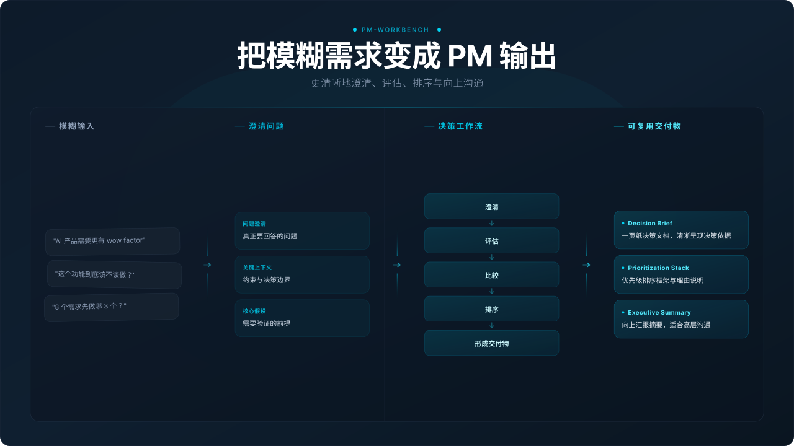
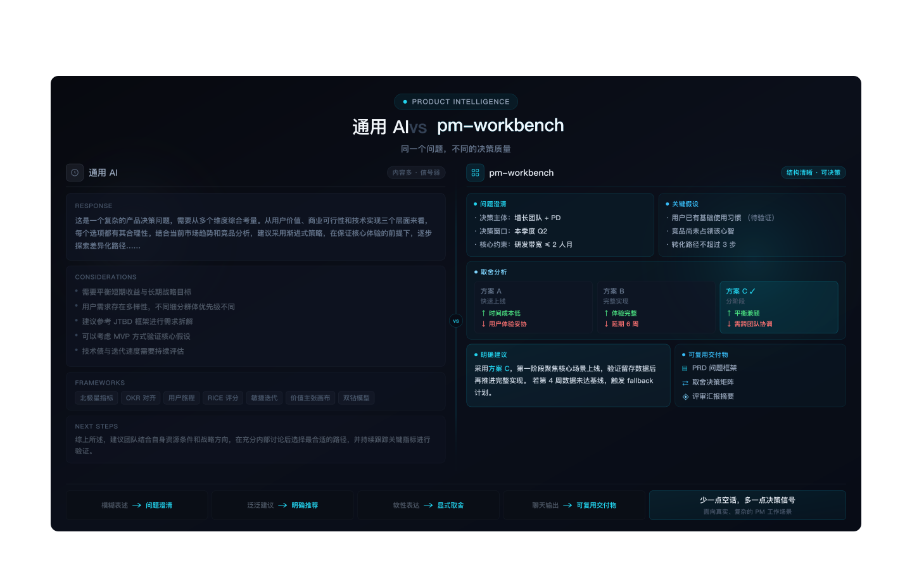
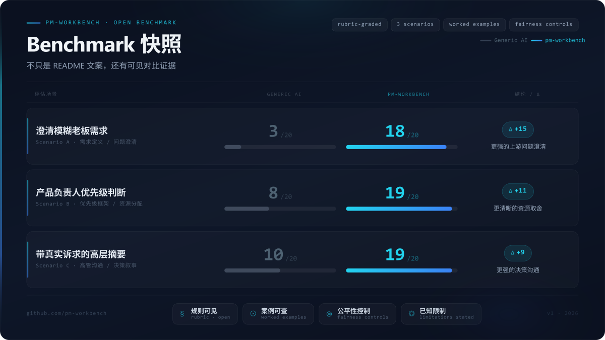
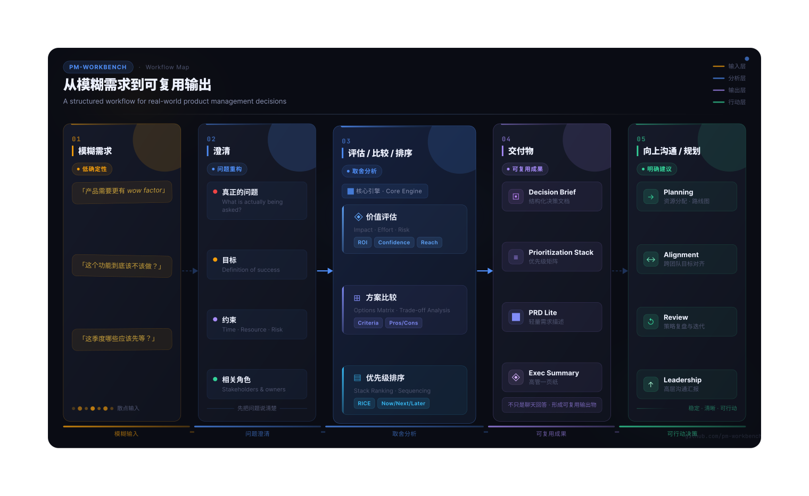

# pm-workbench

> **把模糊的产品需求，转成团队真能拿去用的 PM 输出。**

**语言切换：** [English](./README.md) | [简体中文](./README.zh-CN.md)

`pm-workbench` 是一个面向 PM、产品负责人和创始人的 OpenClaw skill，专门用于在复杂、模糊、现实约束很多的产品场景里，提升产品判断质量。

它解决的是这段最容易失真的工作链路：
**“有人提了个需求” → “我们需要一个能站得住的建议、输出物或下一步行动”**。

**当前发布目标：** `v1.1.3`

## 如果你只有 3 分钟，先看这里

如果你准备把它复制到另一台机器——包括一台新的 Windows 环境——第一轮不要想复杂。
最短路径就是这 4 步：

1. 把 `pm-workbench/` 放进 OpenClaw 的 `skills` 目录
2. 运行 `npm run validate`
3. 运行 `openclaw skills check`
4. 用一个真实 PM 问题试一下

先确认它正常工作，再决定要不要继续调整或准备发布。


### 这是什么

一个把模糊问题转成**明确判断、可复用输出物和清晰取舍**的工作流型 skill。

### 最适合谁

- 需要处理模糊需求的 PM
- 需要做优先级和资源判断的产品负责人
- 需要做产品 / 商业取舍的创始人

### 先试这 3 个提示词

1. **模糊的老板需求**  
   “老板说我们的 AI 产品要更有 wow factor。你帮我拆一下这句话到底意味着什么。”
2. **季度优先级排序**  
   “下季度 8 个需求只能做 3 个，帮我排优先级，并说清楚哪些先不做。”
3. **产品路径取舍**  
   “帮我在一个更快、更好卖的 AI 外挂方案和一个更慢、但更能建立信任的产品路径之间做选择。”

### 为什么不直接问通用模型？

`pm-workbench` **不是** PM 理论手册，也不是提示词合集。它更像一个 OpenClaw 原生的 PM 工作台，重点在于：

- 先澄清上游问题，而不是直接跳方案
- 只追问真正会改变判断的缺失信息
- 强制把 trade-off 和“现在不做什么”说清楚
- 把输出整理成可复用的 PM 交付物，而不是表面漂亮的空话

如果你想最快上手，先看：

- [START_HERE](START_HERE.md)
- [3 分钟快速体验](docs/TRY-IN-3-MINUTES.md)
- [场景选路器](docs/SCENARIO-ROUTER.md)
- [10 个真实入口提示词](docs/10-REAL-ENTRY-PROMPTS.md)
- [组合流程命令](docs/COMMANDS.md)
- [10 分钟试 3 个提示词](docs/TRY-3-PROMPTS.md)



## 为什么它和普通 AI 工具不太一样

大多数 AI 工具都能“聊产品”。
`pm-workbench` 的目标不是聊得像，而是帮你更快得到一个可用的下一步。

它有几个刻意设计的习惯：

- 按**真实 PM 任务类型**路由，而不是按框架背诵路由
- 当问题仍然模糊时，先帮助你把问题框清楚，再进入对应 workflow
- 只追问**会实质改变建议**的上下文
- 更偏向输出**能复用到会议、评审、对齐场景里的交付物**
- 会显式写出**取舍、假设、风险和“不做什么”**
- 同时覆盖**单点功能 PM 工作**与**产品负责人 / 创始人级判断**
- 带有一个**benchmark 证明层**，方便访客直接对比它与通用 AI 的差异

## Benchmark 快照

这个仓库不只是宣传文案，它还带了一层可见的“证明机制”。

示例评分（基于仓库中的 rubric）：

- **澄清模糊老板需求：** generic AI `3` vs `pm-workbench 18`
- **产品负责人优先级排序：** generic AI `8` vs `pm-workbench 19`
- **带真实诉求的高层摘要：** generic AI `10` vs `pm-workbench 19`

为什么这很重要：

- 仓库展示的是 **上游问题澄清、组合优先级判断、向上沟通** 三类差异
- 访客可以直接检查比较链路，而不是只能相信 README 的自我描述
- benchmark 也明确写了**公平性控制**和**已知限制**，不只是自我打分

从这里开始：

- [Benchmark 套件](benchmark/README.md)
- [command benchmark 指南](benchmark/command-benchmark-guide.md)
- [Benchmark 贡献指南](benchmark/CONTRIBUTING-BENCHMARKS.md)
- [适合分享的 benchmark 卡片](docs/images/pm-workbench-benchmark-card.svg)





## 核心产品逻辑

`pm-workbench` 基于一个很简单的链路：

**模糊需求 → 澄清 → 评估 / 比较 / 排序 → 形成交付物 → 向上沟通 / 规划 / 对齐**



这很重要，因为很多 PM 工作都死在上游交接阶段：

- 模糊需求只会带来模糊讨论
- 问题还没澄清，方案就先来了
- 功能评估变成观点互打
- 优先级排序变成政治游戏或打分卡表演
- roadmap 评审把“明确不做什么”藏起来
- 高层摘要把真正结论埋掉

`pm-workbench` 就是为了减少这些失败模式。

## 你能得到什么

如果用户还不确定自己面对的是哪类产品问题，这个 skill 会先帮他框问题，再进入合适的 workflow 与输出形式。

### 不只是单条 workflow

`pm-workbench` 不只支持“一次走一条 workflow”。
对于那些天然跨多个步骤的真实 PM 任务，它也支持 **command-style 的组合路径**，比如：

- clarify -> evaluate
- clarify -> compare
- prioritize -> roadmap -> exec summary
- PRD -> metrics -> exec summary

这点很重要，因为很多真实 PM 工作并不是“一句 prompt 就结束”。
它更像一小段链路：先把问题框清楚，再做判断，最后整理成能复用的输出。

从这里开始：

- [组合流程命令（英文）](docs/COMMANDS.md)
- [组合流程命令（中文）](docs/COMMANDS.zh-CN.md)

### 9 条 workflow 路径

| PM 工作类型 | Workflow | 默认输出形式 |
| --- | --- | --- |
| 澄清模糊需求 | `clarify-request` | Request Clarification Brief |
| 判断一件事值不值得做 | `evaluate-feature-value` | Feature Evaluation Memo |
| 比较多个方案 | `compare-solutions` | Decision Brief |
| 给一组事项排优先级 | `prioritize-requests` | Prioritization Stack |
| 起草轻量规格说明 | `draft-prd` | PRD Lite |
| 把优先级转成分阶段计划 | `build-roadmap` | Roadmap One-Pager |
| 设计成功指标 | `design-metrics` | Metrics Scorecard |
| 准备向上沟通材料 | `prepare-exec-summary` | Executive Summary |
| 复盘上线 / 项目结果 | `write-postmortem` | Postmortem Lite |

### 可复用的输出物

这个仓库不止停留在“分析”。
它在 `references/templates/` 下提供了一组可复用 PM 模板，让 skill 天然更容易输出成真正能用的交付物。

当前内置模板包括：

- Request Clarification Brief
- Feature Evaluation Memo
- Decision Brief
- Prioritization Stack
- PRD Lite
- Roadmap One-Pager
- Metrics Scorecard
- Executive Summary
- Postmortem Lite
- Portfolio Review Summary
- Head of Product Operating Review
- Founder Business Review

### 反模板化设计

模板只是交付形式，**不能替代判断本身**。

这个仓库刻意避免“模板表演”：

- **不要**机械地填完每一栏
- 对判断没有帮助的部分可以跳过
- 先把结论打磨清楚，再扩展结构
- 如果追求速度，宁可交一个锋利的压缩版，也不要交一份臃肿的“完整文档”

目标不是产出一个“看起来像 PM 文档”的东西。
目标是产出一个**真的能推动决策、对齐或评审继续往前走**的东西。

## 安装与使用

### 方案 1：直接使用源代码目录

这是最简单、也最透明的方式。

#### 3 步安装路径

1. **复制仓库**
   - Clone 或复制这个仓库
   - 把 `pm-workbench` 文件夹放到你的 OpenClaw skills 工作区下
2. **校验仓库**

   ```bash
   cd skills/pm-workbench
   npm run validate
   ```

3. **确认已识别**

   ```bash
   openclaw skills check
   ```

然后直接用一个真实 PM 问题开始。

如果你想走更短路径，也可以直接让你的 Agent 帮你安装，并根据你的本地环境调整步骤。

示例：

> Please install this skill: <project link>, and adapt the installation method to my current environment.

如果你只想看简版清单，请用：

- [安装检查清单](docs/INSTALL-CHECKLIST.md)

说明：

- 这个仓库默认是一个 **source-first OpenClaw skill**
- 本地是否能识别，也和你的 OpenClaw 版本、skill 路径配置有关
- 在排查发现问题之前，`npm run validate` 是最可靠的第一步

### 方案 2：使用打包后的 `.skill`

如果你的环境本来就支持打包分发 OpenClaw skills，这个仓库的结构也足够规整，可以支持这条路径。
但默认建议仍然是：**先从 source 开始，快速验证，再按需定制。**

## 推荐先试的提示词

- “在我们跳进方案之前，先帮我把这个需求讲清楚。”
- “这个功能值得现在做吗，还是不值得？”
- “比较这两个方向，并给出推荐。”
- “把这些内容整理成一页给管理层看的 exec summary。”
- “帮我给这个季度排优先级，并说清楚哪些应该先等。”
- “帮我基于这次上线结果写一个轻量 postmortem。”

## 范围边界

### 适合处理

- PM judgment
- 产品决策澄清
- 优先级与向上沟通
- 可复用的 PM 输出物
- 创始人 / 产品负责人层面的产品与商业取舍

### 不适合处理

- 重数据分析型问题
- 深度项目 / 项目群跟踪
- 法务或合规审查
- 通用业务运营工具型工作
- 那些数据 crunching 比产品判断更重要的任务

这个边界是刻意设计的。
如果它试图变成所有业务工作的通用操作系统，反而会变弱。

## 仓库结构

```text
pm-workbench/
├── SKILL.md
├── README.md
├── README.zh-CN.md
├── CHANGELOG.md
├── CONTRIBUTING.md
├── ROADMAP.md
├── package.json
├── assets/
│   └── readme/
│       ├── en/      # English README image assets
│       └── zh-CN/   # 中文 README 配图资源
├── benchmark/      # 场景、rubric、scorecard、worked examples
├── docs/           # onboarding、quick start、visuals、产品负责人指南
├── examples/       # 可复用 PM 与产品负责人案例
├── references/
│   ├── workflows/  # workflow 行为规范
│   └── templates/  # 默认输出物结构
└── scripts/
    └── validate-repo.js
```

当前仓库快照：

- 9 条 workflow reference
- 12 个 template
- 5 条组合流程命令
- 23 个 example
- 一套包含基础对比、高压场景与 command proof 的 benchmark 资产

## 接下来读什么

- **先从这里开始：** [START_HERE.md](START_HERE.md)
- **3 分钟快速体验：** [docs/TRY-IN-3-MINUTES.md](docs/TRY-IN-3-MINUTES.md)
- **安装检查清单：** [docs/INSTALL-CHECKLIST.md](docs/INSTALL-CHECKLIST.md)
- **快速入门：** [docs/GETTING-STARTED.md](docs/GETTING-STARTED.md)
- **场景选路器：** [docs/SCENARIO-ROUTER.md](docs/SCENARIO-ROUTER.md)
- **10 个真实入口提示词：** [docs/10-REAL-ENTRY-PROMPTS.md](docs/10-REAL-ENTRY-PROMPTS.md)
- **组合流程命令：** [docs/COMMANDS.md](docs/COMMANDS.md)
- **组合流程命令（中文）：** [docs/COMMANDS.zh-CN.md](docs/COMMANDS.zh-CN.md)
- **快速试用：** [docs/TRY-3-PROMPTS.md](docs/TRY-3-PROMPTS.md)
- **Benchmark 套件：** [benchmark/README.md](benchmark/README.md)
- **command benchmark 指南：** [benchmark/command-benchmark-guide.md](benchmark/command-benchmark-guide.md)
- **Benchmark 贡献指南：** [benchmark/CONTRIBUTING-BENCHMARKS.md](benchmark/CONTRIBUTING-BENCHMARKS.md)
- **产品负责人指南：** [docs/PRODUCT-LEADER-PLAYBOOK.md](docs/PRODUCT-LEADER-PLAYBOOK.md)
- **案例索引：** [examples/README.md](examples/README.md)
- **如何贡献：** [CONTRIBUTING.md](CONTRIBUTING.md)
- **后续路线图：** [ROADMAP.md](ROADMAP.md)

## 质量标准

这个仓库目前按一个简单标准在构建：

- 主 `SKILL.md` 保持简洁、偏路由
- 细节行为放在 workflow references
- 可复用输出物放在 templates
- examples 要体现真实 PM 使用方式，而不是抽象格式说明
- docs 要尽量降低冷启动 adoption friction
- benchmark 资产要让 side-by-side comparison 真正可做
- 本地 validation 要尽早发现结构漂移
- source-first 的安装与发版检查要尽量简单

本地仓库结构验证目标：

- `npm run validate` -> 预期应通过
- validation 会确认 workflow、template、example 和 benchmark 链路仍然完整
- OpenClaw 的 skill 识别结果仍可能受本地版本和 skill 路径配置影响

## 如何贡献

如果你想改进这个 skill，请尽量保持产品思维：

- 提升判断质量，而不只是增加模板数量
- 优先产出真正能推动 PM 工作的输出物
- 新增 workflow 或 template 时，尽量同步补 example
- README 和文档里的说法要诚实、易验证
- 用 benchmark 场景来挑战这个 skill，而不是只用来美化它

从这里开始： [CONTRIBUTING.md](CONTRIBUTING.md)

## 路线图

简版方向：

- 用更难的证据与更公平的 benchmark 继续增强信任感
- 优先打磨 3 个最高信号的 workflow
- 继续降低新访客冷启动门槛
- 加深产品负责人 / 创始人层面的取舍支持，但不失焦
- 只有核心判断层变得更强后，才继续扩展

完整计划见 [ROADMAP.md](ROADMAP.md)。

## 最后一句

`pm-workbench` 不是给只想看理论的人准备的。
它是给那些真正需要把模糊问题变成以下结果的 PM：

- 更清楚的问题定义
- 更强的建议
- 更能复用的输出物
- 更好的决策
