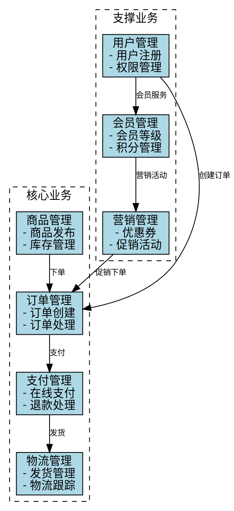
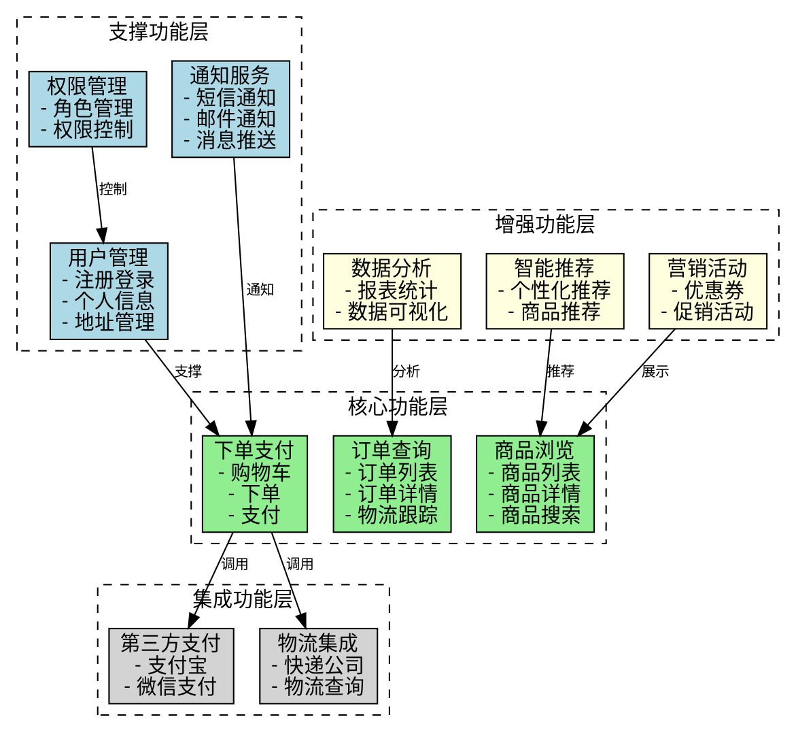
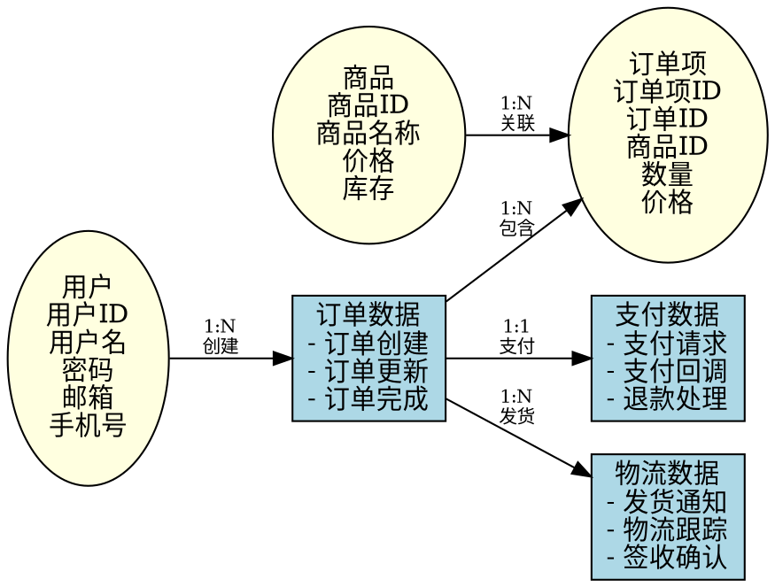
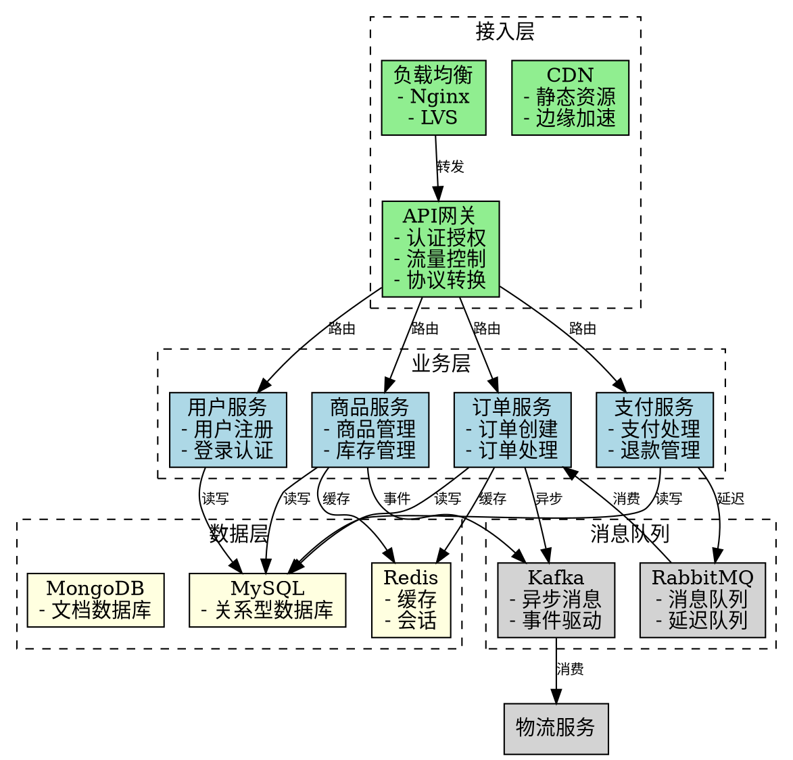

# 架构设计维度参考

## 目录
1. 业务架构设计
2. 功能架构设计
3. 数据架构设计
4. 技术架构设计
5. 四维度协同关系

## 概览
本文档提供业务架构、功能架构、数据架构、技术架构四个维度的设计指导，帮助系统化地进行多维度架构设计，确保各维度协同一致、相互支撑。

## 核心内容

### 1. 业务架构设计

业务架构是系统的战略层面设计，描述业务目标、业务流程、业务能力和业务关系，是功能和数据架构设计的基础。

#### 1.1 业务流程梳理

**核心业务流程**：
- 识别端到端的业务流程（从业务开始到结束）
- 每个流程包括：触发条件、参与角色、执行步骤、输出结果
- 示例：电商平台 - 订单流程（浏览 → 下单 → 支付 → 发货 → 确认收货）

**支撑业务流程**：
- 支撑核心流程的辅助流程
- 示例：用户管理、商品管理、库存管理

**管理业务流程**：
- 运营管理流程
- 示例：运营分析、数据统计、异常处理

**跨部门协同流程**：
- 涉及多个部门/系统的流程
- 示例：政务审批、供应链协同

#### 1.2 业务能力识别

**业务能力分类**：
- **核心能力**：直接支撑业务目标，创造价值
- **支撑能力**：为核心能力提供支持
- **管理能力**：管理和监控业务运行
- **集成能力**：与外部系统交互

**能力识别方法**：
- 按业务领域划分（电商：商品、订单、支付、物流）
- 按价值链划分（研发 → 生产 → 销售 → 服务）
- 按用户角色划分（C端用户、B端用户、运营人员、管理员）

**能力成熟度评估**：
- 成熟度等级：初始级 → 已定义级 → 已管理级 → 优化级
- 评估维度：流程标准化、数字化程度、自动化程度

#### 1.3 业务关系设计

**业务实体关系**：
- 业务对象之间的关系（用户、订单、商品、支付）
- 关系类型：一对一、一对多、多对多

**业务协作关系**：
- 业务部门之间的协作
- 系统之间的协作
- 角色之间的协作

**数据流转关系**：
- 数据在业务流程中的流转
- 数据的采集、存储、处理、应用

**服务提供与消费关系**：
- 业务能力的提供方和消费方
- 服务契约和接口

#### 1.4 业务架构输出

**输出文档内容**：
- 业务架构图（文字描述）
- 核心业务流程清单
- 业务能力清单
- 业务协作模式
- 业务关系矩阵

**质量检查**：
- ✅ 业务流程覆盖全面
- ✅ 业务能力边界清晰
- ✅ 业务关系逻辑合理
- ✅ 业务架构支撑业务目标

#### 1.5 业务架构图模板

**Graphviz DOT 格式示例**：

**使用说明**：
1. 将上述 DOT 格式保存为 `business.dot` 文件
2. 调用脚本生成架构图：`python scripts/generate-architecture-diagram.py --diagram-type business --input business.dot --output business.png`
3. 根据实际业务场景调整节点和边的定义

---

### 2. 功能架构设计

功能架构是系统的功能层面设计，描述功能模块、功能层次和功能关系，将业务能力转化为可实现的功能。

#### 2.1 功能模块划分

**按业务领域划分**：
- 核心业务功能（订单管理、支付管理）
- 支撑业务功能（用户管理、权限管理）
- 管理功能（系统管理、数据管理）

**按用户角色划分**：
- C 端用户功能（注册登录、浏览下单）
- B 端用户功能（商品管理、订单处理）
- 运营人员功能（数据分析、营销活动）
- 管理员功能（系统配置、用户管理）

**按系统层次划分**：
- 接入层（Web、移动端、API）
- 业务层（核心业务逻辑）
- 数据层（数据访问、存储）
- 基础设施层（监控、日志、配置）

**按业务能力划分**：
- 每个业务能力对应一组功能模块
- 示例：订单能力 → 订单创建、订单查询、订单取消、订单统计

#### 2.2 功能层次设计

**核心功能层**：
- 支撑业务关键流程的功能
- 示例：商品浏览、下单支付、订单查询

**支撑功能层**：
- 数据管理（用户管理、商品管理、订单管理）
- 用户管理（注册登录、身份认证、权限管理）
- 通知服务（短信、邮件、推送）

**增强功能层**：
- 数据分析（报表、统计、可视化）
- 智能推荐（个性化推荐、搜索优化）
- 营销活动（优惠券、促销、积分）

**集成功能层**：
- 第三方集成（支付、物流、地图）
- 系统集成（与现有系统对接）
- 数据集成（数据导入导出）

#### 2.3 功能关系设计

**功能依赖关系**：
- 功能之间的依赖（订单依赖用户和商品）
- 先决条件（下单前需登录、购物车需先加商品）

**功能调用关系**：
- 模块间的调用关系
- 同步调用 vs 异步调用

**功能协作关系**：
- 多个功能协作完成业务流程
- 示例：下单 → 库存扣减 → 支付 → 发货 → 通知

**功能复用关系**：
- 公共功能模块（用户认证、权限控制）
- 基础服务（文件上传、缓存服务）

#### 2.4 功能架构输出

**输出文档内容**：
- 功能架构图（文字描述）
- 功能模块清单
- 功能层次划分
- 功能关系矩阵

**质量检查**：
- ✅ 功能模块划分合理
- ✅ 功能层次清晰
- ✅ 功能关系明确
- ✅ 功能架构支撑业务架构

#### 2.5 功能架构图模板

**Graphviz DOT 格式示例**：

---

### 3. 数据架构设计

数据架构是系统的数据层面设计，描述数据模型、数据流、数据标准和数据治理，确保数据的正确性、一致性、安全性和可用性。

#### 3.1 数据模型设计

**核心实体识别**：
- 业务对象抽象（用户、商品、订单、支付）
- 实体属性定义
- 实体关系设计（一对一、一对多、多对多）

**数据类型与约束**：
- 数据类型选择（字符串、数字、日期、JSON）
- 数据约束（非空、唯一、范围、格式）
- 默认值设计

**数据标准化**：
- 命名规范（表名、字段名、索引名）
- 编码规范（字典编码、状态码）
- 格式规范（日期格式、金额格式、坐标格式）

**数据模型层次**：
- **概念模型**：业务层面的数据抽象
- **逻辑模型**：系统层面的数据结构
- **物理模型**：数据库层面的具体实现

#### 3.2 数据流设计

**业务数据流**：
- 数据在业务流程中的流转
- 示例：下单 → 订单数据 → 支付数据 → 物流数据 → 完成数据

**系统数据流**：
- 系统内部的数据流转
- 示例：Web 层 → 业务层 → 数据层

**跨系统数据流**：
- 系统间的数据交换
- 示例：电商平台 → 物流公司 → 用户

**数据采集、存储、处理、应用**：
- **数据采集**：用户输入、传感器、第三方数据
- **数据存储**：关系型数据库、NoSQL、数据仓库
- **数据处理**：ETL、清洗、计算、分析
- **数据应用**：查询、报表、推荐、预测

#### 3.3 数据标准设计

**数据字典**：
- 统一的数据术语定义
- 数据元定义（名称、类型、长度、含义）
- 数据域定义（数据值域、枚举值）

**数据编码规则**：
- 主键生成策略（UUID、雪花算法）
- 业务编码规则（订单号、流水号）
- 状态码设计（状态机、状态转换）

**数据质量管理标准**：
- 数据完整性（必填项、唯一性）
- 数据准确性（数据校验、格式验证）
- 数据一致性（数据同步、事务管理）
- 数据及时性（实时、准实时、批处理）

#### 3.4 数据治理设计

**数据分类分级**：
- **按敏感程度**：公开、受限、敏感、机密
- **按重要程度**：核心数据、重要数据、一般数据
- 分类分级标准与策略

**数据安全与隐私保护**：
- 数据脱敏（手机号、身份证、银行卡号）
- 数据加密（传输加密、存储加密）
- 访问控制（权限管理、角色控制）
- 审计日志（数据访问、数据修改）

**数据生命周期管理**：
- 数据创建、使用、归档、销毁
- 保留策略（热数据、温数据、冷数据）
- 备份与恢复策略

**数据共享与开放**：
- 数据共享机制（API、ETL、数据交换）
- 数据开放策略（公开数据、受限数据）
- 数据使用授权（申请、审批、使用、审计）

#### 3.5 数据架构输出

**输出文档内容**：
- 数据模型图（文字描述）
- 数据流图（文字描述）
- 数据标准规范
- 数据治理方案

**质量检查**：
- ✅ 数据模型完整
- ✅ 数据流清晰
- ✅ 数据标准统一
- ✅ 数据治理方案可行
- ✅ 数据架构支撑功能架构

#### 3.6 数据架构图模板

**Graphviz DOT 格式示例（ER图）**：

---

### 4. 技术架构设计

技术架构是系统的技术层面设计，描述部署架构、技术选型、安全架构和集成架构，确保系统的性能、可用性、安全性和可扩展性。

#### 4.1 部署架构

**部署拓扑**：
- **单机部署**：简单场景、小型系统
- **集群部署**：高可用、负载均衡
- **分布式部署**：大规模、高并发
- **云原生部署**：容器化、微服务、Serverless

**分层架构**：
- **接入层**：负载均衡、API 网关、CDN
- **业务层**：应用服务、微服务
- **数据层**：数据库、缓存、消息队列
- **基础设施层**：服务器、存储、网络

**容器化与编排**：
- **容器化**：Docker 容器化应用
- **编排**：Kubernetes 容器编排
- **服务网格**：Istio 服务治理

**高可用与容灾设计**：
- **高可用**：多实例部署、故障自动转移
- **负载均衡**：Nginx、HAProxy、云负载均衡
- **容灾备份**：异地多活、灾备切换

#### 4.2 安全架构

**网络安全**：
- **防火墙**：网络访问控制
- **WAF**：Web 应用防火墙
- **DDoS 防护**：分布式拒绝服务攻击防护
- **VPN**：虚拟专用网络

**应用安全**：
- **认证授权**：身份认证、权限控制
- **输入验证**：防止 SQL 注入、XSS 攻击
- **加密**：传输加密（HTTPS）、数据加密
- **会话管理**：会话安全、Token 管理

**数据安全**：
- **传输加密**：SSL/TLS 加密
- **存储加密**：数据库加密、文件加密
- **数据脱敏**：敏感数据脱敏
- **备份加密**：备份数据加密

**运维安全**：
- **日志审计**：操作日志、访问日志
- **入侵检测**：异常行为检测、入侵告警
- **漏洞扫描**：安全漏洞扫描、修复
- **应急响应**：安全事件应急响应

#### 4.3 集成架构

**API 网关设计**：
- **统一入口**：API 统一入口
- **认证授权**：统一认证、权限控制
- **流量控制**：限流、熔断、降级
- **协议转换**：HTTP、REST、gRPC

**服务注册与发现**：
- **注册中心**：服务注册、服务发现
- **健康检查**：服务健康状态检查
- **负载均衡**：服务实例负载均衡

**消息队列与事件总线**：
- **消息队列**：RabbitMQ、Kafka、RocketMQ
- **事件总线**：事件发布订阅、事件溯源
- **异步处理**：异步任务、异步通知

**数据交换与同步**：
- **ETL**：数据抽取、转换、加载
- **CDC**：变更数据捕获
- **数据同步**：主从复制、双向同步

#### 4.4 技术架构输出

**输出文档内容**：
- 技术架构图（文字描述）
- 部署架构设计
- 安全架构设计
- 集成架构设计

**质量检查**：
- ✅ 架构模式选择合理
- ✅ 部署架构可行
- ✅ 安全架构完善
- ✅ 集成架构灵活
- ✅ 技术架构支撑数据架构和功能架构

#### 4.5 技术架构图模板

**Graphviz DOT 格式示例（部署架构）**：

---

### 5. 四维度协同关系

#### 5.1 协同原则

**业务架构是源头**：
- 业务架构决定功能和数据架构
- 业务目标和业务流程是设计的起点

**功能架构是桥梁**：
- 功能架构将业务能力转化为可执行的功能
- 功能架构连接业务架构和技术架构

**数据架构是基础**：
- 数据架构支撑功能架构的实现
- 数据架构是业务价值的载体

**技术架构是支撑**：
- 技术架构提供功能实现的技术基础
- 技术架构确保系统的性能、安全、可用性

#### 5.2 协同一致性检查

**业务架构 ↔ 功能架构**：
- ✅ 每个业务能力都有对应的功能模块
- ✅ 业务流程都有对应的功能流程
- ✅ 业务关系都有对应的功能关系

**业务架构 ↔ 数据架构**：
- ✅ 每个业务实体都有对应的数据实体
- ✅ 业务流程都有对应的数据流
- ✅ 业务关系都有对应的数据关系

**功能架构 ↔ 数据架构**：
- ✅ 每个功能都有对应的数据访问
- ✅ 功能流程都有对应的数据操作
- ✅ 功能关系都有对应的数据依赖

**功能架构 ↔ 技术架构**：
- ✅ 每个功能都有技术实现方案
- ✅ 功能性能要求都有技术保障
- ✅ 功能安全要求都有技术措施

**数据架构 ↔ 技术架构**：
- ✅ 数据模型有技术实现方案
- ✅ 数据存储有技术选型
- ✅ 数据安全有技术保障

#### 5.3 协同设计流程

1. **从业务架构开始**：
   - 梳理业务目标、流程、能力、关系

2. **功能架构承接**：
   - 将业务能力转化为功能模块
   - 设计功能层次和关系

3. **数据架构支撑**：
   - 设计数据模型支撑功能
   - 设计数据流支撑业务流程

4. **技术架构实现**：
   - 选择技术栈实现功能
   - 设计部署架构支撑数据

5. **迭代优化**：
   - 检查四维度协同一致性
   - 优化架构设计

#### 5.4 协同设计示例

**示例：电商平台订单功能**

- **业务架构**：订单能力 → 订单创建、订单查询、订单取消、订单支付
- **功能架构**：订单管理模块 → 创建订单、查询订单、取消订单、支付订单
- **数据架构**：订单实体（订单号、用户ID、商品ID、金额、状态）→ 订单数据流
- **技术架构**：订单服务（微服务）→ MySQL（订单数据）→ Redis（订单缓存）→ 消息队列（订单通知）

---

## 架构设计质量检查清单

### 业务架构
- ✅ 业务流程覆盖全面
- ✅ 业务能力边界清晰
- ✅ 业务关系逻辑合理
- ✅ 业务架构支撑业务目标

### 功能架构
- ✅ 功能模块划分合理
- ✅ 功能层次清晰
- ✅ 功能关系明确
- ✅ 功能架构支撑业务架构

### 数据架构
- ✅ 数据模型完整
- ✅ 数据流清晰
- ✅ 数据标准统一
- ✅ 数据治理方案可行
- ✅ 数据架构支撑功能架构

### 技术架构
- ✅ 架构模式选择合理
- ✅ 部署架构可行
- ✅ 安全架构完善
- ✅ 集成架构灵活
- ✅ 技术架构支撑数据架构和功能架构

### 四维度协同
- ✅ 业务架构、功能架构、数据架构、技术架构协同一致
- ✅ 架构设计满足需求
- ✅ 架构设计符合建设思路
- ✅ 架构设计可落地实施
