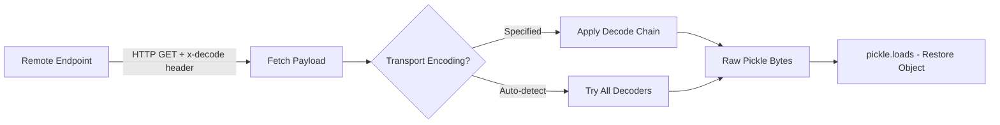

# Distributed State Recovery Tool

A lightweight CLI utility for **fetching and restoring serialized application state** from a remote endpoint in distributed environments.

## Motivation

In microservice and cluster architectures, individual nodes frequently need to synchronize runtime state — session data, cached computation results, feature flag snapshots, ML model weights, or bootstrap configuration — from a central control plane or peer nodes. Python's `pickle` module is the de facto serialization standard used by Django, Celery, pandas, scikit-learn, and virtually every major Python framework for this purpose.

This tool provides a minimal, dependency-free mechanism to **pull and reconstruct** such state objects over HTTP, with flexible transport encoding support for binary-safe delivery through text-only channels.

## How It Works



1. **Fetch** — HTTP GET the target URL; read response body and headers
2. **Identify encoding** — inspect `x-decode` response header (or auto-detect)
3. **Decode** — apply transport decoding (supports chained encodings)
4. **Restore** — deserialize via Python's `pickle` protocol

## Supported Transport Encodings

Since pickle produces binary output, it must be encoded for transmission through text-based protocols. The following encodings are supported via the `x-decode` response header:

| Encoding          | Header Value      | Use Case                          | Example Scenario                  |
|-------------------|-------------------|-----------------------------------|-----------------------------------|
| Base64            | `base64`          | Standard binary-to-text           | JSON config field embedding       |
| Base32            | `base32`          | Case-insensitive channels         | DNS TXT record transport          |
| Hex / Base16      | `hex`             | Human-readable debug output       | Log-pipe extraction               |
| Base85 / ASCII85  | `base85`          | Compact ASCII representation      | Size-constrained payloads         |
| URL percent       | `url`             | Query-string embedding            | GET-parameter state transfer      |
| ROT13             | `rot13`           | Basic obfuscation                 | Log-scraping mitigation           |
| HTML entities     | `html`            | HTML-safe embedding               | Web-page steganographic transport |
| UUencode          | `uuencode`        | Legacy email attachment format    | Mail-gateway compatibility        |
| Quoted-printable  | `quoted-printable`| Email/MIME safe                   | SMTP-based distribution           |
| Binary string     | `binary`          | Raw bit representation            | Custom protocol adaptation        |
| Morse code        | `morse`           | Novelty / constrained alphabet    | Research / CTF use cases          |

**Chained decoding**: multiple encodings can be composed by comma-separating them in the `x-decode` header:

```
x-decode: base64,url
x-decode: base64,rot16,hex
```

## Usage

### Basic (server specifies encoding)

```bash
python3 1.py https://config.internal.example.com/state/v2
```

The server returns the encoded payload with an `x-decode` header indicating how to decode it.

### Example server response

```
HTTP/1.1 200 OK
Content-Type: application/octet-stream
x-decode: base64

gASVwAAAAAB...
```

The client decodes the Base64 payload back into raw pickle bytes, then calls `pickle.loads()` to restore the original Python object (e.g., a configuration dict, DataFrame, model instance, etc.).

## Typical Use Cases

| Use Case                     | What Gets Serialized                | Who Produces It              |
|------------------------------|--------------------------------------|-------------------------------|
| Config management            | Dict of env-specific settings        | Admin control plane           |
| Session restore              | Session object with user state       | Auth service / load balancer  |
| Cache synchronization        | Computation cache (LRU, memcached)   | Primary compute node          |
| Feature flags                | Flag set with rollout percentages    | Feature management service    |
| ML model weights             | Trained sklearn/tensorflow model     | Model training pipeline       |
| Job queue state              | Celery task result or retry state    | Task broker                   |
| Bootstrap / provisioning     | Node initialization manifest         | Orchestration platform (K8s)  |

## Security Considerations

> **Important**: This tool uses Python's built-in `pickle.loads()` for deserialization.
> The pickle protocol is designed to reconstruct arbitrary Python objects, which means
> deserializing untrusted data can execute arbitrary code. **This is documented, expected behaviour**
> of the pickle module — not a bug.
>
> - Only use this tool with endpoints you trust (internal services, signed URLs, mTLS-protected APIs)
> - Never point this tool at arbitrary user-supplied URLs in production
> - For untrusted sources, consider alternatives like JSON, MessagePack, or `jsonpickle` with safe mode
>
> Reference: [Python pickle documentation — security warning](https://docs.python.org/3/library/pickle.html)

## Dependencies

- **Python >= 3.7** (uses type hints and f-strings)
- **Optional**: `requests` library for better HTTP handling; falls back to stdlib `urllib`

## Version

v1.0.0
