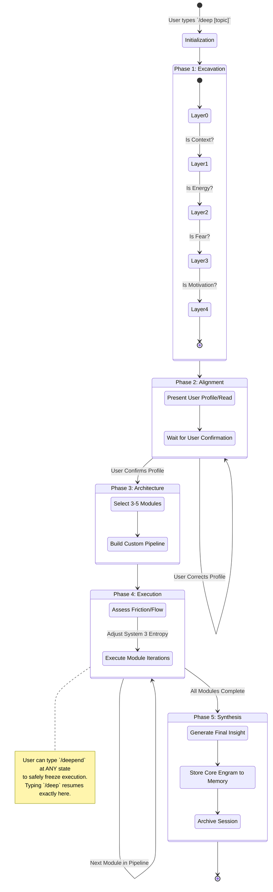
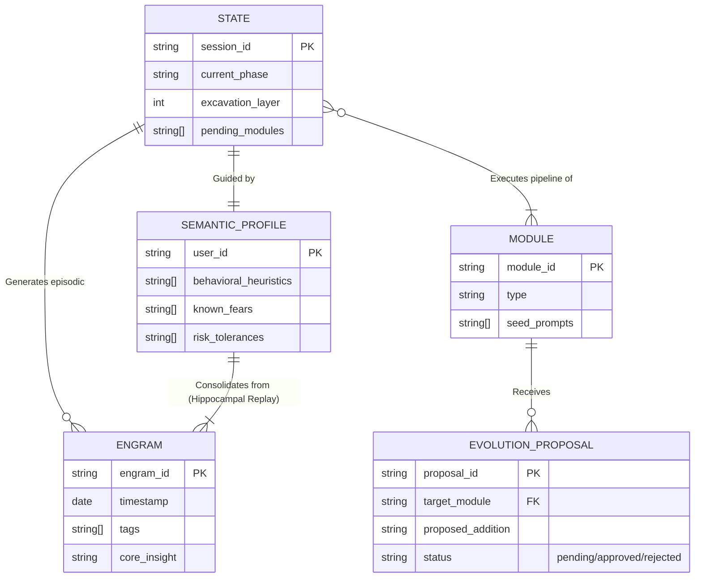

# DeepThinking: Stateful Cognitive Framework for OpenClaw

**DeepThinking** is a stateful, neuroscience-inspired cognitive framework packaged as an OpenClaw skill. It is designed to assist users in complex decision-making, idea exploration, untangling mental knots, and resolving deep ambiguities.

Unlike typical conversational AI that merely answers queries or fulfills direct prompts, DeepThinking operates as a **facilitator**. It guides you through rigorous, structured psychological phases—Excavation, Alignment, Architecture, Execution, and Synthesis—ensuring you don't just get an answer, but actually unpack the root of your problem or idea.

---

## 🧠 Core Philosophy & Architecture

DeepThinking operates on a few core principles that differentiate it from standard AI interactions:
1. **Statefulness over statelessness**: The framework persists your session state on disk. You can explore a thought, type `/deepend`, close your laptop, and return days later with `/deep` to pick up exactly where you left off.
2. **Questions over Answers**: The framework strictly avoids giving raw advice or lists of ideas (which it considers "lazy thinking"). Instead, it provides frameworks, provocations, and lateral reflections.
3. **Adaptive Entropy Control (System 3)**: DeepThinking dynamically detects whether you are in a state of "friction" (short answers, defensive tone) or "flow" (long answers, energy). It adjusts its questioning style silently, either expanding the entropy (asking lateral, weird questions to unblock you) or compressing the entropy (forcing concreteness to drive action).

---

## 🔄 The 5-Phase Cognitive Flow

When you initiate a session with `/deep [topic]`, DeepThinking orchestrates the following pipeline:



### 1. EXCAVATION (The Dig)
The system asks you **five layers of questions**, one per message, to strip away your surface request and find the real underlying motivation.
- **Layer 0 (Surface)**: What do you literally want?
- **Layer 1 (Context)**: What's happening in your life right now that brought this up?
- **Layer 2 (Energy)**: What gives you energy vs. what feels like homework?
- **Layer 3 (Fear)**: What is the irrational worst-case scenario?
- **Layer 4 (Real Want)**: A surgical question based on the gap between your surface request and actual fears.

### 2. ALIGNMENT (The Mirror)
Before proceeding, DeepThinking presents its "read" on you based on the Excavation phase. It explicitly names the deeper motivation and real fear it detected, ensuring both you and the AI are solving the right problem. If it's wrong, you correct it; if it's right, it builds a custom pipeline.

### 3. ARCHITECTURE (The Blueprint)
The system selects 3-5 specific psychological **modules** (e.g., *DIVERGE*, *CONVERGE*, *INVERT*, *MIRROR*, *REFRAME*, *COMMIT*, *PROTOTYPE*) from its registry, tailored to your exact cognitive state. It presents this custom pipeline to you before executing.

### 4. EXECUTION (The Work)
You progress through the chosen modules. For each module, DeepThinking engages in 3-7 exchanges. It monitors your state silently:
- If you give a lazy "job interview" answer, it pushes back.
- If you hit a breakthrough, it anchors it.
- If you stall, it laterally reframes the approach.

### 5. SYNTHESIS (The Anchor)
In the final phase, the system connects everything that emerged. It provides a concise summary, highlights one surprising insight, proposes exactly **one next move**, and gently points out one thing you might be wrong about.

---

## 🧬 Memory & Self-Improvement (GS-3 Memory Mechanics)

DeepThinking features a persistent, cross-session memory and self-improvement engine inspired by the human hippocampus.

### Episodic to Semantic Consolidation
During sessions, DeepThinking silently stores **engrams** (episodic insights, e.g., "energy spikes when discussing creation, drops with services"). Over time, the system runs a "hippocampal replay" to consolidate these isolated engrams into a **Semantic Profile**. 

This means the AI genuinely "gets to know you" at a deep behavioral level—your risk aversion, your blind spots, your working style—without needing to reread every past transcript. It uses this silent profile to guide all future excavation and module selection.

### Automatic Prompt Evolution
 DeepThinking evolves its own prompts over time. Through a nightly analysis script, the system analyzes what questioning techniques worked best and identifies edge cases. It then **proposes** new seed prompts or notes for its execution modules.
*Note: In alignment with strict safety controls, the AI can only propose additions. It cannot overwrite core logic or approve its own proposals. The user must manually review and approve any evolution.*

### ⚙️ Setting up the Evolutionary Cron Job
To enable hippocampal replay and prompt evolution, configure the OpenClaw Cron Job to run the `evolve.py` script nightly at 3 AM:

```json
{
  "jobs": [
    {
      "name": "deepthinking-evolve",
      "schedule": "0 3 * * *",
      "task": "Run these steps in order: (1) python3 {baseDir}/scripts/evolve.py consolidate — this is the hippocampal replay: consolidate episodic engrams into semantic heuristics about the user. (2) python3 {baseDir}/scripts/evolve.py analyze — analyze session patterns, memory themes, module usage. (3) Review the suggestions. If any add-prompt or add-note improvements are clearly beneficial based on data, propose them. (4) Never approve your own proposals — leave them pending for human review."
    }
  ]
}
```

---

## 🛡️ Security & Privacy Declaration

Trust and transparency are the greatest pillars of DeepThinking. Because cognitive exploration requires vulnerability, the technical architecture guarantees absolute privacy:

1. **100% Local Execution**: Everything happens on your machine within the OpenClaw environment.
2. **Zero Network Requests**: The internal python scripts (`state.py`, `memory.py`, `evolve.py`) rely exclusively on native standard Python 3 libraries (`json`, `os`, `sys`, `datetime`, `pathlib`, `subprocess`). There are zero external API calls, zero telemetry, and zero third-party dependencies. This guarantees no supply chain attack risks and ensures immediate compliance with security filters like VirusTotal.
3. **Isolated Safe Paths**: State, memory profiles, and engrams are saved entirely as plain text (`.json` and `.log` files) sandboxed inside the `~/.deepthinking/` directory. Path handling is strictly validated to prevent directory traversal. You have absolute, auditable control over everything the AI remembers about you.

---

## 🛠️ Internal CLI Architecture

For developers, DeepThinking is powered by three completely isolated, single-responsibility Python scripts located in `scripts/`.

The data is persisted locally in your machine, mapping the runtime into these core structures:



*   `state.py`: The state machine. Manages session lifecycles, phase transitions, and module progression (`~/.deepthinking/current/state.json`).
*   `memory.py`: The engram manager. Handles the storage, tagging, and contextual retrieval of granular insights.
*   `evolve.py`: The self-improvement engine. Handles hippocampal consolidation (episodic to semantic) and analyzes session metrics to propose non-destructive module updates.

---

## 🚀 How to Use

1. **Start a new reflection**:
   `/deep I'm considering leaving my job to start a company, but I'm paralyzed.`
2. **Pause mid-session**:
   Type `/deepend` whenever you need a break. Your state in the exact layer/module is safely frozen.
3. **Resume later**:
   Type `/deep` with no arguments, and the AI will pick up the conversation from exactly where you left off.
4. **Review Evolution Proposals**:
   In your terminal, navigate to the skill directory and run `python3 scripts/evolve.py review` to accept/reject the AI's proposed improvements to its own logic.

---

## 🖥️ Standalone TUI (VPS / SSH)

DeepThinking ships with a standalone **Terminal User Interface** that runs natively over SSH on any Linux/macOS VPS — no browser, no OpenClaw, no external dependencies.

### Requirements
- Python 3.8+ (standard library only)
- SSH access to your VPS

### Install

```bash
# Clone to your VPS
git clone https://github.com/bruno-nimbledev/DeepThinking.git ~/deepthinking
cd ~/deepthinking

# Make launcher executable
chmod +x bin/deep scripts/tui.py

# Optional: add to PATH system-wide
sudo ln -s $(pwd)/bin/deep /usr/local/bin/deep
```

### Usage

```bash
# Start a new session
deep "Quero abrir uma empresa de planejamento de festas infantis"

# Or just invoke and type your topic interactively
deep

# Resume an existing paused session
deep

# Commands during a session
/deepend      # Pause and save state (resume later with `deep`)
Ctrl+C     # Same as /deepend
next       # Advance to the next module (also: done, fim, próximo)
```

### Optional: Run as a persistent service (systemd)

To keep a DeepThinking session alive even if you disconnect from SSH:

```ini
# /etc/systemd/system/deepthinking.service
[Unit]
Description=DeepThinking TUI session

[Service]
Type=simple
User=YOUR_USER
WorkingDirectory=/home/YOUR_USER/deepthinking
ExecStart=/usr/local/bin/deep
Restart=no

[Install]
WantedBy=multi-user.target
```

> **Note**: For interactive TUI use, `tmux` or `screen` is simpler than systemd.
> ```bash
> tmux new -s deep
> deep "my topic"
> # Detach with Ctrl+B D · Reattach with tmux attach -t deep
> ```

### State & Memory location

All session data is saved in `~/.deepthinking/` on the VPS:
```
~/.deepthinking/
├── current/state.json        ← active session
├── archive/                  ← completed sessions
├── memory/engrams.log        ← long-term memory
└── evolution/                ← semantic profile + patches
```
