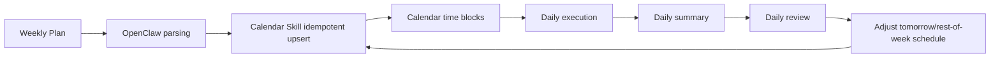
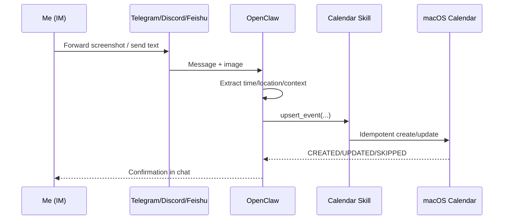
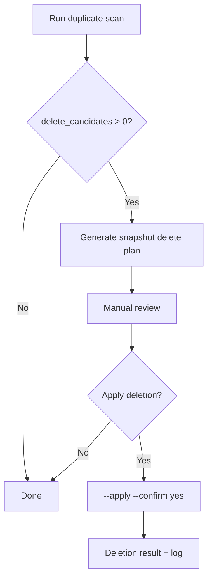
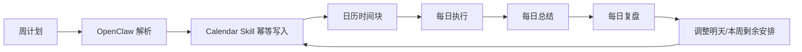
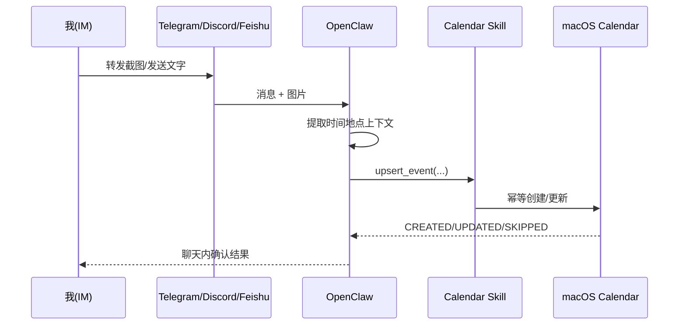
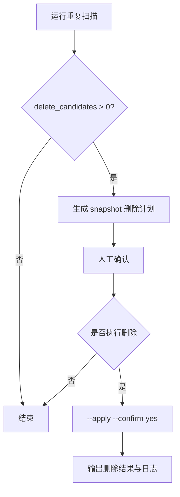

# macos-calendar-assistant

> I use this skill to turn weekly planning, daily execution, summary, and schedule adjustment into one continuous loop.

English | [中文](#中文)

---

## English

## Why I built this skill
Before this, I built a client app called **CalendarAI**. It proved that AI-powered calendar CRUD is feasible.

I also studied a range of scheduling products, including **Toki / Calendly / Clockwise / Motion / Amie**.
Each gave me useful ideas across conversational UX, booking links, team scheduling, auto-rescheduling, and product design.

My conclusion was clear:
high-frequency, natural scheduling is not just about "creating events" — it needs to happen inside the communication tools people already use daily.

After heavily using OpenClaw, I became even more certain:
**managing schedules directly in IM conversations, then syncing into system calendar** is more agentic-friendly and more human-friendly than relying on a standalone client.

I built `macos-calendar-assistant` to close this loop:
- how weekly plans become daily blocks,
- how daily execution gets reviewed,
- and how review outcomes sync back into upcoming schedules.

So calendar is not just a record — it becomes an iterative execution system.

## How I use it
My typical workflow:
1. Create a weekly plan.
2. Use OpenClaw + AI to break it into executable time blocks.
3. Write a daily summary at the end of the day.
4. Adjust upcoming schedules directly from review results.

This creates a full loop: **plan → execute → summarize → adjust**.

## How I use it with IM
This skill works with OpenClaw across IM channels (Telegram / Discord / Feishu / iMessage / Slack).
I can say things like "add this event", "extend to 14:00", or "move to Friday night" in chat, without app switching.

If my calendar is synced via iCloud, the same schedule is visible on both **Mac Calendar** and **iPhone Calendar**.
So any event creation/update/adjustment done through OpenClaw is reflected across desktop and mobile, giving me one consistent calendar system.

### Screenshot-to-schedule (my most common pattern)
I often forward screenshots (group notices, posters, chat screenshots, booking pages):
1. OpenClaw extracts time, location, and context.
2. The skill writes/upserts to Calendar idempotently (no duplicate spam).
3. I refine details in chat (time, location, reminders).

## Problems this solves for me
- Calendar pollution from repeated AI writes
- Drift between plan and real execution
- Review insights not reflected into future schedule
- High adjustment cost within the same week

## Core capabilities
- Idempotent write (`CREATED` / `UPDATED` / `SKIPPED`)
- Calendar/event reads for conflict checks
- UID-based alarm updates
- Duplicate detection with safe cleanup (`--apply --confirm yes`)
- Daily automatic checks (cron)

## Visual workflow






## Real demos

### Demo 1 — Add and edit tasks in chat
Create a task from IM, then update duration in a follow-up message. Changes are synced to Calendar instantly.


### Demo 2 — Daily review template in Calendar
OpenClaw + skill writes both the review time block and checklist into Calendar, making execute → review → adjust repeatable.


### Demo 3 — Weekly calendar outcome view
A full-week view after IM-driven scheduling, rescheduling, and daily review updates via OpenClaw + skill.


## Requirements
- macOS
- Python 3.9+
- Swift (Xcode Command Line Tools)
- Calendar permission granted to terminal/host process

## Quick start
```bash
cd scripts
./install.sh
```

## Common commands
```bash
# Environment check
python3 scripts/env_check.py

# Idempotent create/update
python3 scripts/upsert_event.py \
  --title "Deep work: Product positioning" \
  --start "2026-03-06T10:00:00+08:00" \
  --end "2026-03-06T11:30:00+08:00" \
  --calendar "Product" \
  --notes "Aligned with weekly goals" \
  --alarm-minutes 15

# Duplicate scan (read-only)
python3 scripts/calendar_clean.py --start "2026-03-01T00:00:00+08:00" --end "2026-03-08T23:59:59+08:00"

# Duplicate cleanup (double confirmation)
python3 scripts/calendar_clean.py --start "..." --end "..." --apply --confirm yes --snapshot-out ./delete-plan.json
```

## Tests
```bash
scripts/smoke_test.sh
python3 scripts/regression_test.py
```

## Uninstall
```bash
cd scripts
./uninstall.sh
```

---

## 中文

## 我为什么做这个 Skill
这个 Skill 的背景是：我前段时间做过一个叫 **CalendarAI** 的客户端，已经验证了“调用 AI 做日程增删改查”这件事是可行的。

我也系统研究过一批日程与智能排程产品，包括 **Toki / Calendly / Clockwise / Motion / Amie** 等。
它们分别在对话交互、约会链接、团队排程、自动重排与体验设计上给了我不同启发。
这些研究给了我一个很明确的结论：
真正高频、自然、可持续的日程管理，不只是“能建事件”，而是要把管理动作放进用户每天已经在用的沟通场景里。

所以在我开始重度使用 OpenClaw 后，我更确认了一点：
**直接在 IM 对话里管理日程，再同步到系统日历**，比单独做一个客户端更 agentic-friendly，也更 human-friendly。

我最终做这个 `macos-calendar-assistant`，就是为了把这条链路打通：
- 周计划怎么落地到每天
- 每天执行后怎么复盘
- 复盘结果怎么回写到后续日程

让日程不只是记录，而是持续迭代的执行系统。

## 我主要怎么用
我自己的典型工作流：
1. 每周先写周计划
2. 用 OpenClaw + AI 把计划拆成可执行时间块
3. 每天结束写总结
4. 根据复盘结果直接调整后续日程

这样可以形成“计划—执行—总结—修正”的闭环。

## 我把它接到 IM 里怎么用
这个 Skill 可以配合 OpenClaw 直接接入 IM（Telegram / Discord / Feishu / iMessage / Slack 等）。
我可以在聊天里直接说“加个日程”“延长到14:00”“改到周五晚上”，不需要来回切 App。

如果我的日历走的是 iCloud，同一份日程会自动在 **Mac 端 Calendar** 和 **iPhone 端 Calendar** 同步。
这意味着我在 OpenClaw 里完成的新增/修改/调整，会同时反映到电脑端和手机端，真正做到多端一致的日程管理。

### 截图转日程（我最常用）
我会直接转发截图（群通知、活动海报、聊天截图、预约页面等）：
1. OpenClaw 先识别时间/地点/上下文
2. Skill 幂等写入 Calendar（避免重复）
3. 我在聊天里继续微调（时间、地点、提醒）

## 我解决了哪些痛点
- AI 重复写入导致的日历污染
- 计划和真实执行脱节
- 每日复盘无法同步到后续安排
- 一周内频繁调整成本高

## 核心能力
- 幂等写入（`CREATED` / `UPDATED` / `SKIPPED`）
- 日历/事件读取（冲突检查）
- 按 UID 设置提醒
- 重复检测与安全清理（`--apply --confirm yes`）
- 每日自动检查（cron）

## 可视化流程






## 真实示例图

### 示例 1 — 在聊天中添加并编辑任务
先在 IM 中创建任务，再通过后续消息修改时长，变更会即时同步到日历。


### 示例 2 — 每日复盘模板写入日历
OpenClaw + skill 会把复盘时间块和复盘清单一起写入 Calendar，让执行→复盘→调整形成可持续闭环。


### 示例 3 — 一周结果总览
通过 OpenClaw + skill 在 IM 中持续调度、改期与复盘后，最终形成的一周日程全貌。


## 环境要求
- macOS
- Python 3.9+
- Swift（Xcode Command Line Tools）
- 终端/宿主进程已授予 Calendar 权限

## 快速开始
```bash
cd scripts
./install.sh
```

## 常用命令
```bash
# 环境自检
python3 scripts/env_check.py

# 幂等创建/更新
python3 scripts/upsert_event.py \
  --title "深度工作：产品定位" \
  --start "2026-03-06T10:00:00+08:00" \
  --end "2026-03-06T11:30:00+08:00" \
  --calendar "产品" \
  --notes "与周目标对齐" \
  --alarm-minutes 15

# 重复扫描（仅检查）
python3 scripts/calendar_clean.py --start "2026-03-01T00:00:00+08:00" --end "2026-03-08T23:59:59+08:00"

# 重复清理（双保险）
python3 scripts/calendar_clean.py --start "..." --end "..." --apply --confirm yes --snapshot-out ./delete-plan.json
```

## 测试
```bash
scripts/smoke_test.sh
python3 scripts/regression_test.py
```

## 卸载
```bash
cd scripts
./uninstall.sh
```
