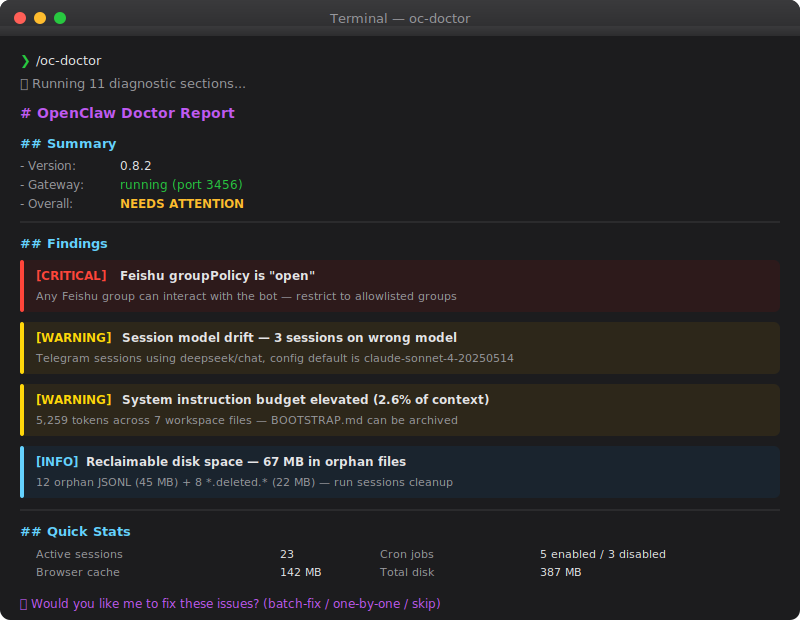

# oc-doctor

[English](README.md) | [中文](README.zh-CN.md)

[](LICENSE)
[-lightgrey.svg)](https://github.com/bryant24hao/oc-doctor)

> 一条命令诊断整个 OpenClaw 环境。发现问题、解释影响、提供修复。

<p align="center">
  
</p>

一个 Claude Code / OpenClaw 技能，对本地 OpenClaw 安装执行 **11 项诊断检查**，生成包含 `CRITICAL` / `WARNING` / `INFO` 分级的结构化健康报告，并支持交互式一键修复，自动匹配你的语言。

## 为什么需要它

深夜，你的 Telegram 机器人突然回复群里每一条消息——因为 `requireMention` 几周前被设成了 `false`，一直没人发现。它还开始"失忆"——原来换模型时 `contextTokens` 设成了 272k，但模型实际只支持 200k。更糟的是 Gateway 挂了，两个进程在抢同一个端口。

你花了两个小时翻配置文件、grep 日志、搜 GitHub Issues。修了三个问题，但不知道还有没有别的坑。

**用 oc-doctor，一条命令 60 秒找到所有问题，再用 30 秒修好。**

```
/oc-doctor
→ 12 项发现：1 CRITICAL、4 WARNING、7 INFO
→ "全部修复？" → 是
→ 完成。安全加固、模型对齐、282 MB 缓存清理、死文件清除。
```

以前要两小时手动排查的事，现在 2 分钟搞定。每周跑一次，就像给 OpenClaw 做体检。（[完整故事](docs/user-story.md)）

## 亮点

- **11 项诊断** 覆盖安装、配置、会话、定时任务、安全、资源、网关、系统指令
- **交互式一键修复** — 批量修复 WARNING，CRITICAL 逐个确认
- **交叉引用完整性** — 检测 AGENTS.md 引用的文件是否缺失或为空，并生成实用替代内容（如根据你的实际 cron 任务和频道生成 HEARTBEAT.md）
- **密钥脱敏** — API 密钥和 token 在报告中自动遮蔽
- **自动语言** — 根据对话上下文自动用中文、英文或其他语言输出

## 快速安装

**通过 [skills.sh](https://skills.sh)**（推荐）：

```bash
npx skills add bryant24hao/oc-doctor -g -y
```

**通过 [ClawdHub](https://clawdhub.ai)**：

```bash
clawhub install oc-doctor
```

**手动安装**：

```bash
git clone https://github.com/bryant24hao/oc-doctor.git ~/.claude/skills/oc-doctor
```

## 使用方法

在 Claude Code 或 OpenClaw 中说：

```
/oc-doctor
openclaw doctor
claw health check
openclaw diagnose
```

## 检查项目

| # | 检查项 | 示例 |
|---|--------|------|
| 1 | **安装与版本** | 版本过旧、Gateway 未运行、LaunchAgent 缺失 |
| 2 | **配置一致性** | 无效模型 ID、遗留 `clawdbot.json`、`.bak` 文件堆积 |
| 3 | **会话维护** | 缺少 `pruneAfter`、维护模式为 `"warn"` 而非 `"enforce"` |
| 4 | **压缩配置** | 缺少 `reserveTokensFloor`（上下文溢出风险）|
| 5 | **模型对齐** | 会话 contextTokens 为 272k 但模型上限仅 200k |
| 6 | **会话健康** | 47 个孤儿 JSONL 文件（180MB）、僵尸条目、空会话 |
| 7 | **定时任务健康** | 重复启用的任务、过期调度、废弃 `.tmp` 文件 |
| 8 | **安全审计** | `groupPolicy: "open"`、`auth.mode: "none"`、不受限的 `allowFrom` |
| 9 | **资源占用** | 浏览器缓存 500MB、日志 80MB、单个 JSONL 15MB |
| 10 | **网关与进程** | 多个 Gateway PID、端口冲突、近期错误激增 |
| 11 | **系统指令健康** | Token 预算分析、空模板、交叉引用完整性 |

## 工作原理

**脚本 + LLM 分离**：确定性数据采集由 shell 脚本完成，判断和分析交给 LLM。

```
scripts/sysinstruction-check.sh  → 结构化 JSON  → LLM 分析
openclaw status --all            → 原始输出      → LLM 解读
openclaw sessions cleanup --dry-run → 候选项    → LLM 分诊
```

确保数据采集可复现，同时利用 LLM 推理能力进行精细诊断。

## 交互式修复

报告完成后，技能会询问：

> "需要我帮你修复这些问题吗？可以批量修复所有 WARNING 及以下级别，CRITICAL 级别逐个确认。"

可用修复：
- **会话清理** — 孤儿/已删除 JSONL 文件、僵尸条目
- **模型漂移** — 将会话对齐到配置的默认模型
- **配置优化** — 维护、压缩、安全设置
- **定时任务清理** — 去重、tmp 文件删除、禁用任务清理
- **系统指令** — 归档 BOOTSTRAP.md、清除空模板、减少 token 膨胀
- **工作区完整性** — 为引用但缺失的文件生成实用内容（如带 cron/频道感知清单的 HEARTBEAT.md）
- **资源清理** — 清除浏览器缓存、轮转日志

## 前置要求

- **OpenClaw** 已安装且在 PATH 中
- **[jq](https://jqlang.github.io/jq/)** 用于系统指令分析脚本

```bash
brew install jq    # macOS
apt install jq     # Debian/Ubuntu/WSL
```

> **Windows 用户**：请在 [WSL](https://learn.microsoft.com/en-us/windows/wsl/install) 中运行。不支持原生 Windows（PowerShell/cmd）。

## 安全与隐私

此技能完全在本地运行，不发起任何网络请求。但诊断输出会成为 LLM 对话上下文的一部分。

| 方面 | 详情 |
|------|------|
| 读取的文件 | `openclaw.json`、`models.json`、`sessions.json`、工作区 `.md` 文件、cron `jobs.json`、Gateway 日志 |
| 修改的文件 | 仅在用户明确确认后执行 |
| 网络请求 | 无 |
| 密钥处理 | 报告中自动脱敏（仅显示前 8 个字符 + `...`），不写入磁盘 |

## 目录结构

```
oc-doctor/
├── SKILL.md                          # 技能定义（由 Claude Code 加载）
├── scripts/
│   └── sysinstruction-check.sh       # 系统指令 token 分析
├── assets/
│   └── demo.svg                      # 终端演示图
├── README.md                         # English
├── README.zh-CN.md                   # 中文
└── LICENSE
```

## 自定义

覆盖 OpenClaw 主目录：

```bash
OPENCLAW_HOME=/custom/path bash scripts/sysinstruction-check.sh
```

## 贡献

欢迎提 Issue 和 PR。此技能遵循 [Anthropic 技能编写最佳实践](https://docs.anthropic.com/en/docs/agents-and-tools/agent-skills/best-practices)。

## 许可证

[MIT](LICENSE)
