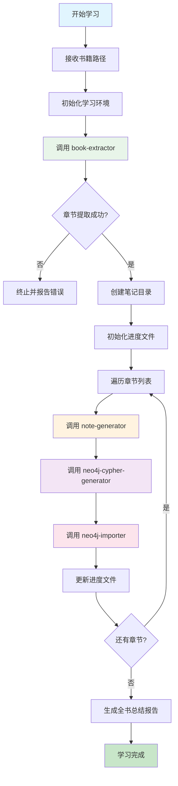

# 🎯 书籍学习协调技能 (Book Learning Coordinator Skill)

> **创建日期**: 2026-03-22
> **版本**: 1.0
> **用途**: 协调管理书籍学习的完整流程，控制各模块顺序执行
> **标签**: #流程管理 #学习协调 #进度跟踪

---

## 🎯 核心职责

作为总控模块，协调book-extractor、note-generator、neo4j-cypher-generator、neo4j-importer四个子模块的执行顺序，管理学习进度，处理异常情况，生成学习总结报告。

---

## 📋 完整学习流程



---

## 🔧 执行步骤

### Step 1: 初始化学习环境

**输入验证**:
```python
def validate_input(book_path):
    """
    验证书籍路径
    """
    path_pattern = r"F:\\book\\(.+)\\\.docx"
    if not re.match(path_pattern, book_path):
        raise ValueError(f"Invalid path format. Expected: F:\\book\\<book>\\<book>.docx")

    if not os.path.exists(book_path):
        raise FileNotFoundError(f"Book file not found: {book_path}")

    return True
```

**提取书名**:
```python
def extract_book_title(book_path):
    """
    从路径提取书名
    F:\book\Security Analysis\Security Analysis.docx -> Security Analysis
    """
    import os
    book_name = os.path.basename(os.path.dirname(book_path))
    return book_name
```

**创建笔记目录**:
```powershell
$notePath = "F:\Obsidian\<书名>"
if (-not (Test-Path $notePath)) {
    New-Item -ItemType Directory -Path $notePath -Force
    Write-Output "Created: $notePath"
}
```

---

### Step 2: 初始化进度跟踪文件

**进度文件路径**: `F:\Obsidian\<书名>\学习进度跟踪.md`

**进度文件模板**:
```markdown
# 《书名》学习进度

- **开始日期**: YYYY-MM-DD
- **总章节数**: XX 章
- **已完成**: 0/XX
- **状态**: 📖 进行中

## 章节进度

| 章节 | 标题 | 笔记文件 | Neo4j概念数 | Neo4j关系数 | 状态 | 完成时间 |
|------|------|---------|------------|------------|------|---------|
| Ch 1 | 标题 | Ch01-*.md | 0 | 0 | ⏳ | - |
| Ch 2 | 标题 | Ch02-*.md | 0 | 0 | ⏳ | - |
| ... | ... | ... | ... | ... | ... | ... |

## 执行日志

| 时间 | 章节 | 操作 | 结果 |
|------|------|------|------|
| YYYY-MM-DD HH:MM | - | 初始化 | ✅ 成功 |
```

---

### Step 3: 调用 book-extractor

**执行指令**:
```
请调用 book-extractor 模块，提取书籍的所有章节内容。

输入参数:
- 书籍路径: <book_path>
```

**接收输出**:
```json
{
  "book_info": {
    "title": "Security Analysis",
    "path": "F:\\book\\Security Analysis\\Security Analysis.docx",
    "total_chapters": 40
  },
  "chapters": [
    {
      "chapter": 1,
      "title": "Security Analysis: Scope and Limitations",
      "paragraphs": [...]
    },
    ...
  ]
}
```

**处理逻辑**:
- 验证章节数量 > 0
- 更新进度文件的"总章节数"
- 初始化章节进度表格

---

### Step 4: 逐章学习循环

**循环执行流程**:

```python
def process_chapter(chapter_data, book_title, book_info):
    """
    处理单个章节的完整学习流程
    """
    chapter_num = chapter_data['chapter']
    chapter_title = chapter_data['title']

    # 4.1 调用 note-generator
    note_result = invoke_note_generator({
        "chapter": chapter_num,
        "title": chapter_title,
        "book_title": book_title,
        "book_version": book_info.get('version', ''),
        "author": book_info.get('author', ''),
        "paragraphs": chapter_data['paragraphs']
    })

    if not note_result['success']:
        return {
            "chapter": chapter_num,
            "success": False,
            "error": "Note generation failed",
            "details": note_result.get('error')
        }

    # 4.2 调用 neo4j-cypher-generator
    cypher_result = invoke_cypher_generator({
        "book_title": book_title,
        "chapter": chapter_num,
        "concepts": note_result['concepts'],
        "relationships": note_result['relationships']
    })

    if not cypher_result['success']:
        return {
            "chapter": chapter_num,
            "success": False,
            "error": "Cypher generation failed",
            "details": cypher_result.get('error')
        }

    # 4.3 调用 neo4j-importer
    import_result = invoke_neo4j_importer({
        "book_title": book_title,
        "chapter": chapter_num,
        "batches": cypher_result['batches'],
        "total_batches": cypher_result['total_batches'],
        "total_concepts": cypher_result['total_concepts'],
        "total_relationships": cypher_result['total_relationships']
    })

    # 4.4 更新进度文件
    update_progress_file(chapter_num, {
        "note_file": note_result['note_file'],
        "concepts_count": import_result.get('imported_concepts', 0),
        "relationships_count": import_result.get('imported_relationships', 0),
        "status": "✅" if import_result['overall_success'] else "❌",
        "completed_at": datetime.now().strftime("%Y-%m-%d %H:%M")
    })

    return {
        "chapter": chapter_num,
        "success": import_result['overall_success'],
        "note_file": note_result['note_file'],
        "concepts_count": import_result.get('imported_concepts', 0),
        "relationships_count": import_result.get('imported_relationships', 0)
    }
```

---

### Step 5: 异常处理

**异常分类处理**:

| 异常类型 | 章节级别处理 | 全局处理 |
|---------|-------------|---------|
| **book-extractor失败** | N/A | 终止整个流程，报告错误 |
| **note-generator失败** | 记录错误，跳过当前章节 | 继续下一章节 |
| **cypher-generator失败** | 记录错误，跳过当前章节 | 继续下一章节 |
| **neo4j-importer失败** | 记录错误，跳过当前章节 | 继续下一章节 |

**错误记录格式**:
```markdown
## 错误日志

| 时间 | 章节 | 模块 | 错误信息 |
|------|------|------|---------|
| YYYY-MM-DD HH:MM | Ch 5 | note-generator | 概念提取失败: 内容为空 |
| YYYY-MM-DD HH:MM | Ch 12 | neo4j-importer | 连接超时 |
```

---

### Step 6: 全书总结

当所有章节处理完成后，调用note-generator的**全书总结模式**:

**输入参数**:
```json
{
  "mode": "full_book_summary",
  "book_title": "Security Analysis",
  "book_version": "6th Edition",
  "author": "Benjamin Graham",
  "total_chapters": 40,
  "completed_chapters": 38,
  "failed_chapters": 2,
  "note_files": [
    "F:\\Obsidian\\Security Analysis\\Ch01-*.md",
    "F:\\Obsidian\\Security Analysis\\Ch02-*.md",
    ...
  ],
  "total_concepts": 150,
  "total_relationships": 80,
  "start_date": "2026-03-22",
  "end_date": "2026-03-25"
}
```

**生成报告**: `F:\Obsidian\<书名>\全书学习完成报告.md`

---

## 📊 学习统计报告

**生成最终统计**:
```markdown
## 📊 学习完成统计

| 指标 | 数值 |
|------|------|
| **书籍名称** | Security Analysis |
| **作者** | Benjamin Graham |
| **学习日期** | 2026-03-22 ~ 2026-03-25 |
| **总章节数** | 40 |
| **成功完成** | 38 (95%) |
| **失败跳过** | 2 (5%) |
| **笔记文件** | 38 个 |
| **Neo4j概念** | 150 个 |
| **Neo4j关系** | 80 个 |
| **总耗时** | ~8 小时 |
```

---

## 🔄 子模块调用接口

### 1. book-extractor 调用

```python
def invoke_book_extractor(book_path):
    """
    调用书籍章节提取模块
    """
    # 指令：调用 book-extractor 模块
    # 输入：book_path
    # 输出：章节列表
    pass
```

### 2. note-generator 调用

```python
def invoke_note_generator(chapter_data):
    """
    调用笔记生成模块
    """
    # 指令：调用 note-generator 模块
    # 输入：章节内容 + 书籍信息
    # 输出：Markdown笔记 + 概念列表
    pass
```

### 3. neo4j-cypher-generator 调用

```python
def invoke_cypher_generator(concepts_data):
    """
    调用Cypher生成模块
    """
    # 指令：调用 neo4j-cypher-generator 模块
    # 输入：概念列表 + 关系列表
    # 输出：批次化Cypher语句
    pass
```

### 4. neo4j-importer 调用

```python
def invoke_neo4j_importer(batches_data):
    """
    调用Neo4j导入模块
    """
    # 指令：调用 neo4j-importer 模块
    # 输入：批次列表
    # 输出：执行报告
    pass
```

---

## ✅ 质量检查清单

### 初始化阶段
- [ ] 书籍路径格式正确
- [ ] 文件存在且可读
- [ ] 笔记目录创建成功
- [ ] 进度文件初始化完成

### 执行阶段
- [ ] book-extractor成功提取所有章节
- [ ] 每个章节的三个子模块按顺序调用
- [ ] 进度文件实时更新
- [ ] 错误正确记录

### 总结阶段
- [ ] 所有章节处理完成
- [ ] 全书总结报告生成
- [ ] 最终统计准确
- [ ] 错误章节已标注

---

## 🎓 使用示例

**输入**:
```
请开始学习书籍：F:\book\Security Analysis\Security Analysis.docx
```

**执行流程**:
```
1. 验证路径: ✅ F:\book\Security Analysis\Security Analysis.docx
2. 提取书名: Security Analysis
3. 创建笔记目录: F:\Obsidian\Security Analysis\
4. 初始化进度文件: ✅
5. 调用 book-extractor:
   - 提取到 40 个章节
6. 逐章处理:
   - Ch 1: note-generator → cypher-generator → neo4j-importer ✅
   - Ch 2: note-generator → cypher-generator → neo4j-importer ✅
   - ...
   - Ch 40: note-generator → cypher-generator → neo4j-importer ✅
7. 生成全书总结报告: ✅
8. 输出最终统计
```

**输出**:
```json
{
  "success": true,
  "book_title": "Security Analysis",
  "total_chapters": 40,
  "completed_chapters": 40,
  "failed_chapters": 0,
  "note_files": 40,
  "total_concepts": 150,
  "total_relationships": 80,
  "duration": "8 hours",
  "summary_file": "F:\\Obsidian\\Security Analysis\\全书学习完成报告.md",
  "progress_file": "F:\\Obsidian\\Security Analysis\\学习进度跟踪.md"
}
```

---

## 🚀 高级功能

### 断点续学

**从指定章节继续**:
```python
def resume_from_chapter(chapter_num):
    """
    从指定章节继续学习
    """
    # 读取进度文件
    progress = read_progress_file()

    # 跳过已完成章节
    for chapter in progress['completed']:
        continue

    # 从指定章节开始处理
    for chapter in chapters[chapter_num-1:]:
        process_chapter(chapter, book_title, book_info)
```

### 批量处理

**一次处理多本书籍**:
```python
def process_multiple_books(book_paths):
    """
    批量处理多本书籍
    """
    results = []
    for path in book_paths:
        result = process_book(path)
        results.append(result)

    return results
```

---

## 🔄 模块依赖关系

```
book-learning-coordinator (总控)
    ├── book-extractor (章节提取)
    ├── note-generator (笔记生成)
    ├── neo4j-cypher-generator (Cypher生成)
    └── neo4j-importer (Neo4j导入)
```

---

## ⚠️ 注意事项

1. **执行顺序**: 必须严格按照 book-extractor → note-generator → neo4j-cypher-generator → neo4j-importer 的顺序
2. **错误隔离**: 单个章节失败不应影响其他章节
3. **进度持久化**: 每完成一个章节必须更新进度文件
4. **资源管理**: 确保文件句柄和连接正确关闭

---

## 📝 进度文件更新逻辑

```python
def update_progress_file(chapter_num, data):
    """
    更新进度文件中的章节状态
    """
    # 读取现有进度文件
    progress_content = read_file("F:\\Obsidian\\<书名>\\学习进度跟踪.md")

    # 更新对应章节行
    # 替换: | Ch 1 | ... | ⏳ | - |
    # 为: | Ch 1 | ... | ✅ | 2026-03-22 18:30 |

    # 更新完成计数
    # 替换: - **已完成**: 0/XX
    # 为: - **已完成**: 1/XX

    # 添加执行日志
    # | YYYY-MM-DD HH:MM | Ch 1 | 章节学习 | ✅ 完成 (3概念, 2关系) |

    # 保存更新后的文件
    write_file("F:\\Obsidian\\<书名>\\学习进度跟踪.md", progress_content)
```

---

## 🛠️ OpenClaw 脚本配置

**脚本文件**: `book-learning-coordinator-script.py`
**脚本类型**: Python
**调用方式**: 外部工具
**角色**: 流程协调器，依赖其他4个子模块脚本

### 执行命令
```bash
python book-learning-coordinator-script.py --book_path "<书籍路径>" [--resume] [--start_chapter N]
```

### 输入参数
```json
{
  "book_path": "F:\\book\\Security Analysis\\Security Analysis.docx",
  "resume": false,
  "start_chapter": null,
  "neo4j_config": {
    "uri": "http://localhost:7474",
    "user": "neo4j",
    "password": "your_password"
  }
}
```

### 输出格式
```json
{
  "success": true,
  "book_title": "Security Analysis",
  "total_chapters": 40,
  "completed_chapters": 40,
  "failed_chapters": 0,
  "note_files": 40,
  "total_concepts": 150,
  "total_relationships": 80,
  "duration": "8 hours",
  "summary_file": "F:\\Obsidian\\Security Analysis\\全书学习完成报告.md",
  "progress_file": "F:\\Obsidian\\Security Analysis\\学习进度跟踪.md",
  "execution_log": [
    {
      "timestamp": "2026-03-22T18:30:00Z",
      "chapter": 1,
      "status": "completed",
      "concepts": 3,
      "relationships": 2
    }
  ]
}
```

### OpenClaw 调用逻辑

#### 完整流程
1. **初始化阶段**
   - 验证书籍路径存在
   - 提取书名（从文件名）
   - 创建笔记目录
   - 初始化进度文件

2. **章节提取阶段**
   - 调用 `book-extractor-script.py`
   - 获取章节列表
   - 验证提取结果

3. **逐章处理阶段**
   - 循环处理每个章节
   - 按顺序调用3个子模块脚本
   - 每完成一章更新进度
   - 错误处理和日志记录

4. **总结阶段**
   - 生成全书总结报告
   - 输出最终统计
   - 标注错误章节

#### 子模块调用序列
```
book-learning-coordinator
  └─→ book-extractor-script.py
       └─→ for each chapter:
            ├─→ note-generator-script.py
            │    └─→ neo4j-cypher-generator-script.py
            │         └─→ neo4j-importer-script.py
            └─→ update progress file
```

### 特殊模式

#### 断点续学模式
```bash
python book-learning-coordinator-script.py --resume --book_path "F:\book\...\book.docx"
```
- 读取进度文件，跳过已完成章节
- 从中断点继续处理

#### 指定章节开始
```bash
python book-learning-coordinator-script.py --start_chapter 15 --book_path "F:\book\...\book.docx"
```
- 从指定章节开始处理
- 适用于重新处理特定章节

### 错误处理
- 提取失败 → 终止流程，报告错误
- 章节处理失败 → 记录错误，继续下一章
- Neo4j连接失败 → 提示检查服务，可重试
- 文件权限错误 → 检查目录权限

### 进度监控
协调器会实时更新进度文件，用户可通过以下方式查看进度：
1. 查看 `学习进度跟踪.md` 文件
2. 执行日志输出到控制台
3. 错误日志单独记录

---

_Book Learning Coordinator v1.0 · 2026-03-22_ 🎯
