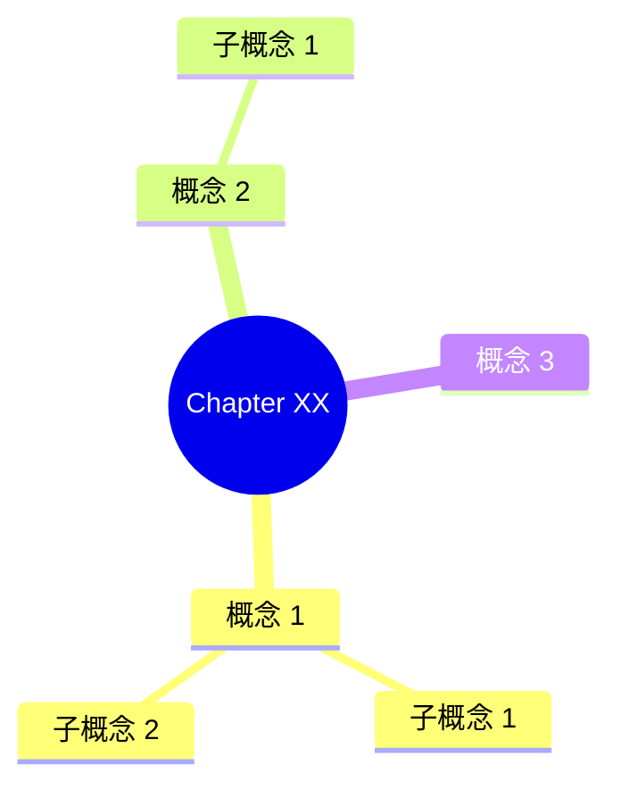

# 📝 笔记生成技能 (Note Generator Skill)

> **创建日期**: 2026-03-22
> **版本**: 1.0
> **用途**: 根据章节内容生成结构化Markdown学习笔记
> **标签**: #笔记生成 #知识整理 #Markdown

---

## 🎯 核心职责

接收章节文本内容，运用笔记模板，生成包含核心概念、思维导图、思考题的完整学习笔记。

---

## 📋 操作流程

### Step 1: 接收章节输入

**输入格式**:
```json
{
  "chapter": 1,
  "title": "章节标题",
  "book_title": "书名",
  "book_version": "版本",
  "author": "作者",
  "paragraphs": [
    "段落1内容",
    "段落2内容",
    ...
  ]
}
```

---

### Step 2: 分析章节内容

**内容分析维度**:

1. **核心主题识别**
   - 识别本章主要讲述的内容
   - 提取1-3个核心关键词

2. **核心概念提取**
   - 识别重要定义、原理
   - 提取关键公式、标准
   - 捕捉方法论框架
   - 记录作者核心观点
   - 标注重要案例应用

3. **金句收集**
   - 提取有启发性的引用
   - 识别核心论断

4. **知识框架构建**
   - 分析概念之间的层级关系
   - 识别并列或递进结构

---

### Step 3: 生成结构化笔记

**笔记模板**:
```markdown
# 📖 <书名> - Chapter XX

> **Chapter**: XX
> **Title**: <章节标题>
> **Source**: <书名> (<版本>) - <作者>
> **学习日期**: YYYY-MM-DD
> **标签**: #<书名> #ChapterXX #<主题>

---

## 📋 本章概览

**核心主题**: <一句话总结>

本章讲解：
- 要点 1
- 要点 2
- 要点 3

---

## 🎯 核心概念

### 概念 1: <名称>

**定义**: <清晰定义>

**公式/标准** (如适用):
```
<公式或标准>
```

**作者观点**:
> "<引用>"

**应用场景**:
- 场景 1
- 场景 2

**重要性**: ⭐⭐⭐⭐⭐ (5star/4star/3star)

---

### 概念 2: <名称>

**定义**: <清晰定义>

**作者观点**:
> "<引用>"

**重要性**: ⭐⭐⭐⭐

---

## 📊 本章框架



---

## 💡 核心金句

> "<金句 1>"

> "<金句 2>"

---

## 📝 思考题

1. <问题 1>
2. <问题 2>
3. <问题 3>

---

## 🎓 学习收获

### 知识收获
- ✅ <收获 1>
- ✅ <收获 2>

### 技能提升
- 📊 <技能 1>
- 📊 <技能 2>

### 思维转变
- 🔄 <转变 1>
- 🔄 <转变 2>

---

_学习笔记由梅梅整理 · YYYY-MM-DD_ ✨
_Progress: Chapter XX/Total_ 📖
_Next: Chapter XX+1 - <下一章标题>_
```

---

### Step 4: 提取概念供Neo4j使用

**概念提取标准**:
- ✅ 核心定义/原理
- ✅ 重要公式/标准
- ✅ 关键方法论
- ✅ 作者核心观点
- ✅ 重要案例/应用

**概念格式输出**:
```json
{
  "concepts": [
    {
      "name": "概念名称",
      "category": "<书名>/<类别>/<子类别>",
      "chapter": 1,
      "description": "清晰描述",
      "formula": "公式/标准 (可选)",
      "importance": "5star",
      "author_quote": "作者观点引用 (可选)"
    },
    {
      "name": "概念名称2",
      "category": "<书名>/<类别>",
      "chapter": 1,
      "description": "清晰描述",
      "importance": "4star"
    }
  ],
  "relationships": [
    {
      "from": "概念1",
      "to": "概念2",
      "type": "INCLUDES",
      "description": "概念1包含概念2"
    },
    {
      "from": "概念1",
      "to": "概念3",
      "type": "REQUIRES",
      "description": "概念1需要概念3"
    }
  ]
}
```

---

## 📁 文件输出规范

**文件命名规则**:
```
F:\Obsidian\<书名>\ChXX-<标题>.md
示例: F:\Obsidian\Security Analysis\Ch01-Security Analysis Scope and Limitations.md
```

**输出要求**:
- ✅ 使用UTF-8编码
- ✅ 使用Unix换行符(\n)
- ✅ Markdown格式规范

---

## 🔧 特殊模式

### 全书总结模式

当输入为全部章节时，生成全书学习完成报告：

```markdown
# 🎉《书名》全书学习完成报告

> **书籍**: <书名> (<版本>)
> **作者**: <作者>
> **学习完成日期**: YYYY-MM-DD
> **学习方式**: 逐章笔记 + Neo4j 知识图谱

---

## ✅ 学习统计

| 指标 | 完成 |
|------|------|
| **学习章节** | XX 章 ✅ |
| **Obsidian 笔记** | XX 个文件 ✅ |
| **Neo4j 概念** | XX 个概念 ✅ |
| **Neo4j 关系** | XX 个关系 ✅ |
| **总字数** | XXKB 笔记 ✅ |
| **学习时长** | ~XX 小时 ✅ |

---

## 💡 全书核心思想总结

### 核心理念 1
> "<引用>"

**应用**:
- 应用 1
- 应用 2

---

## 🎯 实践应用指南

### 行动清单
- [ ] 应用 1
- [ ] 应用 2
- [ ] 应用 3

---

_学习报告由梅梅整理 · YYYY-MM-DD_ ✨
```

---

## ✅ 输出标准

**必须包含**:
- ✅ 完整的Markdown笔记内容
- ✅ 结构化概念列表（供Neo4j使用）
- ✅ 笔记文件保存路径

**禁止包含**:
- ❌ Cypher语句（由neo4j-cypher-generator负责）
- ❌ Neo4j导入操作（由neo4j-importer负责）
- ❌ 章节内容提取（由book-extractor负责）

---

## 🎓 使用示例

**输入**:
```json
{
  "chapter": 1,
  "title": "Security Analysis: Scope and Limitations",
  "book_title": "Security Analysis",
  "book_version": "6th Edition",
  "author": "Benjamin Graham",
  "paragraphs": [
    "段落1: 投资的基本概念...",
    "段落2: 分析的局限性..."
  ]
}
```

**输出**:
```json
{
  "note_file": "F:\\Obsidian\\Security Analysis\\Ch01-Security Analysis Scope and Limitations.md",
  "concepts": [
    {
      "name": "Intrinsic Value",
      "category": "Security Analysis/Core Concepts",
      "chapter": 1,
      "description": "由资产、收益、股息等事实确定的内在价值",
      "importance": "5star",
      "author_quote": "The intrinsic value of a business is determined by its assets, earnings, dividends and definite future prospects."
    }
  ],
  "relationships": [
    {
      "from": "Security Analysis",
      "to": "Intrinsic Value",
      "type": "DEFINES",
      "description": "Security analysis defines intrinsic value"
    }
  ]
}
```

---

## 🔄 与其他模块的接口

**上游模块**:
- `book-extractor`: 接收章节paragraphs

**下游模块**:
- `neo4j-cypher-generator`: 接收concepts和relationships
- `book-learning-coordinator`: 接收笔记文件路径用于进度更新

---

## 🛠️ OpenClaw 脚本配置

**脚本文件**: `note-generator-script.py`
**脚本类型**: Python
**调用方式**: 外部工具
**依赖**: 需要先执行 book-extractor-script.py 获取章节数据

### 执行命令
```bash
python note-generator-script.py --chapter_data <JSON数据>
```

### 输入参数
```json
{
  "book_title": "Security Analysis",
  "chapter": 1,
  "title": "Security Analysis: Scope and Limitations",
  "book_version": "6th Edition",
  "author": "Benjamin Graham",
  "total_chapters": 40,
  "paragraphs": [
    "段落1: 投资的基本概念...",
    "段落2: 分析的局限性..."
  ]
}
```

### 输出格式
```json
{
  "success": true,
  "note_content": "# 📖 Security Analysis - Chapter 1\n\n> **Chapter**: 1\n> **Title**: Security Analysis: Scope and Limitations\n...",
  "concepts": [
    {
      "name": "Intrinsic Value",
      "category": "Security Analysis/Core Concepts",
      "chapter": 1,
      "description": "由资产、收益、股息等事实确定的内在价值",
      "importance": "5star",
      "author_quote": "The intrinsic value of a business is determined by its assets, earnings, dividends and definite future prospects."
    }
  ],
  "relationships": [
    {
      "from": "Security Analysis",
      "to": "Intrinsic Value",
      "type": "DEFINES",
      "description": "Security analysis defines intrinsic value"
    }
  ],
  "note_file": "F:\\Obsidian\\Security Analysis\\Ch01-Security Analysis Scope and Limitations.md"
}
```

### OpenClaw 调用逻辑
1. 接收章节数据（通常来自 book-extractor）
2. 分析章节内容，提取核心概念
3. 生成结构化Markdown笔记
4. 提取概念和关系供Neo4j使用
5. 返回笔记内容和概念数据

### 错误处理
- 段落数据为空 → 提示章节可能损坏
- 概念提取失败 → 返回部分结果并警告
- 文件保存失败 → 检查目录权限

---

_Note Generator v1.0 · 2026-03-22_ 📝
