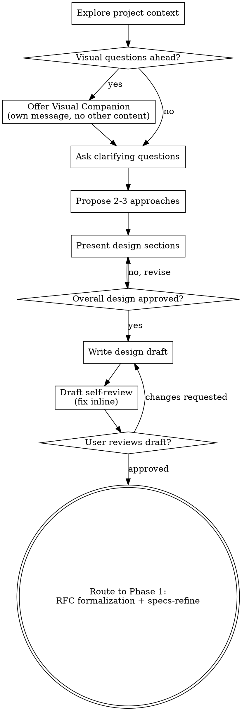

# Platonic Brainstorming

Help turn ideas into fully formed designs through natural collaborative dialogue.

Use this skill when you want structured design exploration before RFC formalization (Phase 1) or design refinement before implementation (Phase 2). Start by understanding the current project context, then ask questions one at a time to refine the idea. Once you understand what you're building, present the design, validate it with the user, and hand off to the next Platonic Coding workflow phase.

<HARD-GATE>
Within this brainstorming flow, do NOT invoke any implementation skill, write any code, scaffold any project, or take any implementation action until you have presented a design and the user has explicitly approved it.
</HARD-GATE>

## Anti-Pattern: "This Is Too Simple To Need A Design"

For work that enters Platonic Coding phases, even "simple" changes deserve an explicit design pass so assumptions are surfaced early. The design can be short (a few sentences for truly simple projects), but it should still be presented and approved before the workflow advances.

## Checklist

Create tasks for the applicable steps below and follow them in process order:

1. **Explore project context** - check files, docs, recent commits
2. **Offer visual companion** (only if upcoming questions will benefit from visual treatment) - this is its own message, not combined with a clarifying question. See the Visual Companion section below.
3. **Ask clarifying questions** - one at a time, understand purpose/constraints/success criteria
4. **Propose 2-3 approaches** - with trade-offs and your recommendation
5. **Present design** - validate sections incrementally as needed, then get explicit approval on the overall design before drafting
6. **Write design draft** - save to `docs/drafts/YYYY-MM-DD-<topic>-design.md` by default, or update the user-provided draft if one already exists
7. **Draft self-review** - quick inline check for placeholders, contradictions, ambiguity, scope (see below)
8. **User reviews written draft** - ask user to review the draft file before proceeding
9. **Transition to the next Platonic stage** - hand off to Platonic Coding workflow phase (Phase 1 RFC formalization or Phase 2 implementation)

## Process Flow

**The terminal state is Platonic Coding Phase 1 RFC formalization.** Do NOT invoke frontend-design, mcp-builder, or any other generic implementation skill. After Platonic Brainstorming, route into Platonic Coding Phase 1: generate an RFC from the approved design draft, then run `specs-refine`.

## The Process

**Understanding the idea:**

- Check out the current project state first (files, docs, recent commits)
- Before asking detailed questions, assess scope: if the request describes multiple independent subsystems (e.g., "build a platform with chat, file storage, billing, and analytics"), flag this immediately. Don't spend questions refining details of a project that needs to be decomposed first.
- If the project is too large for a single design draft, help the user decompose into sub-projects: what are the independent pieces, how do they relate, what order should they be built? Then brainstorm the first sub-project through the normal design flow. Each sub-project gets its own draft -> downstream Platonic stages -> implementation cycle.
- For appropriately-scoped projects, ask questions one at a time to refine the idea
- Prefer multiple choice questions when possible, but open-ended is fine too
- Only one clarifying or design question per message - if a topic needs more exploration, break it into multiple questions. Standalone setup or consent messages, like the visual companion offer, are exempt.
- Focus on understanding: purpose, constraints, success criteria

**Exploring approaches:**

- Propose 2-3 different approaches with trade-offs
- Present options conversationally with your recommendation and reasoning
- Lead with your recommended option and explain why

**Presenting the design:**

- Once you believe you understand what you're building, present the design
- Scale each section to its complexity: a few sentences if straightforward, up to 200-300 words if nuanced
- Validate sections incrementally when that helps the user stay aligned, but do not treat those checkpoints as final approval
- Get one explicit approval on the overall design before you write the draft
- Cover: architecture, components, data flow, error handling, testing
- Be ready to go back and clarify if something doesn't make sense

**Design for isolation and clarity:**

- Break the system into smaller units that each have one clear purpose, communicate through well-defined interfaces, and can be understood and tested independently
- For each unit, you should be able to answer: what does it do, how do you use it, and what does it depend on?
- Can someone understand what a unit does without reading its internals? Can you change the internals without breaking consumers? If not, the boundaries need work.
- Smaller, well-bounded units are also easier for you to work with - you reason better about code you can hold in context at once, and your edits are more reliable when files are focused. When a file grows large, that's often a signal that it's doing too much.

**Working in existing codebases:**

- Explore the current structure before proposing changes. Follow existing patterns.
- Where existing code has problems that affect the work (e.g., a file that's grown too large, unclear boundaries, tangled responsibilities), include targeted improvements as part of the design, the way a good developer improves code they're working in.
- Don't propose unrelated refactoring. Stay focused on what serves the current goal.

## After the Design

**Documentation:**

- Write the validated design draft to `docs/drafts/YYYY-MM-DD-<topic>-design.md`
  - (User preferences or an existing draft path override this default)
- Use elements-of-style:writing-clearly-and-concisely skill if available
- Commit the design draft to git only if the user wants the draft versioned now

**Draft Self-Review:**
After writing the design draft, look at it with fresh eyes:

1. **Placeholder scan:** Any "TBD", "TODO", incomplete sections, or vague requirements? Fix them.
2. **Internal consistency:** Do any sections contradict each other? Does the architecture match the feature descriptions?
3. **Scope check:** Is this focused enough for a single implementation plan, or does it need decomposition?
4. **Ambiguity check:** Could any requirement be interpreted two different ways? If so, pick one and make it explicit.

Fix any issues inline. This self-review is the internal cleanup pass before the user review gate. If the user later requests changes, make them and run this quick self-review again before re-presenting the draft.

**User Review Gate:**
After the draft review loop passes, ask the user to review the written draft before proceeding:

> "Design draft written to `<path>`. Please review it and let me know if you want to make any changes before we advance to Platonic Coding Phase 1 RFC formalization."

Wait for the user's response. If they request changes, make them and re-run the draft review loop. Only proceed once the user approves.

**Implementation:**

- Route to Platonic Coding Phase 1: generate an RFC from the approved design draft, then run `specs-refine`
- Do NOT invoke any other generic implementation skill at this handoff point. Phase 1 RFC formalization is the next step.

## Key Principles

- **One question at a time** - Don't overwhelm with multiple questions
- **Multiple choice preferred** - Easier to answer than open-ended when possible
- **YAGNI ruthlessly** - Remove unnecessary features from all designs
- **Explore alternatives** - Always propose 2-3 approaches before settling
- **Incremental validation** - Use section-by-section checkpoints to keep alignment, then get explicit approval on the overall design before drafting
- **Be flexible** - Go back and clarify when something doesn't make sense

## Visual Companion

A browser-based companion for showing mockups, diagrams, and visual options during Platonic Brainstorming. Available as a tool, not a mode. Accepting the companion means it's available for questions that benefit from visual treatment; it does NOT mean every question goes through the browser.

**Offering the companion:** When you anticipate that upcoming questions will involve visual content (mockups, layouts, diagrams), offer it once for consent:
> "Some of what we're working on might be easier to explain if I can show it to you in a web browser. I can put together mockups, diagrams, comparisons, and other visuals as we go. This feature is still new and can be token-intensive. Want to try it? (Requires opening a local URL)"

**This offer MUST be its own message.** Do not combine it with clarifying questions, context summaries, or any other content. The message should contain ONLY the offer above and nothing else. Wait for the user's response before continuing. If they decline, proceed with text-only brainstorming.

**Per-question decision:** Even after the user accepts, decide FOR EACH QUESTION whether to use the browser or the terminal. The test: **would the user understand this better by seeing it than reading it?**

- **Use the browser** for content that IS visual, mockups, wireframes, layout comparisons, architecture diagrams, side-by-side visual designs
- **Use the terminal** for content that is text, requirements questions, conceptual choices, tradeoff lists, A/B/C/D text options, scope decisions

A question about a UI topic is not automatically a visual question. "What does personality mean in this context?" is a conceptual question, use the terminal. "Which wizard layout works better?" is a visual question, use the browser.

If they agree to the companion, read the detailed guide before proceeding:
`skills/platonic-brainstorming/visual-companion.md`
