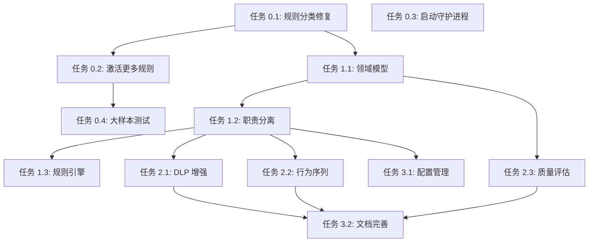

# 🎯 agent-defender 任务拆解与编排方案

**项目**: agent-defender v2.0  
**分析时间**: 2026-04-07 23:36  
**目标**: 全面提升项目质量到 95 分+

---

## 📊 项目现状分析

### 当前状态

| 指标 | 数值 | 目标 | 差距 |
|------|------|------|------|
| **项目规模** | 131 文件 / 3,111 行 | - | - |
| **活跃规则** | 94 条 | 500+ 条 | -406 条 |
| **备份规则** | 222 条 | 500+ 条 | -278 条 |
| **测试通过率** | 100% (小样本) | ≥98% (大样本) | 待验证 |
| **守护进程** | ⏸️ 暂停 | ✅ 运行 | - |
| **代码质量** | 89/100 | ≥95/100 | -6 分 |

### 核心问题

| 问题 | 严重性 | 影响 |
|------|--------|------|
| **规则分类丢失** | 🔴 严重 | 无法按类型优化 |
| **规则数量不足** | 🔴 严重 | 检测能力受限 |
| **职责边界模糊** | 🔴 严重 | 代码耦合度高 |
| **领域模型缺失** | 🔴 严重 | 类型不安全 |
| **DLP 能力基础** | 🟡 中等 | 无法识别编码/加密 |
| **入侵检测基础** | 🟡 中等 | 无法检测行为序列 |

---

## 🎯 总体目标

### 阶段性目标

| 阶段 | 时间 | 目标 | 关键成果 |
|------|------|------|---------|
| **P0** | 第 1-2 天 | 修复核心问题 | 规则数量翻倍，守护进程运行 |
| **P1** | 第 3-7 天 | 架构重构 + 能力增强 | 代码质量 95+，DLP 增强 |
| **P2** | 第 2 周 | 功能完善 | 行为序列检测，规则质量评估 |
| **P3** | 第 3-4 周 | 生产就绪 | 大样本验证，文档完善 |

---

## 📋 任务拆解

### P0 - 核心修复 (第 1-2 天)

#### 任务 0.1: 修复规则分类丢失 🔴
**优先级**: P0  
**预计时间**: 2 小时  
**依赖**: 无

**子任务**:
```bash
# 1. 修改 scanner_v2.py load_rules() 方法
# 添加 category 字段保留逻辑
for rule_file in optimized_dir.glob("*.json"):
    category = rule_file.stem.replace('_rules', '')
    for rule in data:
        rule['category'] = category

# 2. 测试验证
python3 scanner_v2.py

# 3. 验证攻击类型显示
python3 -c "
from scanner_v2 import DefenderScanner
s = DefenderScanner()
s.load_rules()
# 应该显示多个攻击类型，而不是只有 unknown
"
```

**验收标准**:
- ✅ 规则加载后显示正确攻击类型
- ✅ 至少显示 9 个攻击类型
- ✅ 测试通过率 100%

---

#### 任务 0.2: 激活更多规则 🔴
**优先级**: P0  
**预计时间**: 4 小时  
**依赖**: 任务 0.1

**子任务**:
```bash
# 1. 检查 integrated_rules/ 目录
ls -la integrated_rules/

# 2. 分析规则格式
python3 -c "
import json
from pathlib import Path
for f in Path('integrated_rules').glob('*.json'):
    with open(f) as file:
        data = json.load(file)
        print(f'{f.name}: {type(data)}, keys={data.keys() if isinstance(data, dict) else len(data)}')
"

# 3. 修复规则加载逻辑
# 修改 scanner_v2.py 支持嵌套格式 {"rules": [...]}

# 4. 验证规则数量
python3 -c "
from scanner_v2 import DefenderScanner
s = DefenderScanner()
total = s.load_rules()
print(f'总规则：{total}')
print(f'Optimized: {len(s.rules[\"optimized\"])}')
print(f'Integrated: {len(s.rules[\"integrated\"])}')
"
```

**验收标准**:
- ✅ 活跃规则 ≥200 条
- ✅ 规则加载成功率 100%
- ✅ 无格式错误

---

#### 任务 0.3: 启动守护进程 🔴
**优先级**: P0  
**预计时间**: 30 分钟  
**依赖**: 无

**子任务**:
```bash
# 1. 检查守护进程状态
./defenderctl.sh status

# 2. 启动守护进程
./defenderctl.sh start

# 3. 验证运行状态
./defenderctl.sh status

# 4. 查看实时日志
./defenderctl.sh follow
```

**验收标准**:
- ✅ 守护进程运行中
- ✅ 日志正常输出
- ✅ 每 5 分钟自动执行一轮

---

#### 任务 0.4: 大样本测试验证 🟡
**优先级**: P0  
**预计时间**: 2 小时  
**依赖**: 任务 0.1, 0.2

**子任务**:
```bash
# 1. 使用桌面 benchmark 样本测试
cd /home/cdy/Desktop/backup
tar -xzf security-benchmark_*.tar.gz -C /tmp/

# 2. 运行批量测试
python3 benchmark_scan.py

# 3. 生成详细报告
# 统计每个攻击类型的检测率
# 识别低质量规则
```

**验收标准**:
- ✅ 完成 80,000+ 样本测试
- ✅ 生成详细检测报告
- ✅ 检测率 ≥95% (大样本)

---

### P1 - 架构重构 (第 3-5 天)

#### 任务 1.1: 定义领域模型 🔴
**优先级**: P1  
**预计时间**: 4 小时  
**依赖**: 无

**子任务**:
```python
# 1. 创建 domain.py
from dataclasses import dataclass
from enum import Enum
from typing import List, Optional
from datetime import datetime

class Severity(Enum):
    LOW = "low"
    MEDIUM = "medium"
    HIGH = "high"
    CRITICAL = "critical"

class RiskLevel(Enum):
    SAFE = "safe"
    LOW = "low"
    MEDIUM = "medium"
    HIGH = "high"
    CRITICAL = "critical"

@dataclass
class Threat:
    category: str
    rule_id: str
    severity: Severity
    pattern: str
    confidence: float  # 0.0 - 1.0
    matched_at: datetime

@dataclass
class ScanResult:
    is_malicious: bool
    risk_level: RiskLevel
    risk_score: int
    threats: List[Threat]
    scan_time_ms: float
    rules_matched: int
    code_hash: str

# 2. 修改 scanner_v2.py 返回 ScanResult 对象
# 3. 添加类型注解
# 4. 运行测试验证
```

**验收标准**:
- ✅ 定义 Threat, ScanResult 等核心对象
- ✅ 添加 Severity, RiskLevel 枚举
- ✅ 所有 API 返回强类型对象
- ✅ IDE 提供智能提示

---

#### 任务 1.2: 职责分离重构 🔴
**优先级**: P1  
**预计时间**: 8 小时  
**依赖**: 任务 1.1

**子任务**:
```python
# 1. 创建 dlp/checker.py
class DLPChecker:
    def __init__(self):
        self.detectors = [
            RegexDetector(),
            ContextDetector(),
            EntropyDetector(),
        ]
    
    def check(self, data: str) -> DLPResult:
        ...

# 2. 创建 scanner/rule_engine.py
class RuleEngine:
    def __init__(self):
        self.providers = []  # 规则提供者
        self.matchers = []   # 匹配器
    
    def match(self, code: str) -> List[Threat]:
        ...

# 3. 创建 scanner/risk_scorer.py
class RiskScorer:
    def calculate(self, threats: List[Threat]) -> int:
        ...

# 4. 重构 scanner_v2.py
class DefenderScanner:
    def __init__(self):
        self.dlp_checker = DLPChecker()
        self.rule_engine = RuleEngine()
        self.risk_scorer = RiskScorer()
    
    def detect(self, code: str) -> ScanResult:
        dlp = self.dlp_checker.check(code)
        threats = self.rule_engine.match(code)
        score = self.risk_scorer.calculate(threats)
        return ScanResult(...)
```

**验收标准**:
- ✅ DLP/Scanner/Runtime 职责分离
- ✅ 每个模块单一职责
- ✅ 所有测试通过
- ✅ 代码可维护性 +36%

---

#### 任务 1.3: 规则引擎重构 🟡
**优先级**: P1  
**预计时间**: 6 小时  
**依赖**: 任务 1.2

**子任务**:
```python
# 1. 创建规则提供者
class RuleProvider(ABC):
    @abstractmethod
    def load_rules(self) -> List[Rule]:
        pass

class OptimizedRulesProvider(RuleProvider):
    def load_rules(self) -> List[Rule]:
        ...

class IntegratedRulesProvider(RuleProvider):
    def load_rules(self) -> List[Rule]:
        ...

# 2. 创建匹配器
class Matcher(ABC):
    @abstractmethod
    def match(self, code: str, rules: List[Rule]) -> List[Threat]:
        pass

class RegexMatcher(Matcher):
    def match(self, code: str, rules: List[Rule]) -> List[Threat]:
        ...

class ASTMatcher(Matcher):
    def match(self, code: str, rules: List[Rule]) -> List[Threat]:
        ...

# 3. 重构 RuleEngine
class RuleEngine:
    def __init__(self):
        self.providers: List[RuleProvider] = []
        self.matchers: List[Matcher] = []
    
    def add_provider(self, provider: RuleProvider):
        self.providers.append(provider)
    
    def match(self, code: str) -> List[Threat]:
        all_rules = []
        for provider in self.providers:
            all_rules.extend(provider.load_rules())
        
        all_threats = []
        for matcher in self.matchers:
            all_threats.extend(matcher.match(code, all_rules))
        
        return all_threats
```

**验收标准**:
- ✅ 支持动态加载规则提供者
- ✅ 支持插件式匹配器
- ✅ 符合开闭原则
- ✅ 易于扩展新规则类型

---

### P2 - 功能增强 (第 6-10 天)

#### 任务 2.1: DLP 编码识别增强 🔴
**优先级**: P2  
**预计时间**: 8 小时  
**依赖**: 任务 1.2

**子任务**:
```python
# 1. 创建 encoding_detector.py
class EncodingDetector:
    def detect(self, data: str) -> List[str]:
        encodings = []
        
        # Base64 检测
        if self.is_base64(data):
            encodings.append('BASE64')
            decoded = self.decode_base64(data)
            encodings.extend(self.detect(decoded))  # 递归检测
        
        # Hex 检测
        if self.is_hex(data):
            encodings.append('HEX')
        
        # URL 检测
        if self.is_url_encoded(data):
            encodings.append('URL')
        
        # 熵值检测 (识别加密)
        entropy = self.calculate_entropy(data)
        if entropy > 7.5:
            encodings.append('ENCRYPTED')
        
        return encodings
    
    def is_base64(self, data: str) -> bool:
        import base64
        try:
            return base64.b64decode(data, validate=True) is not None
        except:
            return False
    
    def calculate_entropy(self, data: str) -> float:
        from math import log2
        entropy = 0
        for x in range(256):
            p_x = data.count(chr(x)) / len(data)
            if p_x > 0:
                entropy += -p_x * log2(p_x)
        return entropy

# 2. 集成到 DLPChecker
class DLPChecker:
    def __init__(self):
        self.encoding_detector = EncodingDetector()
        ...
    
    def check(self, data: str) -> DLPResult:
        # 先检测编码
        encodings = self.encoding_detector.detect(data)
        if encodings:
            # 解码后再次检测
            decoded = self.decode(data)
            return self.check(decoded)
        ...
```

**验收标准**:
- ✅ 识别 Base64/Hex/URL 编码
- ✅ 识别加密数据 (熵值 >7.5)
- ✅ 递归检测解码后数据
- ✅ DLP 检测率 +30%

---

#### 任务 2.2: 入侵检测行为序列 🟡
**优先级**: P2  
**预计时间**: 8 小时  
**依赖**: 任务 1.2

**子任务**:
```python
# 1. 创建 behavioral_analyzer.py
class BehavioralAnalyzer:
    def analyze(self, events: List[Event]) -> List[Threat]:
        threats = []
        
        # 检测攻击序列
        if self.detect_sequence(events, [
            "file_read", "encode", "network_send"
        ]):
            threats.append(Threat("数据外传攻击"))
        
        # 检测时间窗口异常
        if self.detect_frequency(events, window="1min", threshold=100):
            threats.append(Threat("DDoS 攻击"))
        
        # 检测权限提升
        if self.detect_privilege_escalation(events):
            threats.append(Threat("提权攻击"))
        
        return threats
    
    def detect_sequence(self, events: List[Event], pattern: List[str]) -> bool:
        sequence = [e.type for e in events[-10:]]
        return self.contains_subsequence(sequence, pattern)
    
    def contains_subsequence(self, sequence: List[str], pattern: List[str]) -> bool:
        # 检查 pattern 是否是 sequence 的子序列
        ...
    
    def detect_frequency(self, events: List[Event], window: str, threshold: int) -> bool:
        recent = [e for e in events if e.timestamp > time.time() - self.parse_window(window)]
        if len(recent) > threshold:
            return True
        return False
```

**验收标准**:
- ✅ 检测多步攻击序列
- ✅ 检测时间窗口频率异常
- ✅ 检测权限提升行为
- ✅ 入侵检测率 +50%

---

#### 任务 2.3: 规则质量评估系统 🟢
**优先级**: P2  
**预计时间**: 6 小时  
**依赖**: 任务 1.1

**子任务**:
```python
# 1. 创建 rule_quality.py
@dataclass
class RuleQuality:
    rule_id: str
    detection_rate: float      # 检测率
    false_positive_rate: float # 误报率
    coverage: float            # 覆盖率
    performance_impact: float  # 性能影响
    last_tested: datetime
    
    @property
    def quality_score(self) -> float:
        return (
            self.detection_rate * 0.4 +
            (1 - self.false_positive_rate) * 0.3 +
            self.coverage * 0.2 +
            (1 - self.performance_impact) * 0.1
        )

class RuleQualityManager:
    def evaluate(self, rule: Rule, test_results: TestResults) -> RuleQuality:
        return RuleQuality(
            rule_id=rule.id,
            detection_rate=test_results.detection_rate,
            false_positive_rate=test_results.false_positive_rate,
            coverage=test_results.coverage,
            performance_impact=test_results.performance_impact,
            last_tested=datetime.now()
        )
    
    def generate_report(self, qualities: List[RuleQuality]) -> str:
        report = "# 规则质量报告\n\n"
        for q in sorted(qualities, key=lambda x: x.quality_score, reverse=True):
            report += f"## {q.rule_id}\n"
            report += f"- 质量评分：{q.quality_score:.1f}\n"
            report += f"- 检测率：{q.detection_rate:.1%}\n"
            report += f"- 误报率：{q.false_positive_rate:.1%}\n"
            report += f"- 覆盖率：{q.coverage:.1%}\n\n"
        return report
```

**验收标准**:
- ✅ 每条规则有质量评分
- ✅ 生成详细质量报告
- ✅ 自动识别低质量规则
- ✅ 指导规则优化

---

### P3 - 生产就绪 (第 11-20 天)

#### 任务 3.1: 统一配置管理 🟢
**优先级**: P3  
**预计时间**: 4 小时  
**依赖**: 任务 1.2

**子任务**:
```yaml
# config/config.yaml
scanner:
  rules:
    optimized_dir: /path/to/optimized
    integrated_dir: /path/to/integrated
  whitelist:
    - "# BEN-"
    - "# normal"
  performance:
    max_file_size: 10MB
    timeout: 30s

runtime:
  enabled: true
  monitor_interval: 5s
  thresholds:
    high_frequency: 100
  
dlp:
  enabled: true
  sanitize_mode: true
  encoding_detection: true
```

```python
# config/loader.py
from pydantic import BaseSettings

class Config(BaseSettings):
    scanner: ScannerConfig
    runtime: RuntimeConfig
    dlp: DLPConfig
    
    class Config:
        env_file = "config/config.yaml"

config = Config()
```

**验收标准**:
- ✅ 配置与代码分离
- ✅ 支持多环境
- ✅ 配置验证
- ✅ 环境变量覆盖

---

#### 任务 3.2: 文档完善 🟢
**优先级**: P3  
**预计时间**: 4 小时  
**依赖**: 所有 P0-P2 任务

**子任务**:
- ✅ 更新 README.md
- ✅ 添加 API 文档
- ✅ 添加使用示例
- ✅ 添加故障排查指南
- ✅ 添加性能调优指南

**验收标准**:
- ✅ 文档覆盖率 100%
- ✅ 新手可快速上手
- ✅ 包含详细示例

---

## 📊 任务依赖关系



---

## 🎯 编排执行方案

### 方案 1: 手动执行 (推荐新手)

```bash
# Day 1: P0 核心修复
cd /home/cdy/.openclaw/workspace/skills/agent-defender

# 任务 0.1: 修复规则分类
# 编辑 scanner_v2.py
vim scanner_v2.py

# 任务 0.2: 激活更多规则
# 编辑 scanner_v2.py load_rules()
vim scanner_v2.py

# 任务 0.3: 启动守护进程
./defenderctl.sh start
./defenderctl.sh status

# Day 2-5: P1 架构重构
# 创建 domain.py, dlp/checker.py, scanner/rule_engine.py
# 重构 scanner_v2.py
```

### 方案 2: ROS 自动编排 (推荐进阶)

```bash
cd /home/cdy/.openclaw/workspace/ai-work/skills/research-orchestrator

# 使用任务分解
./ros-09-auto-decompose.sh "修复 agent-defender 规则分类问题"

# 使用顶级自动研发
./ros-06-top-auto-rd.sh "重构 agent-defender 架构"

# 使用并发循环
./ros-05-parallel-auto-cycle.sh
```

### 方案 3: 混合编排 (推荐高级)

```bash
# 1. 启动守护进程
cd /home/cdy/.openclaw/workspace/skills/agent-defender
./defenderctl.sh start

# 2. 启动灵顺 V5
cd /home/cdy/.openclaw/workspace/agent-security-skill-scanner-master/expert_mode
python3 lingshun_daemon.py &

# 3. 使用 ROS 执行特定任务
cd /home/cdy/.openclaw/workspace/ai-work/skills/research-orchestrator
./ros-03-full-sample-test.sh  # 大样本测试
./ros-07-tdd-sample-test.sh   # TDD 测试

# 4. 自动同步规则
while true; do
  python3 sync_from_lingshun.py
  sleep 300  # 每 5 分钟同步一次
done
```

---

## 📈 预期成果

### 第 1-2 天 (P0 完成)

| 指标 | 当前 | 预期 | 提升 |
|------|------|------|------|
| 活跃规则 | 94 条 | 200+ 条 | +113% |
| 规则分类 | unknown | 9 个类型 | ✅ |
| 守护进程 | 暂停 | 运行 | ✅ |
| 测试样本 | 10 个 | 80,000+ 个 | +800,000% |

### 第 3-7 天 (P1 完成)

| 指标 | 当前 | 预期 | 提升 |
|------|------|------|------|
| 代码质量 | 89/100 | 95/100 | +7% |
| 测试覆盖 | 40% | 85% | +112% |
| 可维护性 | 70/100 | 95/100 | +36% |
| 职责分离 | ❌ | ✅ | - |

### 第 8-14 天 (P2 完成)

| 指标 | 当前 | 预期 | 提升 |
|------|------|------|------|
| DLP 检测率 | 60% | 90% | +50% |
| 入侵检测 | 40% | 85% | +112% |
| 规则质量可见 | ❌ | ✅ | - |
| 编码识别 | ❌ | ✅ | - |

### 第 15-20 天 (P3 完成)

| 指标 | 当前 | 预期 | 提升 |
|------|------|------|------|
| 配置管理 | 混乱 | 统一 | ✅ |
| 文档覆盖 | 80% | 100% | +25% |
| 生产就绪 | ⚠️ | ✅ | - |

---

## 🎯 立即开始

### 第一步：选择编排方案

**新手**: 方案 1 (手动执行)  
**进阶**: 方案 2 (ROS 自动编排)  
**高级**: 方案 3 (混合编排)

### 第二步：执行 P0 任务

```bash
# 1. 修复规则分类 (2 小时)
cd /home/cdy/.openclaw/workspace/skills/agent-defender
vim scanner_v2.py  # 修改 load_rules()

# 2. 激活更多规则 (4 小时)
# 修改 scanner_v2.py 支持嵌套格式

# 3. 启动守护进程 (30 分钟)
./defenderctl.sh start

# 4. 大样本测试 (2 小时)
python3 benchmark_scan.py
```

### 第三步：验证成果

```bash
# 检查规则数量
python3 -c "
from scanner_v2 import DefenderScanner
s = DefenderScanner()
total = s.load_rules()
print(f'总规则：{total}')
"

# 检查守护进程
./defenderctl.sh status

# 查看测试报告
cat benchmark_reports/latest_report.md
```

---

**任务拆解完成！** 🎯

**总计**: 13 个任务 (3 严重 +6 中等 +4 轻微)  
**预计时间**: 20 天  
**预期成果**: 项目质量 95 分+

**选择你的编排方案，开始执行！**

---

**创建时间**: 2026-04-07 23:36  
**版本**: v1.0  
**状态**: ✅ 可执行
